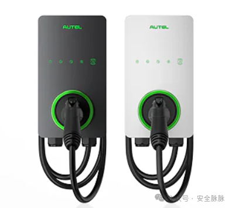
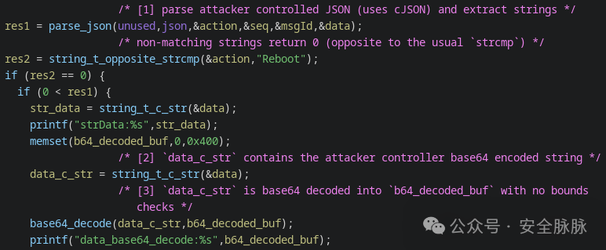
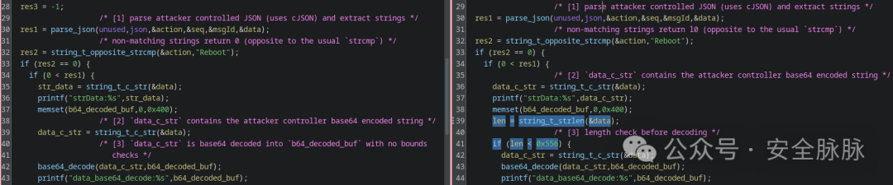
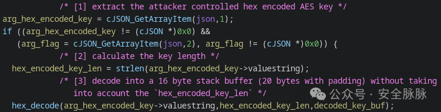
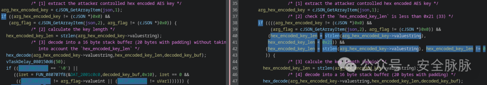
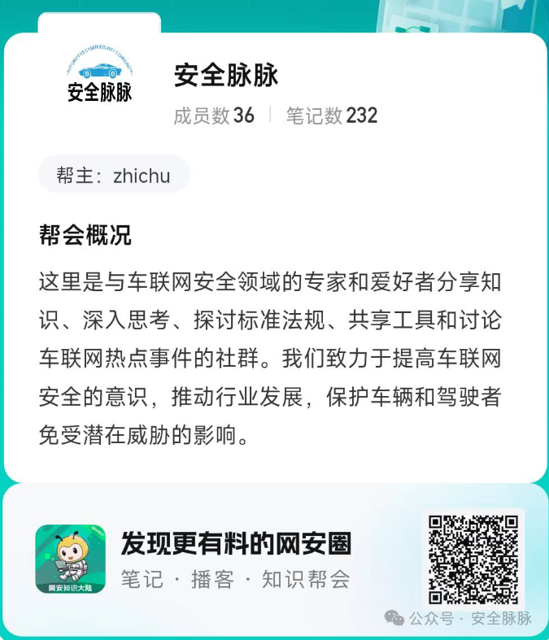

#  Autel MaxiCharger（CVE-2024-23967 /CVE-2024-23957解析）   

<!-- article-review:devices:begin -->
## 技术校订与证据边界（2026-10-02）

- 产品/组件：Autel MaxiCharger
- 本文讨论：CVE-2024-23967 ACMP Base64；23957 DLB hex密钥
- 版本、权限与配置前提：v1.32，比较修复v1.35；需控制WebSocket来源或DLB入站RPC，具体auth未述
- 资料类型：双缓冲溢出补丁分析；本次仅核对归档正文，未执行 PoC、未请求目标，未把原作者的“复现成功”继承为本库验证结果

### 逐项校订

- 元数据只23967；两向量网络/信任边界未交代
- 反编译/补丁均图片，缺原始研究及厂商公告URL；latest1.35需时点
- ACMP展开明确猜测，应保持假说标记

### 操作风险与恢复

- 本篇未提供足以确认无副作用的完整验证流程；应依正文所述配置、权限与交互前提评估，不能把通告或截图当成可直接运行的检测脚本

### 待核与来源

- 固件组件版本、漏洞可达与补丁充分性待原研确认
- 引用图片未查看，截图内容及有效性待核验
- 文内原始链接和图片引用继续保留；未检查图片像素、未下载或执行外部附件。版本边界、修复/在野状态及厂商归属若缺一手依据，均不能视为本次已确认
- 下方保留原技术正文与载荷；其中历史时间表述和成功主张应按本节限定阅读
<!-- article-review:devices:end -->

原创 ByteInsight  安全脉脉   2024-11-12 17:20  
  
这篇博客文章重点介绍了在  
Pwn2Own Automotive 2024中被利用的Autel Maxicharger的两个漏洞。  
  
  
  
  
**CVE-2024-23967**  
  
Computest Sector 7的研究人员识别并利用了Autel固件v1.32中的一个基于堆栈的缓冲区溢出漏洞。该漏洞源于攻击者可控制的base64编码数据的解码过程。由于解码时没有边界检查，导致堆栈缓冲区溢出和远程代码执行。  
  
存在漏洞的函数负责处理从WebSockets服务器接收到的ACMP消息。“ACMP”的确切含义未知，但研究人员猜测它代表类似于“  
Autel Cloud Management Protocol”的东西，与Allen-Cahn消息传递无关。  
  
设备接收ACMP消息后，将其解码为JSON并利用cJSON库解析。JSON中应包含一个名为data的嵌套键，其中包含Base64编码字符串。该字符串从JSON中提取，并通过自定义的Base64解码函数解码到1024字节的栈缓冲区b64_decoded_buf中。由于缺乏长度检查，该解码函数可能被利用以触发栈缓冲区溢出。  
  
  
  
如截图所示，base64_decode()函数没有考虑长度因素。  
  
**修复措施**  
  
对比v1.32和最新的v1.35版本，可以发现一个简单的变动（右侧显示的是修复内容）：  
  
  
  
  
已添加了一个if语句来检查base64编码字符串长度是否小于0x556（1366）字节。如果这个检查通过，字符串会被解码进1024字节的堆栈缓冲区。  
  
  
  
**CVE-2024-23957**  
  
PHP Hooligans / Midnight Blue研究团队还发现了Autel固件v1.32版本中的一个栈缓冲区溢出漏洞，并对其进行了利用。当攻击者发送一个超长十六进制字符串时，该漏洞可以被触发，该字符串随后被解码到一个固定大小的栈缓冲区，且没有进行边界检查。           受影响的函数与动态负载均衡（DLB）协议相关，该协议在电动汽车充电器网络之间分配电力负载。在充电器之间的初始通信过程中，每个充电器都会在JSON RPC负载中接收到一个共享的AES-128密钥。该密钥被编码为十六进制字符串，并作为参数传递给被调用的RPC函数。        被调用的函数提取JSON RPC参数中的十六进制编码密钥，然后将其解码到一个固定大小的栈缓冲区。该栈缓冲区为16字节，但由于对齐原因，在栈上占用了20字节。这对于AES-128密钥来说是正确的大小，然而，由于攻击者可以提供一个更长的字符串，因此可能会发生缓冲区溢出。  
  
  
  
与前面提到的base64_decode()问题不同，hex_decode()函数确实接受一个长度参数（即编码后的密钥长度），但这并不能防止溢出，因为从未将该长度与缓冲区的大小进行比较。  
  
**修复措施**  
  
同样，使用了版本跟踪工具来对比存在漏洞的函数和已修复的函数。右侧高亮的部分展示了修复内容：  
  
  
  
截图显示，已添加了一个if语句，确保hex_encoded_key_len小于某个值（0x21，即十进制的33），并且不等于0。堆栈缓冲区声明为16字节，所以这个修复是有效的，因为32字节或更短的十六进制编码字符串可以成功解码到16字节的缓冲区中。  
  
  
  
  
  
  
  
  
  

---

> 来源：gelusus/wxvl（微信公众号漏洞文章自动归档，原文见文首链接）
