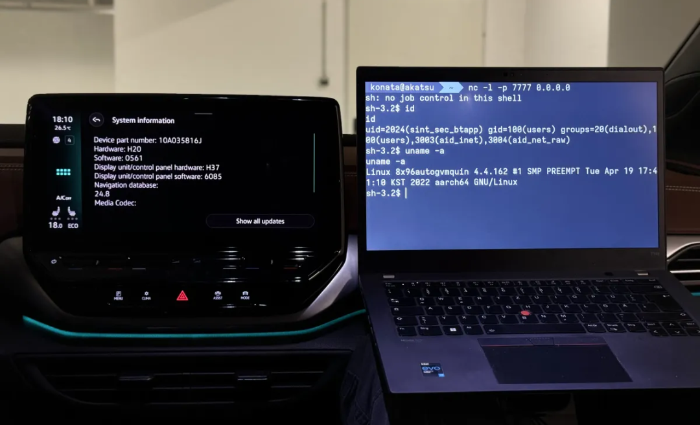

#  BlueSDK 蓝牙堆栈存在严重漏洞，可能允许在汽车系统上执行远程代码  

<!-- article-review:devices:begin -->
## 技术校订与证据边界（2026-10-02）

- 产品/组件：OpenSynergy BlueSDK汽车信息娱乐系统
- 本文讨论：CVE-2024-45431/45432/45433/45434 PerfektBlue
- 版本、权限与配置前提：蓝牙有效距离、可配对；交互因设备而异
- 资料类型：蓝牙漏洞链新闻；本次仅核对归档正文，未执行 PoC、未请求目标，未把原作者的“复现成功”继承为本库验证结果

### 逐项校订

- 无BlueSDK版本/OEM具体车型固件及修复信息
- 元数据未录4CVE，缺PCA/厂商原研链接；数百万适用量不是验证受影响量
- 转向控制明确未证实，保留该限定

### 操作风险与恢复

- 本篇未提供足以确认无副作用的完整验证流程；应依正文所述配置、权限与交互前提评估，不能把通告或截图当成可直接运行的检测脚本

### 待核与来源

- 各CVE机制/版本、车型及安全关键系统隔离待核验
- 引用图片未查看，截图内容及有效性待核验
- 文内原始链接和图片引用继续保留；未检查图片像素、未下载或执行外部附件。版本边界、修复/在野状态及厂商归属若缺一手依据，均不能视为本次已确认
- 下方保留原技术正文与载荷；其中历史时间表述和成功主张应按本节限定阅读
<!-- article-review:devices:end -->

会杀毒的单反狗  军哥网络安全读报   2025-07-11 01:01  
  
**导****读**  
  
  
  
渗透测试和威胁情报公司 PCA Cyber  
  
 Security（前身为 PCAutomotive）研究人员发现，影响广泛使用的蓝牙堆栈严重漏洞可被用来远程入侵数百万辆汽车。  
  
  
研究人员对 OpenSynergy 开发的 BlueSDK 蓝牙框架进行分析，发现多个漏洞，包括允许远程代码执行、绕过安全机制和信息泄露的漏洞。  
  
  
他们演示了如何利用这些漏洞发起名为“PerfektBlue”的远程攻击，从而远程入侵汽车的信息娱乐系统。攻击者可以利用这些信息追踪车辆位置、录制车内音频，并获取受害者的电话簿数据。  
  
  
攻击者还可能横向入侵其他系统，并可能控制转向、喇叭和雨刷等功能。虽然目前尚未证实这一点，但先前的研究表明，黑客有可能从汽车的信息娱乐系统入侵到更关键的系统。  
  
  
PerfektBlue 黑客攻击已针对梅赛德斯奔驰、斯柯达和大众汽车附带的最新信息娱乐模型以及另一家最近才获悉这一发现的未具名 OEM 厂商的产品进行了演示。  
  
  
BlueSDK 已应用于数百万台设备。这些设备不仅包括汽车，还包括数十家大型科技公司生产的手机和其他便携式设备。  
  
  
为了进行攻击，黑客需要处于目标信息娱乐系统的有效范围内，并能够通过蓝牙将其笔记本电脑与目标信息娱乐系统配对。在某些情况下，无需任何用户交互即可配对，而在其他情况下，配对则需要用户确认，或者根本无法配对。  
  
  
  
  
研究人员解释说：“PerfektBlue 只需要用户最多点击一次，攻击者就可以通过无线方式利用该漏洞。”  
  
  
PerfektBlue漏洞于 2024 年 5 月报告给 OpenSynergy，漏洞编号为 CVE-2024-45434、CVE-2024-45431、CVE-2024-45432 和 CVE-2024-45433。  
  
  
新闻链接：  
  
https://www.securityweek.com/millions-of-cars-exposed-to-remote-hacking-via-perfektblue-attack/  
  
  
  
扫码关注  
  
军哥网络安全读报  
  
**讲述普通人能听懂的安全故事**  
  
  

---

> 来源：gelusus/wxvl（微信公众号漏洞文章自动归档，原文见文首链接）
