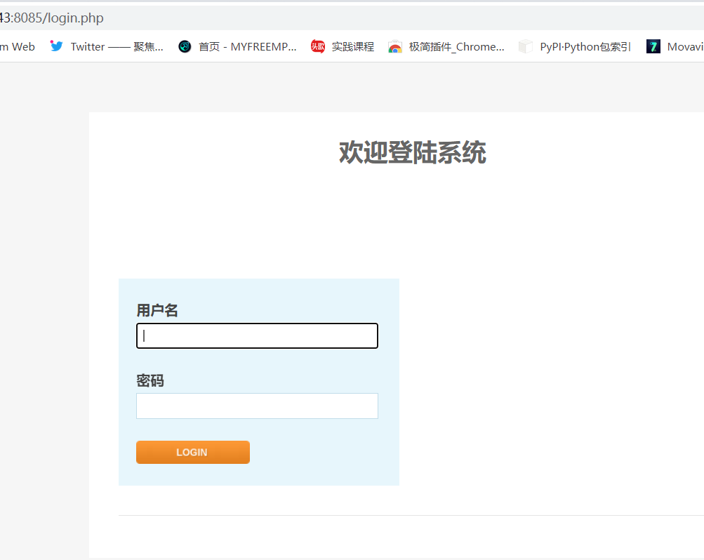
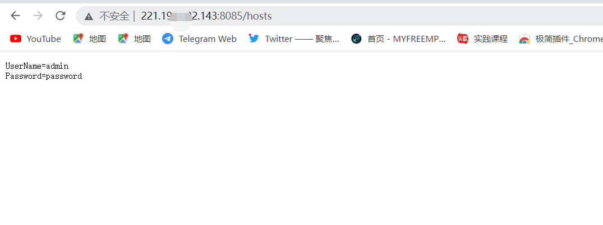
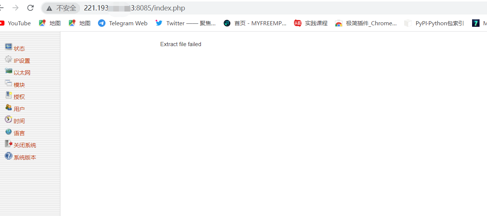

# Kyan 网络监控设备 hosts 账号密码泄露漏洞   孤桜懶契

<!-- article-review:devices:begin -->
## 技术校订与证据边界（2026-10-02）

- 产品/组件：Kyan网络监控平台
- 本文讨论：hosts文件公开凭据
- 版本、权限与配置前提：无认证声称，无版本
- 资料类型：静态凭据文件泄露转载；本次仅核对归档正文，未执行 PoC、未请求目标，未把原作者的“复现成功”继承为本库验证结果

### 逐项校订

- 完整账号字段/有效性只截图，无具体产品厂商/版本和修复
- 网页导航/摘要/页脚重复，末尾GYLQ1.4.16是博客软件版本不能当Kyan版本

### 操作风险与恢复

- 读取内容可能包含配置、账户或个人数据；应只保存授权环境中最小必要的响应，不能由接口可达推定敏感内容已泄露

### 待核与来源

- 凭据格式和是否仍有效、版本范围待核验
- 引用图片未查看，截图内容及有效性待核验
- 文内原始链接和图片引用继续保留；未检查图片像素、未下载或执行外部附件。版本边界、修复/在野状态及厂商归属若缺一手依据，均不能视为本次已确认
- 下方保留原技术正文与载荷；其中历史时间表述和成功主张应按本节限定阅读
<!-- article-review:devices:end -->


<meta name="referrer" content="no-referrer"/>

> 本文由 [简悦 SimpRead](http://ksria.com/simpread/) 转码， 原文地址 [gylq.gitee.io](https://gylq.gitee.io/time/posts/14.html)

> 漏洞描述 Kyan 网络监控设备 存在账号密码泄露漏洞，攻击者通过漏洞可以获得账号密码和后台权限 漏洞影响 s ✅Kyan 空间测绘 d ⭕title="platform - Login" 漏洞复现 ......

[孤桜懶契](https://gylq.gitee.io/time/)

*   [  
    首页](https://gylq.gitee.io/time/)
*   [  
    导航](https://gylq.gitee.io/time/gylq-navigation/)
*   [  
    归档](https://gylq.gitee.io/time/archives/)
*   [  
    分类](https://gylq.gitee.io/time/categories/)
*   [  
    标签](https://gylq.gitee.io/time/tags/)
*   [  
    关于](https://gylq.gitee.io/time/about/)
*   [  
    免责](https://gylq.gitee.io/time/common/)
*   搜索

Kyan 网络监控设备 hosts 账号密码泄露漏洞
--------------------------

2022-04-05 | [漏洞复现](https://gylq.gitee.io/time/categories/%E6%BC%8F%E6%B4%9E%E5%A4%8D%E7%8E%B0/) | [0](https://gylq.gitee.io/time/posts/14.html#comments) |

| 92

Kyan 网络监控设备 存在账号密码泄露漏洞，攻击者通过漏洞可以获得账号密码和后台权限

> s ✅`Kyan`

> d ⭕`title="platform - Login"`

*   ✅登陆页面如下

[](../../.resource/remote/06b63a6a50c5f6d798ad1e515a95b574ffe1cfa0dfcf703fcd9cb9da05622406.png)

*   漏洞 url

```
http://127.0.0.1/hosts
```

[](../../.resource/remote/e32c95ac97d70aa9164e7cc2db45e29a77c3a1764799c703aa552a0ecd631ee8.png)

[](../../.resource/remote/36efae436347c72852dc8d4a711a16f681eb3440ef2a08f4c5a59447eb926db7.png)

> [](#孤桜懶契：https-gylq-gitee-io-time "孤桜懶契：https://gylq.gitee.io/time")孤桜懶契：[https://gylq.gitee.io/time](https://gylq.gitee.io/time)
> ---------------------------------------------------------------------------------------------------------------------------------

本文标题:[Kyan 网络监控设备 hosts 账号密码泄露漏洞](https://gylq.gitee.io/time/posts/14.html)

文章作者: [孤桜懶契](https://gylq.gitee.io/ "访问 孤桜懶契 的个人博客")

发布时间:2022 年 04 月 05 日 - 20:18:15

最后更新:2022 年 04 月 05 日 - 20:39:05

原始链接:[http://gylq.gitee.io/time/posts/14.html](https://gylq.gitee.io/time/posts/14.html "Kyan 网络监控设备 hosts 账号密码泄露漏洞")

许可协议: [署名 - 非商业性使用 - 禁止演绎 4.0 国际](https://creativecommons.org/licenses/by-nc-nd/4.0/ "Attribution-NonCommercial-NoDerivatives 4.0 International (CC BY-NC-ND 4.0)") 转载请保留原文链接及作者。

------------------- 本文结束 感谢您的阅读 -------------------

[](https://guides.github.com/features/mastering-markdown/)

来发评论吧~

Powered By [GYLQ](https://gylq.gitee.io/)  
v1.4.16

---

> 来源：MrWQ/vulnerability-paper（https://github.com/MrWQ/vulnerability-paper）
