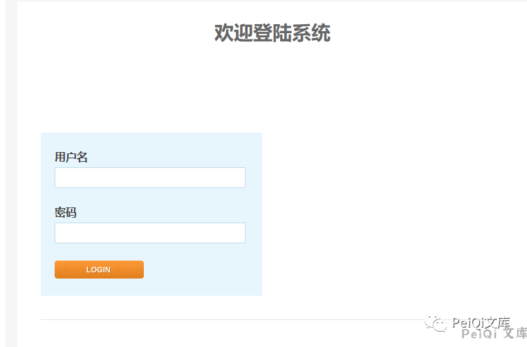
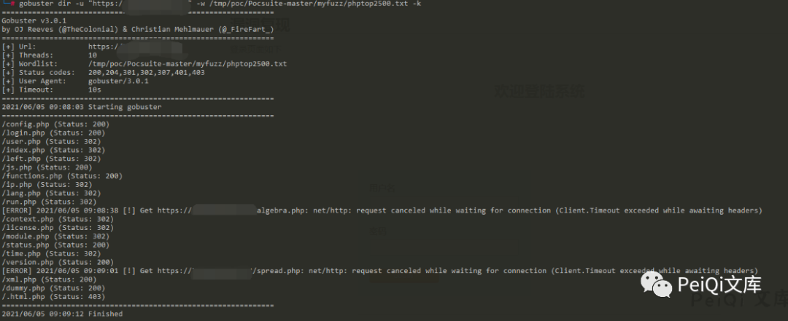
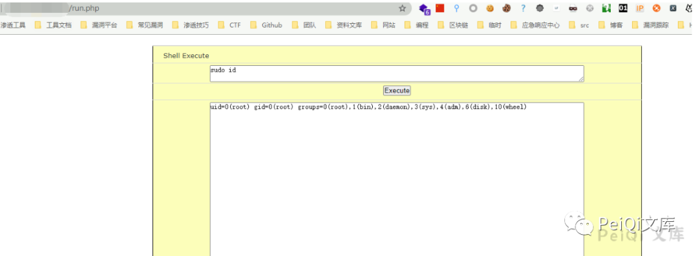

# Kyan 网络监控设备 run-php 远程命令执行漏洞

<!-- article-review:devices:begin -->
## 技术校订与证据边界（2026-10-02）

- 产品/组件：Kyan网络监控平台
- 本文讨论：run.php command直接system；hosts泄露为可选链前置
- 版本、权限与配置前提：auth_check需会话，角色未知；无版本
- 资料类型：认证后Shell界面源码；本次仅核对归档正文，未执行 PoC、未请求目标，未把原作者的“复现成功”继承为本库验证结果

### 逐项校订

- 界面明确Shell Execute，需证明非预期权限或低角色越权，不能仅调用system等于缺陷
- 无原始修复/版本；与436同入口

### 操作风险与恢复

- 本篇未提供足以确认无副作用的完整验证流程；应依正文所述配置、权限与交互前提评估，不能把通告或截图当成可直接运行的检测脚本

### 待核与来源

- auth_check角色限制、预期功能与固件范围待确认
- 引用图片未查看，截图内容及有效性待核验
- 文内原始链接和图片引用继续保留；未检查图片像素、未下载或执行外部附件。版本边界、修复/在野状态及厂商归属若缺一手依据，均不能视为本次已确认
- 下方保留原技术正文与载荷；其中历史时间表述和成功主张应按本节限定阅读
<!-- article-review:devices:end -->


<meta name="referrer" content="no-referrer"/>

> 本文由 [简悦 SimpRead](http://ksria.com/simpread/) 转码， 原文地址 [mp.weixin.qq.com](https://mp.weixin.qq.com/s/84_fqaXnRCix1S09f7CfuQ)


****

**一****：漏洞描述🐑**

  
**Kyan 网络监控设备 run.php 可在身份验证的情况下执行任意命令, 配合账号密码泄露漏洞，可以获取服务器权限，存在远程命令执行漏洞**

**二:  漏洞影响🐇**

**Kyan 网络监控设备**

**三:  漏洞复现🐋**

```
title="platform - Login"
```

**登录页面如下**



**使用 Gobuster 扫描文件**  



**其中 run.php 文件内容为**  

```
<?php 
require_once 'functions.php';
require_once 'international.php';
session_start();
auth_check();
print_html_begin('run');
?>
<body link="#000000" vlink="#000000" alink="#000000" bgcolor="#FFFFFF">

<form method="post">
<table border="1" cellpadding="0" cellspacing="0" style="border-collapse: collapse" width="100%" id="AutoNumber1" height="25" bordercolor="#000000">
    <tr>
      <td width="100%" height="25" bgcolor="#FCFEBA">
      <p align="center"><font face="Verdana" size="2"> Shell Execute </font></td>
    </tr>
    <tr>
      <td width="100%" height="25" bgcolor="#FCFEBA">
            <div align="center">
              <textarea  ><?php echo $_POST['command']; ?>
              </textarea> 
        </div></td>
    </tr>
    <tr>
      <td width="100%" height="25" bgcolor="#FCFEBA">
        <div align="center">
          <input type="submit" value="Execute">
          </div></td>
    </tr>
    <tr>
      <td width="100%" height="25" bgcolor="#FCFEBA">
        <div align="center">
          <textarea  readonly><?php @$output = system(trim($_POST['command'])); ?>
          </textarea>
        </div></td>
    </tr>
</table>
</form>
</body> 
<?php
print_html_end(); 
?>
```



 ****四:  关于文库🦉****

 **在线文库：**

**http://wiki.peiqi.tech**

 **Github：**

**https://github.com/PeiQi0/PeiQi-WIKI-POC**


最后
--

> 下面就是文库的公众号啦，更新的文章都会在第一时间推送在交流群和公众号
> 
> 想要加入交流群的师傅公众号点击交流群加我拉你啦~
> 
> 别忘了 Github 下载完给个小星星⭐

公众号

**同时知识星球也开放运营啦，希望师傅们支持支持啦🐟**

**知识星球里会持续发布一些漏洞公开信息和技术文章~**


**由于传播、利用此文所提供的信息而造成的任何直接或者间接的后果及损失，均由使用者本人负责，文章作者不为此承担任何责任。**

**PeiQi 文库 拥有对此文章的修改和解释权如欲转载或传播此文章，必须保证此文章的完整性，包括版权声明等全部内容。未经作者允许，不得任意修改或者增减此文章内容，不得以任何方式将其用于商业目的。**

---

> 来源：MrWQ/vulnerability-paper（https://github.com/MrWQ/vulnerability-paper）
