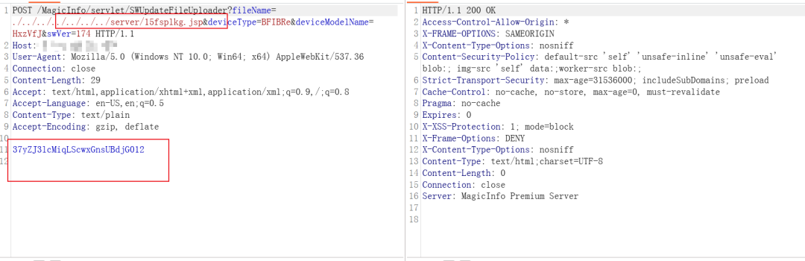
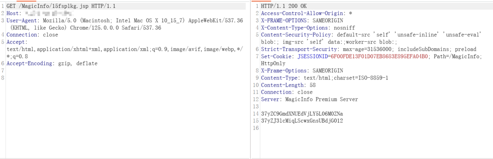
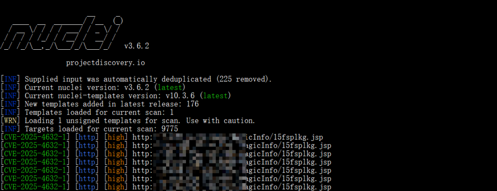

#  漏洞复现 | Samsung MagicINFO 9 Server 路径遍历导致任意文件写入漏洞（CVE-2025-4632）  

<!-- article-review:devices:begin -->
## 技术校订与证据边界（2026-10-02）

- 产品/组件：Samsung MagicINFO 9
- 本文讨论：CVE-2025-4632
- 版本、权限与配置前提：声称版本低于21.1052；鉴权与部署条件未明
- 资料类型：截图式漏洞复现；本次仅核对归档正文，未执行 PoC、未请求目标，未把原作者的“复现成功”继承为本库验证结果

### 逐项校订

- 上传请求、访问路径和执行结果依赖截图，文本不能独立复核
- SYSTEM权限与完整受影响范围无原始公告支持；仅笼统联系厂商/WAF建议

### 操作风险与恢复

- 本篇未提供足以确认无副作用的完整验证流程；应依正文所述配置、权限与交互前提评估，不能把通告或截图当成可直接运行的检测脚本

### 待核与来源

- 官方受影响/修复版本与截图证据待查
- 引用图片未查看，截图内容及有效性待核验
- 文内原始链接和图片引用继续保留；未检查图片像素、未下载或执行外部附件。版本边界、修复/在野状态及厂商归属若缺一手依据，均不能视为本次已确认
- 下方保留原技术正文与载荷；其中历史时间表述和成功主张应按本节限定阅读
<!-- article-review:devices:end -->

 实战安全研究   2026-01-09 02:00  
  
**免责声明**  
<table><tbody><tr style="-webkit-tap-highlight-color: transparent;outline: 0px;visibility: visible;"><td rowspan="5" valign="top" style="-webkit-tap-highlight-color: transparent;outline: 0px;word-break: break-all;hyphens: auto;visibility: visible;"><strong style="-webkit-tap-highlight-color: transparent;outline: 0px;letter-spacing: 0.544px;color: rgb(255, 0, 0);font-size: 14px;visibility: visible;"><strong style="-webkit-tap-highlight-color: transparent;outline: 0px;color: rgb(62, 62, 62);letter-spacing: 0.544px;orphans: 4;text-align: left;visibility: visible;"><span style="-webkit-tap-highlight-color: transparent;outline: 0px;color: rgb(255, 0, 0);letter-spacing: 0.544px;visibility: visible;"><span leaf="">本文仅用于技术学习使用，请勿使用本文所提供的内容及相关技术从事非法活动，由于传播、利用此文所提供的内容或工具而造成任何直接或者间接的后果及损失，均由使用者本人承担，所产生一切不良后果均与文章作者及本账号无关。如内容有争议或侵权，请私信我们！我们会立即删除并致歉。谢谢！</span></span></strong></strong></td></tr><tr style="-webkit-tap-highlight-color: transparent;outline: 0px;visibility: visible;"></tr><tr style="-webkit-tap-highlight-color: transparent;outline: 0px;visibility: visible;"></tr><tr style="-webkit-tap-highlight-color: transparent;outline: 0px;visibility: visible;"></tr><tr style="-webkit-tap-highlight-color: transparent;outline: 0px;visibility: visible;"></tr></tbody></table>  


1  
  
**漏洞描述**  
  
  
  
三星 MagicINFO 9 Server 21.1052 之前的版本中存在将路径名限制为受限目录的漏洞，该漏洞允许攻击者以系统权限写入任意文件。  
  
2  
  
**影响版本**  
  
  
  
MagicINFO 9 Server 21.1052 之前的版本  
  
3  
  
**fofa语法**  
  
  
  
fofa语法  
```
app="MagicInfo-Premium-Server"
```  
  
  
  
  
  
4  
  
**漏洞复现**  
  
  
  
上传文件  
  
  
  
访问文件  
  
  
  
  
5  
  
**检测POC**  
  
  
  
  
  
  
6  
  
**漏洞修复**  
  
  
  
1、建议联系厂商打补丁或升级版本。  
  
2、增加Web应用防火墙防护。  
  
3、关闭互联网暴露面或接口设置访问权限。  
  
7  
  
**内部圈子**  
  
  
  
**现在已更新POC数量 1500+（中危以上）**  
  
  
  
🔥 **1day/Nday 漏洞实战圈上线**  
 🔥  
  
还在到处找公开漏洞 POC？  
  
这里专注实战漏洞复现，一站式解决你的痛点！  
  
🔍   
圈子福利  
  
✅ 整合全网公开1day/Nday漏洞POC，附带复现步骤，新手也能快速上手  
  
✅ 每周更新 10-15 个POC测试脚本，经过实测验证，到手就能用  
  
✅ 完美适配Nuclei 主流扫描工具，脚本无需额外修改，即拿即用  
  
✅ 重磅福利：免登录免费 FOFA 查询，无需账号也能高效资产测绘  
  
✅ 专属权益：提供指纹识别库，指纹库持续更新  
  
💡   
适合对象  
  
渗透测试🔹攻防演练🔹安全运维🔹企业自查  
  
👉 不管你是企业安全自查的运维人员，或者是参加攻防演练的战队成员（红队/蓝队），还是做渗透测试的工程师等职业，这里的资源都能适合你  
  
⚠️   
重要提醒  
  
仅限授权范围内的合法安全测试，严禁用于未授权攻击行为！  
  
本服务为虚拟资源服务，一经购买概不退款，请按需谨慎购买！  
  
现在加入圈子价格是59.9元（  
交个朋友啦  
），后面将调整涨价啦。  
  
  
  
  


---

> 来源：gelusus/wxvl（微信公众号漏洞文章自动归档，原文见文首链接）


## 2026-10-03 公开验证资料补充：写入与回读分别判定

Samsung CNA 将 CVE-2025-4632 映射到 MagicINFO 9 Server `<21.1052` 的任意文件写入。固定 ProjectDiscovery 模板已全文静态阅读，给出未经认证的上传与回读配对，补足旧文仅图片的正文。

输入先 POST `/MagicInfo/servlet/SWUpdateFileUploader`，`fileName` 为 `./../../../../../../server/{{filename}}.html`，并带 `deviceType={{deviceType}}`、`deviceModelName={{deviceModelName}}`、`swVer={{swVer}}`，正文为随机 `{{marker}}`。随后 GET `/MagicInfo/{{filename}}.html`，要求 HTTP 200 且回读正文含同一个 marker；仅上传返回 200 不足以证明写入成立。变量与完整 HTTP 均见固定源文件，未从截图猜写值。

该 PoC 直接证明的是越界文件写入/回读，未上传 JSP，也不以此声称已证明 RCE 或 SYSTEM 命令输出。静态未见外部 helper、依赖安装或第三方回连；会留下 HTML 文件，模板没有清理步骤，需要由获授权管理员只删除本次工件。未执行测试，旧截图未查看。

### 本补充的公开来源与读取范围

- <https://raw.githubusercontent.com/CVEProject/cvelistV5/main/cves/2025/4xxx/CVE-2025-4632.json>（CNA字段摘读；ADP及其他字段不计全文；SHA-256 `5d6a2d21de41a834b94bee46b1280a58582e29e9012d3e15e2c4388e42843875`）
- <https://raw.githubusercontent.com/projectdiscovery/nuclei-templates/9e93c63782dbb2b6160e068710d6240f418a3ed6/http/cves/2025/CVE-2025-4632.yaml>（固定代码全文静态阅读；SHA-256 `ad0e0bcbfeaad2ce857ced84b4c9e9538d2b681d03118e5f02048e4fba71f7c1`）
