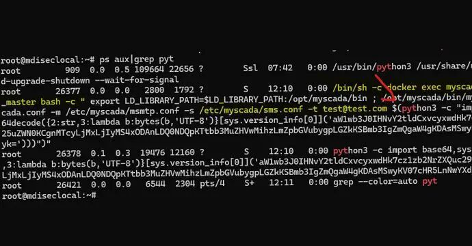
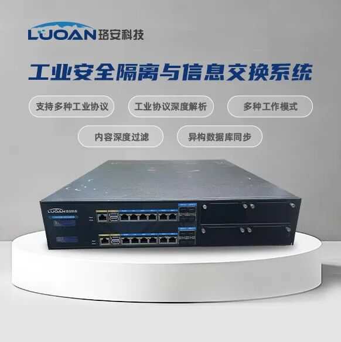
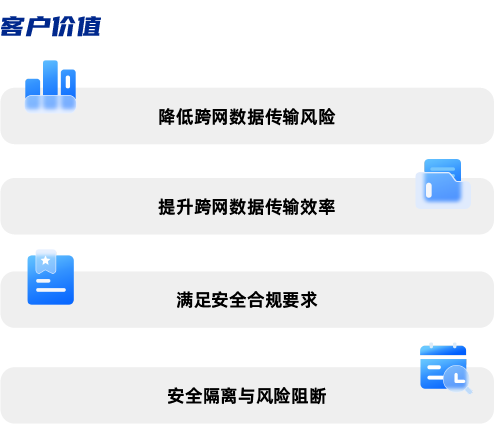

#  重大工控漏洞曝光，工业网络安全如何保障？   

<!-- article-review:devices:begin -->
## 技术校订与证据边界（2026-10-02）

- 产品/组件：mySCADA myPRO为受影响产品，珞安隔离产品是广告
- 本文讨论：CVE-2025-20014/20061命令注入
- 版本、权限与配置前提：版本参数与email参数两个入口，未给版本/权限
- 资料类型：漏洞新闻嵌产品营销；本次仅核对归档正文，未执行 PoC、未请求目标，未把原作者的“复现成功”继承为本库验证结果

### 逐项校订

- 主体大量珞安隔离系统功能宣传，不能当受影响产品
- 无PRODAFT或公告直链、版本及补丁；隔离产品必不可少/有效阻断攻击属营销绝对化

### 操作风险与恢复

- 执行文中载荷可能以目标进程权限启动命令或加载代码；权限受认证角色、操作系统账户及依赖版本约束，不能把 root/200 等通用字符串当成功证据

### 待核与来源

- 原始披露、两个入口权限/修复版本待查
- 引用图片未查看，截图内容及有效性待核验
- 文内原始链接和图片引用继续保留；未检查图片像素、未下载或执行外部附件。版本边界、修复/在野状态及厂商归属若缺一手依据，均不能视为本次已确认
- 下方保留原技术正文与载荷；其中历史时间表述和成功主张应按本节限定阅读
<!-- article-review:devices:end -->

原创 自主研发技术驱动  珞安科技   2025-03-28 18:04  
  
  
  
**1**  
  
**重大工控漏洞危及企业生产安全**  
  
近日，据国内网络安全权威媒体报道，瑞士安全公司PRODAFT公开了两项影响mySCADA myPRO系统的高危漏洞，即CVE-2025-20014和CVE-2025-20061的详细信息，并向工业企业提供了实用的防护建议。  
  
  
报道显示，CVE-2025-20014及CVE-2025-20061均属于操作系统命令注入漏洞，CVSSV4评分达9.3分，可使攻击者通过构造恶意POST请求执行任意代码，进而掌控工业控制系统。  
  
  
其中，CVE-2025-20014操作系统命令注入漏洞，攻击者可通过包含版本参数的特制POST请求，在受影响的系统上执行任意命令。CVE-2025-20061操作系统命令注入漏洞，攻击者可通过包含电子邮件参数的特制POST请求，在受影响的系统上执行任意命令。  
  
  
  
  
PRODAFT在报道中指出，**攻击者若成功利用两项漏洞中的任何一个，便可能注入系统命令并执行任意代码，可能导致工业企业运营中断、财务损失，甚至引发安全隐患。**  
  
****  
  
**2**  
  
**安全防护 隔离当先**  
  
为了防范潜在的网络攻击，PRODAFT建议工业企业采取网络隔离措施，将SCADA系统与IT网络分离；及时更新应用最新的安全补丁；采用强化的身份验证机制和监控可疑活动等多重安全防护手段，以降低漏洞被利用的风险，确保工业控制系统的安全稳定运行。  
  
  
在PRODAFT的防护建议中网络隔离被重点提及。作为工控系统安全防护的核心手段之一，网络隔离被广泛运用。通过在网间区域部署隔离产品，可以有效阻断病毒及网络攻击，保护数据、流量传输安全，进而维护工控系统的运行稳定  
。**鉴于网络隔离的重要性和必要性，一款技术先进、功能强大、可靠性高的的隔离产品则必不可少。**  
  
****  
  
**3**  
  
**自主研发打造网间“桥梁”**  
  
珞安科技作为国内工控安全领域技术先进、实力深厚的优秀企业，针对不同网络安全级别的安全防护、数据交换问题，自主研发工业安全隔离与信息交换系统，打造高效、安全的数据交换“桥梁”。  
  
  
**产品简介**  
  
工业安全隔离与信息交换系统是专用于工业控制网络中不同安全级别网络之间进行数据安全交换的物理隔离产品。产品由内、外网处理单元和数据交换单元组成，通过协议剥离、重组，以信息“摆渡”方式，在保证内外网隔离的前提下，实现高效、安全的跨网是数据交换。  
  
  
  
  
**功能特点**  
  
**工业协议深度解析**  
  
支持对Modbus、IEC104、OPC、S7、DNP3、Profinet等工控协议的指令级解析、识别和过滤，以保护SCADA、DCS、PLC等工控系统免受网络攻击。  
  
**文件同步功能**  
  
支持FTP、NFS、SMB、FTPS、SFTP等通用协议的文件同步，还支持专用文件同步客户端软件，与网闸建立加密认证传输通道，实现文件的加密传输。  
  
**传输层控制**  
  
网闸能够实现TCP与UDP的传输层协议代理，根据传输策略对TCP和UDP会话进行阻断和放行。  
  
**应用控制**  
  
支持FTP、SMTP、TELNET等应用协议代理，并根据应用策略对应用协议进行阻断和放行。  
  
**网页访问控制**  
  
支持基于HTTP和HTTPS的网页访问控制，可以根据策略对指定的URL地址进行访问控制。  
  
**音视频代理**  
  
支持国标GB28281/SIP、RTSP、RTMP等  
常用音视频协议深度解析，根据策略配置可以控制视频数据传输。可以对访问者进行身份认证。  
  
**数据库同步**  
  
系统支持外网向内网的单向数据库同步功能，支持不少于12种主流及国产化数据库；支持数据库级同步、表级同步以及字段级同步；还可支持操作系统异构、数据库异构、字符集异构、表异构、字段异构等多种异构同步。  
  
**数据过滤**  
  
支持对数据的深层次解析和过滤，支持对文件内容进行病毒扫描、关键字检查、文件真实类型检查、文件大小过滤、文件后缀名过滤等细化管控。  
  
  
  
  
  
**4**  
  
**结 语**  
  
网络隔离在工业网络防护中兼具“防御纵深构建”和“业务连续性保障”的双重价值，是应对复杂威胁环境的基础性技术措施。未来，珞安科技将发挥专精特新企业技术、研发创新优势，打造安全、高效、可靠的创新产品，为工业网络空间筑牢防线。  
  
  
**珞安科技**  
  
  
  
**北京珞安科技有限责任公司（简称：珞安科技）成立于2016年，是专注工业网络空间安全的创新型高科技企业和国家专精特新“小巨人”企业，并于2022年行业内率先通过CMMI5级认证。**  
  
  
珞安科技拥有业内顶尖工控安全专家团队、工业网络空间安全研究实验室和四大研发中心，坚持自主研发和技术创新，以零信任理念和体系化思想为指导，打造“实战化、易部署、易维护”工控网络安全产品体系，覆盖工控安全、业务安全和工业互联网安全，构建了全方位的工业网络空间安全防护体系。  
  
  
依托强大的技术原厂商实力，积极开展安全服务和安全运营，业务遍布20多个行业的2000余家工业企业。在全国设有20+分子公司及办事处，提供7*24h安全应急服务响应，保障国家关键信息基础设施安全稳定运行。  
  
  
  
  
  
  
  
  
  
  
  
  
  
  
  
  
  

---

> 来源：gelusus/wxvl（微信公众号漏洞文章自动归档，原文见文首链接）
