# CVE-2013-0662：施耐德 ModBus串行驱动远程代码执行漏洞分析

<!-- article-review:devices:begin -->
## 技术校订与证据边界（2026-10-02）

- 产品/组件：Schneider Electric Modbus Serial Driver Windows软件
- 本文讨论：CVE-2013-0662栈溢出
- 版本、权限与配置前提：1.10–3.2，测试XP SP3/3.2，TCP27700可达
- 资料类型：截图式逆向分析；本次仅核对归档正文，未执行 PoC、未请求目标，未把原作者的“复现成功”继承为本库验证结果

### 逐项校订

- 应归软件驱动而非泛指Modicon设备/Modbus协议
- 完整PoC、汇编和关键数据布局仅图示，文本不够独立复核
- 9.3未标CVSS版本；未给官方修复版本和来源，通用杀毒不是补丁

### 操作风险与恢复

- 畸形输入可能使进程/内核崩溃、设备重启或服务不可用；本文崩溃线索不自动证明稳定代码执行，需隔离环境和可恢复配置

### 待核与来源

- 图片中的控制流/执行证据、受影响范围和补丁待核
- 引用图片未查看，截图内容及有效性待核验
- 文内原始链接和图片引用继续保留；未检查图片像素、未下载或执行外部附件。版本边界、修复/在野状态及厂商归属若缺一手依据，均不能视为本次已确认
- 下方保留原技术正文与载荷；其中历史时间表述和成功主张应按本节限定阅读
<!-- article-review:devices:end -->

<meta name="referrer" content="no-referrer"/>

> 本文由 [简悦 SimpRead](http://ksria.com/simpread/) 转码， 原文地址 [mp.weixin.qq.com](https://mp.weixin.qq.com/s/AESnqiIVmrP4qJpIf6taJQ)

****
------------------------------------------------------------------------------------------------------------------------------------------------------------------------

Part1

漏洞状态

<table interlaced="enabled"><tbody><tr class="ue-table-interlace-color-single"><td width="123" valign="top" align="center" style="word-break: break-all;background-color: rgb(170, 170, 170);">漏洞细节 </td><td width="123" valign="top" align="center" style="word-break: break-all;background-color: rgb(170, 170, 170);">漏洞POC </td><td width="123" valign="top" align="center" style="word-break: break-all;background-color: rgb(170, 170, 170);">漏洞EXP </td><td width="123" valign="top" align="center" style="word-break: break-all;background-color: rgb(170, 170, 170);">在野利用 </td></tr><tr class="ue-table-interlace-color-double"><td width="123" valign="top" align="center" style="word-break: break-all;">有 </td><td width="123" valign="top" align="center" style="word-break: break-all;">有 </td><td width="123" valign="top" align="center" style="word-break: break-all;">有</td><td width="123" valign="top" align="center" style="word-break: break-all;">无</td></tr></tbody></table>

Part2

漏洞描述

<table interlaced="enabled"><tbody><tr class="ue-table-interlace-color-single"><td width="145.66666666666666" valign="middle" align="center" style="word-break: break-all;">漏洞名称 </td><td width="389" valign="top" style="line-height: 1.5em;word-break: break-all;">
Schneider Electric Modbus Serial Driver 基于栈的缓冲区溢出漏洞
</td></tr><tr class="ue-table-interlace-color-double"><td width="145.66666666666666" valign="middle" align="center" style="word-break: break-all;">CVE编号</td><td width="389" valign="top" style="line-height: 1.5em;word-break: break-all;">
CVE-2013-0662
</td></tr><tr class="ue-table-interlace-color-single"><td width="145.66666666666666" valign="middle" align="center" style="word-break: break-all;">漏洞类型</td><td width="389" valign="top" style="line-height: 1.5em;word-break: break-all;">
远程代码执行
</td></tr><tr class="ue-table-interlace-color-double"><td width="145.66666666666666" valign="middle" align="center" style="word-break: break-all;">漏洞等级</td><td width="389" valign="top" style="line-height: 1.5em;word-break: break-all;">9.3&nbsp;高危(Critical)</td></tr><tr class="ue-table-interlace-color-single"><td width="145.66666666666666" valign="middle" align="center" style="word-break: break-all;">公开状态</td><td width="389" valign="top" style="line-height: 1.5em;word-break: break-all;">公开 </td></tr><tr class="ue-table-interlace-color-double"><td width="145" valign="middle" align="center" style="word-break: break-all;">漏洞描述</td><td width="389" valign="top" style="line-height: 1.5em;word-break: break-all;">
Schneider Electric Modbus Serial Driver是法国施耐德电气（Schneider Electric）公司的一款串行驱动。
<section style="line-height: 1.5em;word-break: break-all;">该漏洞是Schneider Electric ModbusSerial Driver 1.10&nbsp;到 3.2 版本的 ModbusDrv.exe程序中的栈溢出漏洞。攻击者可以通过发送长度超过程序预期的网络数据导致程序中栈溢出，从而实现任意远程代码执行。</section></td></tr></tbody></table>

Part3

受影响版本

Version: 1.10 - 3.2

Part4

漏洞复现环境

系统环境：

Windows xp sp3

软件：

Schneider Electric Modbus Serial Driver 3.2

Part5

漏洞复现

安装软件：

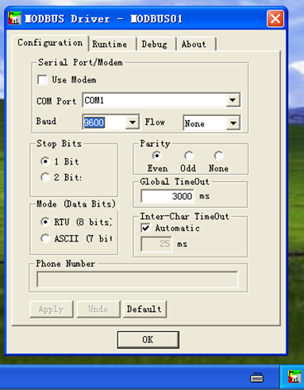

**软件路径：**

C:\WINDOWS\system32\ModbusDrv.exe

**查看进程ID:**

**查看ID绑定端口：**

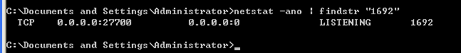

监控 27700 端口

**关闭防火墙:**

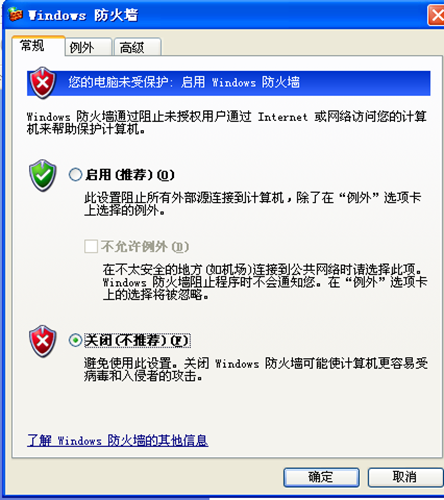

**Python运行脚本：**

  

**攻击结果：**

进程退出，弹出计算器

Part6

漏洞细节分析  

首先在这里接收7个字节的数据

会有数据校验，这块数据必须是 0xFFFF

**再次接收数据：**

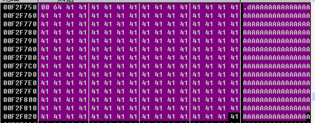

这些就是研究者在poc中构建的数据

这里有数据校验，必须是0x0064 否则不会走正常函数流程

这个函数就是漏洞触发的关键函数，步入查看细节

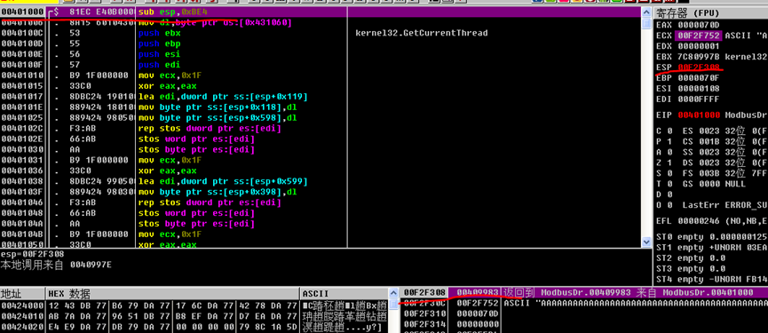

Esp 是 0x00F2F308 返回地址是 0x409983

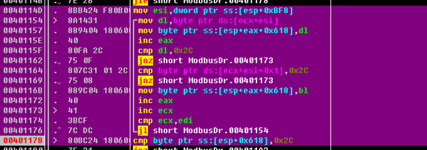

这一块就是 漏洞触发的点，因为没有自己校验长度，把用户数据当接收长度，导致栈上数据被覆盖。

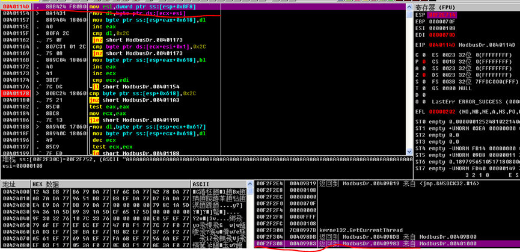

这是这段循环前，返回值堆栈附近的情况。

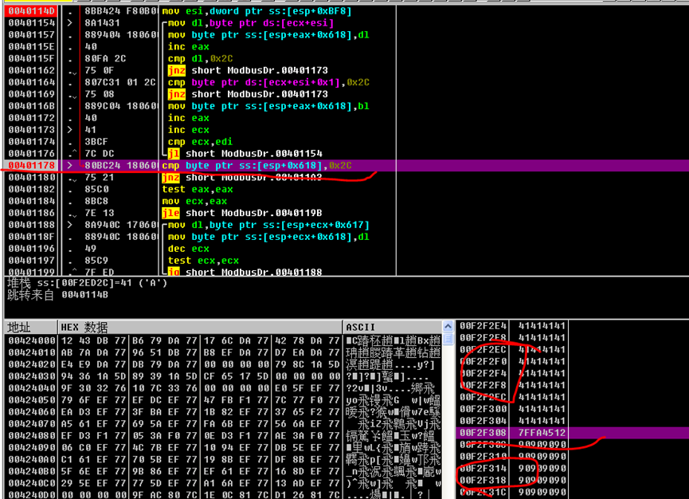

循环执行之后，堆栈已经完全被研究者构造的数据覆盖了。

执行到返回

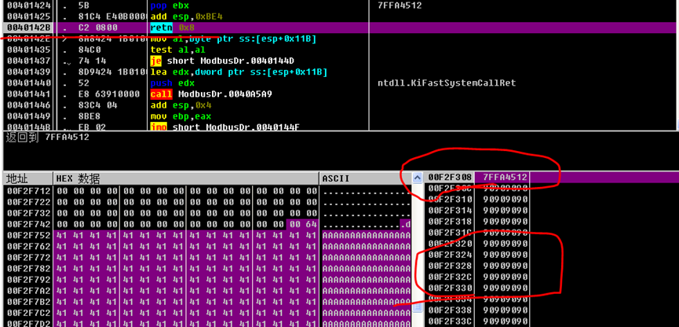

看这里返回地方的堆栈。

返回地址是：

  

Jmp esp xp中常用的动态定位shell code的方法

堆栈中划线的是 0x90  nop指令

单步返回，然后再单步一次，程序就直接跑到 shellcode位置。

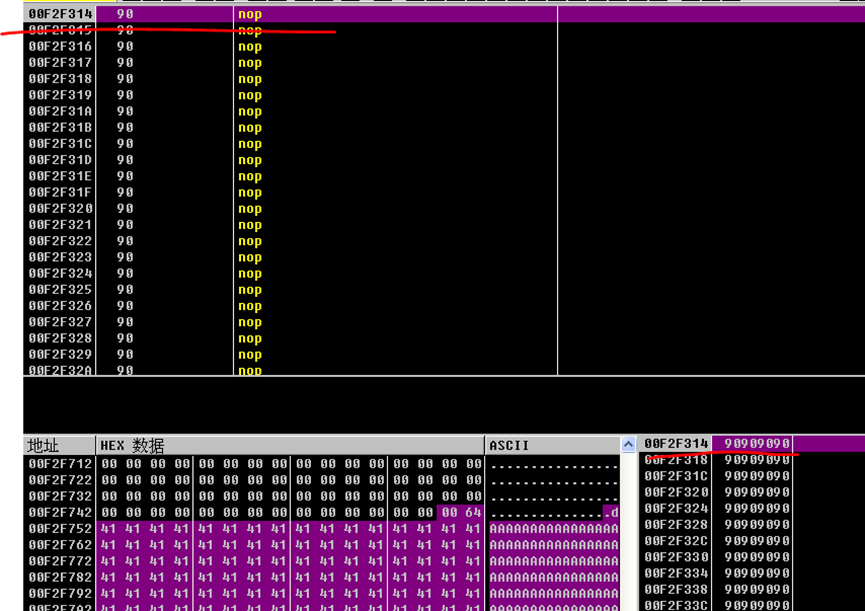  

放开程序运行

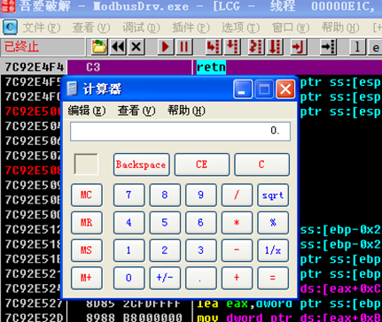

弹出计算器，退出进程。

Part7

修复建议

1. 把软件升级到最新版本。

2. 不要把软件监听的端口27700暴露在外网。

3. 内网维护人员设置可信IP访问。

4. 安全维护人员进行主机加固，如安装杀毒软件，主机卫士等。

**SAFE**

**获取更多情报**

  

联系我们，获取更多漏洞情报详情及处置建议，让企业远离漏洞威胁。  
电话：18511745601

邮箱：shiliangang@andisec.com

**漏洞分析回顾**  

**安帝科技**丨**ANDISEC**

  

北京安帝科技有限公司是新兴的工业网络安全能力供应商，专注于网络化、数字化、智能化背景下的工业网络安全技术、产品、服务的探索和实践，创新应用网络空间行为学及工业网络行为验证，构建了工业大数据深度分析、威胁情报共享、威胁感知和协同响应等核心能力优势，为电力、石油石化、煤炭、烟草、轨道交通、智能制造等关键信息基础设施行业提供安全产品、服务和综合解决方案，工业网络安全态势感知平台已部署4000余家电厂。

  

**点击“在看”鼓励一下吧**

****

---

> 来源：MrWQ/vulnerability-paper（https://github.com/MrWQ/vulnerability-paper）
