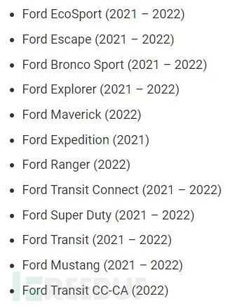

#  福特曝WiFi安全漏洞，官方称仍可安全驾驶   

<!-- article-review:devices:begin -->
## 技术校订与证据边界（2026-10-02）

- 产品/组件：Ford/Lincoln SYNC3 WL18xx MCP驱动
- 本文讨论：CVE-2023-29468；大众/TPMS等历史事件无关
- 版本、权限与配置前提：Wi-Fi范围内，车辆点火且Wi-Fi开启；车型表仅图片
- 资料类型：车载Wi-Fi安全新闻；本次仅核对归档正文，未执行 PoC、未请求目标，未把原作者的“复现成功”继承为本库验证结果

### 逐项校订

- 历史其他品牌/TPMS漏洞混入会误扩大本CVE物理安全影响
- 未给驱动/固件修复号，车型范围图像依赖；无利用证据不能由技术难度直接推出
- SYNC3误拼YNC3

### 操作风险与恢复

- 本篇未提供足以确认无副作用的完整验证流程；应依正文所述配置、权限与交互前提评估，不能把通告或截图当成可直接运行的检测脚本

### 待核与来源

- 车型表、补丁状态和厂商安全边界声明待核
- 引用图片未查看，截图内容及有效性待核验
- 文内原始链接和图片引用继续保留；未检查图片像素、未下载或执行外部附件。版本边界、修复/在野状态及厂商归属若缺一手依据，均不能视为本次已确认
- 下方保留原技术正文与载荷；其中历史时间表述和成功主张应按本节限定阅读
<!-- article-review:devices:end -->

 网络安全应急技术国家工程中心   2023-08-15 15:40  
  
  
  
据bleepingcomputer消息，福特汽车供应商的安全人员向福特公司报告了一个安全漏洞，漏洞编号 CVE-2023-29468。该漏洞位于汽车信息娱乐系统集成的 WiFi 系统 WL18xx MCP 驱动程序中，允许 WiFi 范围内的攻击者使用特制的帧触发缓冲区溢出。  
  
资料显示，SYNC3 是一款现代信息娱乐系统，支持车载 WiFi 热点、电话连接、语音命令、第三方应用程序等，SYNC3 信息娱乐系统被广泛应用于多款福特和林肯汽车上。  
  
受影响的汽车型号如下所示：  
  
  
  
该漏洞发布后，安全研究人员与福特汽车公司、供应商和其他汽车制造商合作，承诺将很快推出相关漏洞补丁，客户可通过USB安装到车辆上，以保护其客户、产品和企业免受影响。   
  
福特汽车公司发布公告称，尚未有任何证据表明该漏洞已经被黑客利用，原因在于利用WiFi软件漏洞需要较为扎实的黑客技术，且攻击者还需在物理上靠近已打开点火装置和 Wi-Fi 设置的车辆。  
  
福特汽车公司进一步指出，哪怕该漏洞已经被利用，也不会影响车辆乘坐人员的人身安全，因为该漏洞只存在于娱乐系统集成中，转向、油门和制动等控制装置有专门的防火墙保护。“如果用户担心该漏洞带来风险，可通过 SYNC 3 信息娱乐系统的设置菜单关闭 WiFi 功能。”  
  
事实上，随着汽车智能化程度持续提升，所包含的安全漏洞也越来越多，福特、大众、丰田等知名汽车制作商屡屡被曝出存在安全漏洞，直接影响用户的使用体验和安全。  
  
英国消费杂志《Which》曾联合网络安全公司Context Information Security发布报告称：大众、福特两大汽车行业巨头计算机系统存在大量安全漏洞，可导致车辆监控、预警系统发出错误信息，误导驾驶员行驶判断，并泄露娱乐系统中的相关敏感信息。  
  
报告显示，大众Polo SELTSI手动1.0L的汽车计算机系统中，负责车辆湿滑路面行驶时牵引力控制的模块存在安全漏洞，黑客可借此获取车辆信息娱乐系统中存储的电话号码、地址以及导航历史记录等敏感信息。  
  
此外，研究人员还发现，只要抬起汽车前部的大众徽章就能进入前雷达模块，黑客可通过这一动作进一步篡改车辆碰撞预警系统。  
  
报告数据显示，福特汽车的安全漏洞似乎更严重一些。研究人员发现，他们使用亚马逊的“廉价笔记本电脑和售价25英镑的渗透小工具”，就能拦截篡改福特福克斯车型上由轮胎压力监控系统（TPMS）发送的消息，比如，在轮胎没有充气时错误地报告轮胎已经正确充气，以此干扰驾驶员做出正确的行驶判断。  
  
在更进一步的分析中，福特计算机系统的代码中还被发现了一些包括wifi详细信息和一个似乎是福特生产线计算机系统的密码，扫描过后，确认该网络属于是福特位于密歇根州底特律的装配厂。同样的，福特汽车中也存在应用程序随时共享车辆敏感信息的现象。  
  
安全研究人员所测试的这两款车型在世界范围内的购买率十分之高，一旦这些漏洞被黑客组织用于投入实战进行攻击，后果不堪设想。  
  
**参考资料：**  
  
https://www.bleepingcomputer.com/news/security/ford-says-cars-with-wifi-vulnerability-still-safe-to-drive/  
  
  
  
原文来源：FreeBuf  
  
“投稿联系方式：孙中豪 010-82992251   sunzhonghao@cert.org.cn”  
  
  
  

---

> 来源：gelusus/wxvl（微信公众号漏洞文章自动归档，原文见文首链接）
