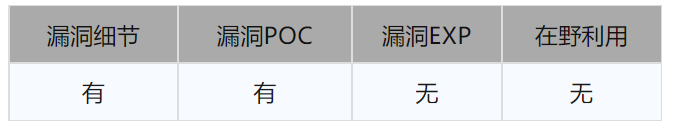
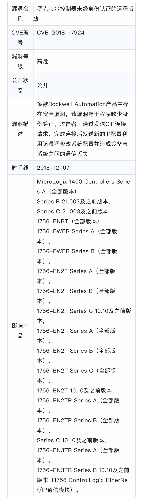
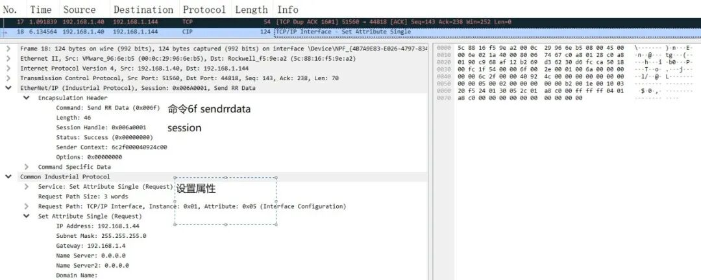
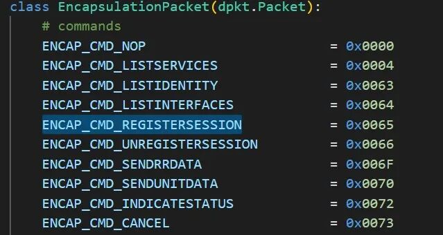
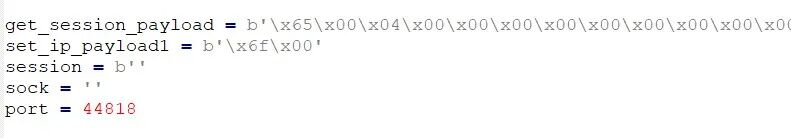
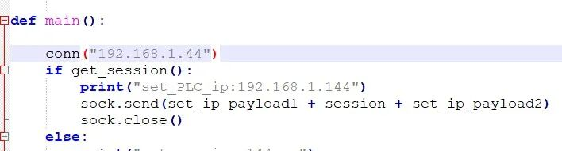
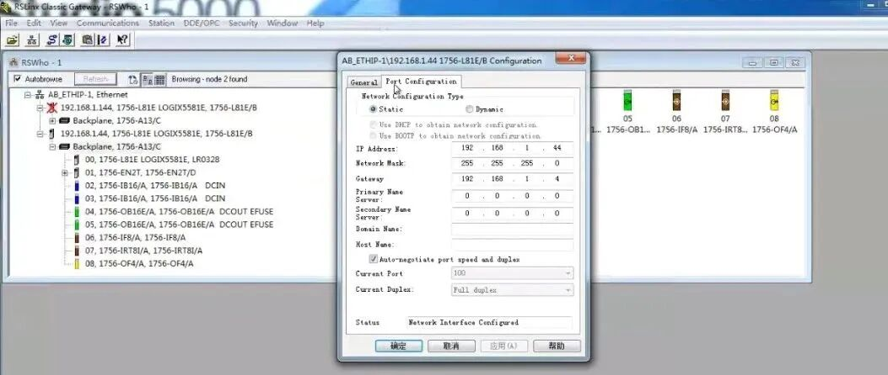
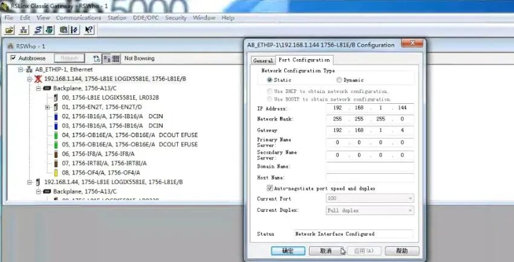
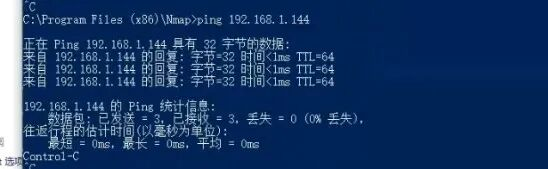

#  罗克韦尔控制器身份认证漏洞CVE-2018-17924分析复现   

<!-- article-review:devices:begin -->
## 技术校订与证据边界（2026-10-02）

- 产品/组件：Rockwell AB1756控制器
- 本文讨论：CVE-2018-17924认证缺失
- 版本、权限与配置前提：ENIP网络可达，注册session后修改IP；固件和型号细分未给
- 资料类型：截图式ENIP研究；本次仅核对归档正文，未执行 PoC、未请求目标，未把原作者的“复现成功”继承为本库验证结果

### 逐项校订

- 漏洞详情/版本表与完整PoC仅图片，正文不能独立复核
- AB1756只是系列不够精确；补丁仅称最新无官方链接
- 需区分ENIP session注册标识与身份认证，避免将建立会话等同已授权

### 操作风险与恢复

- 本篇未提供足以确认无副作用的完整验证流程；应依正文所述配置、权限与交互前提评估，不能把通告或截图当成可直接运行的检测脚本

### 待核与来源

- CVE产品映射、固件及截图证据待查
- 引用图片未查看，截图内容及有效性待核验
- 文内原始链接和图片引用继续保留；未检查图片像素、未下载或执行外部附件。版本边界、修复/在野状态及厂商归属若缺一手依据，均不能视为本次已确认
- 下方保留原技术正文与载荷；其中历史时间表述和成功主张应按本节限定阅读
<!-- article-review:devices:end -->

 网络安全应急技术国家工程中心   2023-04-21 15:15  
  
Rockwell Automation是全球最大的自动化和信息化公司之一，拥有众多的产品，涵盖高级过程控制、变频器、运动控制、HMI、马达控制中心、分布式控制系统、可编程控制器等。  
  
**Part1 漏洞状态**  
  
  
  
  
**Part2 漏洞描述**  
  
  
  
****  
**测试设备: AB1756**  
  
**Part3 漏洞分析**  
  
AB PLC使用ENIP协议通信，未判断数据来源，分析RS linx与PLC通信的数据包，确认只需要获取session后建立连接，便可向PLC发送修改IP的指令，使得PLC与现有设备的连接断开。  
  
  
  
构  
建POC  
  
先使用命令码0x65，注册session，并将返回的session拼接到修改IP的命令内，即可完成远程修改IP的行为。  
  
  
  
  
  
  
  
  
  
- ## 验证  
  
修改之前PLC IP为192.168.1.44  
  
  
  
  
  
运行POC，可以到看PLC 的IP 已经修改为192.168.1.144  
  
  
  
  
  
  
  
**Part4 修复建议**  
  
厂家已发布修复漏洞的补丁和固件，尽快升级到最新版本。  
  
  
  
原文来源：安帝Andisec  
  
“投稿联系方式：孙中豪 010-82992251   sunzhonghao@cert.org.cn”  
  
  
  
  

---

> 来源：gelusus/wxvl（微信公众号漏洞文章自动归档，原文见文首链接）
