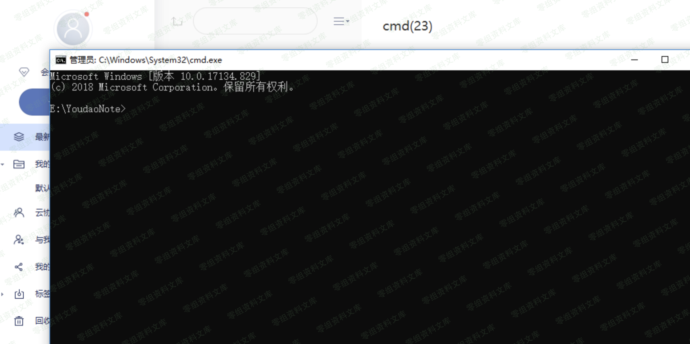
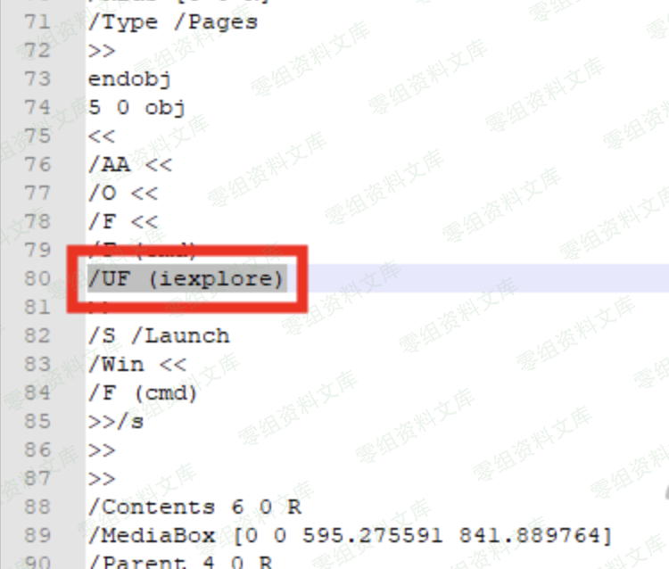

有道云笔记/印象笔记 windows客户端代码执行&本地文件读取
======================================================

一、漏洞简介
------------

二、漏洞影响
------------

三、复现过程
------------

构造一个pdf，UF处是执行的地方，输入iexplore表示打开ie

在客户端上传就会触发：

打开cmd

用到的pdf：

改/UF (iexplore)即可：

/F（cmd）不用理会，这个是我测试的时候乱插的

具体技术详情不说了，感兴趣的搜索关键字"pdf漏洞""pdf脚本执行"

四、参考链接
------------

> <https://www.t00ls.net/thread-54303-1-1.html>
