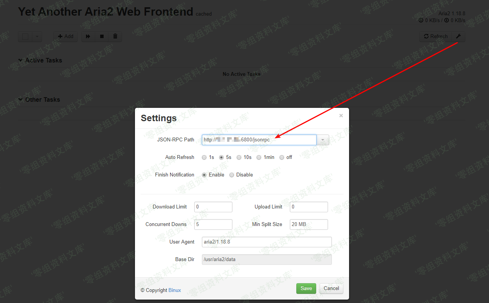
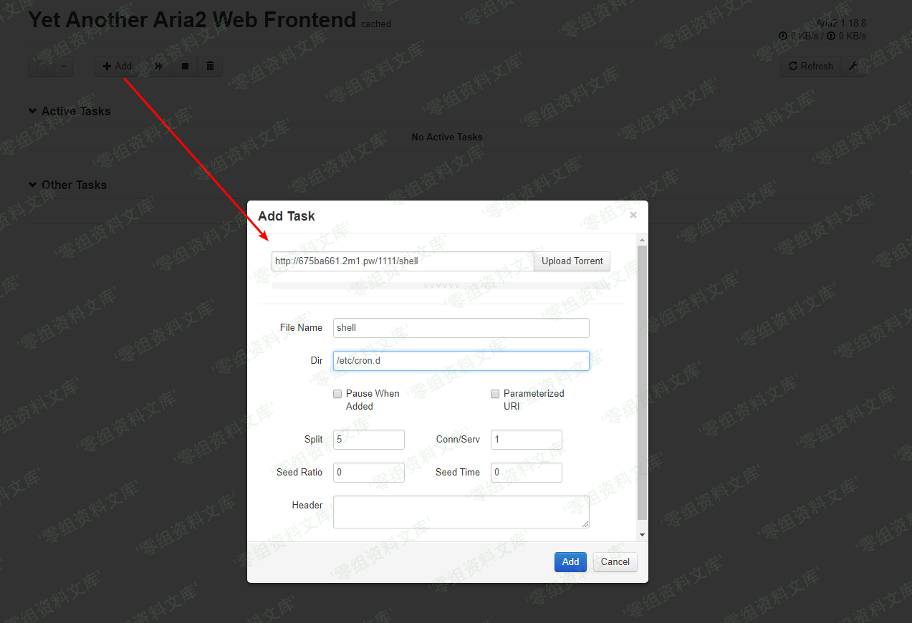
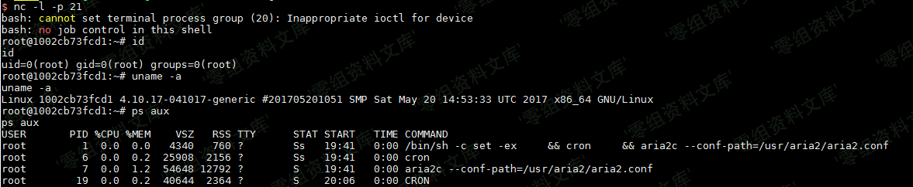

# aria2 RPC 下载路径与文件写入风险（未确认 CVE）

<!-- vulwiki-editorial:start -->
## 校订与适用边界

CVE-2016-3088 属于 Apache ActiveMQ Fileserver，不属于 aria2。本文保留 aria2 RPC 方法与部署条件，原版本断言和修复边界仍待 aria2 来源证明。

- 适用前提：RPC可操作、进程可写/etc/cron.d等高权限路径；<1.18.8范围未给来源
- 证据范围：与7同源同核心步骤，删减了cron说明并错误添加CVE；需去错编号再合并

### 已有来源支持的更正

- Apache官方明确3088对应ActiveMQ Fileserver应用，并非aria2

### 本次正文校订

- 修正题名；原文件路径保持不变，以保留已有链接和资源定位。

### 尚未解决的证据缺口

以下限制仍适用于后文历史材料；相关版本、结果或修复结论不能据此视为已验证：

- CVE-2016-3088不属于aria2
- <1.18.8版本断言缺支持，不能从ActiveMQ编号推导修复
- 图片引用重复残尾

### 核验来源

- https://activemq.apache.org/security-advisories.data/CVE-2016-3088-announcement.txt

### 操作风险与资料使用

- 含计划任务、启动项或 SSH 授权文件写入：会改变后续执行或登录行为。测试前备份原文件，结束后恢复原内容、权限与属主，不覆盖生产文件。
- 含反向连接或交互式命令执行方法：会产生出站连接和子进程；目标、监听端与网络须在授权隔离范围内，结束后关闭会话并核对遗留进程。

本页为文本校订，未执行代码、PoC 或目标请求；原图仅保留引用，未据此确认复现成功。
<!-- vulwiki-editorial:end -->

## 技术正文与历史材料

一、漏洞简介
------------

Aria2是一个命令行下轻量级、多协议、多来源的下载工具（支持
HTTP/HTTPS、FTP、BitTorrent、Metalink），内建XML-RPC和JSON-RPC接口。在有权限的情况下，我们可以使用RPC接口来操作aria2来下载文件，将文件下载至任意目录，造成一个任意文件写入漏洞。

二、漏洞影响
------------

Aria2 \< 1.18.8

三、复现过程
------------

因为rpc通信需要使用json或者xml，不太方便，所以我们可以借助第三方UI来和目标通信，如
http://binux.github.io/yaaw/demo/ 。

> https://github.com/ianxtianxt/yaaw 源码在这里，也可自行搭建。

打开yaaw，点击配置按钮，填入运行aria2的目标域名：`http://your-ip:6800/jsonrpc`:

Aria2任意文件写入漏洞/media/rId24.png)

然后点击Add，增加一个新的下载任务。在Dir的位置填写下载至的目录，File
Name处填写文件名。比如，我们通过写入一个crond任务来反弹shell：

Aria2任意文件写入漏洞/media/rId25.png)

这时候，arai2会将恶意文件（我指定的URL）下载到/etc/cron.d/目录下，文件名为shell。而在debian中，/etc/cron.d目录下的所有文件将被作为计划任务配置文件（类似crontab）读取，等待一分钟不到即成功反弹shell：

Aria2任意文件写入漏洞/media/rId26.png)

> 如果反弹不成功，注意crontab文件的格式，以及换行符必须是`\n`，且文件结尾需要有一个换行符。
