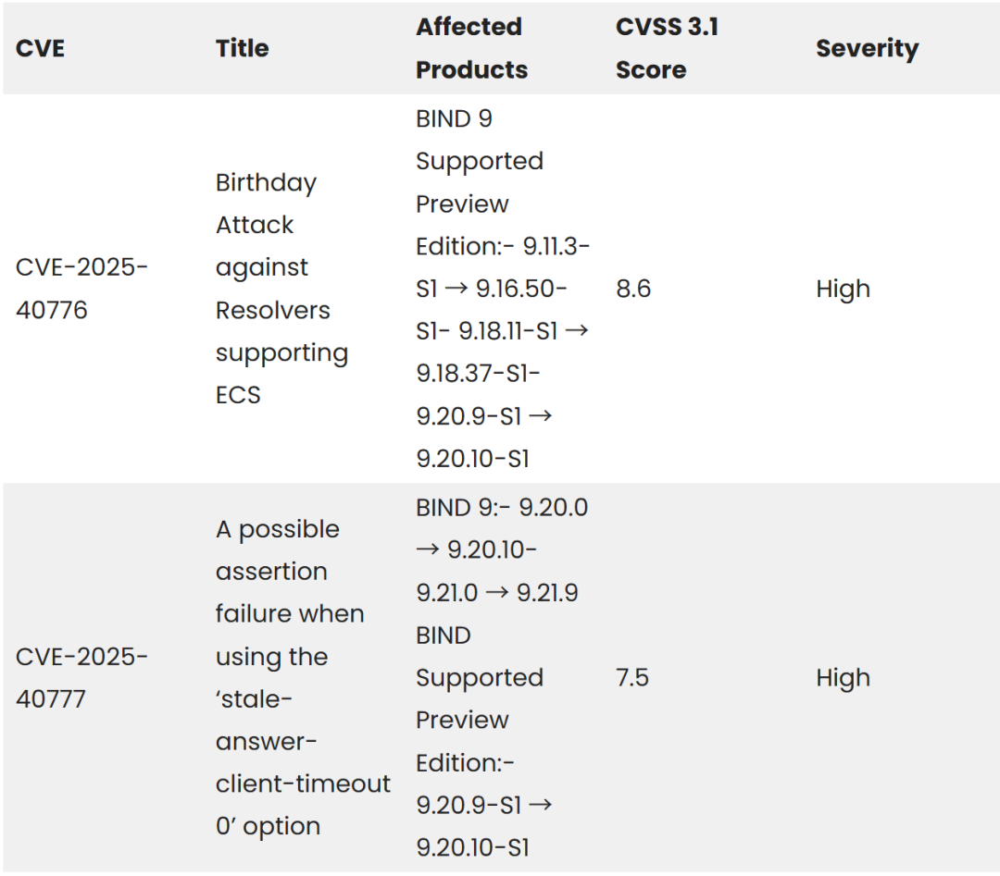

# BIND 9 DNS解析软件漏洞，可能引发缓存投毒与拒绝服务攻击

<!-- vulwiki-editorial:start -->
## 校订与适用边界

- 适用前提：40776仅订阅版特定分支启用ECS；40777需特定serve-stale配置与CNAME处理
- 证据范围：区分两个问题和修复版本，非PoC；配置名称被加空格且serve-stale-enable与后文stale-answer-enable不一致

### 尚未解决的证据缺口

以下限制仍适用于后文历史材料；相关版本、结果或修复结论不能据此视为已验证：

- 配置键如ecs - zones、stale - answer - client - timeout不可直接复制
- 需核对serve-stale-enable是否误写并补ISC原始公告
- 版本-S1被加空格，应统一语义版本

### 操作风险与资料使用

- 含资源消耗、延时或崩溃验证：可能影响服务可用性；限制请求次数、并发与超时，保留无攻击负载的对照结果。

本页为文本校订，未执行代码、PoC 或目标请求；原图仅保留引用，未据此确认复现成功。
<!-- vulwiki-editorial:end -->

## 技术正文与历史材料

看雪学苑  看雪学苑   2025-07-18 09:59  
  
近期，BIND 9 DNS 解析器软件曝出两枚关键漏洞——CVE-2025-40776 和 CVE-2025-40777，正对全球组织构成威胁，可能引发缓存投毒与拒绝服务攻击，危及 DNS 基础设施安全。  
  
  
  
  
  
CVE-2025-40776 是针对配置了 EDNS 客户端子网（ECS）选项的 BIND 9 解析器的缓存投毒漏洞，CVSS 评分高达 8.6 。该“生日攻击”漏洞仅影响 BIND 订阅版（-S）特定版本，像 9.11.3 - S1 到 9.16.50 - S1 、9.18.11 - S1 到 9.18.37 - S1 以及 9.20.9 - S1 到 9.20.10 - S1 。其利用解析器向权威服务器发送 ECS 选项，迫使服务器发起查询，增加源端口猜测成功概率，且绕过了原有缓存投毒攻击缓解措施，由南开大学 AOSP 实验室的 Xiang Li 发现，CVSS 向量显示可网络远程利用，对完整性影响高 。  
  
  
另一漏洞 CVE-2025-40777 则会引发拒绝服务攻击，CVSS 评分为 7.5 。它影响 BIND 9.20.0 到 9.20.10 、9.21.0 到 9.21.9 版本及对应支持预览版。当解析器配置为 serve - stale - enable yes 且 stale - answer - client - timeout 设为 0 时，漏洞触发。攻击者可利用特定 CNAME 链组合（涉及缓存或权威记录），迫使 named 守护进程终止，不过目前未发现活跃利用情况，其 CVSS 向量体现出远程利用对可用性高影响 。  
  
  
针对这些漏洞，ISC 建议立即打补丁修复。CVE-2025-40776 需升级到 BIND 9.18.38 - S1 或 9.20.11 - S1 ，也可通过从 named.conf 移除 ecs - zones 选项禁用 ECS ；CVE-2025-40777 要升级到 BIND 9.20.11 或 9.21.10 ，临时解决办法包括在配置文件中设置 stale - answer - client - timeout off 或 stale - answer - enable no 。  
  
  
  
资讯来源：  
cybersecuritynews  
  
转载请注明出处和本文链接  
  
  
﹀  
  
﹀  
  
﹀  
  
  
  
  
  
  
  
**球分享**  
  
  
  
**球点赞**  
  
  
  
**球在看**  
  
  
  
  
点击阅读原文查看更多  
  

---

> 来源：gelusus/wxvl（微信公众号漏洞文章自动归档，原文见文首链接）
