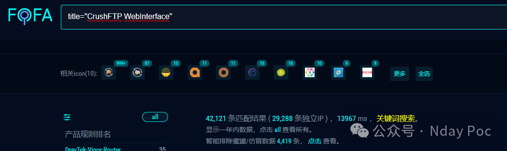
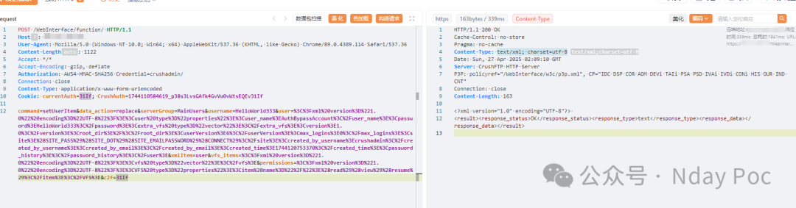
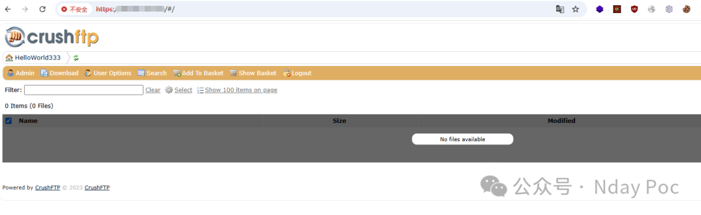
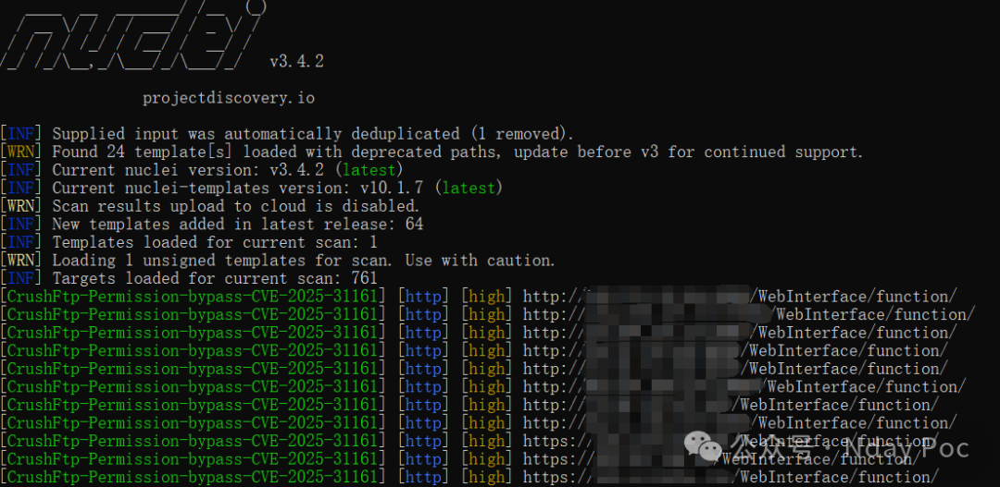
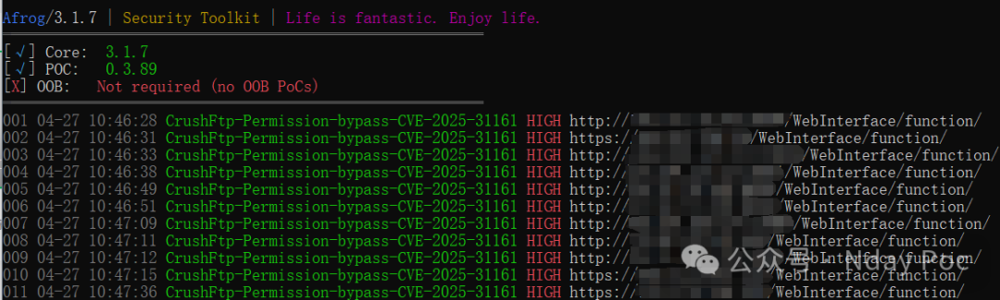
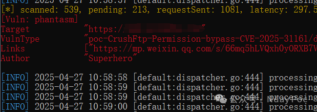

# CrushFtp 权限绕过漏洞 (CVE-2025-31161)

<!-- vulwiki-editorial:start -->
## 校订与适用边界

- 适用前提：未认证HTTP(S)、有效用户名及适用版本；正文未列版本
- 证据范围：文字没有原始请求或脚本，创建用户及登录仅截图；有状态账户创建不能称无副作用自查

### 尚未解决的证据缺口

以下限制仍适用于后文历史材料；相关版本、结果或修复结论不能据此视为已验证：

- 缺受影响/修复版本和请求，截图无法替代可检索文本
- 多数用户默认用户名的统计断言无依据
- 竞态条件与实际利用流程需来源证据，不靠一次创建账号示例推断

### 操作风险与资料使用

- 含落盘脚本或账户创建：会留下持久状态。记录本次生成的路径或账户，测试后清理这些对象并撤销关联令牌；不要删除既有业务对象。

本页为文本校订，未执行代码、PoC 或目标请求；原图仅保留引用，未据此确认复现成功。
<!-- vulwiki-editorial:end -->

## 技术正文与历史材料

Superhero  Nday Poc   2025-04-27 03:03  
  
  
  
  
  
  
  
内容仅用于学习交流自查使用，由于传播、利用本公众号所提供的  
POC  
信息及  
POC对应脚本  
而造成的任何直接或者间接的后果及损失，均由使用者本人负责，公众号Nday Poc及作者不为此承担任何责任，一旦造成后果请自行承担！  
  
  
**01**  
  
**漏洞概述**  
  
  
该漏洞源于 HTTP 组件的 AWS4\-HMAC\-SHA256 认证方法中存在竞态条件。攻击者可以通过构造特殊的 HTTP Authorization 请求头，在无需密码的情况下临时认证为任意用户（包括管理员账户），从而绕过正常认证机制。由于大多数用户选择默认管理员用户名（如 crushadmin），这使得漏洞利用变得极为简单，攻击者可以轻松获得系统完全控制权。  
**02******  
  
**搜索引擎**  
  
  
FOFA:  
```
title="CrushFTP WebInterface"
```  
  
  
  
  
**03******  
  
**漏洞复现**  
  
用户创建  
  
  
```
HelloWorld333/HelloWorld333
```  
  
使用创建的用户登录  
  
  
  
  
**04**  
  
**自查工具**  
  
  
nuclei  
  
  
  
afrog  
  
  
  
xray  
  
  
  
  
**05******  
  
**修复建议**  
  
  
1、关闭互联网暴露面或接口设置访问权限  
  
2、  
升级至安全版本  
  
https://www.crushftp.com/crush11wiki/Wiki.jsp?page=Update  
  
  
**06******  
  
**内部圈子介绍**  
  
  
【Nday漏洞实战圈】🛠️   
  
专注公开1day/Nday漏洞复现  
 · 工具链适配支持  
  
 ✧━━━━━━━━━━━━━━━━✧   
  
🔍 资源内容  
  
 ▫️ 整合全网公开  
1day/Nday  
漏洞POC详情  
  
 ▫️ 适配Xray/Afrog/Nuclei检测脚本  
  
 ▫️ 支持内置与自定义POC目录混合扫描   
  
🔄 更新计划   
  
▫️ 每周新增7-10个实用POC（来源公开平台）   
  
▫️ 所有脚本经过基础测试，降低调试成本   
  
🎯 适用场景   
  
▫️ 企业漏洞自查 ▫️ 渗透测试 ▫️ 红蓝对抗   
▫️ 安全运维  
  
✧━━━━━━━━━━━━━━━━✧   
  
⚠️ 声明：仅限合法授权测试，严禁违规使用！  
  
  
  
  


---

> 来源：gelusus/wxvl（微信公众号漏洞文章自动归档，原文见文首链接）
