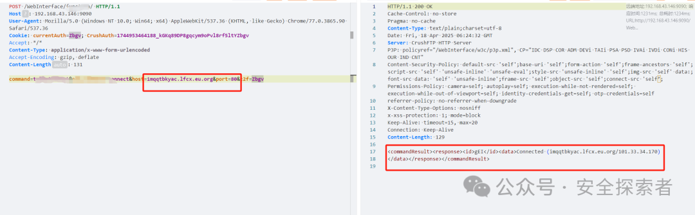
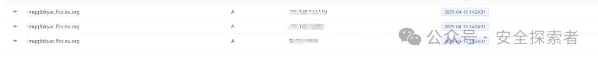
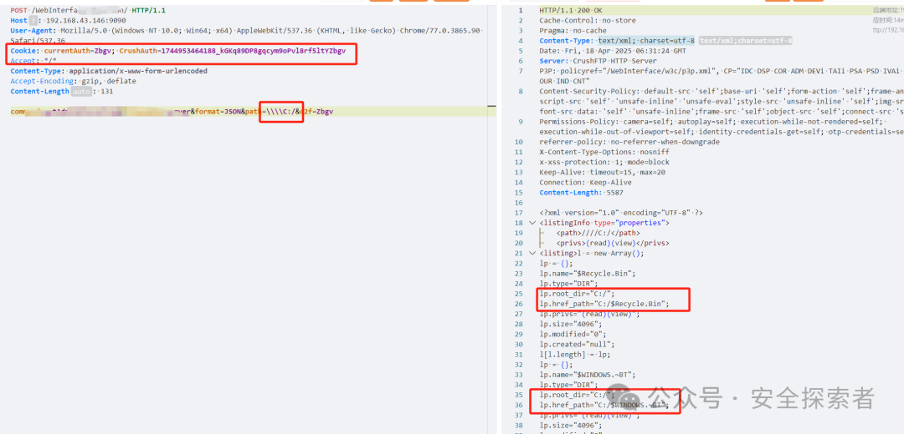

# 【已复现】CrushFTP SSRF和目录遍历漏洞（CVE-2025-32102，CVE-2025-32103 ）

<!-- vulwiki-editorial:start -->
## 校订与适用边界

- 适用前提：文章末尾明确管理员Cookie；影响9/10至10.8.4及11至11.3.1；需相应网络/SMB可达
- 证据范围：鉴权重要前提埋在末尾，应前置；DNS解析仅证明解析行为不必然证明完整SSRF响应读取，32103只显示目录图

### 尚未解决的证据缺口

以下限制仍适用于后文历史材料；相关版本、结果或修复结论不能据此视为已验证：

- 元数据漏32103
- 两个漏洞共用5.0评分未说明各自向量
- PoC被公众号索取门槛替代，正文没有HTTP请求
- 尚无补丁仅为2025-04-18时点声明，需标日期

本页为文本校订，未执行代码、PoC 或目标请求；原图仅保留引用，未据此确认复现成功。
<!-- vulwiki-editorial:end -->

## 技术正文与历史材料

原创 安全探索者  安全探索者   2025-04-18 06:38  
  
↑点击关注，获取更多漏洞预警，技术分享  
  
0x01 组件介绍  
  
    
  
   
CrushFTP是一款支持FTP, FTPS, SFTP, HTTP, HTTPS, WebDAV and WebDAV SSL等协议的跨平台FTP服务器软件。CrushFTP 被广泛用于企业、教育机构和个人用户之间安全地传输文件。  
  
搜索语法:  
title="CrushFTP WebInterface" ||   
body="crushftp"  
  
  
0x02 漏洞描述  
  
     
CVE-2025-32102：  
CrushFTP 9.x 和 10.x 以及 10.8.4 和 11.x 以及 11.3.1 版本允许通过  
command  
=telnetSocket 请求到 /WebInterface/function/ URI 的主机和端口参数进行 SSRF。  
  
  CVE-2025-32103：  
攻击者可以通过访问/WebInterface/function/ URI来读取SMB在UNC共享路径名下可访问的文件，绕过SecurityManager的限制。  
  
  
<table><tbody><tr><td data-colwidth="143" width="143" style="border-color:#0080ff;"><section>漏洞分类</section></td><td colspan="3" data-colwidth="143,143,143" width="143,143,143" style="border-color:#0080ff;"><section>SSRF和目录遍历漏洞</section></td></tr><tr><td data-colwidth="143" width="143" style="border-color:#0080ff;"><section>CVSS 3.1分数</section></td><td data-colwidth="143" width="143" style="border-color:#0080ff;"><section>5.0</section></td><td data-colwidth="143" width="143" style="border-color:#0080ff;"><section>漏洞等级</section></td><td data-colwidth="143" width="143" style="border-color:#0080ff;"><section>中危</section></td></tr><tr><td data-colwidth="143" width="143" style="border-color:#0080ff;"><section>POC/EXP</section></td><td data-colwidth="143" width="143" style="border-color:#0080ff;"><section> 已公开</section></td><td data-colwidth="143" width="143" style="border-color:#0080ff;"><section>可利用性</section></td><td data-colwidth="143" width="143" style="border-color:#0080ff;"><section>低</section></td></tr></tbody></table>  
  
0x03 影响版本  
  
9.x<= CrushFTP <= 10.8.4  
11.x <= CrushFTP <=11.3.1  
<table><tbody><tr style="-webkit-tap-highlight-color: transparent;outline: 0px;visibility: visible;"></tr></tbody></table>  
  
0x04 漏洞验证  
  
目前POC/EXP已经公开（  
后台留言：  
CVE-2025-32102，  
CVE-2025-32103，获取测试POC  
）  
  
概念性验证：  
  
发送数据包，出现下面的即可证明漏洞存在  
  
CVE-2025-32102：  
  
发送请求，访问随机域名：imqqtbkyac.lfcx.eu.org  
  
  
  
有解析记录，证明漏洞存在  
  
  
  
CVE-2025-32103：  
  
发送请求，查看C盘目录  
  
  
  
  
  
  
0x05 漏洞影响  
  
由于该漏洞影响范围较广，危害较小。通过以上复现过程，我们可以知道该漏洞的利用过程比较困难，  
需要优先获得管理员的身份，使用管理员的cookie信息才能进行利用，能造成的危害是中危的。企业应该尽快排查是否有使用该组件，并尽快做出对应措施  
  
  
0x06 修复建议  
  
  
目前官方尚未发布最新安全版本，可关注官网更新通告：  
  
https://crushftp.com/download.html  
  
0X07 参考链接  
  
https://securityonline.info/crushftp-hit-by-ssrf-and-directory-traversal-vulnerabilities-cve-2025-32102-cve-2025-32103/  
  
https://seclists.org/fulldisclosure/2025/Apr/17  
  
  
0x08 免责声明  
  
> 本文所涉及的任何技术、信息或工具，仅供学习和参考之用。  
  
> 请勿利用本文提供的信息从事任何违法活动或不当行为。任何因使用本文所提供的信息或工具而导致的损失、后果或不良影响，均由使用者个人承担责任，与本文作者无关。  
  
> 作者不对任何因使用本文信息或工具而产生的损失或后果承担任何责任。使用本文所提供的信息或工具即视为同意本免责声明，并承诺遵守相关法律法规和道德规范。  
  
  
  

---

> 来源：gelusus/wxvl（微信公众号漏洞文章自动归档，原文见文首链接）
