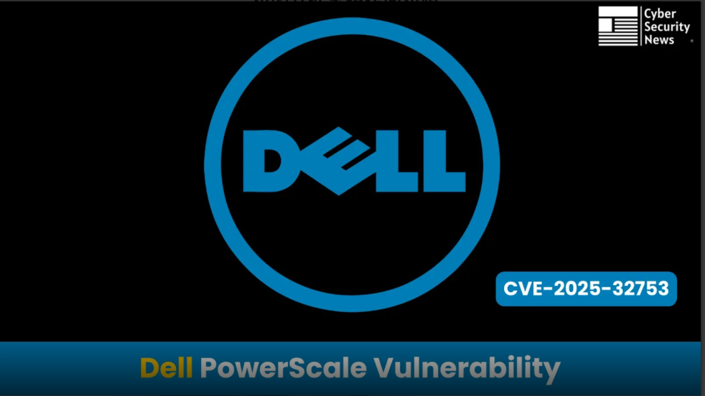

# Dell PowerScale 漏洞让攻击者能够获得未经授权的文件系统访问权限

<!-- vulwiki-editorial:start -->
## 校订与适用边界

- 适用前提：文列9.5.0.0至9.10.0.1；NFS网络可达，SQL注入另需本地低权限
- 证据范围：两种独立权限边界被推导为连续提权链，但无NFS访问如何变本地执行的证据，不能称已证明组合

### 尚未解决的证据缺口

以下限制仍适用于后文历史材料；相关版本、结果或修复结论不能据此视为已验证：

- 两个主CVE均缺元数据
- 称5.3 SQL注入比9.8 NFS更严重与上下文矛盾，疑翻译遗漏否定
- 没有Dell公告、修复版本或具体NFS导出设置
- 读写删除整个文件系统的普遍性应限实际授权缺陷影响

### 操作风险与资料使用

- 含资源消耗、延时或崩溃验证：可能影响服务可用性；限制请求次数、并发与超时，保留无攻击负载的对照结果。

本页为文本校订，未执行代码、PoC 或目标请求；原图仅保留引用，未据此确认复现成功。
<!-- vulwiki-editorial:end -->

## 技术正文与历史材料

邑安科技  邑安全   2025-06-09 14:45  
  
更多全球网络安全资讯尽在邑安全  
  
  
  
影响 Dell PowerScale OneFS 存储作系统的两个重大安全漏洞，其中最严重的缺陷可能允许未经身份验证的攻击者获得对企业文件系统数据的完全未经授权的访问。  
  
该严重漏洞被跟踪为 CVE-2024-53298，影响 PowerScale OneFS 版本 9.5.0.0 到 9.10.0.1，最高 CVSS 评分为 9.8，表明对组织数据安全构成极高风险。  
  
此披露伴随着一个辅助 SQL 注入漏洞 （CVE-2025-32753），该漏洞可能启用本地权限提升攻击，从而为企业存储环境创建双重威胁场景。  
  
绕过 NFS 导出授权 （CVE-2024-53298）  
  
最严重的漏洞 CVE-2024-53298 表示 Dell PowerScale OneFS 中的网络文件系统 （NFS） 导出授权机制出现根本性故障。  
  
此缺少授权漏洞使具有远程网络访问权限的未经身份验证的攻击者能够完全绕过安全控制并获得未经授权的文件系统访问权限。  
  
该漏洞的 CVSS 向量字符串 （CVSS：3.1/AV：N/AC：L/PR：N/UI：N/S：U/C：H/I：H/A：H） 表示该攻击可以通过低复杂度的网络远程执行，不需要权限或用户交互，并可能对数据的机密性、完整性和可用性造成很大影响。  
  
此漏洞的技术影响对于企业环境尤其令人担忧，因为在这些环境中，PowerScale 系统通常存储任务关键型数据并用作组织文件存储的中央存储库。  
  
利用此缺陷的攻击者可能会读取敏感的公司文档、修改关键系统配置并删除整个文件系统结构，而无需任何身份验证要求。  
  
NFS 协议通常用于企业环境中的网络连接存储，当此授权检查失败时，它将成为直接攻击媒介，从而有效地将存储系统转变为任何联网威胁行为者都可以访问的开放存储库。  
<table><tbody><tr style="box-sizing: border-box;background-color: rgb(240, 240, 240);"><td data-colwidth="136" style="box-sizing: border-box;padding: 2px 8px;border: 1px solid rgba(0, 0, 0, 0);word-break: break-word;"><strong msttexthash="14330498" msthash="71" style="box-sizing: border-box;font-weight: bold;">风险因素</strong></td><td style="box-sizing: border-box;padding: 2px 8px;border: 1px solid rgba(0, 0, 0, 0);word-break: break-word;"><strong msttexthash="3259074" msthash="72" style="box-sizing: border-box;font-weight: bold;">详</strong></td></tr><tr style="box-sizing: border-box;"><td data-colwidth="136" style="box-sizing: border-box;padding: 2px 8px;border: 1px solid rgba(0, 0, 0, 0);word-break: break-word;"><section style="margin-top: 8px;margin-bottom: 8px;">受影响的产品</section></td><td style="box-sizing: border-box;padding: 2px 8px;border: 1px solid rgba(0, 0, 0, 0);word-break: break-word;"><section style="margin-top: 8px;margin-bottom: 8px;">Dell PowerScale OneFS 9.5.0.0 到 9.10.0.1</section></td></tr><tr style="box-sizing: border-box;background-color: rgb(240, 240, 240);"><td data-colwidth="136" style="box-sizing: border-box;padding: 2px 8px;border: 1px solid rgba(0, 0, 0, 0);word-break: break-word;"><section style="margin-top: 8px;margin-bottom: 8px;">冲击</section></td><td style="box-sizing: border-box;padding: 2px 8px;border: 1px solid rgba(0, 0, 0, 0);word-break: break-word;"><section style="margin-top: 8px;margin-bottom: 8px;">未经授权的文件系统访问（读取、修改、删除任意文件）</section></td></tr><tr style="box-sizing: border-box;"><td data-colwidth="136" style="box-sizing: border-box;padding: 2px 8px;border: 1px solid rgba(0, 0, 0, 0);word-break: break-word;"><section style="margin-top: 8px;margin-bottom: 8px;">利用先决条件</section></td><td style="box-sizing: border-box;padding: 2px 8px;border: 1px solid rgba(0, 0, 0, 0);word-break: break-word;"><section style="margin-top: 8px;margin-bottom: 8px;">具有远程访问权的未经身份验证的攻击者</section></td></tr><tr style="box-sizing: border-box;background-color: rgb(240, 240, 240);"><td data-colwidth="136" style="box-sizing: border-box;padding: 2px 8px;border: 1px solid rgba(0, 0, 0, 0);word-break: break-word;"><section style="margin-top: 8px;margin-bottom: 8px;">CVSS 3.1 分数</section></td><td style="box-sizing: border-box;padding: 2px 8px;border: 1px solid rgba(0, 0, 0, 0);word-break: break-word;"><section style="margin-top: 8px;margin-bottom: 8px;">9.8（严重）</section></td></tr></tbody></table>  

SQL 注入缺陷 （CVE-2025-32753）  
  
次要漏洞 CVE-2025-32753 在 PowerScale OneFS 系统中引入了 SQL 注入攻击媒介，但需要本地访问权限和低级权限才能利用。  
  
这种对特殊元素漏洞的不当中和的 CVSS 评分为 5.3 （CVSS：3.1/AV：L/AC：L/PR：L/UI：N/S：U/C：L/I：L/A：L），表明本地攻击媒介具有中等风险，需要较低的权限。  
  
该漏洞允许攻击者将恶意 SQL 命令注入数据库查询中，从而可能导致拒绝服务情况、未经授权的信息泄露和数据篡改功能。  
  
虽然比 NFS 授权绕过更严重，但当与 CVE-2024-53298 提供的远程访问功能结合使用时，此 SQL 注入漏洞变得特别危险。  
  
通过 NFS 漏洞获得初始访问权限的攻击者可能会使用 SQL 注入技术提升其权限，从而为全面的系统入侵创建途径。  
  
该漏洞影响相同的版本范围（9.5.0.0 到 9.10.0.1），这表明运行受影响的 PowerScale 部署的组织面临着需要立即关注的复合安全风险。  
<table><tbody><tr style="box-sizing: border-box;background-color: rgb(240, 240, 240);"><td data-colwidth="146" style="box-sizing: border-box;padding: 2px 8px;border: 1px solid rgba(0, 0, 0, 0);word-break: break-word;"><strong msttexthash="14330498" msthash="88" style="box-sizing: border-box;font-weight: bold;">风险因素</strong></td><td style="box-sizing: border-box;padding: 2px 8px;border: 1px solid rgba(0, 0, 0, 0);word-break: break-word;"><strong msttexthash="3259074" msthash="89" style="box-sizing: border-box;font-weight: bold;">详</strong></td></tr><tr style="box-sizing: border-box;"><td data-colwidth="146" style="box-sizing: border-box;padding: 2px 8px;border: 1px solid rgba(0, 0, 0, 0);word-break: break-word;"><section style="margin-top: 8px;margin-bottom: 8px;">受影响的产品</section></td><td style="box-sizing: border-box;padding: 2px 8px;border: 1px solid rgba(0, 0, 0, 0);word-break: break-word;"><section style="margin-top: 8px;margin-bottom: 8px;">Dell PowerScale OneFS 9.5.0.0 到 9.10.0.1</section></td></tr><tr style="box-sizing: border-box;background-color: rgb(240, 240, 240);"><td data-colwidth="146" style="box-sizing: border-box;padding: 2px 8px;border: 1px solid rgba(0, 0, 0, 0);word-break: break-word;"><section style="margin-top: 8px;margin-bottom: 8px;">冲击</section></td><td style="box-sizing: border-box;padding: 2px 8px;border: 1px solid rgba(0, 0, 0, 0);word-break: break-word;"><section style="margin-top: 8px;margin-bottom: 8px;">拒绝服务、信息泄露、数据篡改</section></td></tr><tr style="box-sizing: border-box;"><td data-colwidth="146" style="box-sizing: border-box;padding: 2px 8px;border: 1px solid rgba(0, 0, 0, 0);word-break: break-word;"><section style="margin-top: 8px;margin-bottom: 8px;">利用先决条件</section></td><td style="box-sizing: border-box;padding: 2px 8px;border: 1px solid rgba(0, 0, 0, 0);word-break: break-word;"><section style="margin-top: 8px;margin-bottom: 8px;">具有本地访问权限的低权限攻击者</section></td></tr><tr style="box-sizing: border-box;background-color: rgb(240, 240, 240);"><td data-colwidth="146" style="box-sizing: border-box;padding: 2px 8px;border: 1px solid rgba(0, 0, 0, 0);word-break: break-word;"><section style="margin-top: 8px;margin-bottom: 8px;">CVSS 3.1 分数</section></td><td style="box-sizing: border-box;padding: 2px 8px;border: 1px solid rgba(0, 0, 0, 0);word-break: break-word;"><section style="margin-top: 8px;margin-bottom: 8px;">5.3 （中等）</section></td></tr></tbody></table>  

修复  
  
Dell Technologies 已将 NFS 授权漏洞归类为严重漏洞，并强烈建议客户尽早升级其 PowerScale OneFS 系统。  
  
系统管理员应立即评估其网络风险，实施网络级访问控制作为临时缓解措施，并计划紧急升级到修补版本的 OneFS。  
  
组织还应对其 PowerScale 部署进行全面的安全审计，以识别未经授权访问或数据泄露的任何迹象。  
  
远程访问和本地权限提升功能的结合创造了一个重要的攻击面，老练的威胁行为者可以利用该攻击面来建立对企业存储环境的持久访问，因此快速补救对于维护数据安全和法规合规性至关重要。  
  
原文来自: cybersecuritynews.com  
  
原文链接:   
https://cybersecuritynews.com/dell-powerscale-vulnerability/  
  
欢迎收藏并分享朋友圈，让五邑人网络更安全  
  
  
  
欢迎扫描关注我们，及时了解最新安全动态、学习最潮流的安全姿势！  
  
推荐文章  
  
1  
  
[新永恒之蓝？微软SMBv3高危漏洞（CVE-2020-0796）分析复现](http://mp.weixin.qq.com/s?__biz=MzUyMzczNzUyNQ==&mid=2247488913&idx=1&sn=acbf595a4a80dcaba647c7a32fe5e06b&chksm=fa39554bcd4edc5dc90019f33746404ab7593dd9d90109b1076a4a73f2be0cb6fa90e8743b50&scene=21#wechat_redirect)  
  
  
2  
  
[重大漏洞预警：ubuntu最新版本存在本地提权漏洞（已有EXP）　](http://mp.weixin.qq.com/s?__biz=MzUyMzczNzUyNQ==&mid=2247483652&idx=1&sn=b2f2ec90db499e23cfa252e9ee743265&chksm=fa3941decd4ec8c83a268c3480c354a621d515262bcbb5f35e1a2dde8c828bdc7b9011cb5072&scene=21#wechat_redirect)  
  
  
  
  
  

---

> 来源：gelusus/wxvl（微信公众号漏洞文章自动归档，原文见文首链接）
