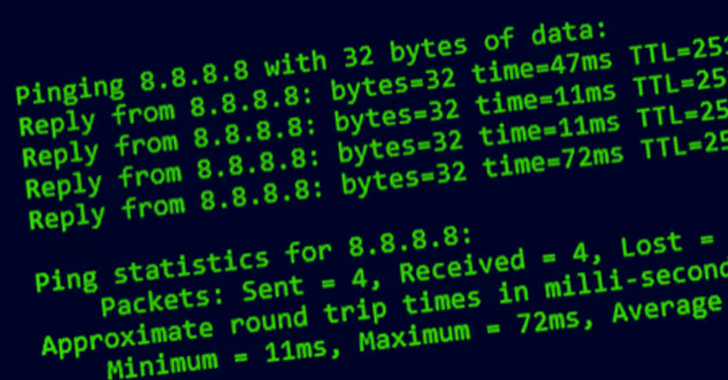

# CVE-2022-23093：ping漏洞影响FreeBSD系统

<!-- vulwiki-editorial:start -->
## 校订与适用边界

- 适用前提：受害主机运行ping并接收恶意ICMP响应；工具撤销权限及沙箱影响后果
- 证据范围：正文描述ping创建socket后降权，却两次无条件称可接管整个OS，未给绕过降权/沙箱的证据

### 尚未解决的证据缺口

以下限制仍适用于后文历史材料；相关版本、结果或修复结论不能据此视为已验证：

- ping称常驻服务不准确，应强调客户端程序触发
- 影响所有版本需限定公告当时受支持分支/补丁级别
- 缺精确修复版本，不能用崩溃直接证明root执行

本页为文本校订，未执行代码、PoC 或目标请求；原图仅保留引用，未据此确认复现成功。
<!-- vulwiki-editorial:end -->

## 技术正文与历史材料

ang010ela  嘶吼专业版   2022-12-09 12:00  
  
  
  
研究人员在Ping服务中发现一个栈缓存溢出漏洞，攻击者利用该漏洞可接管FreeBSD操作系统。  
  
  
  
Ping是使用ICMP消息测试远程主机可达性的程序。为发送ICMP消息，ping使用原始socket，因此需要较高的权限。为使非特权用户能够使用ping功能，安装了setuid bit集。Ping运行后，会创建一个原始socket，然后撤销其特权。  
# 漏洞概述  
  
研究人员在Ping服务模块中发现一个基于栈的缓存溢出漏洞，漏洞CVE编号为CVE-2022-23093，影响所有FreeBSD操作系统版本。  
  
Ping模块会从网络中读取原始的IP报文以处理pr_pack() 函数中的响应。为处理该响应，ping必须重构IP header、ICMP header、以及"quoted packet"。quoted packet表示产生了ICMP 错误，quoted packet也有IP header和 ICMP header。  
  
pr_pack() 会复制接收到的IP和ICMP header到栈缓存中，用于下一步处理。但是没有考虑到响应和quoted packet中的IP header中存在IP option header的问题。如果存在IP option，那么pr_pack() 就会产生溢出，最大40字节。  
# 漏洞影响  
  
该漏洞可以被远程主机触发，引发ping 服务奔溃。恶意主机也可能在ping 中触发远程代码执行。攻击者利用该漏洞通过远程代码执行最终可以实现接管操作系统的目的。  
  
漏洞影响所有FreeBSD 系统版本。目前，FreeBSD操作系统维护者已发布了安全更新。  
  
更多参见：https://www.freebsd.org/security/advisories/FreeBSD-SA-22:15.ping.asc  
  
参考及来源：https://thehackernews.com/2022/12/critical-ping-vulnerability-allows.html  
  
  
  
  
  
  

---

> 来源：gelusus/wxvl（微信公众号漏洞文章自动归档，原文见文首链接）
