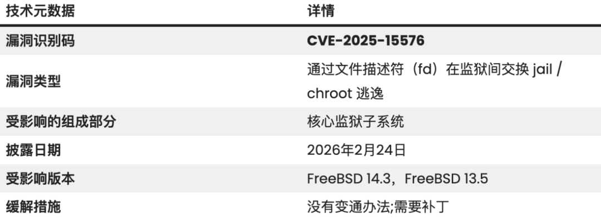

# FreeBSD 漏洞允许攻击者导致整个系统崩溃

<!-- vulwiki-editorial:start -->
## 校订与适用边界

- 适用前提：两个兄弟jail共享nullfs挂载并有可协作进程通过Unix socket交换目录描述符
- 证据范围：正文主体是特定配置的jail逃逸，标题全系统崩溃与论证不匹配；目录边界绕过后仍需考虑文件权限

### 尚未解决的证据缺口

以下限制仍适用于后文历史材料；相关版本、结果或修复结论不能据此视为已验证：

- 主CVE缺frontmatter
- 标题应反映jail隔离绕过而非未经展示崩溃
- freebsd-update安装命令被翻译损坏
- 没有精确RELEASE-p补丁级别，只有2026-02-24后日期
- 无临时缓解与避免传描述符的建议需区分局部降低风险/完整修复

本页为文本校订，未执行代码、PoC 或目标请求；原图仅保留引用，未据此确认复现成功。
<!-- vulwiki-editorial:end -->

## 技术正文与历史材料

O安全研究员
                    O安全研究员  O安全研究员   2026-02-27 11:42  
  
  
  
  
  
  
管理员必须紧急修补一个关键漏洞，使攻击者能够逃离孤立的监狱环境。  
  
  
该漏洞被追踪为CVE-2025-15576，尽管通常与系统崩溃相关，但仍导致危险的越狱状态。  
  
  
它使被禁进程绕过其受限环境，获得对主机底层文件系统的完全、未经授权的访问权限。  
  
  
FreeBSD jails 是一种作系统虚拟化形式，能够安全地隔离进程。它们采用类似 chroot 的机制来限制进程对文件和目录的访问。  
  
  
然而，CVE-2025-15576 暴露了一个在两个独立兄弟监狱相互作用时目录文件描述符处理的关键缺陷。该漏洞发生在非常特定的系统配置下。  
  
  
如果管理员通过 nullfs 挂载配置两个兄弟监狱共享目录，这些监狱中的协作进程可以通过 Unix 域套接字建立连接。  
  
  
  
  
  
通过该套接字，恶意进程可以交换目录描述符。在正常的文件系统名称查找过程中，内核检查目录是否下降到jail根以下。  
  
  
然而，由于该缺陷，内核在通过套接字交换目录描述符时无法正确停止查找。  
  
  
因此，进程可以成功接收完全超出其受限监狱树的目录文件描述符。  
  
  
这一缺陷的主要影响是文件系统隔离的完全丧失。如果攻击者控制两个共享 nullfs 挂载和 Unix 域套接字的 jail 中的进程，他们可以互相传递目录描述符以突破 chroot 限制。一旦离开监狱环境，攻击者即可获得完整的文件系统访问权限。  
  
  
它们可以访问根文件系统，修改关键系统文件，窃取敏感数据，或发动进一步攻击以提升主机权限。  
  
  
需要注意的是，管理员必须确保无权限用户无法将目录描述符传递给被禁的进程。  
  
  
目前，没有临时的变通方法可以缓解这一漏洞。管理员必须立即将他们的 FreeBSD 系统升级到已补丁的发布分支。  
  
  
对于从二进制发行集（如 FreeBSD 14.3 或 13.5 的 RELEASE 版本）安装的系统，管理员可以使用内置的更新工具部署修复。  
  
  
运行 freebsd-update fetch，然后安装 freebsd-update 安装，将安全套用补丁。安全更新生效必须系统重启。  
  
  
对于管理源代码安装的环境，管理员必须从官方 FreeBSD 安全门户下载相关补丁，验证其 PGP 签名，并重新编译内核。  
  
  
为确保完全保护，请确认您的系统运行的是2026年2月24日之后的补丁内核。  
  
  
  

---

> 来源：gelusus/wxvl（微信公众号漏洞文章自动归档，原文见文首链接）
