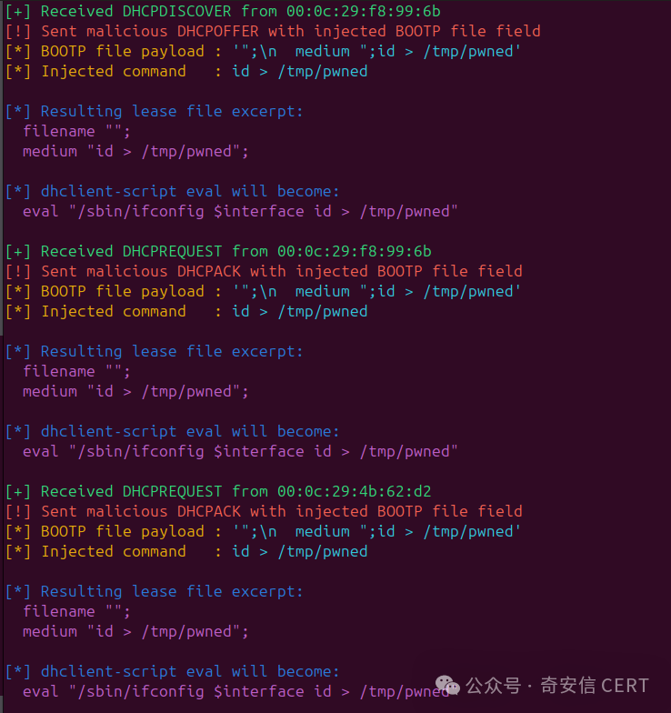
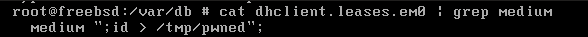
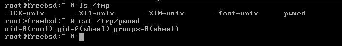

# 【已复现】FreeBSD dhclient 远程命令执行漏洞(CVE-2026-42511)

<!-- vulwiki-editorial:start -->
## 校订与适用边界

- 适用前提：同广播域恶意DHCP响应被接收、BOOTP file注入租约、后续重新解析租约；非任意互联网直连RCE
- 证据范围：完整读取HTML与正文，指出先写租约再重启执行；已复现为发布者声明，只有未视检截图

### 尚未解决的证据缺口

以下限制仍适用于后文历史材料；相关版本、结果或修复结论不能据此视为已验证：

- 修复范围写FreeBSD14.2.*>=14.3-RELEASE-p12，与前面14.3分支矛盾，应纠正
- 简介只需同广播域过度省略接受租约和重读触发条件
- QVD年份2025与CVE2026可能是独立编号时点，需验证不能仅凭年份认定错误
- 十万级影响量无估算方法，不能等于已验证易受攻击资产
- 巨量HTML样式可清理

本页为文本校订，未执行代码、PoC 或目标请求；原图仅保留引用，未据此确认复现成功。
<!-- vulwiki-editorial:end -->

## 技术正文与历史材料

奇安信CERT
                    奇安信CERT  HACK之道   2026-05-10 00:45  
  
●   
点击↑蓝字关注我们，获取更多安全风险通告  
  
  
<table><tbody><tr style="margin: 0px;padding: 0px;outline: 0px;max-width: 100%;visibility: visible;box-sizing: border-box !important;overflow-wrap: break-word !important;"><td colspan="4" data-colwidth="136,157,166,98" valign="middle" align="center" style="margin: 0px;padding: 5px 10px;outline: 0px;word-break: break-all;hyphens: auto;border: 1px solid rgb(70, 118, 217);max-width: 100%;background-color: rgb(70, 118, 217);visibility: visible;overflow-wrap: break-word !important;box-sizing: border-box !important;">
<strong style="margin: 0px;padding: 0px;outline: 0px;max-width: 100%;visibility: visible;box-sizing: border-box !important;overflow-wrap: break-word !important;">漏洞概述</strong> 
</td></tr><tr style="margin: 0px;padding: 0px;outline: 0px;max-width: 100%;visibility: visible;box-sizing: border-box !important;overflow-wrap: break-word !important;"><td data-colwidth="136" width="136" valign="middle" align="left" style="margin: 0px;padding: 5px 10px;outline: 0px;word-break: break-all;hyphens: auto;border: 1px solid rgb(70, 118, 217);max-width: 100%;visibility: visible;overflow-wrap: break-word !important;box-sizing: border-box !important;">
<strong style="margin: 0px;padding: 0px;outline: 0px;max-width: 100%;visibility: visible;box-sizing: border-box !important;overflow-wrap: break-word !important;">漏洞名称</strong>
</td><td colspan="3" data-colwidth="157,166,98" valign="middle" align="left" style="margin: 0px;padding: 5px 10px;outline: 0px;word-break: break-all;hyphens: auto;border: 1px solid rgb(70, 118, 217);max-width: 100%;visibility: visible;overflow-wrap: break-word !important;box-sizing: border-box !important;">
FreeBSD dhclient 远程命令执行漏洞
</td></tr><tr style="margin: 0px;padding: 0px;outline: 0px;max-width: 100%;visibility: visible;box-sizing: border-box !important;overflow-wrap: break-word !important;"><td data-colwidth="136" width="136" valign="middle" align="left" style="margin: 0px;padding: 5px 10px;outline: 0px;word-break: break-all;hyphens: auto;border: 1px solid rgb(70, 118, 217);max-width: 100%;visibility: visible;overflow-wrap: break-word !important;box-sizing: border-box !important;">
<strong style="margin: 0px;padding: 0px;outline: 0px;max-width: 100%;visibility: visible;box-sizing: border-box !important;overflow-wrap: break-word !important;">漏洞编号</strong>
</td><td colspan="3" data-colwidth="157,166,98" valign="middle" align="left" style="margin: 0px;padding: 5px 10px;outline: 0px;word-break: break-all;hyphens: auto;border: 1px solid rgb(70, 118, 217);max-width: 100%;visibility: visible;overflow-wrap: break-word !important;box-sizing: border-box !important;">
QVD-2025-49072，CVE-2026-42511
</td></tr><tr style="margin: 0px;padding: 0px;outline: 0px;max-width: 100%;visibility: visible;box-sizing: border-box !important;overflow-wrap: break-word !important;"><td data-colwidth="136" width="136" valign="middle" align="left" style="margin: 0px;padding: 5px 10px;outline: 0px;word-break: break-all;hyphens: auto;border: 1px solid rgb(70, 118, 217);max-width: 100%;visibility: visible;overflow-wrap: break-word !important;box-sizing: border-box !important;">
<strong style="margin: 0px;padding: 0px;outline: 0px;max-width: 100%;visibility: visible;box-sizing: border-box !important;overflow-wrap: break-word !important;"><strong style="margin: 0px;padding: 0px;cursor: text;color: rgb(0, 0, 0);caret-color: rgb(255, 0, 0);font-family: 微软雅黑, &#34;Microsoft YaHei&#34;, sans-serif;visibility: visible;max-width: 100%;max-inline-size: 100%;outline: none 0px !important;box-sizing: border-box !important;overflow-wrap: break-word !important;">公开时间</strong></strong>
</td><td data-colwidth="157" width="157" valign="middle" align="left" style="margin: 0px;padding: 5px 10px;outline: 0px;word-break: break-all;hyphens: auto;border: 1px solid rgb(70, 118, 217);max-width: 100%;visibility: visible;overflow-wrap: break-word !important;box-sizing: border-box !important;">
2026-04-30
</td><td data-colwidth="166" width="166" valign="middle" align="left" style="margin: 0px;padding: 5px 10px;outline: 0px;word-break: break-all;hyphens: auto;border: 1px solid rgb(70, 118, 217);max-width: 100%;visibility: visible;overflow-wrap: break-word !important;box-sizing: border-box !important;">
<strong style="margin: 0px;padding: 0px;outline: 0px;max-width: 100%;visibility: visible;box-sizing: border-box !important;overflow-wrap: break-word !important;"><strong style="margin: 0px;padding: 0px;cursor: text;color: rgb(0, 0, 0);caret-color: rgb(255, 0, 0);font-family: 微软雅黑, &#34;Microsoft YaHei&#34;, sans-serif;visibility: visible;max-width: 100%;max-inline-size: 100%;outline: none 0px !important;box-sizing: border-box !important;overflow-wrap: break-word !important;">影响量级</strong></strong>
</td><td data-colwidth="98" width="98" valign="middle" align="left" style="margin: 0px;padding: 5px 10px;outline: 0px;word-break: break-all;hyphens: auto;border: 1px solid rgb(70, 118, 217);max-width: 100%;visibility: visible;overflow-wrap: break-word !important;box-sizing: border-box !important;">
十万级
</td></tr><tr style="margin: 0px;padding: 0px;outline: 0px;max-width: 100%;visibility: visible;box-sizing: border-box !important;overflow-wrap: break-word !important;"><td data-colwidth="136" width="136" valign="middle" align="left" style="margin: 0px;padding: 5px 10px;outline: 0px;word-break: break-all;hyphens: auto;border: 1px solid rgb(70, 118, 217);max-width: 100%;visibility: visible;overflow-wrap: break-word !important;box-sizing: border-box !important;">
<strong style="margin: 0px;padding: 0px;cursor: text;color: rgb(0, 0, 0);font-size: 17px;caret-color: rgb(255, 0, 0);font-family: 微软雅黑, &#34;Microsoft YaHei&#34;, sans-serif;visibility: visible;max-width: 100%;max-inline-size: 100%;outline: none 0px !important;box-sizing: border-box !important;overflow-wrap: break-word !important;">奇安信评级</strong>
</td><td data-colwidth="157" width="157" valign="middle" align="left" style="margin: 0px;padding: 5px 10px;outline: 0px;word-break: break-all;hyphens: auto;border: 1px solid rgb(70, 118, 217);max-width: 100%;visibility: visible;overflow-wrap: break-word !important;box-sizing: border-box !important;">
<strong style="margin: 0px;padding: 0px;cursor: text;color: rgb(255, 0, 0);caret-color: rgb(255, 0, 0);font-family: 微软雅黑, &#34;Microsoft YaHei&#34;, sans-serif;visibility: visible;max-width: 100%;max-inline-size: 100%;outline: none 0px !important;box-sizing: border-box !important;overflow-wrap: break-word !important;">高危</strong>
</td><td data-colwidth="166" width="166" valign="middle" align="left" style="margin: 0px;padding: 5px 10px;outline: 0px;word-break: break-all;hyphens: auto;border: 1px solid rgb(70, 118, 217);max-width: 100%;visibility: visible;overflow-wrap: break-word !important;box-sizing: border-box !important;">
<strong style="margin: 0px;padding: 0px;outline: 0px;max-width: 100%;visibility: visible;box-sizing: border-box !important;overflow-wrap: break-word !important;">CVSS 3.1分数</strong>
</td><td data-colwidth="98" width="98" valign="middle" align="left" style="margin: 0px;padding: 5px 10px;outline: 0px;word-break: break-all;hyphens: auto;border: 1px solid rgb(70, 118, 217);max-width: 100%;visibility: visible;overflow-wrap: break-word !important;box-sizing: border-box !important;">
<strong style="margin: 0px;padding: 0px;outline: 0px;max-width: 100%;visibility: visible;box-sizing: border-box !important;overflow-wrap: break-word !important;">8.1</strong>
</td></tr><tr style="margin: 0px;padding: 0px;outline: 0px;max-width: 100%;visibility: visible;box-sizing: border-box !important;overflow-wrap: break-word !important;"><td data-colwidth="136" width="136" valign="middle" align="left" style="margin: 0px;padding: 5px 10px;outline: 0px;word-break: break-all;hyphens: auto;border: 1px solid rgb(70, 118, 217);max-width: 100%;visibility: visible;overflow-wrap: break-word !important;box-sizing: border-box !important;">
<strong style="margin: 0px;padding: 0px;outline: 0px;max-width: 100%;visibility: visible;box-sizing: border-box !important;overflow-wrap: break-word !important;">威胁类型</strong>
</td><td data-colwidth="157" width="157" valign="middle" align="left" style="margin: 0px;padding: 5px 10px;outline: 0px;word-break: break-all;hyphens: auto;border: 1px solid rgb(70, 118, 217);max-width: 100%;visibility: visible;overflow-wrap: break-word !important;box-sizing: border-box !important;">
命令执行
</td><td data-colwidth="166" width="166" valign="middle" align="left" style="margin: 0px;padding: 5px 10px;outline: 0px;word-break: break-all;hyphens: auto;border: 1px solid rgb(70, 118, 217);max-width: 100%;visibility: visible;overflow-wrap: break-word !important;box-sizing: border-box !important;">
<strong style="margin: 0px;padding: 0px;cursor: text;color: rgb(0, 0, 0);caret-color: rgb(255, 0, 0);font-family: 微软雅黑, &#34;Microsoft YaHei&#34;, sans-serif;visibility: visible;max-width: 100%;max-inline-size: 100%;outline: none 0px !important;box-sizing: border-box !important;overflow-wrap: break-word !important;">利用可能性</strong>
</td><td data-colwidth="98" width="98" valign="middle" align="left" style="margin: 0px;padding: 5px 10px;outline: 0px;word-break: break-all;hyphens: auto;border: 1px solid rgb(70, 118, 217);max-width: 100%;visibility: visible;overflow-wrap: break-word !important;box-sizing: border-box !important;">
<strong style="margin: 0px;padding: 0px;cursor: text;caret-color: rgb(255, 0, 0);color: rgb(255, 0, 0);font-family: 微软雅黑, &#34;Microsoft YaHei&#34;, sans-serif;visibility: visible;max-width: 100%;max-inline-size: 100%;outline: none 0px !important;box-sizing: border-box !important;overflow-wrap: break-word !important;"><strong style="margin: 0px;padding: 0px;outline: 0px;max-width: 100%;font-family: system-ui, -apple-system, BlinkMacSystemFont, &#34;Helvetica Neue&#34;, &#34;PingFang SC&#34;, &#34;Hiragino Sans GB&#34;, &#34;Microsoft YaHei UI&#34;, &#34;Microsoft YaHei&#34;, Arial, sans-serif;letter-spacing: 0.544px;visibility: visible;box-sizing: border-box !important;overflow-wrap: break-word !important;">高</strong></strong>
</td></tr><tr style="margin: 0px;padding: 0px;outline: 0px;max-width: 100%;visibility: visible;box-sizing: border-box !important;overflow-wrap: break-word !important;"><td data-colwidth="136" width="136" valign="middle" align="left" style="margin: 0px;padding: 5px 10px;outline: 0px;word-break: break-all;hyphens: auto;border: 1px solid rgb(70, 118, 217);max-width: 100%;visibility: visible;overflow-wrap: break-word !important;box-sizing: border-box !important;">
<strong style="margin: 0px;padding: 0px;outline: 0px;max-width: 100%;visibility: visible;box-sizing: border-box !important;overflow-wrap: break-word !important;">POC状态</strong>
</td><td data-colwidth="157" width="157" valign="middle" align="left" style="margin: 0px;padding: 5px 10px;outline: 0px;word-break: break-all;hyphens: auto;border: 1px solid rgb(70, 118, 217);max-width: 100%;visibility: visible;overflow-wrap: break-word !important;box-sizing: border-box !important;">
<strong style="margin: 0px;padding: 0px;outline: 0px;max-width: 100%;letter-spacing: 0.544px;font-family: system-ui, -apple-system, BlinkMacSystemFont, &#34;Helvetica Neue&#34;, &#34;PingFang SC&#34;, &#34;Hiragino Sans GB&#34;, &#34;Microsoft YaHei UI&#34;, &#34;Microsoft YaHei&#34;, Arial, sans-serif;visibility: visible;box-sizing: border-box !important;overflow-wrap: break-word !important;">已公开</strong>
</td><td data-colwidth="166" width="166" valign="middle" align="left" style="margin: 0px;padding: 5px 10px;outline: 0px;word-break: break-all;hyphens: auto;border: 1px solid rgb(70, 118, 217);max-width: 100%;visibility: visible;overflow-wrap: break-word !important;box-sizing: border-box !important;">
<strong style="margin: 0px;padding: 0px;outline: 0px;max-width: 100%;visibility: visible;box-sizing: border-box !important;overflow-wrap: break-word !important;">在野利用状态</strong>
</td><td data-colwidth="98" width="98" valign="middle" align="left" style="margin: 0px;padding: 5px 10px;outline: 0px;word-break: break-all;hyphens: auto;border: 1px solid rgb(70, 118, 217);max-width: 100%;visibility: visible;overflow-wrap: break-word !important;box-sizing: border-box !important;">
未发现
</td></tr><tr style="margin: 0px;padding: 0px;outline: 0px;max-width: 100%;visibility: visible;box-sizing: border-box !important;overflow-wrap: break-word !important;"><td data-colwidth="136" width="136" valign="middle" align="left" style="margin: 0px;padding: 5px 10px;outline: 0px;word-break: break-all;hyphens: auto;border: 1px solid rgb(70, 118, 217);max-width: 100%;visibility: visible;overflow-wrap: break-word !important;box-sizing: border-box !important;">
<strong style="margin: 0px;padding: 0px;outline: 0px;max-width: 100%;visibility: visible;box-sizing: border-box !important;overflow-wrap: break-word !important;">EXP状态</strong>
</td><td data-colwidth="157" width="157" valign="middle" align="left" style="margin: 0px;padding: 5px 10px;outline: 0px;word-break: break-all;hyphens: auto;border: 1px solid rgb(70, 118, 217);max-width: 100%;visibility: visible;overflow-wrap: break-word !important;box-sizing: border-box !important;">
<strong style="margin: 0px;padding: 0px;outline: 0px;max-width: 100%;color: rgb(0, 0, 0);letter-spacing: 0.544px;font-family: system-ui, -apple-system, BlinkMacSystemFont, &#34;Helvetica Neue&#34;, &#34;PingFang SC&#34;, &#34;Hiragino Sans GB&#34;, &#34;Microsoft YaHei UI&#34;, &#34;Microsoft YaHei&#34;, Arial, sans-serif;visibility: visible;box-sizing: border-box !important;overflow-wrap: break-word !important;">已公开</strong>
</td><td data-colwidth="166" width="166" valign="middle" align="left" style="margin: 0px;padding: 5px 10px;outline: 0px;word-break: break-all;hyphens: auto;border: 1px solid rgb(70, 118, 217);max-width: 100%;visibility: visible;overflow-wrap: break-word !important;box-sizing: border-box !important;">
<strong style="margin: 0px;padding: 0px;outline: 0px;max-width: 100%;visibility: visible;box-sizing: border-box !important;overflow-wrap: break-word !important;">技术细节状态</strong>
</td><td data-colwidth="98" width="98" valign="middle" align="left" style="margin: 0px;padding: 5px 10px;outline: 0px;word-break: break-all;hyphens: auto;border: 1px solid rgb(70, 118, 217);max-width: 100%;visibility: visible;overflow-wrap: break-word !important;box-sizing: border-box !important;">
<strong style="margin: 0px;padding: 0px;outline: 0px;max-width: 100%;letter-spacing: 0.544px;font-family: system-ui, -apple-system, BlinkMacSystemFont, &#34;Helvetica Neue&#34;, &#34;PingFang SC&#34;, &#34;Hiragino Sans GB&#34;, &#34;Microsoft YaHei UI&#34;, &#34;Microsoft YaHei&#34;, Arial, sans-serif;visibility: visible;box-sizing: border-box !important;overflow-wrap: break-word !important;">已公开</strong>
</td></tr><tr style="margin: 0px;padding: 0px;outline: 0px;max-width: 100%;visibility: visible;box-sizing: border-box !important;overflow-wrap: break-word !important;"><td colspan="4" data-colwidth="136,157,166,98" valign="middle" align="left" style="margin: 0px;padding: 5px 10px;outline: 0px;word-break: break-all;hyphens: auto;border: 1px solid rgb(70, 118, 217);max-width: 100%;visibility: visible;overflow-wrap: break-word !important;box-sizing: border-box !important;">
<strong style="margin: 0px;padding: 0px;outline: 0px;max-width: 100%;visibility: visible;box-sizing: border-box !important;overflow-wrap: break-word !important;">危害描述：</strong>攻击者只需与目标处于同一广播域并架设恶意DHCP服务器，即可实现远程代码执行并完全控制目标系统。
</td></tr></tbody></table>  
  
  
**0****1**  
  
**漏洞详情**  
  
**>**  
**>**  
**>**  
**>**  
  
**影响组件**  
  
FreeBSD 是一款以高性能、高稳定性和安全性著称的开源类 Unix 操作系统，广泛应用于服务器、网络设备、嵌入式系统和桌面计算领域。FreeBSD 以其卓越的网络协议栈和严格的代码工程质量而闻名，是 Netflix、PlayStation、WhatApp 后端服务、NetApp 存储系统以及众多网络设备厂商的基础操作系统。dhclient 是 FreeBSD 默认的 IPv4 DHCP 客户端，负责与网络段上的 DHCP 服务器通信，并根据接收到的信息初始化和配置网络接口。  
  
**>**  
**>**  
**>**  
**>**  
  
**漏洞描述**  
  
近日，奇安信CERT监测到官方修复  
FreeBSD dhclient 远程命令执行漏洞(CVE-2026-42511)，该漏洞源于写入 BOOTP file 字段到租约文件时未转义双引号，攻击者可通过恶意 DHCP 响应注入配置指令。当 dhclient 重新解析租约文件时，恶意指令会被 root 权限运行的 dhclient-script 脚本执行，攻击者只需与目标处于同一广播域并架设恶意DHCP服务器，即可实现远程代码执行并完全控制目标系统。  
值得注意的是，该漏洞自 2005 年 FreeBSD 6.0 版本引入以来，已在代码库中潜伏了长达 21 年。目前该漏洞PoC和技术细节已公开。  
鉴于该漏洞影响范围较大，建议客户尽快做好自查及防护。  
  
**>**  
**>**  
**>**  
**>**  
  
**利用条件**  
  
需要位于同一广播域并响应 DHCP 请求。  
  
  
**02**  
  
**影响范围**  
  
**>**  
**>**  
**>**  
**>**  
  
**影响版本**  
  
FreeBSD 13.5.* < 13.5-RELEASE-p13  
FreeBSD 14.3.* < 14.3-RELEASE-p12  
  
FreeBSD 14.4.* < 14.4-RELEASE-p3  
  
FreeBSD 15.0.* < 15.0-RELEASE-p7  
  
**>**  
**>**  
**>**  
**>**  
  
**其他受影响组件**  
  
无  
  
  
**03**  
  
**复现情况**  
  
目前，奇安信威胁情报中心安全研究员已成功复现  
FreeBSD dhclient 远程命令执行漏洞(CVE-2026-42511)  
，图2为FreeBSD启动时劫持修改租约文件，图3为重启后代码执行。截图如下：  
  
  
  
  
  
  
  
  
  
  
  
  
  
**04**  
  
**处置建议**  
  
**>**  
**>**  
**>**  
**>**  
  
**安全更新**  
  
官方已发布安全补丁，请及时将系统更新至以下修复后的版本或更高版本：  
  
FreeBSD 13.5.* >= 13.5-RELEASE-p13  
  
FreeBSD 14.2.* >= 14.3-RELEASE-p12  
  
FreeBSD 14.4.* >= 14.4-RELEASE-p3  
  
FreeBSD 15.0.* >= 15.0-RELEASE-p7  
  
下载地址：  
  
https://www.freebsd.org/security/advisories/FreeBSD-SA-26:12.dhclient.asc  
  
  
  
**05**  
  
**参考资料**  
  
[1]https://www.freebsd.org/security/advisories/FreeBSD-SA-26:12.dhclient.asc  
  
[2]  
https://aisle.com/blog/aisle-discovers-cve-2026-42511-a-21-year-old-freebsd-remote-command-execution-vulnerability  
  
  
  
  

---

> 来源：gelusus/wxvl（微信公众号漏洞文章自动归档，原文见文首链接）
