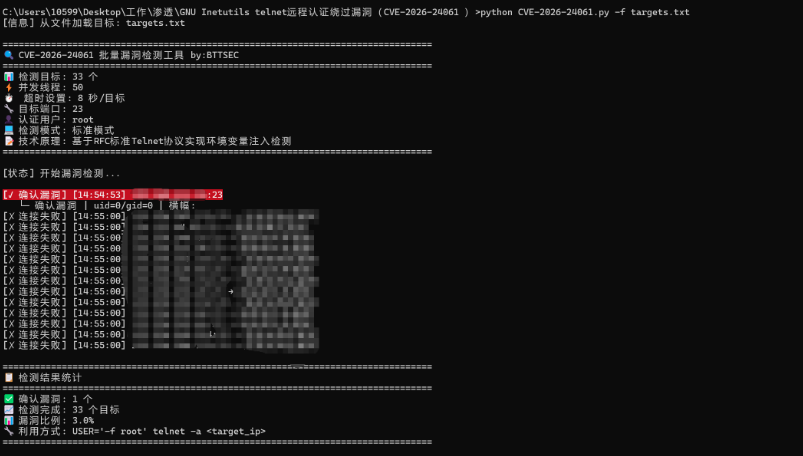
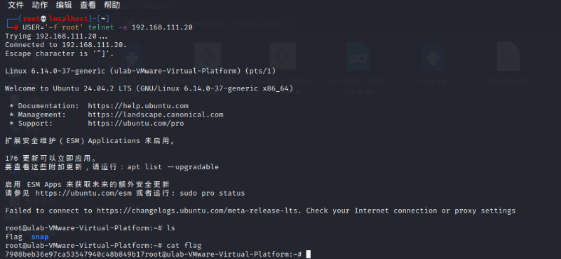

## 收录状态复核（2026-10-03）

本文保留第三方工具的参数、使用例及 uid/gid 判据主张；未保存实现代码、工具版本/哈希或结果原文，不能据此确认其准确率和版本边界。该检测会与目标交互并尝试认证/命令行为，应按主动检查阅读，不能视为被动指纹判断。

以下为保留的归档正文与既有校订。资料以 `needs-review` 收录，具体缺口按本页说明阅读。

# GNU Inetutils Telnetd 认证绕过漏洞检测工具（CVE-2026-24061）1月28日更新

<!-- vulwiki-editorial:start -->
## 校订与适用边界

- 适用前提：需第三方Python脚本，正文仅网盘链接；实际实现与依赖未知
- 证据范围：没有源码，不可评估线程、RFC实现或uid判据可靠性；此类检测包含登录绕过/命令执行而非被动版本核查

### 尚未解决的证据缺口

以下限制仍适用于后文历史材料；相关版本、结果或修复结论不能据此视为已验证：

- 缺源代码仓库、版本/哈希、维护者与变更说明
- uid=0/gid=0字符串可能误报，需明确实际输出核验逻辑
- 标题1月28更新而刊发30日应区分版本/发布日期
- HTML图仅data-src可能无法普通Markdown渲染

本页为文本校订，未执行代码、PoC 或目标请求；原图仅保留引用，未据此确认复现成功。
<!-- vulwiki-editorial:end -->

## 技术正文与历史材料

MY0723
                    MY0723  Web安全工具库   2026-01-30 16:02  
  
===================================  
  
**免责声明**  
  
请勿利用文章内的相关技术从事非法测试，由于传播、利用此文所提供的信息而造成的任何直接或者间接的后果及损失，均由使用者本人负责，作者不为此承担任何责任。工具来自网络，  
安全性自测  
，  
大家都要把工具当做病毒对待，在虚拟机运行。  
如有侵权请联系删除。个人微信：  
ivu123ivu  
  
  
**0x01 工具介绍**  
  
这是一个用于检测 GNU Inetutils Telnetd 认证绕过漏洞 (CVE-2026-24061) 的高级检测工具。该漏洞CVSS评分高达9.8，攻击者可通过环境变量注入实现无需认证的root权限获取。功能特性：  
```
✅ 多线程批量检测 - 支持并发扫描多个目标
✅ 智能漏洞识别 - 基于uid=0/gid=0特征的多重检测
✅ 详细输出模式 - 支持彩色终端输出和详细日志
✅ 结果导出 - 可将漏洞结果保存到文件
✅ 协议标准实现 - 基于RFC 1572 Telnet协议标准
✅ 跨平台支持 - 支持Windows/Linux/macOS
```  
  
漏洞信息：  
```
CVE编号: CVE-2026-24061
CVSS评分: 9.8 (严重)
影响范围: GNU Inetutils 1.9.3 - 2.7
漏洞类型: 认证绕过
技术原理: 基于RFC 1572标准的环境变量注入
```  
  
  
**0x02 安装与使用**  
  
常用命令  
```
1. 单目标检测
python3 CVE-2026-24061.py 192.168.1.1
2. 批量检测
# 创建目标文件
echo "192.168.1.1" > targets.txt
echo "192.168.1.2" >> targets.txt
echo "192.168.1.3" >> targets.txt
# 执行批量检测
python3 CVE-2026-24061.py -f targets.txt
3. 高级参数配置
# 指定端口和线程数
python3 CVE-2026-24061.py -f targets.txt -p 23 -t 50
# 详细模式并保存结果
python3 CVE-2026-24061.py -f targets.txt -o results.txt -v
# 自定义超时时间
python3 CVE-2026-24061.py -f targets.txt -T 10
```  
  
运行界面  
  
  
  
  
  
  
****  
网盘下载链接（一定要在虚拟机运行）：  
  
链接：https://pan.quark.cn/s/8842a28e10ca  
  
****  
<table><tbody><tr><td data-colwidth="287"><section><span leaf=""></span></section></td><td data-colwidth="287"><section><span leaf=""></span></section></td></tr></tbody></table>  
  


---

> 来源：gelusus/wxvl（微信公众号漏洞文章自动归档，原文见文首链接）
